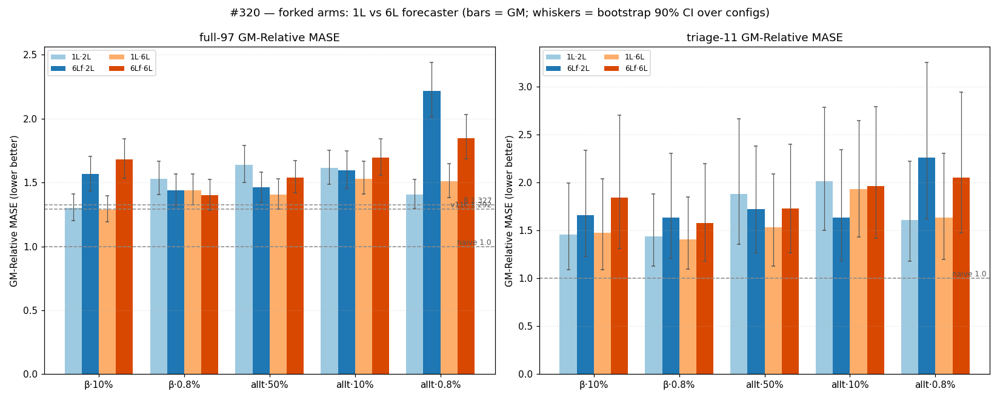
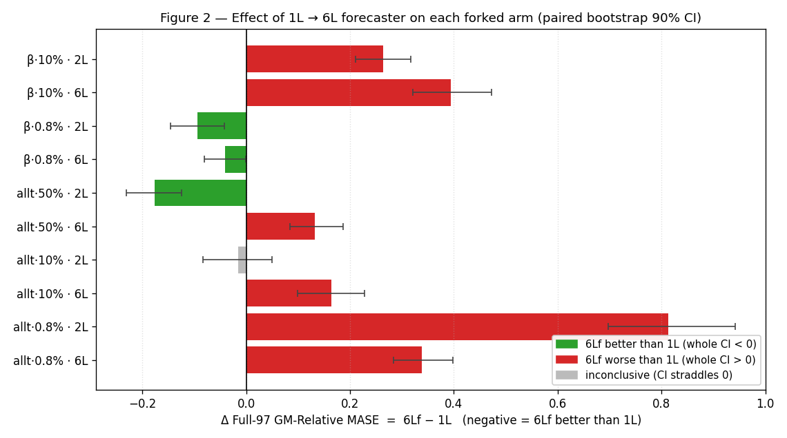

# #320 — Forked arms × 6-layer forecaster

<!-- WIP: Verdict, Result bullets, the 6Lf scoreboard cells, and the plots are
     filled once the eval matrix lands. Question / Protocol / Annex are final. -->

> ⏳ **Results landing.** All 5 backbones trained (50k, #318 recipe + 6L
> forecaster); the q-head + GIFT-Eval matrix (2L & 6L heads × full-97 + triage-11)
> is grinding on elisa. Scoreboard cells, plots, and the verdict fill in as cells
> complete. Question, protocol, and the reused 1L scores are final.

## Question

#318 asked whether forbidding the encoder's **positional shortcut** improves
transfer, two ways: through the **loss** (repel what different series share at a
step) and through the **data** — *forked continuations*: pairs whose past is
byte-identical but whose futures diverge, so position alone cannot encode the
future. Across two base losses (β, all-time) and three injection fractions, only
**one** data-side config beat β: the fork on the **β loss at ≈10% injection**
(reproducing across two seeds and both q-heads). Every other forked config — the
all-time loss at any fraction, and either loss at 0.8% — was neutral-to-worse.

All of #318's forked arms used a **1-layer forecaster**. This card asks: does a
**6-layer forecaster** (1L → 6L; the 6L causal *encoder* is unchanged) move where
the fork helps vs hurts — and can any forked-6Lf config beat **β = 1.3272** or reach
**v11c = 1.292**?

*Why forecaster depth is not just a training knob.* The forecaster is the
`--num-layers` transformer stack above the encoder, and it is **not discarded at
eval**: with `--reconstruction forecaster --head-train-input e_then_f`, the q-head
reads the sequence `[e_0..e_{T-1}, f_0..f_{T-1}]` — both the frozen encoder latents
`e` **and** the frozen **forecaster latents `f`**. So 1L → 6L changes (i) the
contrastive gradient that shapes the encoder in training and (ii) the `f` latents
the q-head reads at eval. We report the GM effect and do not assert which mechanism
dominates.

## Result

<!-- PENDING DATA -->
*Verdict and the where-it-helps/hurts read fill in once the matrix lands.*

## Scoreboard — every forked arm × {2L, 6L} q-head

*GM-Relative MASE = geometric mean over configs of model-MASE ÷ seasonal-naive-MASE
(1.0 = parity with seasonal-naive, lower better); full-97 = all 97 configs,
triage-11 = noisy fast subset. **1L** columns reused from #318 (not re-run); **6Lf**
is this card. Single backbone seed (20260520) per cell, paired 1L↔6Lf; absolute GMs
were markedly seed-variable in #318 (≫ ±0.02), so within-arm 1L↔6Lf deltas — paired
on seed and data — are the controlled quantity, not absolute standings.*

| arm | head | full-97 1L | full-97 6Lf | triage 1L | triage 6Lf | Δ full (6Lf−1L) |
|---|:--:|---:|---:|---:|---:|---:|
| **β·10%**   | 2L | 1.3030 | — | 1.4559 | — | — |
| **β·10%**   | 6L | 1.2889 | — | 1.4747 | — | — |
| **β·0.8%**  | 2L | 1.5302 | — | 1.4376 | — | — |
| **β·0.8%**  | 6L | 1.4412 | — | 1.4027 | — | — |
| **allt·0.8%** | 2L | 1.4049 | — | 1.6083 | — | — |
| **allt·0.8%** | 6L | 1.5100 | — | 1.6348 | — | — |
| **allt·10%**  | 2L | 1.6130 | — | 2.0115 | — | — |
| **allt·10%**  | 6L | 1.5304 | — | 1.9293 | — | — |
| **allt·50%**  | 2L | 1.6366 | — | 1.8824 | — | — |
| **allt·50%**  | 6L | 1.4065 | — | 1.5339 | — | — |
| β (#309) | 2L | 1.3272 | — | 1.4836 | — | reference |
| v11c | 2L | 1.292 | — | — | — | reference |

## Protocol

All 5 arms are byte-identical to #318's data-side forked arms **except the
forecaster depth** (`--num-layers 1 → 6`; the 6L causal encoder
`--num-encoder-layers 6` is unchanged). Backbone: GRU patch-encoder → 6L causal
encoder → **6L** forecaster (d=128, h=4), AdamW β2=0.98, τ=0.10, dropkey 0.70
shared, fp16 body / fp32 residual+patch-emb, EWMA RevNorm span 128, seed 20260520,
50k steps, global batch 256, `--pos-in-denominator`. The fork is in the **data**
(`--synth-kind forked-arma --mix-ratio MIX`, generator `src/synthetic_forked_arma.py`)
— no added loss term; each arm carries its base loss's negatives (β-fork → β column,
all-time-fork → all-time column in the annex). Injection fractions: 0.8% = one
forked pair (2 samples) per 256-batch; 10% = 0.10; 50% = 0.5 (all-time only, the
#318-retained mis-specified arm).

Eval (byte-identical to #318 / #309 / #315): fresh 2L and 6L quantile q-head, 30k
steps, transformer, causal, head-ffn-mult 4.0, dropout 0.1,
`--head-train-input e_then_f`, `--reconstruction forecaster`, forecast-len 16, bs256,
cosine LR, β2=0.98, `--amp-dtype none` (avoids the depthwise-conv fp32/bf16 mismatch
in `extract_forecaster_latents` that crashed #318's first 6Lf eval). GIFT-Eval
`--strategy B4`, full-97 + triage-11. References: β 1.3272, v11c 1.292,
seasonal-naive 1.0.

## Annex — exact negatives (per anchor, C=1; pooled N = B·Σ)

The fork adds no loss term, so each arm's negative pool is its base loss's
(unchanged from #318). For context (B=256, T=64 latent):

| family | repels | β loss | all-time loss |
|---|---|:--:|:--:|
| `xy` adjacent h↔h | `cos(h_t, h_{t+1})` | 1 | — |
| `zy` forecaster f↔f | `cos(f_{t+1}, f_t)` | 1 | 1 |
| `hh_all` within-series ∀l | `cos(h_t, h_l)`, l≠t | T−1 | T−1 |
| `cross_fe` cross-series f↔h | `cos(f_{b,t}, h_{b',t+1})` | B−1 | B−1 |
| `xs_allt` cross-series ∀l | `cos(h_{b,t}, h_{b',l})` | — | (B−1)·T |
| **pooled N** | | **81,920** | **4,259,584** (52×) |

The all-time loss costs ~2× the step time (its B²·T² cross-series×cross-time Gram is
chunked + gradient-checkpointed). See #318 for the full derivation.
