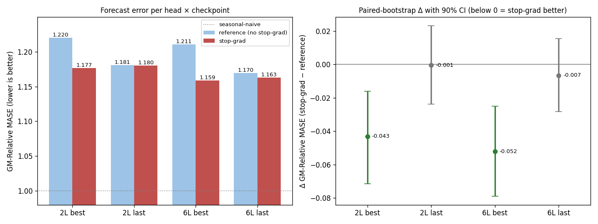

# Stop-gradient on the encoder side of the positive: dynamics change completely, transfer TBD

**Question.** The strongest backbone recipe so far (#328's L3 + no-bottleneck + crossfade-triplet,
PR #336) reliably beats its base on the downstream forecast at full training. In SimSiam/BYOL,
stopping the gradient through the *target* branch of the positive pair is load-bearing. Does the
analogous cut here — training with `sim(stopgrad(h_{t+1}), f_{t+1})` as the positive, everywhere
that term appears (numerator and denominator) — change the learning dynamics and the downstream
transfer of that recipe?

**Result.** TBD-VERDICT-ONE-LINE.

*Forecast error is **GM-Relative MASE**: the geometric mean, over GIFT-Eval's 97 tasks, of a
model's error divided by the seasonal-naive forecast's error. Lower is better; 1.0 is
seasonal-naive.*

| forecasting head | checkpoint | reference | stop-grad | change | 90% interval |
|---|---|--:|--:|--:|:--:|
| 2-layer | best-loss | 1.220 | TBD | TBD | TBD |
| 2-layer | last (12.5k) | 1.181 | TBD | TBD | TBD |
| 6-layer | best-loss | 1.211 | TBD | TBD | TBD |
| 6-layer | last (12.5k) | 1.169 | TBD | TBD | TBD |

TBD-RESULT-PARAGRAPH (paired bootstrap over the 97 tasks: resample the task list with repeats,
score both models on each resample so per-task difficulty cancels; 90% interval on the change).

## Training dynamics: slower alignment, no dimension collapse

The single change splits the dynamics into two regimes:

- **Alignment slows by an order of magnitude.** With the encoder no longer pulled toward the
  forecast, the forecast must do all the closing: the forecast-to-future cosine reaches only
  0.45 by 12.5k steps (reference: 0.99), the floor-subtracted loss plateaus near 5.9 from ~5k
  steps on (reference: 1.04), and the ratio gap and skill metrics stall correspondingly
  (1−R²_naive 0.66 vs 0.011).
- **Dimension usage stays high instead of collapsing.** U_batch — the fraction of embedding
  dimensions that vary across the batch — holds at ~0.50 throughout, against the reference's
  early drop to ~0.13. The embedding stays ~4× higher-rank.
- **Discrimination is unaffected.** Both runs separate positives from negatives essentially
  perfectly from early on (AUC and Top-1 ≈ 1.0), and different series stay near-orthogonal
  (cross-series cosine 0.024 vs 0.002). What the stop-grad changes is only how fast the
  positive pair is pulled together, not whether the model can tell pairs apart.

Both arms log the same floor-subtracted loss (identical constant; the stop-grad does not change
the forward value, verified bit-equal in tests), so the loss curves are directly comparable.

## How the arm works

The training loss is a normalized InfoNCE: each forecast f_{t+1} should be similar to its own
future encoding h_{t+1} (the positive) and dissimilar from everything else (negatives across
time, series, and the batch). By default the positive's gradient flows into *both* branches —
the forecaster chases the encoder, and the encoder is simultaneously pulled back toward the
forecast. The single change here detaches h_{t+1} in the positive term wherever it appears
(numerator and denominator), so the encoder receives gradient only from the *negative* terms —
it is trained to spread series apart, never to make its own representation easier to forecast.
This is the same asymmetry SimSiam/BYOL apply to their target branch. Everything else — data
mix, crossfade triplet, architecture, floor subtraction, temperature, seed, batch, step count —
is byte-identical to the reference run.

## Protocol

One backbone per arm, single seed (20260520), 12,500 steps at batch 1024 on one GPU. The
reference is #328's best arm (L3 + no-bottleneck + triplet) unchanged; the stop-grad arm differs
by the single flag described above. Each finished backbone is frozen and scored by training a
fresh quantile forecasting head on top — once with two transformer layers, once with six — and
evaluating on GIFT-Eval's 97 tasks, at two backbone checkpoints: **best-loss** (the step with
the lowest contrastive loss) and **last** (the full 12,500 steps; the regime where the reference
arm's downstream advantage shows). Intervals are paired bootstrap over tasks; one seed, so they
quantify task-set noise, not seed noise.

## What we learned

TBD-LEARNED (facts from the table + dynamics; hypothesis flags).

TBD-HYPOTHESIS: the user-suggested reading — the stop-grad arm avoids the dimension collapse of
the base configuration — is consistent with the U_batch curves but is a hypothesis until the
transfer numbers say whether the higher-rank embedding helps the downstream task.
