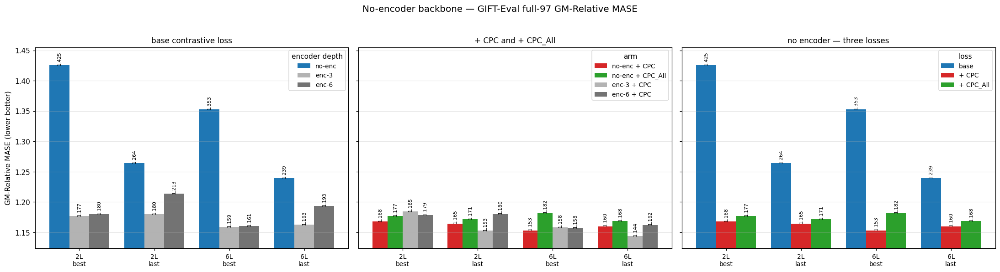
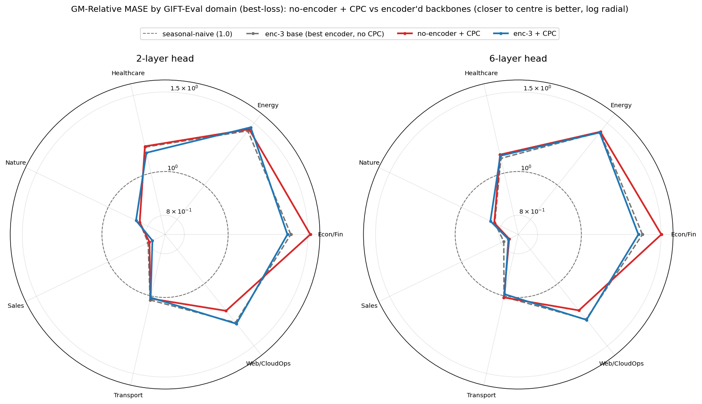
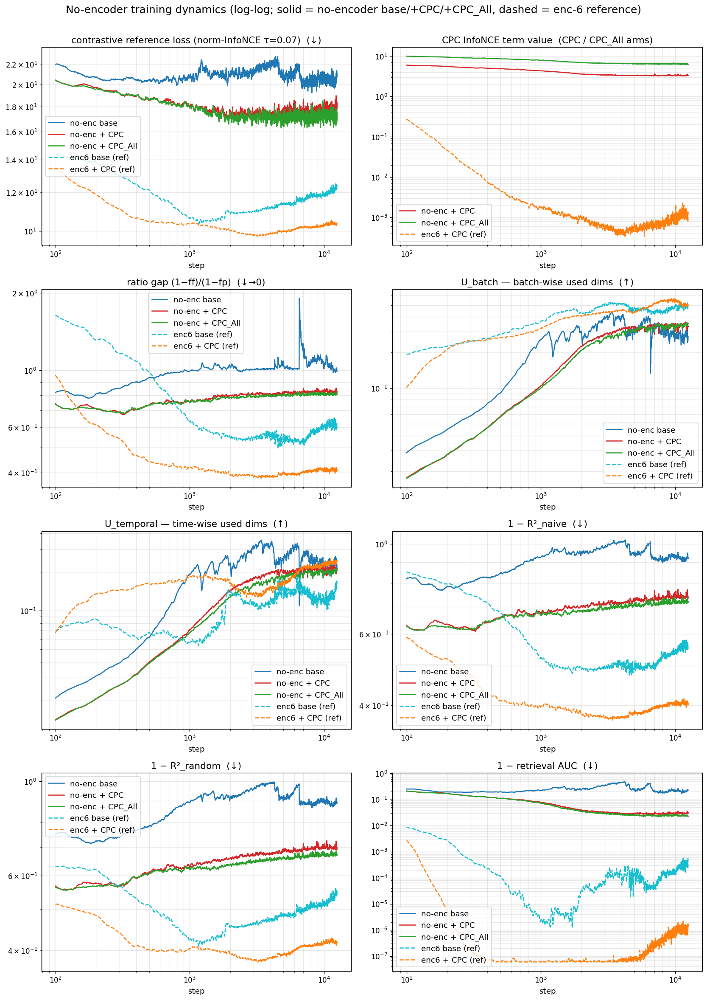
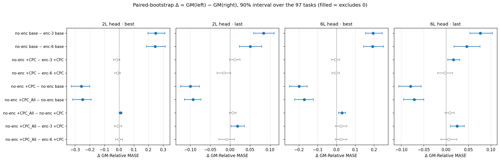

# Without the encoder the base loss has higher GIFT-Eval error; the + CPC and + CPC_All arms match the encoder backbones

We remove the encoder stack (`--num-encoder-layers 0`) so the forecaster reads the patch-embedding directly, and measure GIFT-Eval error (GM-Relative MASE) for three losses — the contrastive loss alone (**base**), plus the CPC InfoNCE term (**+ CPC**), and that term widened to the full van den Oord Eq. 4 marginal, every other sequence at every step (**+ CPC_All**) — against the same recipe with a 3- and a 6-layer encoder.

## Result



Without the encoder the base loss has the highest error; either CPC term brings the no-encoder backbone level with the 3- and 6-layer encoder backbones. GM-Relative MASE is the geometric mean over the 97 tasks of model error / seasonal-naive error (lower is better; 1.0 = seasonal-naive).



By domain, the no-encoder + CPC arm tracks both encoder'd backbones, lagging mainly in Econ/Fin and running slightly ahead in Web/CloudOps.

## Training curves



Across the no-encoder runs, the CPC arms record a lower contrastive reference loss, lower 1−R², lower 1−AUC, and lower ratio gap than base, with higher U_batch and slightly lower U_temporal. (The two CPC term-value curves are not comparable — the arms sum over candidate sets of different sizes; panel definitions are in *Metrics*.)

## Protocol

One backbone per arm, single seed. The shared recipe: a GRU patch-embedding, d_model 384 / 6 heads, a 6-layer full-width forecaster, the crossfade-triplet allt·0.8% data mix, qk-norm and attention-output norm, the `xshh_allt` contrastive loss (positive-in-denominator, floor subtraction), the encoder-side positive stop-gradient (`--stopgrad-positive-h`), τ 0.10, batch 1024, 12,500 steps, seed 20260520; the encoder stack removed with `--num-encoder-layers 0`. A backbone is patch-embedding (a GRU, one token per patch) → encoder stack → causal-transformer forecaster, trained by the contrastive objective to predict the next token's embedding.

The arms differ only in the loss: **base** is the contrastive loss alone; **+ CPC** adds the CPC InfoNCE term (`--cpc-infonce-weight 1.0`); **+ CPC_All** widens its candidate set to the full marginal (`--cpc-infonce-negs cross`). To score a backbone we freeze it, train a fresh quantile forecasting head (once with two transformer layers, once with six), and evaluate on GIFT-Eval's 97 tasks at the best-loss checkpoint (lowest smoothed contrastive loss) and the last checkpoint (step 12,500). The enc-3 and enc-6 backbones use this identical recipe at encoder depth 3 and 6.

## The CPC term

The + CPC arm adds one CPC InfoNCE term (van den Oord et al. 2018, Eq. 4, horizon k = 1): for each step *t* it predicts the next embedding `e_{t+1}` from the forecaster context `h_t` through a learnable log-bilinear score `f(e_j, h_t) = exp(e_jᵀ W₁ h_t)`:

```
L_cpc = − log(  exp(e_{t+1}ᵀ W₁ h_t)  /  Σ_{e_j ∈ C}  exp(e_jᵀ W₁ h_t)  )
```

The positive sits in the denominator (normalised InfoNCE ≥ 0), summed equal-weight, no stop-gradient, no temperature (`W₁` carries the scale). The candidate set `C` differs by arm: **+ CPC** uses the matched-step cross-batch embeddings plus the same sequence's other-step embeddings; **+ CPC_All** uses the positive plus every other sequence's embeddings at every step (the full marginal `p(x_{t+1})` of van den Oord Eq. 4, whose negatives are independent of the context `h_t`).

## Metrics

Training-curve panels: **ff** and **fp** are the forecast-to-future and forecast-to-present cosines, so the ratio gap (1−ff)/(1−fp) falls toward 0 as the positive separates; **R²_naive / R²_random** measure how much of the next embedding the forecast explains, against a copy-the-present / random-embedding baseline; **U_batch / U_temporal** are the fractions of embedding dimensions that vary across the batch / across time; **retrieval AUC** ranks the positive against the negatives; the **reference loss** is a fixed τ=0.07 normalised-InfoNCE diagnostic, distinct from the τ 0.10 training objective.

## Paired bootstrap



For the base loss, every no-encoder − encoder Δ excludes zero (no-encoder higher). Adding either CPC term (vs base, no encoder) gives a negative Δ excluding zero in all eight cells, while the no-encoder CPC Δs against the encoder arms span zero in 7/8 (+ CPC) and 6/8 (+ CPC_All) cells.

| comparison (left − right) | 2L best | 2L last | 6L best | 6L last |
|---|--:|--:|--:|--:|
| no-enc base − enc-3 base | +0.248 (+0.197, +0.312) | +0.084 (+0.059, +0.110) | +0.194 (+0.155, +0.242) | +0.076 (+0.053, +0.104) |
| no-enc base − enc-6 base | +0.245 (+0.186, +0.314) | +0.050 (+0.023, +0.079) | +0.192 (+0.144, +0.249) | +0.046 (+0.018, +0.076) |
| no-enc +CPC − enc-3 +CPC | −0.017 (−0.038, +0.004) | +0.011 (−0.001, +0.025) | −0.005 (−0.027, +0.017) | +0.016 (+0.004, +0.031) |
| no-enc +CPC − enc-6 +CPC | −0.011 (−0.030, +0.009) | −0.016 (−0.033, +0.002) | −0.004 (−0.025, +0.016) | −0.002 (−0.019, +0.015) |
| no-enc +CPC − no-enc base | −0.258 (−0.325, −0.200) | −0.099 (−0.124, −0.076) | −0.199 (−0.250, −0.156) | −0.079 (−0.106, −0.056) |
| no-enc +CPC_All − no-enc base | −0.248 (−0.316, −0.190) | −0.092 (−0.114, −0.073) | −0.171 (−0.222, −0.122) | −0.071 (−0.094, −0.049) |
| no-enc +CPC_All − no-enc +CPC | +0.009 (+0.000, +0.020) | +0.007 (−0.002, +0.015) | +0.029 (+0.011, +0.049) | +0.008 (−0.002, +0.019) |
| no-enc +CPC_All − enc-3 +CPC | −0.007 (−0.032, +0.019) | +0.018 (+0.002, +0.035) | +0.023 (−0.006, +0.055) | +0.025 (+0.010, +0.041) |
| no-enc +CPC_All − enc-6 +CPC | −0.001 (−0.025, +0.024) | −0.009 (−0.028, +0.011) | +0.024 (−0.006, +0.056) | +0.006 (−0.011, +0.024) |

## Results

GM-Relative MASE (GIFT-Eval full-97; lower is better). Encoder depth 0 = no encoder; 3 and 6 = the 3- and 6-layer encoder backbones.

| arm | 2L head, best / last | 6L head, best / last |
|---|--:|--:|
| base, **no encoder** | **1.425 / 1.264** | **1.353 / 1.239** |
| base, enc-3 | 1.177 / 1.180 | 1.159 / 1.163 |
| base, enc-6 | 1.180 / 1.213 | 1.161 / 1.193 |
| + CPC, **no encoder** | **1.168 / 1.165** | **1.153 / 1.160** |
| + CPC, enc-3 | 1.185 / 1.153 | 1.158 / 1.144 |
| + CPC, enc-6 | 1.179 / 1.180 | 1.158 / 1.162 |
| + CPC_All, **no encoder** | **1.177 / 1.171** | **1.182 / 1.168** |
