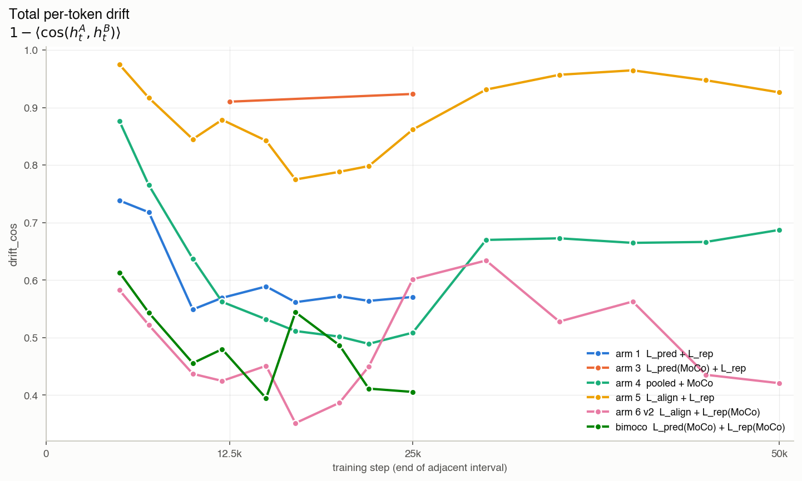
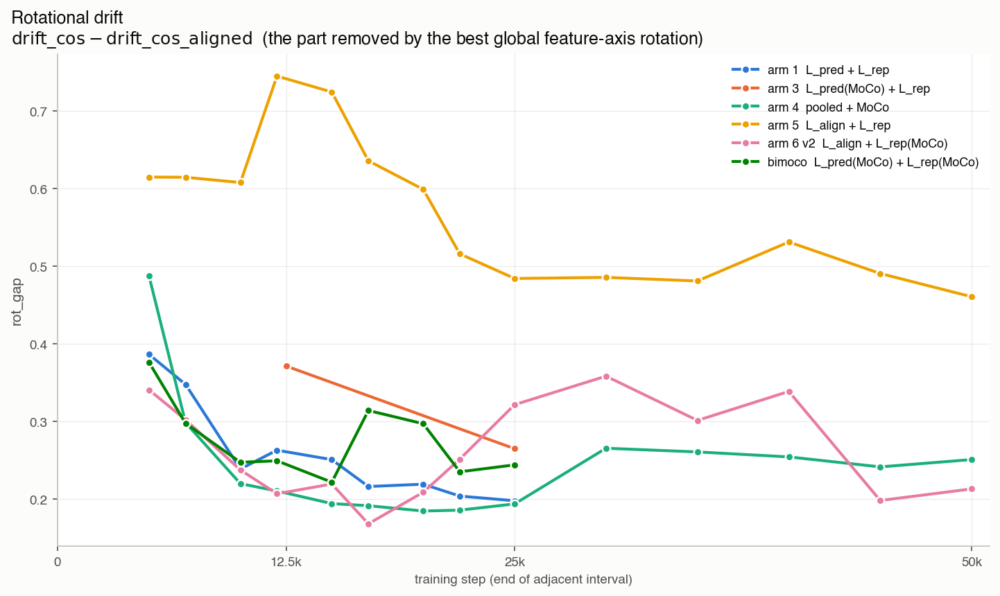
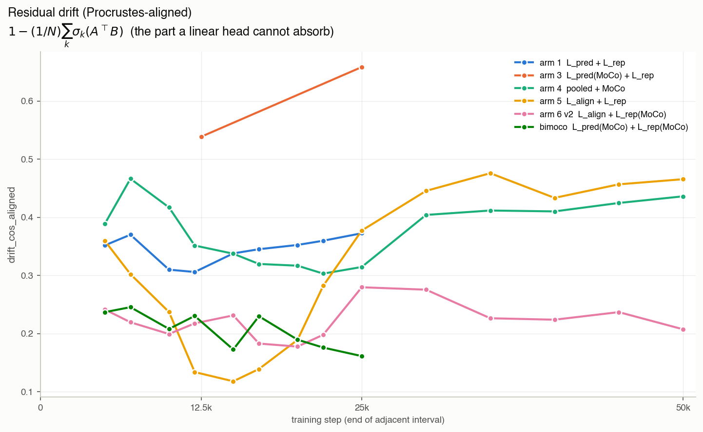
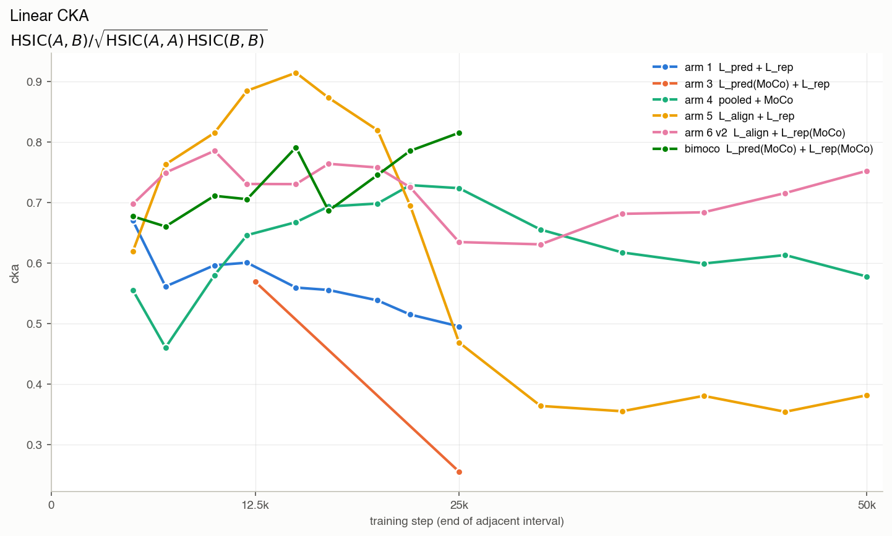
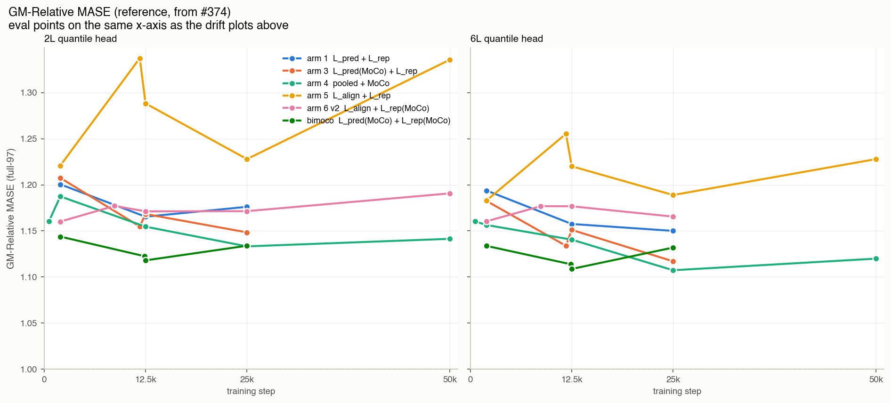

# Latent-drift across #374 arm training

Six-arm sweep from
[#374](https://github.com/jeremycochoy/contrastive-forecasting/issues/374)
(PR
[#376](https://github.com/jeremycochoy/contrastive-forecasting/pull/376))
— retroactively measured. Loss recipes per arm are defined in #376 and
repeated in the plot legends. Runs
[`scripts/latent_drift.py`](../../scripts/latent_drift.py) over 68
saved backbone snapshots on a fixed ARMA probe batch (`B=64`,
`T=4096`, `C=1`; seed `20260722`). Two extra probe seeds
([`20260723`](results/drift_374_seed20260723.csv),
[`20260724`](results/drift_374_seed20260724.csv)) give a max
across-seed stdev of `0.038` for `cka` and `≤ 0.029` for the other
three metrics.

## Adjacent-pair drift



Arms 3 and 5's `h_t` is nearly orthogonal between consecutive
checkpoints; the other four arms drop to moderate drift after early
training.



Arm 5's drift is dominated by a large, sustained feature-axis
rotation throughout training; the other arms' rotational share
shrinks and stabilises lower.



Arm 5 crosses a regime around step 15k — early intervals are
dominated by rotation, later intervals accumulate substantial
head-non-absorbable drift. Bimoco and arm 6 v2 stay in the
low-residual regime throughout.



Arm 5 preserves its token geometry through mid-training then
collapses abruptly around step 20k; the other arms show no
comparable collapse.

## GM-Relative MASE reference (from #374)



Arm 5 stays highest MASE across the whole trajectory and its
best-loss step spikes higher than its endpoints; the other five arms
cluster in a narrow band.

## Metric derivation

Two encoder-latent tensors `A, B ∈ ℝ^{N × H}` — same probe batch, two
training steps, `N` tokens, `H` features. Row-normalise; the
contrastive loss lives on `S^{H-1}`.

**Total drift** — mean cosine distance:

```
drift_cos = 1 − (1/N) Σᵢ ⟨Aᵢ, Bᵢ⟩.
```

A linear head absorbs any feature-axis rotation `R ∈ O(H)`: its first
weight matrix `W` becomes `W R`. Quotient the best such `R` out via
Procrustes:

```
R* = argmax_{R ∈ O(H)} Tr(R AᵀB).
```

The SVD `AᵀB = U Σ Vᵀ` gives `R* = V Uᵀ` and `max = Σₖ σₖ(AᵀB)`.
Hence

```
drift_cos_aligned = 1 − (1/N) Σₖ σₖ(AᵀB).
```

**Split**:

- `rot_gap = drift_cos − drift_cos_aligned` — the part `R*` removed;
  a linear head absorbs this into its first weight matrix.
- `drift_cos_aligned` — the residual after removing `R*`; a linear
  head cannot absorb it by right-multiplication.

**Cross-check** via centered linear CKA (columns of `A, B`
mean-subtracted, subscript `c`):

```
cka = ‖A_cᵀ B_c‖_F² / (‖A_cᵀ A_c‖_F · ‖B_cᵀ B_c‖_F).
```

CKA is invariant under right-multiplication by any `R ∈ O(H)` and any
global rescaling; `drift_cos` is not. `cka ≈ 1` with `drift_cos > 0`
means all raw drift lives in `rot_gap`.

## Regenerate

- Manifest of the 68 #374 checkpoints:
  [`results/manifest_374.csv`](results/manifest_374.csv).
- Drift CSVs (three seeds):
  `python3 scripts/latent_drift.py
  --manifest experiments/2026-07-22_latent-drift/results/manifest_374.csv
  --out experiments/2026-07-22_latent-drift/results/drift_374.csv
  [--seed <S>]` on a host with the #374 backbones on disk.
- GM-MASE reference CSV
  [`results/gm_mase_374.csv`](results/gm_mase_374.csv) parsed from
  `Aggregate GM-Relative MASE` in the `summary.txt` files at
  `origin/feature/contrastive-forecasting-374:experiments/2026-07-10_split_pred_rep/{results,results_arm4,results_arm5,results_arm6_v2,results_bimoco_v2}/gift_eval_full_*/summary.txt`.
- Plots:
  `python3 experiments/2026-07-22_latent-drift/plots/_make_plots.py`.
