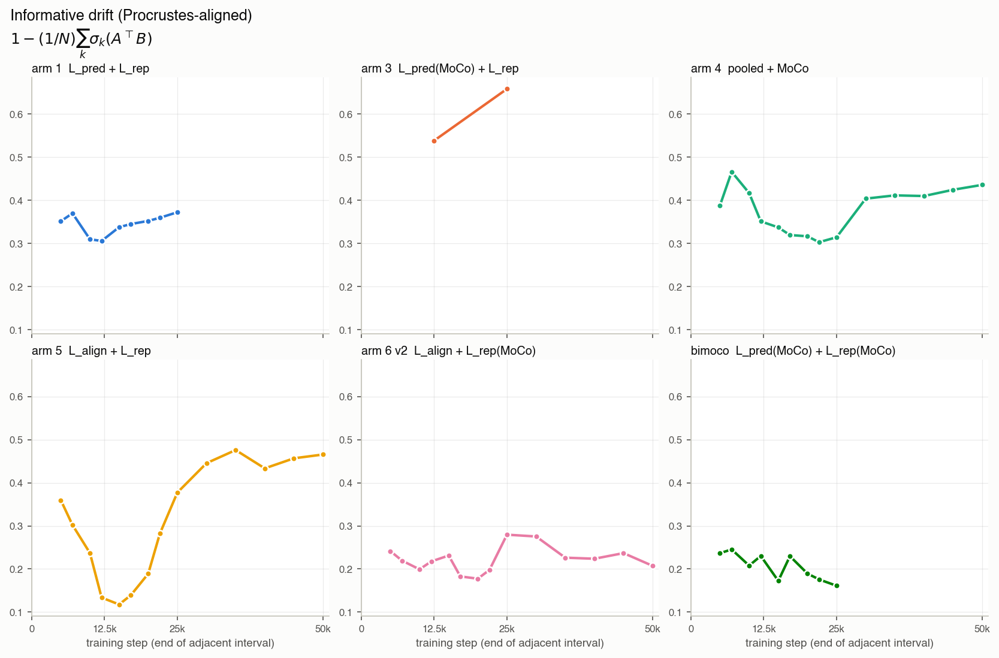

# Latent-drift across #374 arm training

Six-arm sweep from
[#374](https://github.com/jeremycochoy/contrastive-forecasting/issues/374)
(PR
[#376](https://github.com/jeremycochoy/contrastive-forecasting/pull/376))
— retroactively measured. Runs the offline probe in
[`scripts/latent_drift.py`](../../scripts/latent_drift.py) over the
saved backbone snapshots.

## Question

How much does the encoder latent `h_t` move between consecutive
checkpoints during #374 training, and how much of that movement is a
pure feature-axis rotation vs a real change in the token geometry a
downstream head sees?

## Method

Given the encoder output `h_t^A`, `h_t^B` of two checkpoints of the
same arm, evaluated on ONE fixed ARMA probe batch (`B=64`, `T=4096`,
`C=1`, seed `20260722`), rows unit-normalised (the loss lives on the
unit sphere), we compute:

| Symbol | Definition | Reads |
|---|---|---|
| `drift_cos` | `1 − mean_i cos(A_i, B_i)` | raw per-token movement |
| `drift_cos_aligned` | `1 − (1/N) Σ_k σ_k(AᵀB)` | movement AFTER Procrustes rotation on the feature axis — the part a linear head cannot absorb |
| `rot_gap` | `drift_cos − drift_cos_aligned` | pure feature-axis rotation; movement a linear head absorbs |
| `cka` | linear centered CKA | cross-check on token-Gram similarity, rotation- and global-scale-invariant |

Split logic. If `A = B Q` for some orthogonal `Q ∈ ℝ^(H×H)` on the
feature axis, then row cosines flip but the Procrustes optimum removes
`Q` exactly and `drift_cos_aligned = 0`; the whole raw movement lands
in `rot_gap`. A rising `drift_cos_aligned` (or falling `cka`) is the
signal we cannot explain away as reparameterization — the geometry the
head sees is being rewritten.

Manifest: 68 snapshots, 6 arms — arm 1 (10 pts, 2k→25k), arm 3 (3 pts,
2k, 12.5k, 25k), arm 4/5/6v2 (15 pts each, 2k→50k), bimoco (10 pts,
2k→25k). See [`results/manifest_374.csv`](results/manifest_374.csv);
raw metric [`results/drift_374.csv`](results/drift_374.csv). Arm 3's
step-2000 snapshot is a mid-experiment retrain; its step-25000 uses a
fresh-optimizer extension — the 12.5k → 25k interval crosses that
seam. Regenerate:
`python3 scripts/latent_drift.py --manifest results/manifest_374.csv
--out results/drift_374.csv` on a host with the backbones on disk;
`python3 plots/_make_plots.py` for the PNGs.

## Results

Adjacent-pair curves for all four metrics. X axis: step at the END of
the interval (arm 5's step 15k point is the `12500→15000` interval).
Y axis linear, arm-panel scales shared across arms within a metric.

### Total per-token drift

Every arm's `h_t` keeps moving substantially across the whole training
window. Bimoco is the least-moving arm (`~0.4` late); arms 3 and 5 sit
above `0.9` for their full trajectories — successive checkpoint pairs
are effectively orthogonal on the unit sphere.

### Uninformative rotation

`rot_gap > 0` at the LAST recorded interval of every arm:
arm 1 `0.20` at 25k, arm 3 `0.27` at 25k, arm 4 `0.25` at 50k, arm 5
`0.46` at 50k, arm 6 v2 `0.21` at 50k, bimoco `0.24` at 25k. A steady
fraction of the per-checkpoint movement remains pure feature-axis
rotation deep into training in every arm — never decays to zero.
Arm 5 is a category apart, sustaining `≥ 0.46` through 50k.

### Informative drift

Same-token movement remaining after Procrustes rotation. Two regimes
in the late-training (`step_b ≥ 20k`) window (adjacent-interval means):
arm 6 v2 (`0.23`) and bimoco (`0.18`) sit low — the geometry a head
would see is nearly frozen; arms 1 (`0.36`), 4 (`0.38`), and 5
(`0.39`) sit roughly twice as high. Arm 5 reverses its own
trajectory: informative drift is `0.12` at step 15k, then climbs to
`0.38` at step 25k and stays in `0.43–0.48` through step 50k — the
arm reorganizes MORE late in training than early.

### Linear CKA

Cross-check on token-Gram similarity. Arm 4 preserves the most
geometry (`0.55–0.73`). Arms 1 / 6 v2 / bimoco sit in `0.5–0.8`
throughout. Arm 5 collapses from `0.91` at step 15k to `0.36` from
step 30k on — matches the `drift_cos_aligned` climb; the token
geometry is being rewritten, not rotated.

## What we learned

- **Uninformative rotation never stops in any #374 arm.** `rot_gap` is
  bounded away from zero at every arm's terminal interval. The
  encoder frame keeps rotating deep into training even when a linear
  head would see a nearly-stable geometry (arm 1 / 6 v2 / bimoco).
- **Arm 5 has a two-regime trajectory** the training logs don't
  surface. Through `~15k` steps its movement is mostly rotation
  (`drift_cos_aligned < 0.15`, `cka > 0.9`). From `~25k` onwards it
  swaps: `drift_cos_aligned` roughly triples to `~0.45` and CKA
  collapses to `~0.36`. `L_align + L_rep` continues reshaping the
  token geometry — not just the frame — long after the paper-scale
  `12.5k`-step budget of #374 ends.
- **Bimoco and arm 6 v2 are the geometrically-quietest arms.** Late-
  training mean informative drift `0.18` (bimoco) and `0.23` (arm 6 v2)
  — roughly half of the other L_rep-bearing arms (arm 1 `0.36`, arm 4
  `0.38`, arm 5 `0.39`). The two arms share `L_rep(MoCo)`; consistent
  with #374's report that MoCo-on-the-representation term compresses
  `h_t`. The head-visible axis stabilizes even while the frame keeps
  spinning.

For every future run, the same probe is written by the training loop
into `<run>_latent_drift.csv` automatically (probe cadence defaults to
`--save-every`), so this curve becomes a free diagnostic on every arm
we launch.
