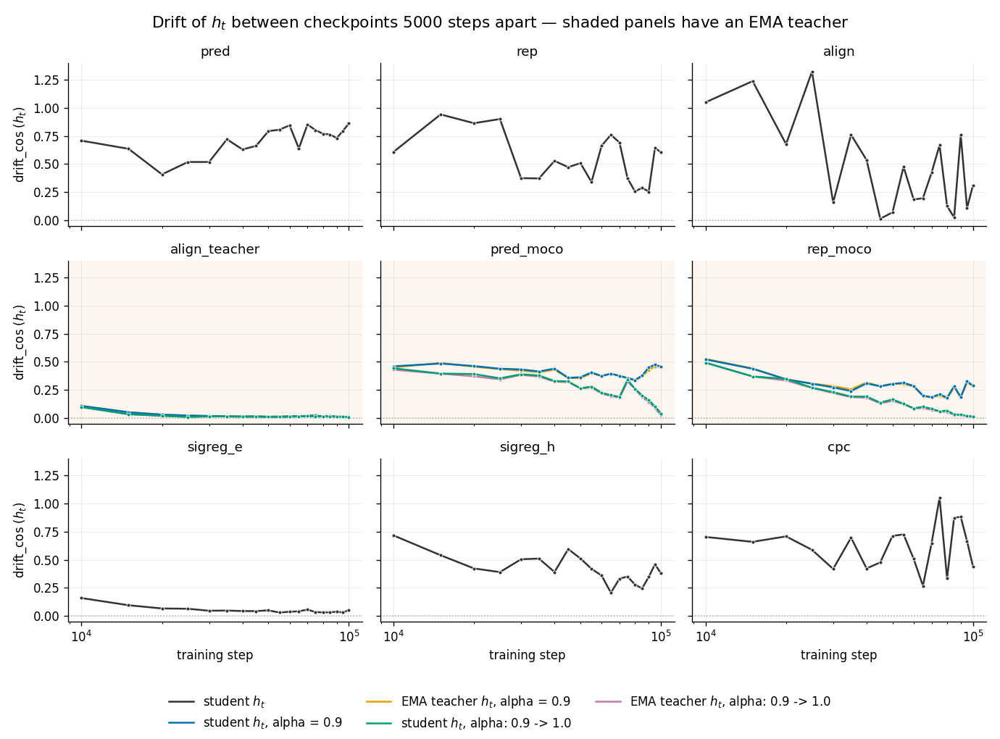
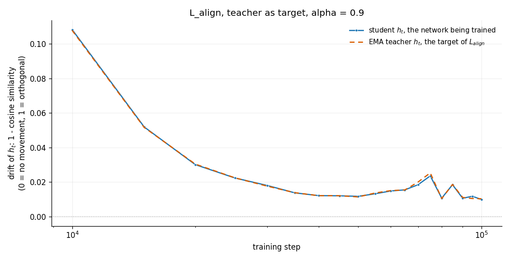
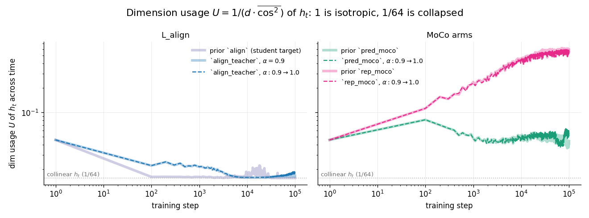
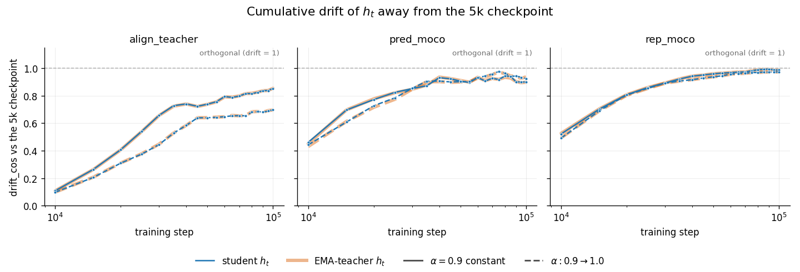
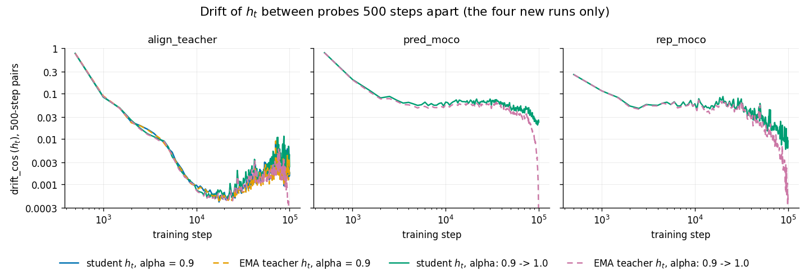
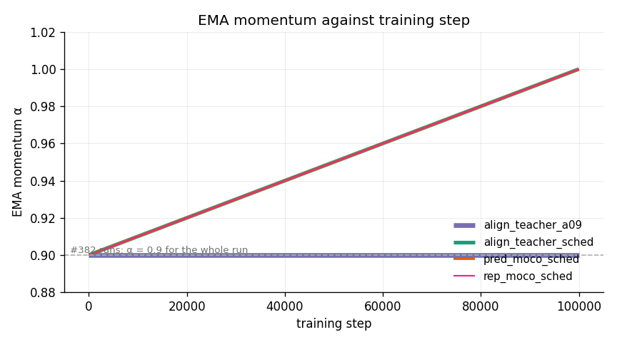

# A per-loss-term map of latent movement, measured on the student and the EMA teacher latent

**TL;DR.** Nine loss terms, one fixed probe batch, drift measured between
checkpoints 5000 steps apart. In every arm that has an exponential-moving-average
(EMA) teacher, the teacher latent tracks the student latent. The nine terms
separate into distinct movement regimes.



*One panel per loss term, same axes for all nine. Shaded panels have an EMA
teacher and carry four named curves; the other six have no teacher and carry
one. Solid = student, dashed = EMA teacher. In every teacher panel the
EMA-teacher curve tracks its student curve within a line width for the whole
run: orange on blue for α = 0.9, pink on green for the schedule. The two α
settings separate from 40k on for `pred_moco` and `rep_moco`, and stay together
on `align_teacher`.*

Three regimes: drift stays near zero for `align_teacher` and `sigreg_e`; drift
falls with training for `align`, `rep`, `sigreg_h` and `rep_moco`; drift does
not fall for `pred` and `cpc`.



*Same probe and same 5000-step spacing, α = 0.9 constant. Purple: the earlier
`align` arm, whose target was the student's own stop-gradient `sg(h_{t+1})`
(`sg(·)` blocks gradient flow through its argument). Blue: `align_teacher`,
target = EMA teacher `h_{t+1}`. Dashed orange: the EMA-teacher latent of the
same run, which tracks the student curve within a line width for the whole run.
With the teacher as target the latent no longer moves wildly between adjacent
checkpoints.*



*Dimension usage `U = 1/(d · mean cos²)` with `d = 64`, measured over the time
axis, from the training logs. 1 means isotropic, i.e. the directions spread
evenly over all 64 axes; 1/64 = 0.015625 means every timestep points the same
way. Both align arms end near that floor: at 100k, `align_teacher` reads
0.016709 with α = 0.9 and 0.018166 with the schedule, 6.9% and 16.3% above the
floor, so the low drift of those arms is measured on a representation with
almost nothing left to rotate. Along the batch axis the same two runs read
0.057068 and 0.074540, well off the floor: the collapse is across time, not
across the batch. Wide pale curves are constant α, dashed are the schedule; on
the MoCo (momentum-contrast) arms the two nearly coincide.*

One seed per arm and one probe batch, so every number here is a single
measurement without a spread. No downstream forecasting evaluation was run in
this experiment.

## Other windows on the same probe



*Same probe, each checkpoint compared to the run's 5k checkpoint instead of to
its predecessor. The `align_teacher` panel reaches 0.8529 at 100k while the same
run's adjacent-window drift averages 0.0123 over 80k–100k: slow per-window drift
still accumulates, so the representation is not fixed in place.*



*The in-training probe, 500-step spacing, the four runs of this card only. Only
`align_teacher` was run at both α settings, so the other two panels carry the
schedule alone. All arms drop below 0.1 between 1000 and 2000 steps and stay
there.*

## The α schedule



*α is the weight the teacher keeps on itself in
`θ_teacher ← α·θ_teacher + (1 − α)·θ_student`, applied after every optimizer
step. `align_teacher_a09` holds α = 0.9; the three scheduled runs share the same
0.9 → 1.0 linear ramp over 100k steps, so they draw one line.*

## What this measures

`drift_cos` = 1 − mean cosine similarity between two sets of encoder latents
`h_t`, on one fixed probe batch: a single ARMA draw of 64 series, 1024 raw
timesteps, seed 20260722, shared by every checkpoint of every run. 0 means the
representation did not move, 1 means orthogonal.

`drift_cos_aligned` is `drift_cos` after a Procrustes rotation, the single
orthogonal transform that best maps one latent set onto the other, is removed.
What remains is the movement a downstream linear head cannot absorb. `cka` is
linear centered kernel alignment, a rotation- and scale-invariant similarity in
[0, 1].

## Runs

Four runs. Same backbone, seed, dataset and 100k-step budget as the loss-term
isolation experiment
([report](../2026-07-28_loss_term_isolation/loss_term_isolation.md)). That
experiment supplies the earlier `align` arm and the constant-α halves of
`pred_moco` and `rep_moco`. `pred`, `rep`, `sigreg_e`, `sigreg_h` and `cpc` have
no teacher and were not re-run.

| Run | Loss term | α |
|---|---|---|
| `align_teacher_a09` | `L_align`, target = EMA teacher's `h_{t+1}` | 0.9 constant |
| `align_teacher_sched` | same | 0.9 → 1.0 linear |
| `pred_moco_sched` | `L_pred` + MoCo negatives | 0.9 → 1.0 linear |
| `rep_moco_sched` | `L_rep` + MoCo keys | 0.9 → 1.0 linear |

## Late-window adjacent drift, 80k–100k

Student `h_t`, adjacent-checkpoint probe, mean over the 80k–100k window, from
`results/drift.csv`.

| Run | α | mean drift_cos 80k–100k | mean drift_cos_aligned 80k–100k |
|---|---|---|---|
| `align` | none | 0.2653 | 0.0000 |
| `align_teacher_a09` | const 0.9 | 0.0123 | 0.0013 |
| `align_teacher_sched` | 0.9 → 1.0 | 0.0120 | 0.0038 |
| `pred_moco` | const 0.9 | 0.4198 | 0.2942 |
| `pred_moco_sched` | 0.9 → 1.0 | 0.1531 | 0.1111 |
| `rep_moco` | const 0.9 | 0.2531 | 0.1240 |
| `rep_moco_sched` | 0.9 → 1.0 | 0.0326 | 0.0258 |

Across the whole run the `align` arm's raw adjacent `drift_cos` spans 0.0133 to
1.3226, while its `drift_cos_aligned` peaks at 0.0464 and stays at or below
7e-06 from 40k on.

## Drift against the 5k checkpoint, measured at 100k

Student `h_t`, from `results/drift.csv` (`kind=vs_initial`).

| Run | α | drift_cos vs 5k | drift_cos_aligned vs 5k | cka vs 5k |
|---|---|---|---|---|
| `align` | none | 1.237727 | 0.000035 | 0.000000 |
| `align_teacher_a09` | const 0.9 | 0.852939 | 0.011372 | 0.368196 |
| `align_teacher_sched` | 0.9 → 1.0 | 0.697010 | 0.029031 | 0.288741 |
| `pred_moco` | const 0.9 | 0.899133 | 0.461897 | 0.158591 |
| `pred_moco_sched` | 0.9 → 1.0 | 0.924765 | 0.458751 | 0.171612 |
| `rep_moco` | const 0.9 | 0.986973 | 0.783621 | 0.084590 |
| `rep_moco_sched` | 0.9 → 1.0 | 0.971899 | 0.778909 | 0.084094 |

The `align` row reads `cka` 0.000000 next to an aligned drift of 0.000035
because that latent is collinear across time at 100k: its time-axis `U` is
0.015625, exactly the floor, so there is no spread left for CKA to correlate.

## Dimension usage at 100k

From `results/loss_curve.csv`, floor 1/64 = 0.015625 on both axes.

| Run | U, time axis | U, batch axis |
|---|---|---|
| `align` | 0.015625 | 0.015625 |
| `align_teacher_a09` | 0.016709 | 0.057068 |
| `align_teacher_sched` | 0.018166 | 0.074540 |
| `pred_moco` | 0.044333 | 0.559589 |
| `pred_moco_sched` | 0.050975 | 0.597697 |
| `rep_moco` | 0.580033 | 0.794081 |
| `rep_moco_sched` | 0.560926 | 0.827109 |

## Adjacent-checkpoint drift per arm and latent

Mean raw `drift_cos` of the adjacent-checkpoint probe over each window. Slope is
per decade of training step, from `results/summary.csv`.

| Run | Latent | α | mean drift_cos 10k-25k | mean drift_cos 80k-100k | slope / decade |
|---|---|---|---|---|---|
| `pred` | student | none | 0.5672 | 0.7837 | +0.2778 |
| `rep` | student | none | 0.8281 | 0.4090 | −0.3678 |
| `align` | student | none | 1.0715 | 0.2653 | −0.9308 |
| `sigreg_e` | student | none | 0.0959 | 0.0367 | −0.0861 |
| `sigreg_h` | student | none | 0.5171 | 0.3415 | −0.3007 |
| `cpc` | student | none | 0.6645 | 0.6393 | +0.0107 |
| `pred_moco` | student | const 0.9 | 0.4619 | 0.4198 | −0.0722 |
| `pred_moco` | teacher | const 0.9 | 0.4584 | 0.4091 | −0.0769 |
| `rep_moco` | student | const 0.9 | 0.4028 | 0.2531 | −0.2277 |
| `rep_moco` | teacher | const 0.9 | 0.4046 | 0.2470 | −0.2422 |
| `align_teacher_a09` | student | const 0.9 | 0.0531 | 0.0123 | −0.0608 |
| `align_teacher_a09` | teacher | const 0.9 | 0.0530 | 0.0122 | −0.0602 |
| `align_teacher_sched` | student | 0.9 → 1.0 | 0.0402 | 0.0120 | −0.0472 |
| `align_teacher_sched` | teacher | 0.9 → 1.0 | 0.0406 | 0.0111 | −0.0488 |
| `pred_moco_sched` | student | 0.9 → 1.0 | 0.3958 | 0.1531 | −0.3239 |
| `pred_moco_sched` | teacher | 0.9 → 1.0 | 0.3851 | 0.1409 | −0.3269 |
| `rep_moco_sched` | student | 0.9 → 1.0 | 0.3701 | 0.0326 | −0.4608 |
| `rep_moco_sched` | teacher | 0.9 → 1.0 | 0.3669 | 0.0257 | −0.4656 |

## Reproducing

```bash
WT=$PWD bash experiments/2026-08-01_align_teacher_ema_schedule/scripts/smoke.sh 0
WT=$PWD bash experiments/2026-08-01_align_teacher_ema_schedule/scripts/orchestrate.sh 100000
WT=$PWD bash experiments/2026-08-01_align_teacher_ema_schedule/scripts/analyse.sh 0
```
