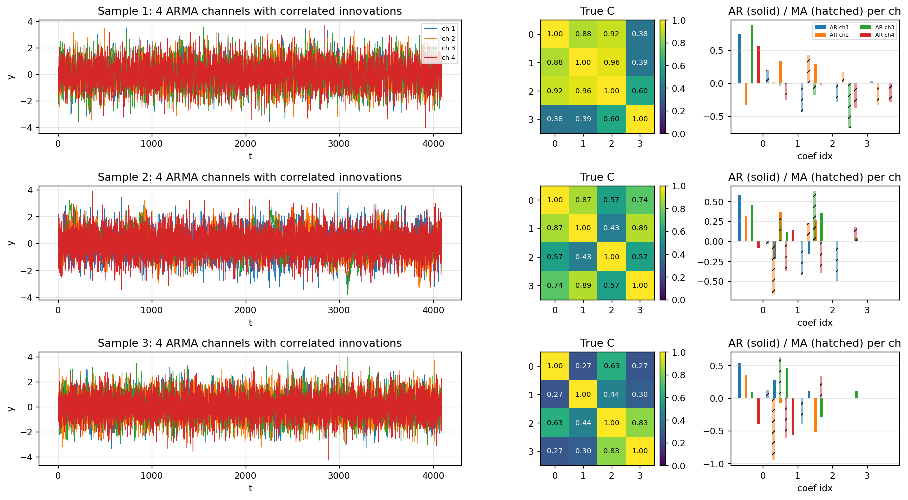
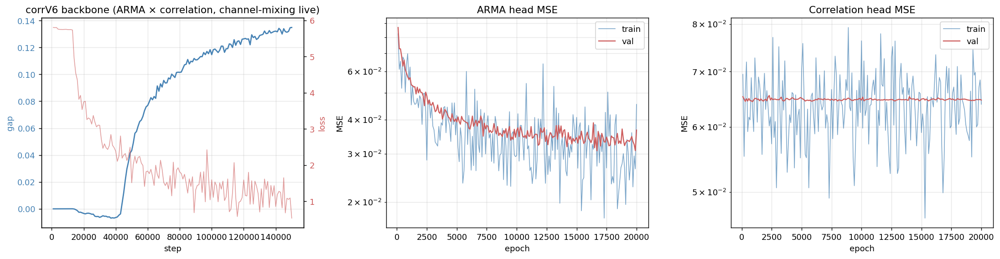
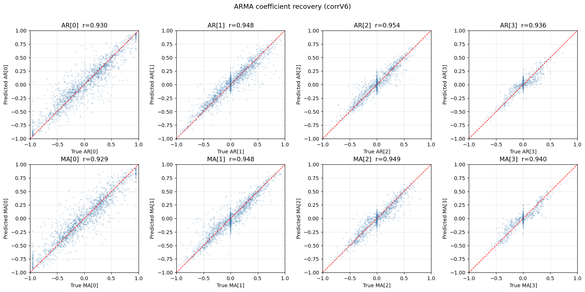
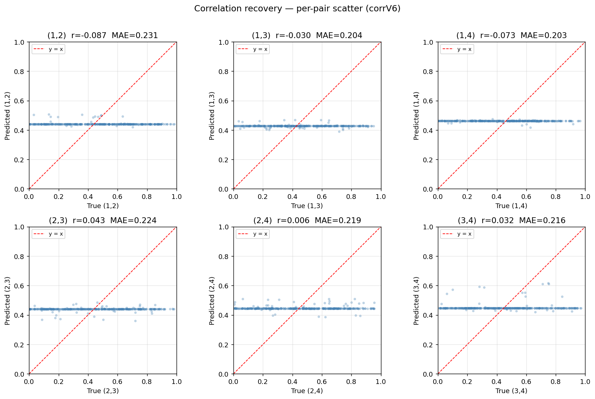
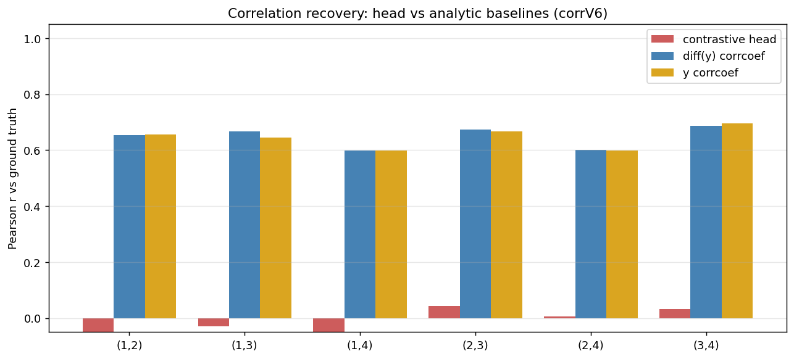
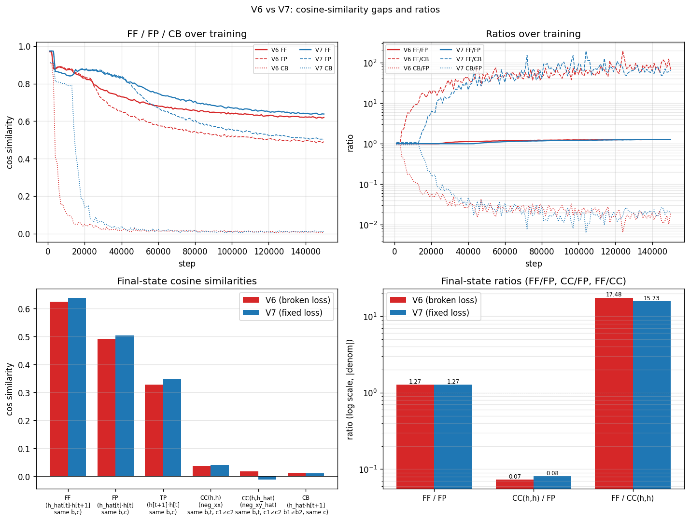

# Joint ARMA + Correlation Recovery, Channel-Mixing on Top

## Goal

Train one contrastive backbone with a channel-mixing block on top of a
per-channel transformer, then recover from a single frozen backbone
both per-channel ARMA coefficients and the per-sample 4×4 correlation
matrix using two separate small heads.

## Protocol

Data: 4-channel ARMA(p,q) processes with p, q ∈ {1..4} and T = 4096
timesteps, driven by Cholesky-correlated innovations whose covariance
is a per-sample 4×4 correlation matrix sampled iid per off-diagonal
pair with PSD rejection. Each channel is z-scored. See `data.py`.

Backbone: a per-channel GRU encoder, a 12-layer transformer that runs
one channel at a time (`[B*C, T, H]`), and a `Simple_channel_mixing_module`
on top that linearly mixes the C channels in the H-dimensional latent.
Hidden size H=1024, ~154 M params. The contrastive loss is
`cosine_similarity_batch_no_time_neg`: a same-channel time-shifted
positive, plus same-time cross-channel and time-shifted cross-batch
negatives. 150 k steps, batch 16, lr 7e-5, no grad clipping.

Heads (frozen backbone): a `GRURecoveryHead` reads the per-channel
encoder output and predicts the eight ARMA coefficients per channel; a
`JointCorrelationHead` reads the channel-mixed forecaster output and
predicts the six off-diagonal correlations per sample.

| Setting | Value |
|---|---|
| Channels C, hidden H, patch W | 4, 1024, 32 |
| Transformer layers, heads | 12, 8 |
| Backbone steps, batch, lr | 150 000, 16, 7e-5 |
| Head training epochs, batch, lr | 20 000, 16, 3e-4 |

## Backbone trains stably

The contrastive loss settles, and the model develops a small but real
forecast gap (FF − FP ≈ 0.13) between same-channel time-shifted
positives and same-time persistence. Cross-batch similarity drops
several orders of magnitude — different samples are well-separated.

## ARMA recovery succeeds

The frozen encoder output carries enough per-channel structure that a
small bidirectional GRU head recovers all eight AR/MA coefficients
cleanly. Per-coefficient Pearson correlation between predicted and
true is in the 0.93–0.95 range, sign agreement around 94 %, and MSE
is roughly 7× lower than predicting zero.

## Correlation recovery fails with the projected head

The first correlation head wraps a `Linear(C·H → H)` projection in
front of the GRU. Trained on a frozen backbone that has the latent
structure we wanted (channels nearly orthogonal in `h`, samples
near-orthogonal in cross-batch), the head still ends up predicting
the unconditional mean of the correlation distribution for every
sample. Per-pair Pearson r is near zero. A trivial `corrcoef(diff(y))`
estimator produces per-pair r ≈ 0.6–0.7 from the raw data — the
signal is in the data, but the head doesn't expose it.

## Why: the projection collapses cross-channel structure

The `Linear(C·H → H)` ahead of the GRU is sample-independent. It mixes
the four channels' features by a single fixed weighting for every
sample. Per-sample correlation lives in second-order cross-channel
quantities — products like `h^{c1} · h^{c2}` — which a linear map
cannot compute. After the projection the GRU sees a sequence with no
channel axis left to attend across.

The contrastive loss does push the right structure into the latent.
We verified mechanically that the loss-side cross-channel pressure
acts on the forecaster output by tracking `CC(h, h_hat)` (mean cosine
similarity of `h` vs `h_hat` across channels at the same time).
With the same-time cross-channel negative `neg_xy_hat` in the loss
this term is driven below zero (the forecaster is anti-aligned with
other channels' encoder output). The encoder-side ratios FF/FP, FF/CC
and CC/FP are essentially what we expected.

## Direct-input head fails identically

Replacement: `JointCorrelationHeadDirect` feeds `[B, T, C·H]` straight
into a bidirectional GRU with `input_size = C·H`. The recurrent gates
are nonlinear, so the hidden state can in principle accumulate
quadratic cross-channel statistics over time without an upstream
sample-independent linear bottleneck.

It does not. Per-pair Pearson r is again indistinguishable from zero
(range −0.10 to 0.06), MSE matches the mean baseline to two decimal
places, and the head converges to predicting the unconditional mean
of the correlation distribution within ~2000 epochs and stays there.
Two heads with very different inductive biases — sample-independent
linear projection then GRU, vs GRU eating the full `C·H` directly —
both fail in the same way.

The head architecture is therefore not the bottleneck we suspected.
The cross-channel correlation signal in this `h_hat` is either absent
or so faint that an order of magnitude in head capacity does not
recover it, while a trivial `corrcoef(diff(y))` estimator on the raw
data achieves r ≈ 0.6–0.7 from the same samples. The signal lives in
the data; it does not survive into `h_hat` in a form a 3–5 M parameter
GRU head can read.

The likely cause is back to the architecture: per-channel transformer
plus a sample-independent linear channel mix on top. The joint
statistics of channels do flow into `h_hat` in principle, but the
contrastive loss is dominated by per-channel ARMA features (which
drive both the same-channel positive and the cross-batch negative)
and the per-sample correlation signal sits well below that. A
backbone where channels are joint *in the representation* —
[B, T, C·H] into the transformer attention itself, or
sample-dependent mixing weights — is the next thing to try.

## Artifacts

Plots embedded above live in `plots/`. The frozen backbone is
`checkpoints/corrV7_best_gap.pth`; the two heads are
`checkpoints/corrV7_head_arma_best.pth` and
`checkpoints/corrV7_head_corr_best.pth` (projected) /
`checkpoints/corrV7_head_corr_direct_best.pth` (direct, pending).
Numerical summaries are in the matching `*_results.json` files. The
relative-gap analysis script that produced `v6_v7_ratios.png` is
`analyze_ratios.py`. Operational notes live in `experiment_log.md`.
