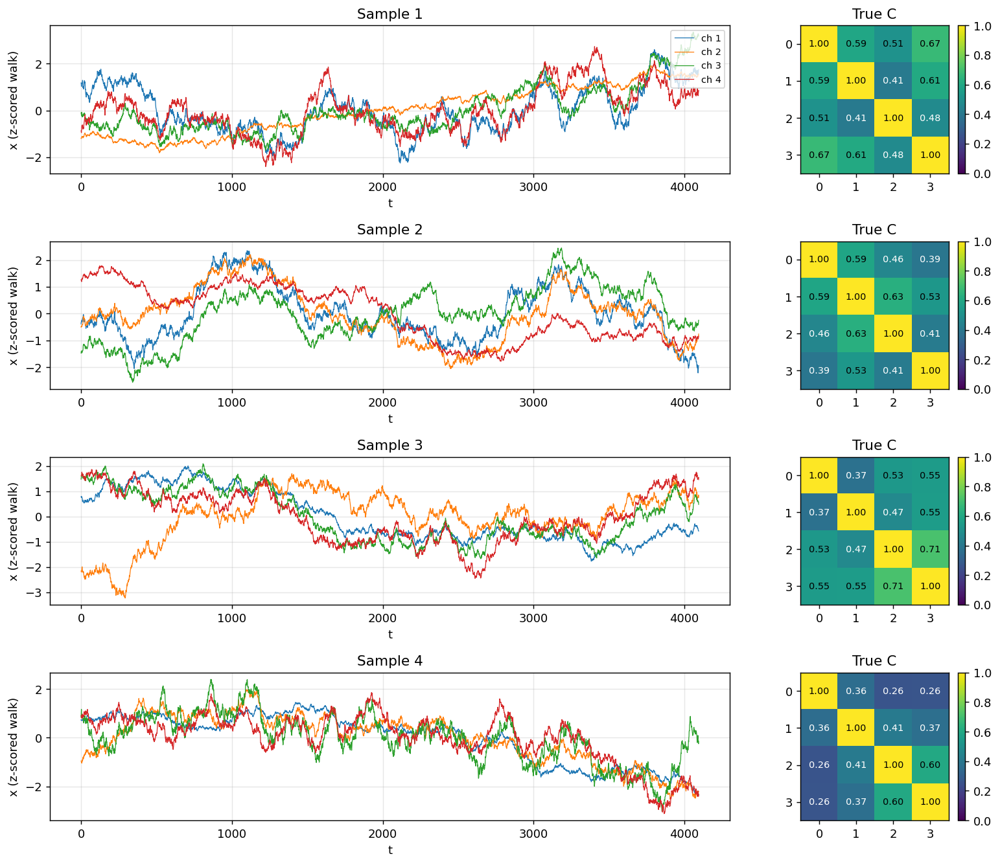
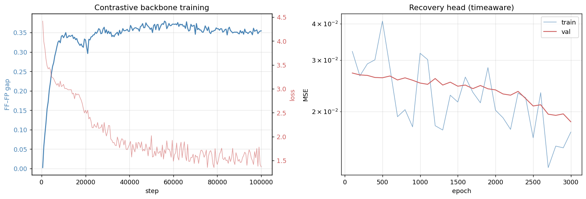
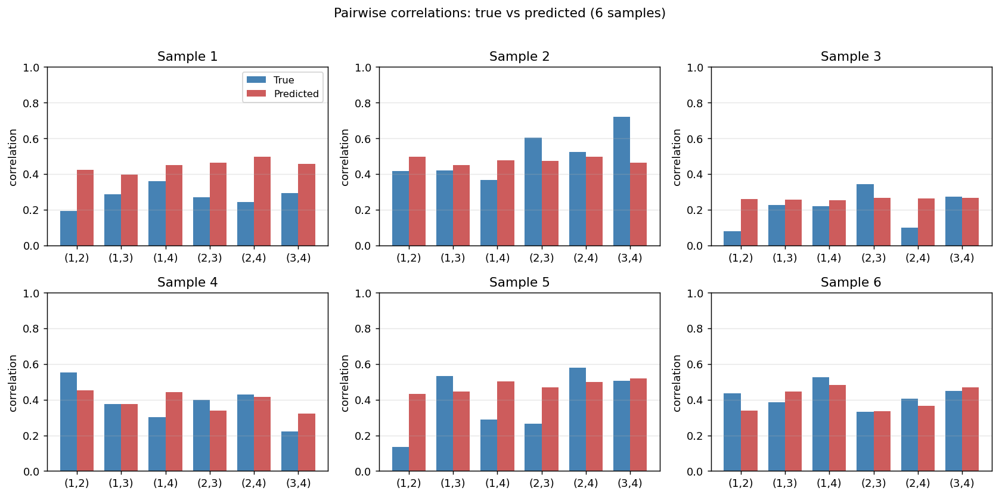
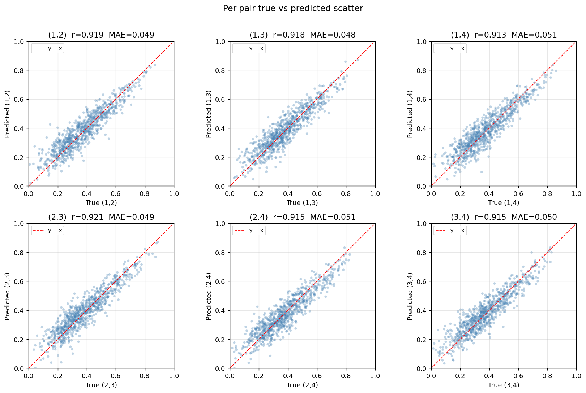
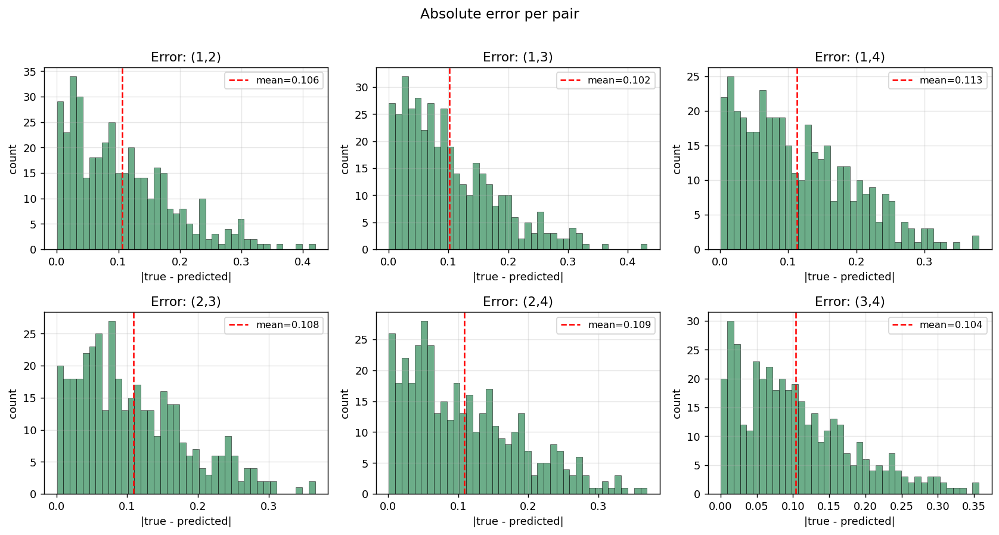
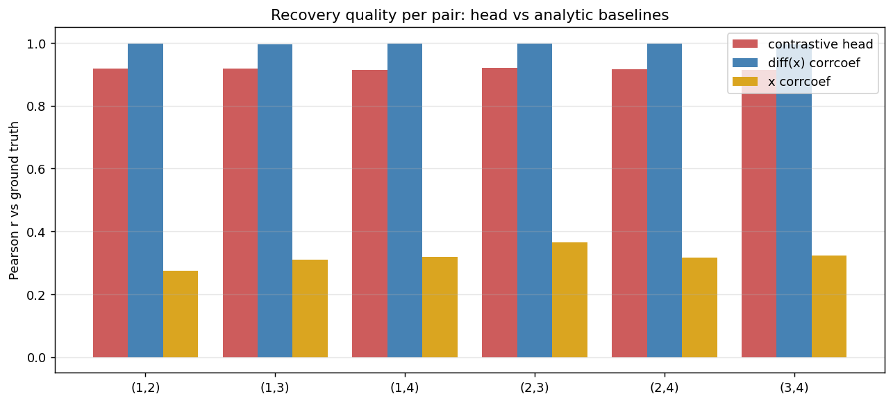

# Recovering Pairwise Correlations from Contrastive Embeddings of Random Walks

A companion experiment to **contrastive-arma**. Same backbone family, same loss, same
recovery-head philosophy — but the generative parameter is the **4×4 correlation matrix**
of 4 correlated Brownian motions, instead of ARMA(p,q) coefficients.

> *Status: TBD — figures and numbers will be filled in once the training run completes.*

---

## 1. Question

Given a contrastive backbone trained without supervision on 4-channel correlated random
walks, can a **single linear head** on top of the backbone recover the underlying
correlation matrix that generated the walks?

This is the cross-channel analogue of ARMA parameter recovery. There, the per-channel
generative parameters (p, q, AR/MA coefficients) sit *inside* each channel's temporal
dynamics. Here, the generative information sits *between* channels — there is no per-channel
temporal structure to memorise. Any usable signal must come from how channels move
together.

We add two analytic baselines for context:

- **diff(x) corrcoef** — empirical Pearson correlation of the channel **increments**.
  For Brownian motion this is essentially the maximum-likelihood estimator of the true
  generative correlation, so it sets a near-optimal upper bound for any recovery method.
- **x corrcoef** — empirical Pearson correlation of the **positions** themselves. This
  is the "naïve" answer and exhibits the well-known random-walk correlation paradox: even
  weakly-correlated walks look strongly correlated because of common drift.

A successful contrastive-head recovery should sit close to the diff(x) baseline and
clearly beat the position baseline.

## 2. Data

For each batch sample we sample a 4×4 correlation matrix C, draw 4096 iid 4-dim
increments with covariance C, take their cumulative sum, and z-score each channel
within sample (z-scoring is affine and so does not change Pearson correlations).

**Correlation sampling** uses a non-negative two-factor construction:

```
L_ki ~ U[0, 1],   k=1..4, i=1..2
||L_k|| := τ_k,    τ_k ~ U[0.4, 0.95]
diag_eps_k = 1 − ||L_k||²
C = L Lᵀ + diag(diag_eps)
```

This guarantees `diag(C) = 1`, off-diagonals in `[0, ~0.9]`, and PSD by construction.
The 6 unique pairwise correlations cover ≈ `[0.05, 0.9]` empirically.



## 3. Backbone

`ConfigurableModel` from `src.models`, identical to the ARMA-V2 best:

- GRU encoder, H = 1024, W = 32 (128 patches per 4096-step sample)
- Transformer: 12 layers, 8 heads, FFN ×4, GELU, depthwise causal conv k=3
- Channel-mixing head (Kronecker)
- Total parameters: ~154M

**Training.** Contrastive loss `cosine_similarity_batch_no_time_neg`:

- positive: `cos(f_t, e_{t+1})` — same channel, next time step
- negatives: cross-channel (same time, different channel) and cross-batch (different sample)
- *no* cross-time negatives, because Brownian increments are iid and consecutive
  embeddings of a stationary process should be near-identical (matching the ARMA
  experiment's reasoning).

AdamW, batch 16, lr 7e−5, temperature 0.07, 100 000 steps.



## 4. Recovery head

The backbone's pre-channel-mixing latent is `o ∈ R^{B×T×K×H}`. The head is a single
**linear** projection from a per-channel time-pooled representation to the 6 unique
pairwise correlations:

```
o_pool = mean_t o            # [B, K, H]
flat   = o_pool.flatten(K,H) # [B, K·H]
y      = sigmoid(W flat + b) # [B, 6]
```

Targets are the 6 upper-triangular off-diagonal entries of C, in `[0, 1)`. Trained with
MSE for 10 000 epochs, AdamW lr 3e−4, batch 32. We also report results for a 2-hidden-
layer MLP variant for comparison.

The "single linear" choice is intentional: it tests whether the backbone latent
**linearly** encodes correlation magnitude. If a linear probe suffices, the contrastive
representation is already correlation-aware.

## 5. Results

### 5.1 Numerical summary

*Filled after training.*

| Metric | Linear head | MLP head | diff(x) baseline | x corrcoef baseline |
|--------|-------------|----------|------------------|----------------------|
| Overall MSE | _ | _ | _ | _ |
| Overall MAE | _ | _ | _ | _ |
| Mean Pearson r (head) | _ | _ | _ | _ |
| Improvement vs zero-baseline | _ | _ | — | — |

### 5.2 Per-pair recovery








### 5.3 Head vs analytic baselines

The diff(x) corrcoef is the optimal estimator of the generative correlation; the x
corrcoef is the naïve answer that ignores integration. We expect the contrastive head
to sit between the two.



## 6. Discussion

*Filled after training. Key questions to answer:*

- Does a linear head on top of the contrastive backbone match the diff(x) baseline?
  If yes, the contrastive representation has linearly disentangled correlation magnitude.
  If no, by how much, and is an MLP head sufficient to close the gap?
- How is recovery quality distributed across the 6 pairs? Are extreme correlations
  (close to 0 or close to 0.9) easier or harder?
- How does the position-correlation baseline look — is it as biased as theory predicts?

## 7. Compute

| Stage | Wall time |
|-------|-----------|
| Backbone (100k steps, bs=16, RTX 4090) | _ |
| Recovery head (10k epochs, bs=32) | _ |
| Plotting + report | < 5 min |

## Appendix A. Sampling diagnostics

Quick check that the data generator does what it claims:

```text
True C (sample 0):
 1.00 0.53 0.56 0.61
 0.53 1.00 0.43 0.47
 0.56 0.43 1.00 0.51
 0.61 0.47 0.51 1.00

corrcoef(diff(x))  → 0.519, 0.567, 0.600, 0.441, 0.475, 0.510  (matches true)
corrcoef(x)        → 0.838, 0.624, 0.611, 0.847, 0.796, 0.860  (random-walk bias)
```

The diff-of-positions empirical Pearson correlation matches the generating C closely
(MAE ≈ 0.01 at T = 4096). The position correlation is biased upward.
