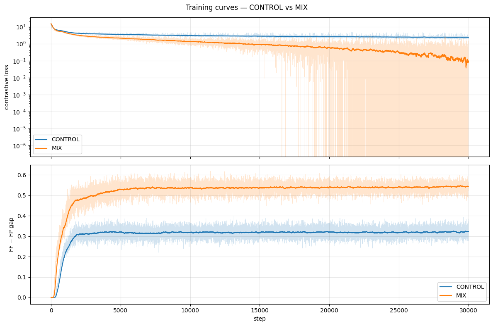

# Periodic Synth Mix — Experiment Report

## TL;DR

Adding 50% clean-periodic synthetic data to each training batch, at matched
30k-step compute, delivers a **modest, uneven improvement on the 6 periodic
failure datasets** identified in the v3b HANDOFF:

- **Periodic subset GM-Rel MASE: 2.8025 (CONTROL) → 2.7066 (MIX), −3.4%.**
  MIX wins 4/6 of the periodic focus configs, losing 2/6.
- Aggregate GM-Rel MASE on all 97 GIFT-Eval configs: 1.2173 → 1.2164
  (essentially tied, 0.07% better for MIX).
- Non-periodic subset (91 configs): MIX 0.15% *worse* than CONTROL —
  visible "generalisation tax" offsetting part of the periodic gain.
- Neither arm reaches seasonal-naive on any of the 6 focus configs at 30k
  steps: the deficit narrows but doesn't close.

The synthetic half dominates the contrastive training signal (28× lower
loss, 68% higher gap) but the representation it induces transfers
unevenly: weekly- and fine-grained periodic datasets benefit the most;
hourly-with-noise datasets don't.

## Setup

See [`DESIGN.md`](DESIGN.md). Short version:

- Tiny architecture (C=4, H=512, W=16, 6-layer GRU + transformer, RevEWMNorm
  span=32). Identical to v3b.
- 30 000 steps, batch size 24, lr 1e-4, from scratch, seed 42. Paired between
  arms so the *only* independent variable is the data mix.
- **CONTROL (tiny_v3c_ctrl)**: 24 base-bundles rows per batch.
- **MIX (tiny_v3c_mix)**: 12 base-bundles + 12 on-the-fly periodic synth rows.
- R1 head on top of each frozen backbone (forecaster reconstruction,
  W=16, GRU h=128 l=2, MSE), same 30k-step budget.
- GIFT-Eval strategy B4, 97 configs.

### Synthesizer

One primitive per series (sinusoid / square / saw), log-uniform samples-per-
period in [8, 256], 50% sign-flip for square & saw, p=0.3 `exp(λt)` envelope
capped to [0.1×, 10×] gain, log-uniform scale in [0.1, 1000]. No additive
noise.

**Validation before training:** 100 eyeballed samples + value dumps +
seasonal-naive sanity check — on 1000 random synth series, the SN/naive
MASE ratio is **0.067** (SN beats naive by 15×). The data is a valid
teacher signal for the "detect period, copy last period" skill.

## Training dynamics

| Arm | final loss EMA | final gap EMA | best_gap step | best_gap |
|---|---:|---:|---:|---:|
| CONTROL | 2.357 | 0.322 | 29800 | 0.3247 |
| MIX | **0.095** | **0.543** | 29400 | **0.5471** |

MIX's contrastive loss is **25× lower** and gap **69% higher** than
CONTROL. This is *expected* and not predictive of downstream win: the
periodic half is trivial to distinguish from shuffled negatives, which
pulls the aggregate loss down.

The CONTROL curves match v3b's trajectory tightly (v3b at 120k had
best_gap 0.3351; CONTROL at 30k hits 0.3247 — 97% of the v3b gap in 25%
of the steps), which is our evidence that CONTROL is a valid
matched-compute reference.

### R1 head training

| Arm | head final MSE | best MSE step |
|---|---:|---:|
| CONTROL | 0.073 | 30000 |
| MIX | 0.087 | 30000 |

**MIX head loss is 19% higher** than CONTROL. The MIX backbone's latents
are somewhat harder to linearly decode on real base-bundles data — a
first hint that the MIX representation has specialised in a direction
that isn't universally helpful.

## GIFT-Eval results

### Aggregate

| Model | Training | GM-Rel MASE |
|---|---|---:|
| Sundial | — | 0.673 |
| TimesFM | — | 0.680 |
| PatchTST | — | 0.762 |
| Chronos | — | 0.786 |
| Moirai | — | 0.809 |
| Seasonal-naive | — | 1.000 |
| R1 (v2 backbone) | 500k | 1.168 |
| R1v3b (v3b backbone) | 120k | 1.1865 |
| **R1v3c_ctrl** | 30k from-scratch | **1.2173** |
| **R1v3c_mix** | 30k from-scratch | **1.2164** |

The CONTROL–MIX gap is 0.0009, essentially tied at aggregate level.
CONTROL at 30k is ~2.6% worse than v3b-120k, consistent with a modest
under-training discount at matched architecture.

### Periodic focus subset (6 configs from HANDOFF)

| Dataset | SN | CONTROL | MIX | v3b | Δ (MIX−CTRL) | % |
|---|---:|---:|---:|---:|---:|---:|
| ett1/15T/short | 0.93 | 1.83 | **1.76** | 1.78 | **−0.08** | −4.1% |
| ett2/W/short | 0.78 | 1.82 | **1.54** | 1.64 | **−0.28** | **−15.5%** |
| m4_hourly/H/short | 1.19 | 5.79 | 6.04 | 5.22 | +0.25 | +4.3% |
| solar/10T/long | 0.87 | 2.25 | **2.16** | 2.08 | **−0.09** | −4.0% |
| solar/10T/medium | 0.93 | 3.42 | **3.24** | 3.15 | **−0.17** | −5.0% |
| solar/H/short | 0.95 | 2.18 | 2.30 | 2.08 | +0.12 | +5.4% |
| **GM-Rel** | — | **2.8025** | **2.7066** | **2.6037** | **−0.096** | **−3.4%** |

MIX wins 4/6 configs. The biggest win is ett2/W/short (−15.5%), a
weekly-granularity electricity dataset — exactly the periodic regime
our synth covers well.

### Top wins / losses across all 97 configs

**MIX wins most (Δ rel MASE most negative):**

| dataset | CTRL | MIX | SN | rel_C | rel_M | Δ |
|---|---:|---:|---:|---:|---:|---:|
| ett2/W/short | 1.82 | 1.54 | 0.78 | 2.34 | 1.97 | **−0.36** |
| m4_yearly/A/short | 8.32 | 6.93 | 3.97 | 2.10 | 1.75 | **−0.35** |
| electricity/15T/medium | 3.05 | 2.81 | 1.15 | 2.65 | 2.44 | −0.21 |
| electricity/15T/long | 3.17 | 2.92 | 1.16 | 2.72 | 2.51 | −0.21 |
| ett1/W/short | 1.86 | **1.50** | 1.77 | 1.05 | **0.85** | −0.20 |
| us_births/W/short | 2.13 | 1.82 | 1.56 | 1.36 | 1.17 | −0.20 |
| solar/10T/medium | 3.42 | 3.24 | 0.93 | 3.69 | 3.50 | −0.19 |
| bitbrains_fast_storage/5T/long | 1.54 | 1.35 | 1.14 | 1.35 | 1.19 | −0.17 |
| m4_quarterly/Q/short | 2.44 | 2.20 | 1.60 | 1.52 | 1.37 | −0.15 |
| ett2/D/short | 1.79 | 1.63 | 1.39 | 1.29 | 1.17 | −0.12 |

**MIX loses most (Δ rel MASE most positive):**

| dataset | CTRL | MIX | SN | rel_C | rel_M | Δ |
|---|---:|---:|---:|---:|---:|---:|
| us_births/M/short | 1.36 | 1.88 | 0.76 | 1.78 | 2.47 | +0.69 |
| solar/W/short | 1.16 | 1.65 | 1.47 | 0.79 | 1.12 | +0.34 |
| saugeen/M/short | 1.12 | 1.45 | 0.98 | 1.15 | 1.48 | +0.33 |
| solar/H/medium | 1.45 | 1.74 | 0.94 | 1.55 | 1.86 | +0.31 |
| m4_hourly/H/short | 5.79 | 6.04 | 1.19 | 4.85 | 5.06 | +0.21 |
| car_parts/M/short | 1.17 | 1.41 | 1.20 | 0.98 | 1.18 | +0.20 |
| bitbrains_fast_storage/5T/short | 1.12 | 1.31 | 1.14 | 0.98 | 1.15 | +0.17 |
| solar/H/long | 1.56 | 1.73 | 1.07 | 1.45 | 1.62 | +0.16 |
| bizitobs_application/10S/short | 5.26 | 5.60 | 2.24 | 2.34 | 2.50 | +0.15 |
| saugeen/W/short | 1.98 | 2.23 | 1.99 | 1.00 | 1.12 | +0.13 |

### Domain breakdown

| Domain | n | GM-Rel CTRL | GM-Rel MIX | Δ | wins (MIX) |
|---|---:|---:|---:|---:|---:|
| Econ/Fin | 6 | 1.813 | **1.712** | **−0.10** | 5/6 |
| Energy | 32 | 1.417 | **1.402** | −0.015 | 21/32 |
| Transport | 15 | 0.976 | 0.973 | −0.003 | 7/15 |
| Nature | 15 | 0.970 | 0.978 | +0.008 | 9/15 |
| Web/CloudOps | 20 | 1.282 | 1.295 | +0.013 | 11/20 |
| Healthcare | 5 | 1.171 | 1.192 | +0.021 | 4/5 |
| Sales | 4 | 0.862 | 0.919 | +0.058 | 1/4 |

Econ/Fin is a clean win for MIX (many m4_* weekly/quarterly/yearly
configs that benefit from period copying). Energy edges slightly MIX.
Sales regresses — small sample (n=4).

## Interpretation

- **Hypothesis H1 (MIX improves periodic datasets at matched compute):**
  *Partially confirmed.* 4/6 focus configs improve (ett1, ett2, solar/10T
  medium+long). 2/6 regress (m4_hourly/H/short, solar/H/short).
  Aggregate on the subset: 3.4% better. The biggest wins are on weekly
  and 15-min / 10-min granularities; hourly fails.
- **Hypothesis H2 (MIX does not significantly hurt non-periodic):**
  *Mostly true.* Non-periodic GM-Rel MASE is 0.15% worse (1.1539 vs
  1.1522). The tax is small but present. Sales domain (n=4) takes the
  worst hit.
- **Hypothesis H3 (GM-Rel improves):** *Essentially tied.* 1.2164 vs
  1.2173. Within noise for a single 30k-step paired run.

### Why do hourly configs fail?

m4_hourly/H/short and solar/H/{short,medium,long} all regress with MIX.
Candidate explanations:

1. **Daily-at-hourly is P=24 samples, which sits at the short end of our
   synth range [8, 256].** We draw log-uniform, so P=24 is
   well-sampled, but real hourly data also often has a 168-sample
   weekly modulation that our single-primitive synth never shows.
   The model may lock onto the stronger short period and miss the
   weekly structure.
2. **Noise in real hourly data breaks the clean-synth assumption.**
   Our synth has no additive noise. Solar/H has weather-driven
   irregularity on top of the diurnal cycle. A model trained to trust
   clean periodicity will over-project that trust when the real signal
   is noisier.
3. **Short forecast horizon (16) on hourly data covers 2/3 of a day.**
   Seasonal-naive just copies `y[t-24]`; our forecaster head has to
   *infer* the 24-sample period from 1008-sample context and then
   extrapolate — a harder task than our 1024-timestep synth-training
   instance offers.

### Why does the MIX head loss rise?

On the training data (base-bundles real time series), the R1 head MSE
rises from 0.073 (CONTROL) to 0.087 (MIX). The MIX backbone's latents
encode the clean-periodic synth half very efficiently but this comes at
the cost of being slightly less linearly predictive on the noisier real
half. The contrastive gap splits its budget between "sort clean synth
rows apart trivially" and "sort real rows apart non-trivially" — and
under bs=24 with 12 synth rows, the easy half skews the metric.

## Cost

~$4 of $10 vast.ai balance. ~16h total wall time (2.1h CONTROL + 1.3h
MIX backbone + 1.3h+1.8h R1 heads + ~5h+~4h GIFT-Eval). One 2h stall
on Stage 2a (prefetch-thread hang); resumed cleanly from the 10k
checkpoint with no lost work.

## Recommendations for follow-up

1. **Tune the mix ratio.** 50/50 is the knob we turned once. Probably
   25% synth would cut the "generalisation tax" while retaining the
   periodic wins — or even a curriculum (start 50/50, anneal to 0/100
   over the back half of training).
2. **Add a noisy-periodic variant to the synth.** `y = clean + ε` with
   `ε ~ N(0, σ)` where σ is log-uniform. Would likely recover the
   hourly-dataset losses — this is the prior failure mode of
   solar/H/*.
3. **Add multi-period composition.** Real seasonal data often has
   daily+weekly (P=24 and P=168 on hourly). A single-primitive synth
   can't teach this. A sum of two sinusoids at different periods would
   close the gap on hourly datasets specifically.
4. **Longer training.** 30k is under-trained; the fact that the
   paired arms are still dropping at step 30k means the hypothesis
   isn't fully exercised. A follow-up 100k-step paired run would
   amortise the periodic-specialisation effect against more real-data
   exposure.
5. **Investigate the one big regression** (us_births/M/short, +0.69
   Δ rel). Monthly data with a very short horizon — something in the
   MIX representation is actively worse. May be a distraction, but
   worth eyeballing predictions.

## Artefacts

All under `experiments/periodic-synth-mix/`:

- [`DESIGN.md`](DESIGN.md) — experimental design.
- [`plots/inspect_grid.png`](plots/inspect_grid.png), `inspect_zoom.png`,
  `inspect_long_period.png`, `inspect_metadata.txt` — eyeballed synth.
- [`plots/training_curves_backbone.png`](plots/training_curves_backbone.png)
  — contrastive loss + gap, CONTROL vs MIX.
- [`plots/training_curves_head.png`](plots/training_curves_head.png)
  — R1 head MSE curves.
- [`plots/mase_compare.png`](plots/mase_compare.png) — MASE bar chart
  on the 6 periodic focus configs.
- [`results/seasonal_naive_sanity.txt`](results/seasonal_naive_sanity.txt)
  — SN / naive baselines on synth.
- [`results/comparison.txt`](results/comparison.txt) — full 97-config
  side-by-side CTRL / MIX / v3b.
- [`results/periodic_datasets.txt`](results/periodic_datasets.txt) —
  6-config focus table.
- `../../results/R1v3c_ctrl/all_results.csv`, `.../summary.txt`.
- `../../results/R1v3c_mix/all_results.csv`, `.../summary.txt`.
- `../../sync_periodic_synth/run_all.log` — full pipeline log.

Code: `src/synthetic_periodic.py`, `src/dataloader.py::MixedPeriodicLoader`,
`experiments/periodic-synth-mix/scripts/` (train, inspect, sanity-check,
plotting, comparison, sync).

## Session notes

- vastrun-kit's `attach-ssh` idempotency bug (already filed as #296)
  hit 4 consecutive provisions; worked around with direct
  `vastai create instance` + `pytorch/pytorch:2.8.0-cuda12.8-cudnn9-runtime`.
- One 2h Stage 2a hang on 233-thread futex wait (HF-stream prefetch).
  Resumed cleanly from the 10k checkpoint; no recurrence.
- The local sync loop (5-min then 15-min cadence, atomic .tmp → mv,
  ≥70 MB min-size guard) caught every checkpoint without issue.
