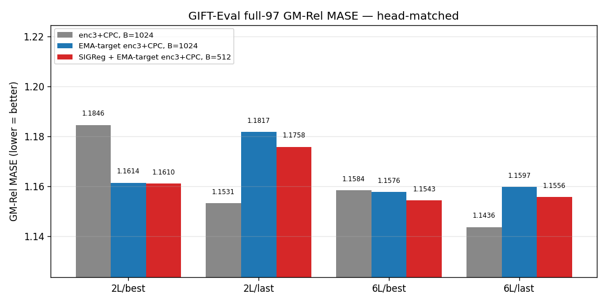
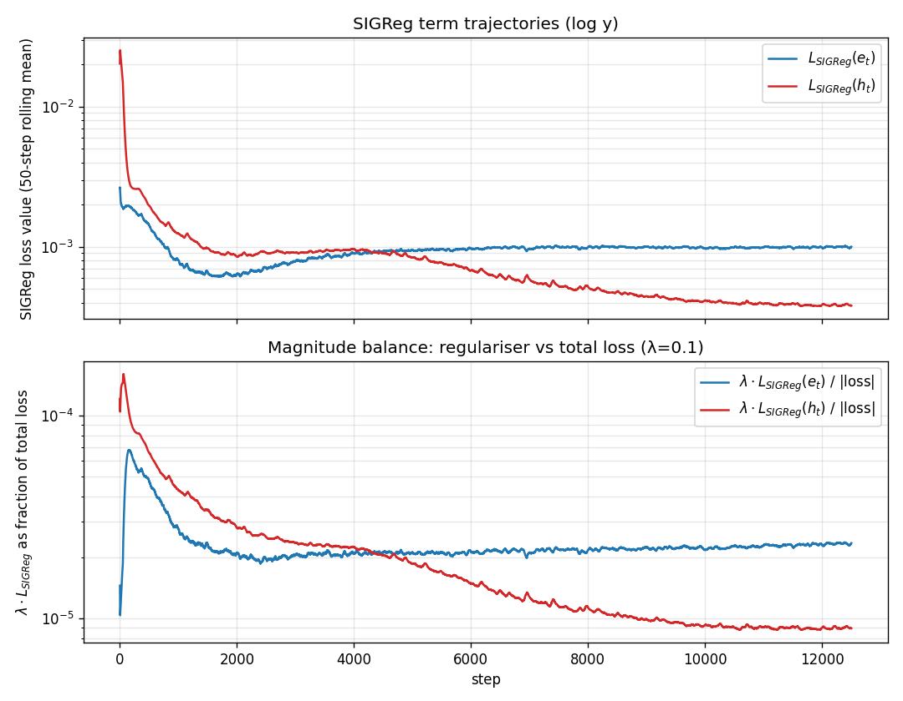
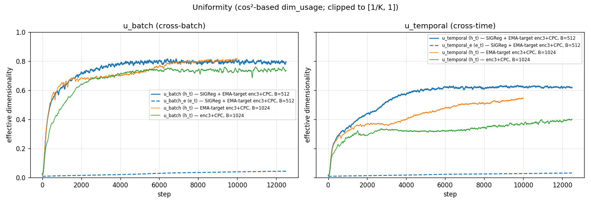
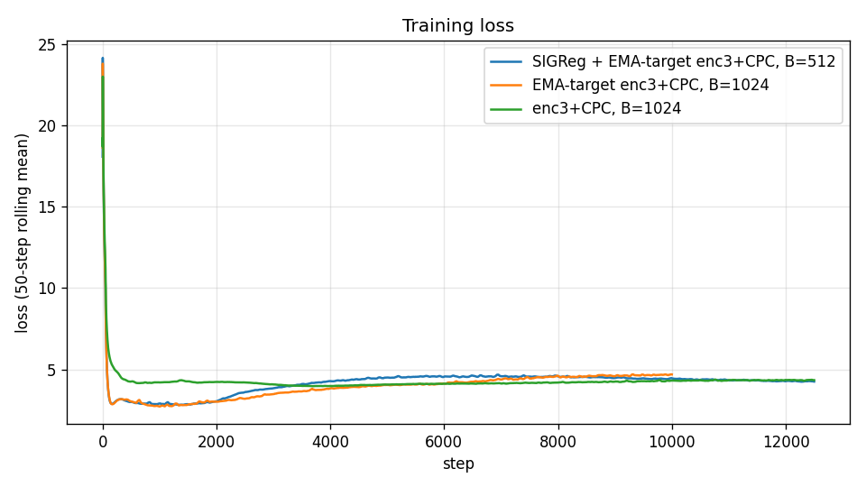

# LeJEPA spherical regulariser at half batch size

## Question

The previous EMA-target enc3+CPC recipe at B=1024 is bound by GPU memory at the GRU patch-embed inside the teacher path. Cutting the batch to 512 frees that budget. With the cut, does adding a spherical regulariser on the patch-embed and on the encoder output keep the GIFT-Eval full-97 score in the same neighbourhood as the B=1024 reference, and fill the latent sphere?

## Vocabulary

| term | definition |
| --- | --- |
| `enc3` | 3-layer transformer encoder (hidden size `K`=384, 6 heads — the codebase's depth used here). |
| `CPC` | InfoNCE auxiliary head on the encoder, `--cpc-infonce-weight 1.0`. |
| **EMA-target** | exponential-moving-average teacher on the encoder + patch-embed, `--ema-tau 0.99`. |
| `e_t` | output of the GRU patch-embed, per (batch, time, channel) position; `K`=384. |
| `h_t` | output of the 3-layer transformer encoder (the codebase's `original_latent`), same shape. |
| **SIGReg** | LeJEPA-style spherical regulariser. Epps–Pulley test statistic averaged over `M`=1024 random unit-direction 1-D projections of the pooled latent, trapezoidal-integrated on `[−6/√K, 6/√K]` against `N(0, 1/K)`. Drives the pooled marginal toward `Unif(S^{K-1})`. Two terms here: `L_SIGReg(e_t)` (`--sigreg-embedding`) and `L_SIGReg(h_t)` (`--sigreg-encoding`), both pre-`F.normalize` (`--sigreg-post-normalization` OFF). Each weighted by `λ`=0.1. |
| `u_batch` | cross-batch dimensionality usage of `h_t`, clipped to `[1/K, 1]`. `1/K` ≈ 0.00260 = one direction; 1 = uniform sphere coverage. `u_batch_e` is the same statistic on `e_t`. |
| `u_temporal` | cross-time analogue of `u_batch`; `u_temporal_e` is the `e_t` version. |
| **GM-Rel MASE** | GIFT-Eval full-97 aggregate: geometric mean over 97 configs of (model MASE ÷ seasonal-naive MASE). Lower = better; 1.0 = seasonal-naive parity. |

## Result

| head / checkpoint | enc3+CPC, B=1024 | EMA-target enc3+CPC, B=1024 | SIGReg + EMA-target, B=512 |
| --- | ---: | ---: | ---: |
| 2L / best | 1.1846 | 1.1614 | 1.1610 |
| 2L / last | 1.1531 | 1.1817 | 1.1758 |
| 6L / best | 1.1584 | 1.1576 | 1.1543 |
| 6L / last | 1.1436 | 1.1597 | 1.1556 |

Cross-arm deltas of the SIGReg arm vs the EMA-target reference: 2L/best −0.0004, 2L/last −0.0059, 6L/best −0.0033, 6L/last −0.0041. The largest cross-arm delta (0.0059) is 2.5× smaller than the SIGReg arm's own intra-row best-vs-last spread of **0.0148** (2L: 1.1610 → 1.1758). The four-cell head-to-head does not separate the SIGReg + B=512 arm from the EMA-target B=1024 reference in either direction.

**Metric scope.** This GIFT-Eval wrapper emits only GM-Rel MASE per `summary.txt`. The project's preferred aggregates are GM-MASE / GM-MAPE_SN / GM-CRPS_SN; those are not produced here — the per-config `all_results.csv` carries raw `MASE[0.5]`, `MAPE[0.5]`, and `mean_weighted_sum_quantile_loss`, but not the seasonal-naive denominators needed to form the SN-relative versions (see annex C).

**Reference-values provenance.** The enc3+CPC and EMA-target columns reproduce prior arms' published head-matched tables at their own code revisions, embedded as constants `REF_GM` and `EMA_GM` in [`build_report.py`](../../experiments/2026-06-20_lejepa_sigreg/scripts/build_report.py); the SIGReg column is the only fresh head-matched eval at this code revision and HF cache snapshot.

### What the two SIGReg terms did

Mean over the last 50 of 12 500 steps:

| quantity | value |
| --- | ---: |
| total `loss` | 4.2478 |
| `λ · L_SIGReg(e_t)` | 1.001e-4 |
| `λ · L_SIGReg(h_t)` | 3.805e-5 |
| **`λ · L_SIGReg(e_t) / loss`** | **2.36e-5** (~42 000× smaller than total) |
| **`λ · L_SIGReg(h_t) / loss`** | **8.96e-6** (~110 000× smaller than total) |

The `e_t` regulariser was effectively inert by magnitude: `L_SIGReg(e_t)` sits ~42 000× below the contrastive + CPC + EMA-target sum. The `L_SIGReg(e_t)` curve is also non-monotone — it drops to ~6.4e-4 by step 2 000, then rebounds to ~1.0e-3 from step 5 000 onward where it plateaus (annex D).

### Sphere coverage

`h_t` reaches `u_batch` = 0.796 and `u_temporal` = 0.619. `e_t` ends at `u_batch_e` = 0.044 and `u_temporal_e` = 0.032 — 17× and 12× the `1/K` floor of 0.00260, but ~18× below the `h_t` levels. The contrastive loss `cosine_similarity_batch_full_hh_negs_xshh_allt` directly rewards angular separation between `h_t` vectors, so `h_t`'s sphere coverage is not attributable to the SIGReg term alone.

## Protocol

One arm, seed `20260520`, 12 500 steps. Launcher: [`experiments/2026-06-20_lejepa_sigreg/scripts/train_backbone_sigreg.sh`](../../experiments/2026-06-20_lejepa_sigreg/scripts/train_backbone_sigreg.sh).

Backbone: GRU patch-embed → 3-layer transformer encoder (`K`=384, 6 heads). The arm changes exactly three flags vs the EMA-target enc3+CPC reference (B=1024):

| flag | reference | this arm |
| --- | --- | --- |
| `--batch-size` | 1024 | 512 |
| `--sigreg-embedding` | OFF | ON |
| `--sigreg-encoding` | OFF | ON |

Other flags from the reference (`--ema-embedding --ema-encoder --ema-tau 0.99`, `--cpc-infonce-weight 1.0`, `--encoder-dropkey 0.70`, `--mix-ratio 0.0078125`, dataset, dtypes) are kept verbatim. `--sigreg-post-normalization` is OFF; `--sigreg-weight 0.1`, `--sigreg-m 1024`, `--sigreg-t-knots 17`.

### Head-matched downstream

Each backbone checkpoint (`best` = best train-loss, `last` = step 12 500) trains a 2-layer and a 6-layer quantile head, then evaluates on GIFT-Eval full-97 via `scripts/run_gift_eval_full.sh`. Per-cell summaries live at `results/gift_eval_full_<tag>{,_last}_{2L,6L}/summary.txt`.

### Training loss

The SIGReg arm and the EMA-target reference both dip to ~2.5–2.9 around step 1 000, then rise to ~4.2–4.7 by step 5 000 where the curves plateau; the enc3+CPC reference (no EMA-target) sits at ~4.2–4.5 throughout with a small rise over the same window. This report does not isolate the cause of the shape.

## Annex

### A. Cross-arm plot provenance

All plots embed the SIGReg arm's training CSV `runs/bb_allt08_xftrip_nobn_enc3_emateach_sigreg_qk_aon_b512_cpc_losses.csv` (12 500 rows, seed `20260520`). `loss_curve.png` and `uniformity.png` overlay:

- EMA-target arm: `experiments/2026-06-19_ema_target_encoder/runs/bb_allt08_xftrip_nobn_enc3_emateach_qk_aon_b1024_cpc_losses.csv`
- enc3+CPC arm: `experiments/2026-06-13_cpc_infonce_aux/runs/bb_allt08_xftrip_nobn_enc3_sgpos_qk_aon_b1024_cpc_losses.csv`

Both overlay CSVs are taken from those arms' own code revisions; no fresh re-training was run for this report. The `gm_rel_mase.png` legend mapping: grey = enc3+CPC B=1024 (no SIGReg, no EMA-target), blue = EMA-target enc3+CPC B=1024 (no SIGReg), red = this arm. The four x-axis cells decompose as `<head layers>/<backbone checkpoint>` (e.g. `2L/best` = 2-layer head on the best-train-loss backbone).

### B. Attribution — three axes move together

The arm changes three things vs the EMA-target B=1024 reference: SIGReg on `e_t`, SIGReg on `h_t`, batch 1024 → 512. The four-cell GM-Rel MASE table measures the joint perturbation. A per-axis decomposition would need at minimum a no-SIGReg B=512 arm (isolates batch) and a SIGReg B=1024 arm (isolates SIGReg, would itself need an OOM remediation beyond the chunking workaround used here). The issue spec asks for the single B=512 arm; those controls are out of scope and were not run.

### C. GIFT-Eval wrapper emits only GM-Rel MASE

`scripts/run_gift_eval_full.sh` writes `Aggregate GM-Relative MASE (97 configs)` to each `summary.txt`. The per-config `all_results.csv` carries raw `MASE[0.5]`, `MAPE[0.5]`, and `mean_weighted_sum_quantile_loss`, but not the seasonal-naive denominators needed to form GM-MASE / GM-MAPE_SN / GM-CRPS_SN. Computing those would require re-running the wrapper with an additional emit flag — out of scope here.

### D. Trajectory of SIGReg terms and `e_t` dimensionality

50-step rolling means:

| step | `L_SIGReg(e_t)` | `L_SIGReg(h_t)` | `u_batch_e` | `u_batch` (`h_t`) | `loss` |
| ---: | ---: | ---: | ---: | ---: | ---: |
| 250 | 1.76e-3 | 2.59e-3 | 0.0100 | 0.4069 | 3.13 |
| 500 | 1.36e-3 | 1.92e-3 | 0.0110 | 0.5379 | 2.99 |
| 1 000 | 7.55e-4 | 1.23e-3 | 0.0126 | 0.6173 | 2.88 |
| 2 000 | 6.41e-4 | 8.57e-4 | 0.0151 | 0.7190 | 3.07 |
| 5 000 | 9.38e-4 | 8.40e-4 | 0.0240 | 0.7867 | 4.50 |
| 7 500 | 9.96e-4 | 5.17e-4 | 0.0341 | 0.7925 | 4.54 |
| 10 000 | 9.70e-4 | 4.12e-4 | 0.0395 | 0.7923 | 4.43 |
| 12 500 | 1.01e-3 | 3.81e-4 | 0.0438 | 0.8020 | 4.24 |

`1/K` = 1/384 ≈ 0.00260. Final-step `u_temporal` = 0.6194, `u_temporal_e` = 0.0315.
