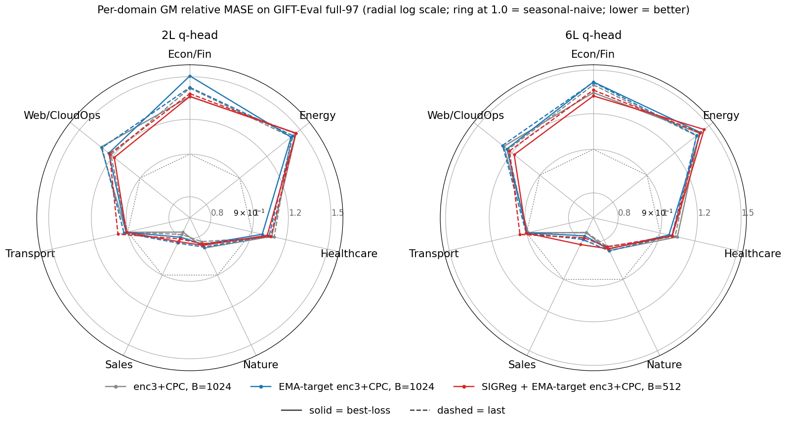

# LeJEPA spherical regulariser at half batch size

Does adding a spherical regulariser on the patch-embed and on the encoder output, with batch cut from 1024 to 512, keep the GIFT-Eval full-97 GM-Rel MASE near the B=1024 reference and fill the latent sphere? The SIGReg arm is below the EMA-target reference in every cell by 0.0004–0.0059 GM-Rel MASE; on the sphere, `u_batch` (`h_t`) ends slightly below the reference (0.80 vs 0.82) and `u_temporal` (`h_t`) slightly above (0.62 vs 0.57).

## Result

GM-Rel MASE (lower = better; 1.0 = seasonal-naive parity):

| head / checkpoint | enc3+CPC, B=1024 | EMA-target enc3+CPC, B=1024 | SIGReg + EMA-target, B=512 |
| --- | ---: | ---: | ---: |
| 2L / best | 1.1846 | 1.1614 | 1.1610 |
| 2L / last | 1.1531 | 1.1817 | 1.1758 |
| 6L / best | 1.1584 | 1.1576 | 1.1543 |
| 6L / last | 1.1436 | 1.1597 | 1.1556 |

GM-MASE (geometric mean of per-config `MASE[0.5]` across 97 configs; lower = better; not seasonal-naive-normalised):

| head / checkpoint | enc3+CPC, B=1024 | EMA-target enc3+CPC, B=1024 | SIGReg + EMA-target, B=512 |
| --- | ---: | ---: | ---: |
| 2L / best | 1.6559 | 1.6235 | 1.6229 |
| 2L / last | 1.6119 | 1.6519 | 1.6436 |
| 6L / best | 1.6193 | 1.6182 | 1.6135 |
| 6L / last | 1.5986 | 1.6211 | 1.6154 |

**Metric scope.** GM-Rel MASE and GM-MASE are both available from the wrapper artefacts; GM-MAPE_SN and GM-CRPS_SN are not, since the per-config seasonal-naive denominators for MAPE and CRPS are not written to `all_results.csv` (annex C).

**Reference-values provenance.** The enc3+CPC and EMA-target columns are hard-coded from prior arms (constants `REF_GM` / `EMA_GM` / `REF_GM_MASE` / `EMA_GM_MASE` in [`build_report.py`](../../experiments/2026-06-20_lejepa_sigreg/scripts/build_report.py)). The SIGReg column is freshly evaluated at this code revision and HF cache snapshot — GM-MASE is the geometric mean of `eval_metrics/MASE[0.5]` over the 97 configs in each `gift_eval_full_<tag>{,_last}_{2L,6L}/all_results.csv`.

## Per-domain split

SIGReg (red) tracks the EMA-target reference (blue) on most domains in both head panels; Econ/Fin at 2L/best shows the largest single-cell deviation (SIGReg 1.353 vs EMA 1.506).

## Dimension usage

`u_batch_e` / `u_temporal_e` (`e_t`, dashed) sit ~1–2 decades below the `h_t` curves and drift up to ~17× / ~12× the `1/K` floor (0.0438 / 0.0315 vs 0.00260) over training. On `u_batch`, EMA and SIGReg `h_t` curves overlap (0.82 / 0.80) and CPC ends ~10% lower (0.74); SIGReg's `h_t` ends highest on `u_temporal` (0.62 vs EMA 0.57, CPC 0.40).

## Training loss

CPC sits above SIGReg and EMA-target in the first ~3 000 steps then converges into the same envelope.

## SIGReg term magnitudes

`L_SIGReg(h_t)` falls from a ~2.5×10⁻² peak to 3.8×10⁻⁴ (~65×); `L_SIGReg(e_t)` from ~2.6×10⁻³ to 1.0×10⁻³ (~2.5×).

## Protocol

One arm, single seed `20260520`, 12 500 steps (no replicates run for this report or for the two reference arms it compares against). Launcher: [`experiments/2026-06-20_lejepa_sigreg/scripts/train_backbone_sigreg.sh`](../../experiments/2026-06-20_lejepa_sigreg/scripts/train_backbone_sigreg.sh).

Backbone: GRU patch-embed → 3-layer transformer encoder (`K`=384, 6 heads). The arm changes exactly three flags vs the EMA-target enc3+CPC reference (B=1024):

| flag | reference | this arm |
| --- | --- | --- |
| `--batch-size` | 1024 | 512 |
| `--sigreg-embedding` | OFF | ON |
| `--sigreg-encoding` | OFF | ON |

Other flags from the reference (`--ema-embedding --ema-encoder --ema-tau 0.99`, `--cpc-infonce-weight 1.0`, `--encoder-dropkey 0.70`, `--mix-ratio 0.0078125`, dataset, dtypes) are kept verbatim. `--sigreg-post-normalization` is OFF; `--sigreg-weight 0.1`, `--sigreg-m 1024`, `--sigreg-t-knots 17`.

### Head-matched downstream

Each backbone checkpoint (`best` = best train-loss, `last` = step 12 500) trains a 2-layer and a 6-layer quantile head, then evaluates on GIFT-Eval full-97 via `scripts/run_gift_eval_full.sh`. Per-cell summaries live at `results/gift_eval_full_<tag>{,_last}_{2L,6L}/summary.txt`.

## Annex

### A. Cross-arm plot provenance

SIGReg arm training CSV: `runs/bb_allt08_xftrip_nobn_enc3_emateach_sigreg_qk_aon_b512_cpc_losses.csv` (12 500 rows, seed `20260520`). `loss_curve.png`, `uniformity.png`, and `sigreg_e_inspection.png` read from this CSV; `loss_curve.png` and `uniformity.png` additionally overlay:

- EMA-target arm: `experiments/2026-06-19_ema_target_encoder/runs/bb_allt08_xftrip_nobn_enc3_emateach_qk_aon_b1024_cpc_losses.csv` (steps 1 → 10 000) concatenated with `…_r2_losses.csv` (steps 10 001 → 12 500)
- enc3+CPC arm: `experiments/2026-06-13_cpc_infonce_aux/runs/bb_allt08_xftrip_nobn_enc3_sgpos_qk_aon_b1024_cpc_losses.csv`

`gm_rel_mase.png` and `perdomain_radar.png` read each arm's `gift_eval_full_<tag>{,_last}_{2L,6L}/{summary.txt,all_results.csv}`; the radar takes the geometric mean of per-config `Relative MASE` within each of the 7 GIFT-Eval domains. Reference-arm CSVs and eval directories are taken from those arms' own code revisions; no fresh re-training was run for this report. Colour mapping (bar plot + radar): grey = enc3+CPC B=1024, blue = EMA-target enc3+CPC B=1024, red = this arm.

### B. Attribution — three axes move together

The arm changes three things vs the EMA-target B=1024 reference: SIGReg on `e_t`, SIGReg on `h_t`, batch 1024 → 512. The four-cell GM-Rel MASE table measures the joint perturbation. No-SIGReg B=512 and SIGReg B=1024 controls were not run.

### C. Metric availability from the wrapper artefacts

`scripts/run_gift_eval_full.sh` writes `Aggregate GM-Relative MASE (97 configs)` + per-config `Config / MASE / SN_MASE / Relative` to `summary.txt`, and per-config `eval_metrics/MASE[0.5]`, `eval_metrics/MAPE[0.5]`, `eval_metrics/mean_weighted_sum_quantile_loss`, `domain` to `all_results.csv`. GM-Rel MASE is the wrapper's headline aggregate. GM-MAPE_SN and GM-CRPS_SN need the per-config seasonal-naive denominators for MAPE and the seasonal-naive weighted quantile loss for CRPS, neither of which is written to either file.

### D. Trajectory of SIGReg terms and `e_t` / `h_t` dimensionality

50-step uncentered rolling means (matches the plots and `final_trajectories.txt`):

| step | `L_SIGReg(e_t)` | `L_SIGReg(h_t)` | `u_batch_e` | `u_batch` (`h_t`) | `u_temporal_e` | `u_temporal` (`h_t`) | `loss` |
| ---: | ---: | ---: | ---: | ---: | ---: | ---: | ---: |
| 250 | 1.81e-3 | 2.59e-3 | 0.0100 | 0.3834 | 0.0095 | 0.2238 | 3.08 |
| 500 | 1.43e-3 | 1.97e-3 | 0.0109 | 0.5343 | 0.0102 | 0.2879 | 3.00 |
| 1 000 | 7.99e-4 | 1.24e-3 | 0.0127 | 0.6157 | 0.0115 | 0.3398 | 2.90 |
| 2 000 | 6.43e-4 | 8.49e-4 | 0.0152 | 0.7257 | 0.0131 | 0.4408 | 3.04 |
| 5 000 | 9.52e-4 | 8.35e-4 | 0.0238 | 0.7819 | 0.0196 | 0.6082 | 4.49 |
| 7 500 | 9.99e-4 | 5.23e-4 | 0.0338 | 0.7895 | 0.0245 | 0.6240 | 4.55 |
| 10 000 | 9.74e-4 | 4.14e-4 | 0.0394 | 0.7961 | 0.0279 | 0.6227 | 4.45 |
| 12 500 | 1.00e-3 | 3.81e-4 | 0.0438 | 0.7964 | 0.0315 | 0.6194 | 4.25 |

`1/K` = 1/384 ≈ 0.00260.

## Vocabulary

| term | definition |
| --- | --- |
| `enc3` | 3-layer transformer encoder (hidden size `K`=384, 6 heads — the codebase's depth used here). |
| `CPC` | InfoNCE auxiliary head on the encoder, `--cpc-infonce-weight 1.0`. |
| **EMA-target** | exponential-moving-average teacher on the encoder + patch-embed, `--ema-tau 0.99`. |
| `e_t` | output of the GRU patch-embed, per (batch, time, channel) position; `K`=384. |
| `h_t` | output of the 3-layer transformer encoder (the codebase's `original_latent`), same shape. |
| **SIGReg** | LeJEPA-style spherical regulariser. Epps–Pulley test statistic averaged over `M`=1024 random unit-direction 1-D projections of the pooled latent, trapezoidal-integrated on `[−6/√K, 6/√K]` against `N(0, 1/K)`. Drives the pooled marginal toward `Unif(S^{K-1})`. Two terms here: `L_SIGReg(e_t)` (`--sigreg-embedding`) and `L_SIGReg(h_t)` (`--sigreg-encoding`), both pre-`F.normalize` (`--sigreg-post-normalization` OFF). Each weighted by `λ`=0.1. |
| `u_batch` | cross-batch dimensionality usage of `h_t`, clipped to `[1/K, 1]`. `1/K` ≈ 0.00260 = one direction; 1 = uniform sphere coverage. `u_batch_e` is the same statistic on `e_t`. |
| `u_temporal` | cross-time analogue of `u_batch`; `u_temporal_e` is the `e_t` version. |
| **GM-Rel MASE** | GIFT-Eval full-97 aggregate: geometric mean over 97 configs of (model MASE ÷ seasonal-naive MASE). Lower = better; 1.0 = seasonal-naive parity. |
