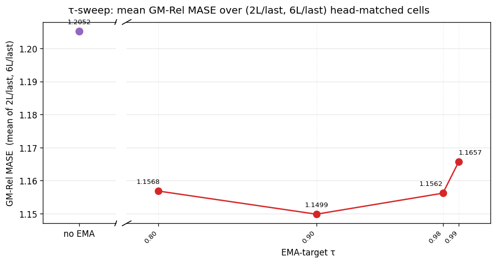

# LeJEPA spherical regulariser: EMA-target window sweep

## Question

The reference arm at B=512 trains SIGReg on the patch-embed and on the encoder output against an EMA-target teacher at `τ=0.99` (half-life ≈69 steps). This report sweeps the EMA-target window `τ ∈ {0.99, 0.98, 0.90, 0.80}` at fixed B=512, plus a no-EMA arm, all head-matched on GIFT-Eval full-97 GM-Rel MASE against two B=1024 reference columns.

## Result

| head / checkpoint | enc3+CPC, B=1024 | EMA-target enc3+CPC, B=1024, τ=0.99 | SIGReg + EMA-target, B=512, τ=0.99 | SIGReg + EMA-target, B=512, τ=0.98 | SIGReg + EMA-target, B=512, τ=0.90 | SIGReg + EMA-target, B=512, τ=0.80 | SIGReg (no EMA-target), B=512 |
| --- | ---: | ---: | ---: | ---: | ---: | ---: | ---: |
| 2L / best | 1.1846 | 1.1614 | 1.1610 | 1.1807 ⁂ | **1.1569** | 1.1904 | 1.2119 |
| 2L / last | 1.1531 | 1.1817 | 1.1758 | 1.1662 | **1.1624** | 1.1667 | 1.2105 |
| 6L / best | 1.1584 | 1.1576 | 1.1543 | 1.1493 ⁂ | **1.1489** | 1.1867 | 1.2081 |
| 6L / last | 1.1436 | 1.1597 | 1.1556 | 1.1462 | **1.1373** | 1.1470 | 1.1999 |

⁂ The τ=0.98 `*_best` row uses the `_10k.pth` periodic save (see Protocol); the other arms use a `best_loss.pth` tracker checkpoint. Cross-arm `*_best` deltas involving the τ=0.98 column are not directly comparable.

The four B=512 EMA-target arms' deltas vs the τ=0.99 reference are within or at the ~0.01 GM-Rel MASE seed-noise band from the τ-sweep card (annex F); no-EMA sits ≥+0.0347 above the band on every cell (annex A).

### Sphere coverage

### Training loss

### SIGReg term trajectories

Tail-50 mean per arm at the final logged step:

| quantity | τ=0.99 (12 500) | τ=0.98 (12 400) | τ=0.90 (12 500) | τ=0.80 (12 500) | no-EMA (12 500) |
| --- | ---: | ---: | ---: | ---: | ---: |
| `u_batch` (h_t) | 0.7964 | 0.7626 | 0.7537 | 0.7712 | 0.1491 |
| `u_batch_e` (e_t) | 0.0438 | 0.0333 | 0.0212 | 0.0287 | 0.00433 |
| `u_temporal` (h_t) | 0.6194 | 0.5735 | 0.6062 | 0.6451 | 0.1399 |
| `u_temporal_e` (e_t) | 0.0315 | 0.0251 | 0.0181 | 0.0238 | 0.00418 |
| `L_SIGReg(e_t)` | 1.001e-3 | 1.251e-3 | 1.989e-3 | 1.697e-3 | 5.68e-7 |
| `L_SIGReg(h_t)` | 3.80e-4 | 6.04e-4 | 4.58e-4 | 4.84e-4 | 7.81e-5 |
| total `loss` | 4.248 | 4.083 | 3.830 | 3.893 | 0.867 |

In every SIGReg + EMA-target arm, the larger of `λ · L_SIGReg(e_t) / loss` and `λ · L_SIGReg(h_t) / loss` at the final logged step is at most `5.2e-5` (τ=0.90 `e_t`).

**Metric scope.** Only GM-Rel MASE is emitted; project-standard GM-MASE / GM-MAPE_SN / GM-CRPS_SN are not produced (annex D).

## Protocol

All four new arms use seed `20260520`, target 12 500 steps. Per-arm launchers: [τ=0.98](../../experiments/2026-06-20_lejepa_sigreg/scripts/train_backbone_sigreg.sh), [τ=0.90](../../experiments/2026-06-20_lejepa_sigreg/scripts/train_backbone_sigreg_tau090.sh), [τ=0.80](../../experiments/2026-06-20_lejepa_sigreg/scripts/train_backbone_sigreg_tau080.sh), [no-EMA](../../experiments/2026-06-20_lejepa_sigreg/scripts/train_backbone_sigreg_noema.sh).

The τ=0.98 arm's CSV ends at step 12 400 with no `best_loss.pth` tracker; the `bb_*_FINAL.pth` used as `*_best` is byte-identical to `bb_*_10k.pth` (`md5sum`). The τ=0.90, τ=0.80 and no-EMA arms each reached step 12 500; the launchers promoted `best_loss.pth` to `bb_*_FINAL.pth` via `cp` (`md5sum` confirms equality).

Flag changes vs `SIGReg + EMA-target, B=512, τ=0.99`:

| flag | reference (τ=0.99) | τ=0.98 arm | τ=0.90 arm | τ=0.80 arm | no-EMA arm |
| --- | --- | --- | --- | --- | --- |
| `--ema-tau` | 0.99 | 0.98 | 0.90 | 0.80 | (not passed) |
| `--ema-embedding` | ON | ON | ON | ON | (not passed) |
| `--ema-encoder` | ON | ON | ON | ON | (not passed) |

`--batch-size 512`, `--sigreg-embedding`, `--sigreg-encoding`, `--sigreg-post-normalization` OFF, `--sigreg-weight 0.1`, `--sigreg-m 1024`, `--sigreg-t-knots 17`, `--cpc-infonce-weight 1.0`, `--encoder-dropkey 0.70`, `--mix-ratio 0.0078125`, dataset, dtypes, and the GRU patch-embed → 3-layer transformer encoder (`K`=384, 6 heads) backbone are kept verbatim from the reference.

Each backbone checkpoint trains a 2-layer and a 6-layer quantile head (`2L`/`6L`), then evaluates on GIFT-Eval full-97 via `scripts/run_gift_eval_full.sh`. The `*_best` cells use `bb_*_FINAL.pth`; the `*_last` cells use `bb_*_final.pth`. The 2L head trains 30 000 steps on `*_best` and 10 000 steps on `*_last`. Per-cell summaries: `results/gift_eval_full_<tag>{,_last}_{2L,6L}/summary.txt`.

## Annex

### A. Per-arm head-matched cells vs the τ=0.99 reference

| head / checkpoint | τ=0.99 | τ=0.98 | Δ | τ=0.90 | Δ | τ=0.80 | Δ | no-EMA | Δ |
| --- | ---: | ---: | ---: | ---: | ---: | ---: | ---: | ---: | ---: |
| 2L / best | 1.1610 | 1.1807 ⁂ | — | 1.1569 | −0.0041 | 1.1904 | +0.0294 | 1.2119 | +0.0509 |
| 2L / last | 1.1758 | 1.1662 | −0.0096 | 1.1624 | −0.0134 | 1.1667 | −0.0091 | 1.2105 | +0.0347 |
| 6L / best | 1.1543 | 1.1493 ⁂ | — | 1.1489 | −0.0054 | 1.1867 | +0.0324 | 1.2081 | +0.0538 |
| 6L / last | 1.1556 | 1.1462 | −0.0094 | 1.1373 | −0.0183 | 1.1470 | −0.0086 | 1.1999 | +0.0443 |

### B. Cross-arm plot provenance

All plots embed the τ=0.98 arm's training CSV `runs/bb_allt08_xftrip_nobn_enc3_emateach_sigreg_qk_aon_b512_cpc_tau098_losses.csv` (12 401 rows, steps 0–12 400). `loss_curve.png` and `uniformity.png` overlay:

- τ=0.90 SIGReg arm: `runs/bb_allt08_xftrip_nobn_enc3_emateach_sigreg_qk_aon_b512_cpc_tau090_losses.csv` (12 501 rows).
- τ=0.80 SIGReg arm: `runs/bb_allt08_xftrip_nobn_enc3_emateach_sigreg_qk_aon_b512_cpc_tau080_losses.csv` (12 501 rows).
- no-EMA SIGReg arm: `runs/bb_allt08_xftrip_nobn_enc3_sigreg_qk_aon_b512_cpc_noema_losses.csv` (12 501 rows).
- τ=0.99 SIGReg arm: `reports/2026-06-20_lejepa_sigreg/runs/bb_allt08_xftrip_nobn_enc3_emateach_sigreg_qk_aon_b512_cpc_losses.csv` (12 500 rows).
- EMA-target arm: `experiments/2026-06-19_ema_target_encoder/runs/bb_allt08_xftrip_nobn_enc3_emateach_qk_aon_b1024_cpc_losses.csv`.
- enc3+CPC arm: `experiments/2026-06-13_cpc_infonce_aux/runs/bb_allt08_xftrip_nobn_enc3_sgpos_qk_aon_b1024_cpc_losses.csv`.

`gm_rel_mase.png` legend: grey = enc3+CPC B=1024, blue = EMA-target enc3+CPC B=1024 τ=0.99, red = SIGReg + EMA-target B=512 τ=0.99, green = SIGReg + EMA-target B=512 τ=0.98, orange = SIGReg + EMA-target B=512 τ=0.90, cyan = SIGReg + EMA-target B=512 τ=0.80, purple = SIGReg no EMA-target B=512. `tau_sweep_last_avg.png` is generated by [`plot_tau_sweep_last_avg.py`](../../experiments/2026-06-20_lejepa_sigreg/scripts/plot_tau_sweep_last_avg.py) directly from `results/gm_table.csv`.

### C. Reference-values provenance

The `enc3+CPC`, `EMA-target enc3+CPC, τ=0.99`, and `SIGReg + EMA-target, τ=0.99` columns reproduce prior arms' published head-matched tables at their own code revisions — source experiments `experiments/2026-06-13_cpc_infonce_aux/`, `experiments/2026-06-19_ema_target_encoder/`, `reports/2026-06-20_lejepa_sigreg/`. Embedded as `REF_GM`, `EMA_GM`, `SIGREG_TAU099_GM` in [`build_report_tau098.py`](../../experiments/2026-06-20_lejepa_sigreg/scripts/build_report_tau098.py). The τ=0.98, τ=0.90, τ=0.80 and no-EMA columns are fresh head-matched evals at this code revision and HF cache snapshot.

### D. GIFT-Eval wrapper emits only GM-Rel MASE

`scripts/run_gift_eval_full.sh` writes `Aggregate GM-Relative MASE (97 configs)` to each `summary.txt`. The per-config `all_results.csv` carries `MASE[0.5]`, `MAPE[0.5]`, and `mean_weighted_sum_quantile_loss`, but not the seasonal-naive denominators needed to form GM-MASE / GM-MAPE_SN / GM-CRPS_SN.

### E. Trajectory of SIGReg terms and dimensionality (τ=0.98 arm)

50-step rolling means at the listed step. `1/K` = 1/384 ≈ 0.00260. Step 12 500 is absent from this arm's CSV; tail-50 centred on 12 400 is reported on the last line.

| step | `L_SIGReg(e_t)` | `L_SIGReg(h_t)` | `u_batch_e` | `u_batch` (`h_t`) | `u_temporal_e` | `u_temporal` (`h_t`) | `loss` |
| ---: | ---: | ---: | ---: | ---: | ---: | ---: | ---: |
| 250 | 1.74e-3 | 2.74e-3 | 0.0102 | 0.366 | 0.0096 | 0.214 | 3.50 |
| 500 | 1.25e-3 | 1.85e-3 | 0.0114 | 0.517 | 0.0105 | 0.297 | 3.09 |
| 1 000 | 8.56e-4 | 1.26e-3 | 0.0131 | 0.613 | 0.0117 | 0.383 | 3.00 |
| 2 000 | 8.13e-4 | 1.00e-3 | 0.0141 | 0.721 | 0.0124 | 0.464 | 3.79 |
| 5 000 | 1.06e-3 | 6.99e-4 | 0.0256 | 0.783 | 0.0201 | 0.618 | 4.48 |
| 7 500 | 1.18e-3 | 6.01e-4 | 0.0302 | 0.765 | 0.0221 | 0.589 | 4.46 |
| 10 000 | 1.16e-3 | 5.64e-4 | 0.0317 | 0.773 | 0.0233 | 0.582 | 4.27 |
| 12 400 (tail-50) | 1.25e-3 | 6.04e-4 | 0.0333 | 0.763 | 0.0251 | 0.574 | 4.08 |

Source: `results/trajectory_table.csv` (steps 250–10 000), `results/final_trajectories.txt` (step 12 400).

### F. Seed noise for `~0.01` GM-Rel MASE deltas

In the τ-sweep card (`experiments/2026-05-08_exp_tau_sweep`), arms at distinct `--tau` values differed by `~0.01` on GM-Rel MASE while being indistinguishable at single-seed precision and matching the seed-noise band of paired re-runs. Each arm here is one seed. Distribution of cell deltas vs τ=0.99 relative to that band: τ=0.98 `*_last` (−0.0096, −0.0094) inside; τ=0.90 `*_best` (−0.0041, −0.0054) inside; τ=0.90 `*_last` (−0.0134, −0.0183) at or above; τ=0.80 `*_last` (−0.0091, −0.0086) inside, `*_best` (+0.0294, +0.0324) above; no-EMA all four cells (+0.0347 to +0.0538) above.

### G. Vocabulary

| term | definition |
| --- | --- |
| `enc3` | 3-layer transformer encoder (hidden size `K`=384, 6 heads — the codebase's depth used here). |
| `CPC` | InfoNCE auxiliary head on the encoder, `--cpc-infonce-weight 1.0`. |
| **EMA-target** | exponential-moving-average teacher on the encoder + patch-embed; `--ema-tau τ`, half-life ≈ ln(2)/(1−τ) steps. `τ=0.99` ≈69 steps, `τ=0.98` ≈34 steps, `τ=0.90` ≈7 steps, `τ=0.80` ≈3 steps. The no-EMA arm removes the teacher entirely (`--ema-embedding`, `--ema-encoder`, `--ema-tau` not passed). |
| `e_t` | output of the GRU patch-embed, per (batch, time, channel) position; `K`=384. |
| `h_t` | output of the 3-layer transformer encoder (the codebase's `original_latent`), same shape. |
| **SIGReg** | LeJEPA-style spherical regulariser. Epps–Pulley test statistic averaged over `M`=1024 random unit-direction 1-D projections of the pooled latent, trapezoidal-integrated on `[−6/√K, 6/√K]` against `N(0, 1/K)`. Drives the pooled marginal toward `Unif(S^{K-1})`. Two terms here: `L_SIGReg(e_t)` (`--sigreg-embedding`) and `L_SIGReg(h_t)` (`--sigreg-encoding`), both pre-`F.normalize` (`--sigreg-post-normalization` OFF). Each weighted by `λ`=0.1. |
| `u_batch` | cross-batch dimensionality usage of `h_t`, clipped to `[1/K, 1]`. `1/K` ≈ 0.00260 = one direction; 1 = uniform sphere coverage. `u_batch_e` is the same statistic on `e_t`. |
| `u_temporal` | cross-time analogue of `u_batch`; `u_temporal_e` is the `e_t` version. |
| **GM-Rel MASE** | GIFT-Eval full-97 aggregate: geometric mean over 97 configs of (model MASE ÷ seasonal-naive MASE). Lower = better; 1.0 = seasonal-naive parity. |
| `*_best` | head-matched downstream cell where the head is trained on the lowest-train-loss backbone checkpoint of the arm. |
| `*_last` | head-matched downstream cell where the head is trained on the final-step backbone checkpoint. Same convention across all five arms in the table above. |
