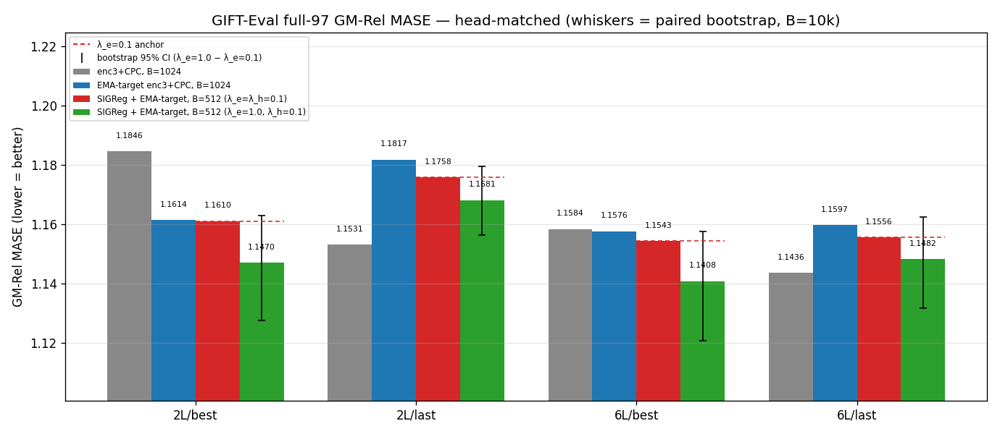
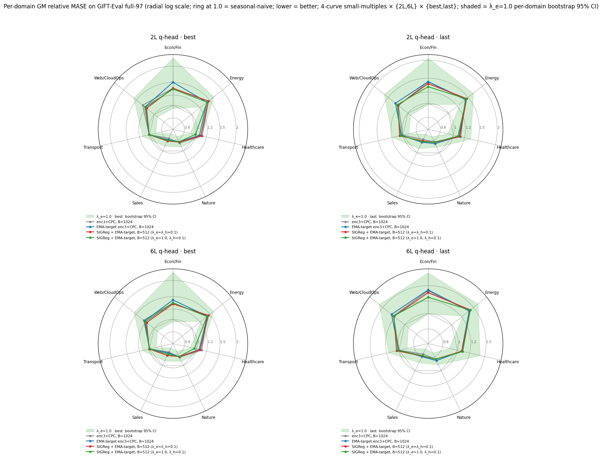

# LeJEPA SIGReg with embedding-side weight bumped 10×

## Question

In the prior `λ_e=λ_h=0.1` SIGReg arm the embedding-side regulariser contributed a negligible fraction of the total loss and `u_batch_e`, `u_temporal_e` stayed well below the spherical target.

1. Does setting `λ_e=1.0` (`λ_h` unchanged at 0.1) move GIFT-Eval full-97 GM-Rel MASE in the four (q-head depth, backbone checkpoint) cells, against the `λ_e=λ_h=0.1` arm with the same backbone, dataset, and seed?
2. Does it change the **time course** of `u_batch_e`, `u_temporal_e`, `L_SIGReg(e_t)`, and the loss-fraction `λ_e · L_SIGReg(e_t) / loss` — measured by their Early-50 (first 50 logged training steps) and Tail-50 (last 50) means?

## Result

**Q2 — downstream GIFT-Eval full-97 GM-Rel MASE.**

Point Δ_GM (this arm − prior arm) is negative in all 4 (q-head depth, backbone-checkpoint) cells (range `[−0.014, −0.007]`); all 4 paired-bootstrap 95% CIs include zero (P(Δ<0) range `[0.83, 0.95]`).

Per-domain curves of the two arms overlap on every domain at both q-head depths; no domain shows a separation visibly larger than the cross-ckpt within-arm gap.

### GM table

| head / ckpt | enc3+CPC, B=1024 | EMA-target enc3+CPC, B=1024 | SIGReg, B=512, `λ_e=λ_h=0.1` | SIGReg, B=512, `λ_e=1.0, λ_h=0.1` | Δ_GM (1.0 − 0.1) | 95% CI | P(Δ<0) |
| --- | ---: | ---: | ---: | ---: | ---: | ---: | ---: |
| 2L / best | 1.1846 | 1.1614 | 1.1610 | 1.1470 | −0.0139 | [−0.0333, +0.0018] | 0.953 |
| 2L / last | 1.1531 | 1.1817 | 1.1758 | 1.1681 | −0.0077 | [−0.0195, +0.0037] | 0.904 |
| 6L / best | 1.1584 | 1.1576 | 1.1543 | 1.1408 | −0.0135 | [−0.0336, +0.0033] | 0.933 |
| 6L / last | 1.1436 | 1.1597 | 1.1556 | 1.1482 | −0.0074 | [−0.0239, +0.0068] | 0.830 |

Paired bootstrap on the 97 per-config rel-MASE values (B=10 000), CIs on the absolute GM scale; n=97 per cell. Full glossary in §Vocabulary at the back.

**Q1 — time course (this arm − prior arm, single seed 20260520).**

| quantity | Early-50 Δ (steps 1–50) | Tail-50 Δ (last 50) |
| --- | ---: | ---: |
| `u_batch_e` | −4.1e-6 | −0.0099 |
| `u_temporal_e` | −3.4e-6 | −0.0077 |
| `L_SIGReg(e_t)` | −5.6e-6 | −1.8e-4 |
| `λ_e · L_SIGReg(e_t) / loss` | +2.0e-4 | +1.6e-4 |
| total `loss` | +0.002 | +0.30 |

Early-50 means of `u_batch_e`, `u_temporal_e`, and `L_SIGReg(e_t)` match across arms to within `|Δ| < 1e-5`, so the Early-50 shift in `λ_e · L_SIGReg(e_t) / loss` is the 10× `λ_e` factor applied to a near-identical ratio (`L_SIGReg(e_t) / loss ≈ 2.23e-4` on both sides). At Tail-50 that visible ratio ends at 1.80e-4 vs 2.36e-5 (this/prior = 7.6×, not 10×): `L_SIGReg(e_t)` ends 18% lower in this arm and total `loss` ends 7% higher, partially cancelling the weight bump.

## Protocol

Single seed `20260520`, 12 500 steps. Launcher: [`scripts/train_backbone_sigreg.sh`](scripts/train_backbone_sigreg.sh). Backbone: GRU patch-embed → 3-layer transformer encoder (`K`=384, 6 heads). The arm changes exactly one flag vs the `λ_e=λ_h=0.1` SIGReg arm:

| flag | `λ_e=λ_h=0.1` arm | this arm |
| --- | --- | --- |
| `--sigreg-embedding-weight` | 0.1 | 1.0 |
| `--sigreg-encoding-weight` | 0.1 | 0.1 |

All other flags identical: `--batch-size 512`, `--sigreg-embedding --sigreg-encoding`, `--sigreg-n-chunk 2048`, `--sigreg-post-normalization` OFF, `--ema-embedding --ema-encoder --ema-tau 0.99`, `--cpc-infonce-weight 1.0`, `--encoder-dropkey 0.70`, `--mix-ratio 0.0078125`, `--sigreg-m 1024`, `--sigreg-t-knots 17`, same dataset (`gift-pretrain-full-4096` / `small_v1`), dtypes.

### Head-matched downstream

Each backbone checkpoint (`best` = best train-loss, `last` = step 12 500) trains a 2-layer and a 6-layer quantile head, then evaluates on GIFT-Eval full-97 via `scripts/run_gift_eval_full.sh`. Per-cell summaries: `results/gift_eval_full_<tag>{,_last}_{2L,6L}/summary.txt`.

## Vocabulary

| term | definition |
| --- | --- |
| `K` | latent dimensionality, 384 throughout this report. `1/K` ≈ 0.00260. |
| `enc3` | 3-layer transformer encoder (hidden size `K`, 6 heads). |
| `CPC` | InfoNCE auxiliary head on the encoder, `--cpc-infonce-weight 1.0`. |
| **EMA-target** | exponential-moving-average teacher on the encoder + patch-embed, `--ema-tau 0.99`. |
| `e_t` | output of the GRU patch-embed, per (batch, time, channel) position; dimension `K`. |
| `h_t` | output of the 3-layer transformer encoder (`original_latent`), same shape. |
| **SIGReg** | LeJEPA spherical regulariser. Epps–Pulley test statistic averaged over `M`=1024 random unit-direction 1-D projections of the pooled latent, trapezoidal-integrated on `[−6/√K, 6/√K]` against `N(0, 1/K)`. Two terms: `L_SIGReg(e_t)` weighted by `λ_e`, `L_SIGReg(h_t)` weighted by `λ_h`; both computed before any L2-normalisation step (`--sigreg-post-normalization` OFF). |
| `u_batch` | cross-batch dimensionality usage of `h_t`, clipped to `[1/K, 1]`. `1/K` = one direction; 1 = uniform sphere coverage. `u_batch_e` is the same statistic on `e_t`. |
| `u_temporal` | cross-time analogue of `u_batch`; `u_temporal_e` is the `e_t` version. |
| **GM-Rel MASE** | GIFT-Eval full-97 aggregate: geometric mean over 97 configs of (model MASE ÷ seasonal-naive MASE). Lower = better; 1.0 = seasonal-naive parity. |
| **paired bootstrap** | resample the 97 per-config rel-MASE values with replacement (B=10 000 draws), recompute the difference `mean(log(GM_A) − log(GM_B))`, take its 2.5/97.5 quantiles, convert back to absolute GM-Rel MASE scale via `GM_B · (exp(quantile) − 1)`. |

## Annex

### A. Plot provenance

- **Sources.** Training CSV `runs/bb_allt08_xftrip_nobn_enc3_emateach_sigreg_qk_aon_b512_cpc_emb10_losses.csv` (12 500 rows, seed `20260520`). `λ_e=λ_h=0.1` overlay reads `reports/2026-06-20_lejepa_sigreg/runs/bb_allt08_xftrip_nobn_enc3_emateach_sigreg_qk_aon_b512_cpc_losses.csv` and its matching GIFT-Eval summary tree. Reference GMs transcribed as constants in [`scripts/build_report.py`](scripts/build_report.py).
- **Bootstrap.** Paired bootstrap on the 97 per-config rel-MASE values, B=10 000, seed 20260622, statistic = `mean(log(rel_A) − log(rel_B))`, converted to absolute GM-Rel MASE scale. Per-cell rows in `results/bootstrap_ci.csv`.
- **Colour map.** grey = enc3+CPC B=1024; blue = EMA-target enc3+CPC B=1024; red = SIGReg `λ_e=λ_h=0.1` B=512; green = SIGReg `λ_e=1.0, λ_h=0.1` B=512.

### B. Trajectory means — Early-50, Tail-50, and within-arm delta

50-step means over the first 50 (Early-50) and the last 50 of 12 500 (Tail-50) training steps; `Δ_within = Tail−Early` per arm.

**`λ_e=0.1` (prior arm)**

| quantity | Early-50 | Tail-50 | Δ_within (Tail−Early) |
| --- | ---: | ---: | ---: |
| `u_batch_e` | 0.008885 | 0.0438 (≈ 16.8 · 1/K) | +0.0349 |
| `u_temporal_e` | 0.008686 | 0.0315 | +0.0228 |
| `u_batch` (`h_t`) | 0.0395 | 0.7964 | +0.7569 |
| `u_temporal` (`h_t`) | 0.0219 | 0.6194 | +0.5975 |
| `L_SIGReg(e_t)` | 1.914e-3 | 1.001e-3 | −9.14e-4 |
| `L_SIGReg(h_t)` | 1.509e-2 | 3.805e-4 | −1.47e-2 |
| `λ_e · L_SIGReg(e_t) / loss` | 2.23e-5 | 2.36e-5 | +1.2e-6 |
| total `loss` | 10.4165 | 4.2478 | −6.17 |

**`λ_e=1.0` (this arm)**

| quantity | Early-50 | Tail-50 | Δ_within (Tail−Early) |
| --- | ---: | ---: | ---: |
| `u_batch_e` | 0.008881 | 0.0339 (≈ 13.0 · 1/K) | +0.0250 |
| `u_temporal_e` | 0.008683 | 0.0238 | +0.0151 |
| `u_batch` (`h_t`) | 0.0395 | 0.7754 | +0.7359 |
| `u_temporal` (`h_t`) | 0.0219 | 0.5761 | +0.5542 |
| `L_SIGReg(e_t)` | 1.909e-3 | 8.184e-4 | −1.09e-3 |
| `L_SIGReg(h_t)` | 1.509e-2 | 6.513e-4 | −1.44e-2 |
| `λ_e · L_SIGReg(e_t) / loss` | 2.22e-4 | 1.80e-4 | −4.23e-5 |
| total `loss` | 10.4186 | 4.5490 | −5.87 |

**Cross-arm shift (this − prior) at each window**

| quantity | Early-50 Δ | Tail-50 Δ |
| --- | ---: | ---: |
| `u_batch_e` | −4.1e-6 | −0.00991 |
| `u_temporal_e` | −3.4e-6 | −0.00769 |
| `u_batch` (`h_t`) | −5.0e-6 | −0.02098 |
| `u_temporal` (`h_t`) | −1.0e-6 | −0.04330 |
| `L_SIGReg(e_t)` | −5.6e-6 | −1.82e-4 |
| `L_SIGReg(h_t)` | +2.8e-6 | +2.71e-4 |
| `λ_e · L_SIGReg(e_t) / loss` | +2.00e-4 | +1.56e-4 |
| total `loss` | +0.0020 | +0.3011 |

### C. GIFT-Eval wrapper emits only GM-Rel MASE

`scripts/run_gift_eval_full.sh` emits only `Aggregate GM-Relative MASE (97 configs)` per `summary.txt`; the per-config CSV does not carry the seasonal-naive denominators needed for GM-MASE / GM-MAPE_SN / GM-CRPS_SN.
