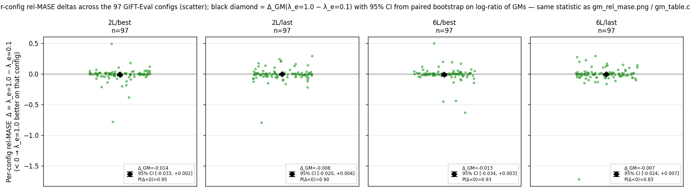
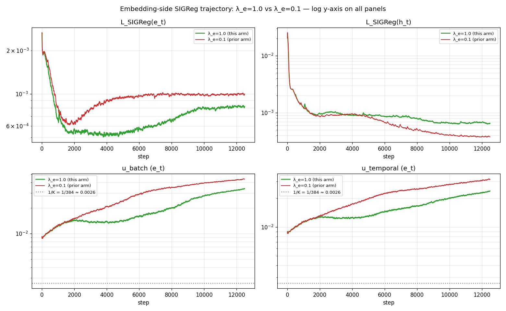

# LeJEPA SIGReg with embedding-side weight bumped 10×

## Question

Following the prior arm (SIGReg + EMA-target, B=512, `λ_e=λ_h=0.1`), where the embedding-side regulariser contributed `λ_e · L_SIGReg(e_t) / loss ≈ 2.4e-5` and `u_batch_e` finished at ≈ 16.8 · 1/K:

1. Does setting `λ_e=1.0` (`λ_h` unchanged at 0.1) move `u_batch_e` off the 1/K floor?
2. Does it move GIFT-Eval full-97 GM-Rel MASE in the four (q-head depth, backbone checkpoint) cells, against the `λ_e=λ_h=0.1` arm with the same backbone, dataset, and seed?

## Vocabulary

| term | definition |
| --- | --- |
| `K` | latent dimensionality, 384 throughout this report. `1/K` ≈ 0.00260. |
| `enc3` | 3-layer transformer encoder (hidden size `K`, 6 heads). |
| `CPC` | InfoNCE auxiliary head on the encoder, `--cpc-infonce-weight 1.0`. |
| **EMA-target** | exponential-moving-average teacher on the encoder + patch-embed, `--ema-tau 0.99`. |
| `e_t` | output of the GRU patch-embed, per (batch, time, channel) position; dimension `K`. |
| `h_t` | output of the 3-layer transformer encoder (`original_latent`), same shape. |
| **SIGReg** | LeJEPA spherical regulariser. Epps–Pulley test statistic averaged over `M`=1024 random unit-direction 1-D projections of the pooled latent, trapezoidal-integrated on `[−6/√K, 6/√K]` against `N(0, 1/K)`. Drives the pooled marginal toward `Unif(S^{K-1})`. Two terms: `L_SIGReg(e_t)` weighted by `λ_e`, `L_SIGReg(h_t)` weighted by `λ_h`; both pre-`F.normalize` (`--sigreg-post-normalization` OFF). |
| `u_batch` | cross-batch dimensionality usage of `h_t`, clipped to `[1/K, 1]`. `1/K` = one direction; 1 = uniform sphere coverage. `u_batch_e` is the same statistic on `e_t`. |
| `u_temporal` | cross-time analogue of `u_batch`; `u_temporal_e` is the `e_t` version. |
| **GM-Rel MASE** | GIFT-Eval full-97 aggregate: geometric mean over 97 configs of (model MASE ÷ seasonal-naive MASE). Lower = better; 1.0 = seasonal-naive parity. |
| **paired bootstrap** | resample the 97 per-config rel-MASE values with replacement (B=10 000 draws), recompute the difference `mean(log(GM_A) − log(GM_B))`, take its 2.5/97.5 quantiles, convert back to absolute GM-Rel MASE scale via `GM_B · (exp(quantile) − 1)`. The reported CI on `Δ_GM` is on that absolute scale. |

## Result

**Q1: NO.** Tail-50 `u_batch_e` fell from 16.8 · 1/K to 13.0 · 1/K under the 10× weight bump — toward the 1/K floor, not away. The 10× `λ_e` translated to only a ~7.6× rise in `λ_e · L_SIGReg(e_t) / loss` because `L_SIGReg(e_t)` itself partially self-suppressed.

**Q2: NO at α=0.05.** Point Δ_GM (`λ_e=1.0` − `λ_e=0.1`) is negative in all 4 cells (range `[−0.014, −0.007]`); all 4 paired-bootstrap 95% CIs include zero (P(Δ<0) range `[0.83, 0.95]`).

**Caveat: single seed (20260520); the CIs are over the 97 per-config rel-MASE values, not over seeds.**

### GM table

| head / ckpt | enc3+CPC, B=1024 | EMA-target enc3+CPC, B=1024 | SIGReg, B=512, `λ_e=λ_h=0.1` | SIGReg, B=512, `λ_e=1.0, λ_h=0.1` | Δ_GM (1.0 − 0.1) | 95% CI | P(Δ<0) |
| --- | ---: | ---: | ---: | ---: | ---: | ---: | ---: |
| 2L / best | 1.1846 | 1.1614 | 1.1610 | 1.1470 | −0.0139 | [−0.0333, +0.0018] | 0.953 |
| 2L / last | 1.1531 | 1.1817 | 1.1758 | 1.1681 | −0.0077 | [−0.0195, +0.0037] | 0.904 |
| 6L / best | 1.1584 | 1.1576 | 1.1543 | 1.1408 | −0.0135 | [−0.0336, +0.0033] | 0.933 |
| 6L / last | 1.1436 | 1.1597 | 1.1556 | 1.1482 | −0.0074 | [−0.0239, +0.0068] | 0.830 |

CI is paired bootstrap (B=10 000) on the log-ratio of GMs, converted to absolute GM-Rel MASE scale; `n`=97 paired per-config rel-MASE values per cell.

## Protocol

One arm, seed `20260520`, 12 500 steps. Launcher: [`scripts/train_backbone_sigreg.sh`](scripts/train_backbone_sigreg.sh).

Backbone: GRU patch-embed → 3-layer transformer encoder (`K`=384, 6 heads). The arm changes exactly one flag vs the `λ_e=λ_h=0.1` SIGReg arm (same B=512, same EMA-target enc3+CPC recipe):

| flag | `λ_e=λ_h=0.1` arm | this arm |
| --- | --- | --- |
| `--sigreg-embedding-weight` | 0.1 (shared default) | 1.0 |
| `--sigreg-encoding-weight` | 0.1 (shared default) | 0.1 |

All other flags identical: `--batch-size 512`, `--sigreg-embedding --sigreg-encoding`, `--sigreg-n-chunk 2048`, `--sigreg-post-normalization` OFF, `--ema-embedding --ema-encoder --ema-tau 0.99`, `--cpc-infonce-weight 1.0`, `--encoder-dropkey 0.70`, `--mix-ratio 0.0078125`, `--sigreg-m 1024`, `--sigreg-t-knots 17`, same dataset (`gift-pretrain-full-4096` / `small_v1`), dtypes, and 12 500 steps.

### Head-matched downstream

Each backbone checkpoint (`best` = best train-loss, `last` = step 12 500) trains a 2-layer and a 6-layer quantile head, then evaluates on GIFT-Eval full-97 via `scripts/run_gift_eval_full.sh`. Per-cell summaries: `results/gift_eval_full_<tag>{,_last}_{2L,6L}/summary.txt`.

## Annex

### A. Plot provenance

- **Sources.** This arm's training CSV `runs/bb_allt08_xftrip_nobn_enc3_emateach_sigreg_qk_aon_b512_cpc_emb10_losses.csv` (12 500 rows, seed `20260520`). The `λ_e=λ_h=0.1` overlay reads `reports/2026-06-20_lejepa_sigreg/runs/bb_allt08_xftrip_nobn_enc3_emateach_sigreg_qk_aon_b512_cpc_losses.csv` and its matching GIFT-Eval summary tree. EMA-target and enc3+CPC overlays read each arm's published `losses.csv` and `summary.txt`; reference GM values transcribed as constants `REF_GM`, `EMA_GM`, `SIGREG01_GM` in [`scripts/build_report.py`](scripts/build_report.py).
- **Bootstrap.** Per-cell paired bootstrap on the 97 per-config rel-MASE values, B=10 000, seed 20260622, statistic = `mean(log(rel_A) − log(rel_B))`, converted back to absolute GM-Rel MASE scale. Cells in `results/bootstrap_ci.csv`.
- **Colour map.** grey = enc3+CPC B=1024; blue = EMA-target enc3+CPC B=1024; red = SIGReg `λ_e=λ_h=0.1` B=512; green = SIGReg `λ_e=1.0, λ_h=0.1` B=512.

### B. Tail-50 trajectory means

50-step rolling means over the last 50 of 12 500 training steps:

| quantity | `λ_e=0.1` (prior arm) | `λ_e=1.0` (this arm) |
| --- | ---: | ---: |
| `u_batch_e` | 0.0438 (≈ 16.8 · 1/K) | 0.0339 (≈ 13.0 · 1/K) |
| `u_temporal_e` | 0.0315 | 0.0238 |
| `u_batch` (`h_t`) | 0.7964 | 0.7754 |
| `u_temporal` (`h_t`) | 0.6194 | 0.5761 |
| `L_SIGReg(e_t)` | 1.001e-3 | 8.184e-4 |
| `L_SIGReg(h_t)` | 3.805e-4 | 6.513e-4 |
| `λ_e · L_SIGReg(e_t) / loss` | 2.36e-5 | 1.80e-4 |
| total `loss` | 4.2478 | 4.5490 |

`1/K` = 1/384 ≈ 0.00260.

### C. GIFT-Eval wrapper emits only GM-Rel MASE

`scripts/run_gift_eval_full.sh` writes `Aggregate GM-Relative MASE (97 configs)` to each `summary.txt`. The per-config `all_results.csv` carries raw `MASE[0.5]`, `MAPE[0.5]`, and `mean_weighted_sum_quantile_loss`, but not the seasonal-naive denominators needed to form GM-MASE / GM-MAPE_SN / GM-CRPS_SN.
