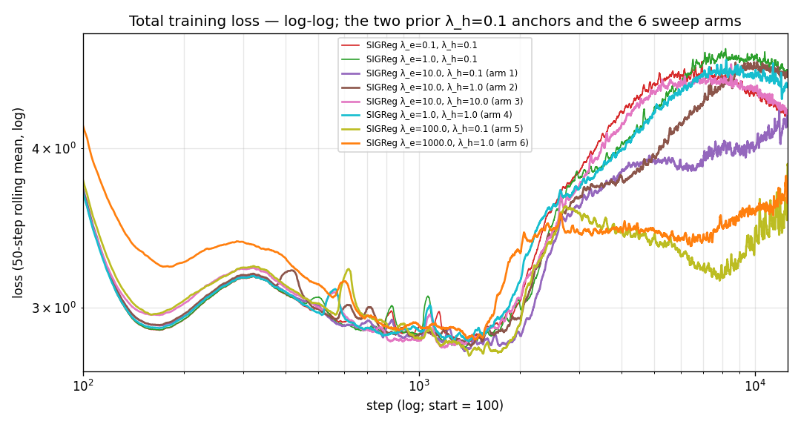

# SIGReg λ-sweep — embedding-side weight pushed further, encoding-side weight varied

## Question

The prior arm (`λ_e=1.0, λ_h=0.1`) had a lower GM-Rel MASE than the `λ_e=λ_h=0.1` arm in all 4 (q-head depth, backbone checkpoint) cells (point Δ_GM range `[−0.014, −0.007]`), but every paired-bootstrap 95% CI vs that anchor straddled zero. Continue the sweep on the same recipe (SIGReg + EMA-target, B=512, enc3+CPC, 12 500 steps, seed 20260520) to find either a clear-of-noise improvement or a ceiling on the SIGReg-weight axis.

The four arms run:

| arm | `λ_e` | `λ_h` |
| --- | ---: | ---: |
| 1 | 10.0 | 0.1 |
| 2 | 10.0 | 1.0 |
| 3 | 10.0 | 10.0 |
| 5 | 100.0 | 0.1 |

## Result

**Verdict.** Two baselines. Vs the `λ_e=1.0, λ_h=0.1` anchor (#359), only arm 2 (`λ_e=10.0, λ_h=1.0`) on `2L/best` is CI-clean (Δ = −0.017, 95% CI `[−0.029, −0.005]`, P(Δ<0) = 0.997); the other 3 (head, ckpt) cells straddle zero. Vs arm 1 (`λ_e=10.0, λ_h=0.1`), arm 5 (`λ_e=100.0`) regresses CI-clean on both last-ckpt cells (Annex B).

### Training trajectory

![Cross-batch and cross-time dim-usage of `h_t` (solid) and `e_t` (dashed) for the sweep arms and the 2 anchors from step 100 onwards; clipped to `[1/K, 1]`.](plots/uniformity.png)

### GM-Rel MASE — B=512 sweep family

Among the 4 sweep arms, arm 5 (`λ_e=100.0, λ_h=0.1`) holds the highest GM in 3 of 4 cells (all except `6L/best`, where arm 3 edges it by 0.0003). The 4 anchor rows are kept for reference; column-bold marks the row-minimum among the B=512 family (`λ_e=λ_h=0.1` (#355), `λ_e=1.0, λ_h=0.1` (#359), and the 4 sweep arms). The B=1024 cells (#344, #353) are not comparable to the B=512 family and are never bolded, regardless of their value.

| head / ckpt | `enc3+CPC`, B=1024 (#344) | `EMA enc3+CPC`, B=1024 (#353) | `λ_e=λ_h=0.1`, B=512 (#355) | `λ_e=1.0, λ_h=0.1`, B=512 (#359) | arm 1 (10.0, 0.1) | arm 2 (10.0, 1.0) | arm 3 (10.0, 10.0) | arm 5 (100.0, 0.1) |
| --- | ---: | ---: | ---: | ---: | ---: | ---: | ---: | ---: |
| 2L / best | 1.1846 | 1.1614 | 1.1610 | 1.1470 | 1.1474 | **1.1302** | 1.1540 | 1.1554 |
| 2L / last | 1.1531 | 1.1817 | 1.1758 | 1.1681 | **1.1610** | 1.1756 | 1.1682 | 1.1828 |
| 6L / best | 1.1584 | 1.1576 | 1.1543 | 1.1408 | 1.1447 | **1.1294** | 1.1465 | 1.1462 |
| 6L / last | 1.1436 | 1.1597 | 1.1556 | 1.1482 | **1.1473** | 1.1515 | 1.1538 | 1.1682 |

### λ_e ladder at fixed λ_h=0.1

Walking `λ_e` from 0.1 → 1.0 → 10.0 → 100.0 at `λ_h=0.1`, the GM drops between 0.1 and 1.0 on all 4 cells, moves by Δ ∈ [−0.0071, +0.0039] between 1.0 and 10.0 (within the bootstrap CI on every cell), then rises at `λ_e=100.0` on all 4 cells.

### Best-vs-last divergence

The desirable direction at step 12 500 is `last ≤ best` — i.e. the model is still improving at the end of training, so picking `last` would be at least as good as picking `best`. Positive `last − best` is therefore the drift / over-fitting signal.

Only the `enc3+CPC, B=1024` anchor (#344) shows negative drift on both heads (still improving at step 12 500). Every SIGReg arm has positive drift on both heads. Arm 2's `2L` drift of `+0.045` is the largest in the table. Per-cell CIs of these last-ckpt regressions vs arm 1 are in §Annex B.

## Protocol

Single seed `20260520`, 12 500 steps. Launcher: [`scripts/train_backbone_sigreg.sh`](../../experiments/2026-06-24_sigreg_lambda_sweep/scripts/train_backbone_sigreg.sh). Backbone: GRU patch-embed → 3-layer transformer encoder (`K`=384, 6 heads). The 4 arms change exactly two flags vs the `λ_e=1.0, λ_h=0.1` anchor:

| flag | arm 1 | arm 2 | arm 3 | arm 5 |
| --- | ---: | ---: | ---: | ---: |
| `--sigreg-embedding-weight` (`λ_e`) | 10.0 | 10.0 | 10.0 | 100.0 |
| `--sigreg-encoding-weight` (`λ_h`) | 0.1 | 1.0 | 10.0 | 0.1 |

All other flags identical to the prior arm: `--batch-size 512`, `--sigreg-embedding --sigreg-encoding`, `--sigreg-n-chunk 2048`, `--sigreg-post-normalization` OFF, `--ema-embedding --ema-encoder --ema-tau 0.99`, `--cpc-infonce-weight 1.0`, `--encoder-dropkey 0.70`, `--mix-ratio 0.0078125`, `--sigreg-m 1024`, `--sigreg-t-knots 17`, same dataset (`gift-pretrain-full-4096` / `small_v1`), dtypes.

### Scope deviation

The issue's optional 4th arm was `(λ_e=1.0, λ_h=1.0)` (interior point); it was not run. A 5th arm `(λ_e=100.0, λ_h=0.1)` was run instead, on user request, to extend the `λ_h=0.1` ladder one decade further. The arms in this report are therefore labelled 1, 2, 3, 5 — the slot for arm 4 is intentionally empty so arms 1–3 keep the issue-spec ordering.

### Head-matched downstream

For each arm, each backbone checkpoint (`best` = best train-loss, `last` = step 12 500) trains a 2-layer and a 6-layer quantile head; each head is evaluated on GIFT-Eval full-97 via `scripts/run_gift_eval_full.sh`. Per-cell summaries: `results/gift_eval_full_<tag>{,_last}_{2L,6L}/summary.txt`.

### Anchors

The 4 anchors that share the GM table:

| label | recipe |
| --- | --- |
| `enc3+CPC, B=1024` (#344) | non-SIGReg, non-EMA baseline |
| `EMA enc3+CPC, B=1024` (#353) | EMA-target only, no SIGReg |
| `SIGReg λ_e=λ_h=0.1, B=512` (#355) | `λ_e=λ_h=0.1` (per-config rel-MASE re-read from `reports/2026-06-20_lejepa_sigreg/`) |
| `SIGReg λ_e=1.0, λ_h=0.1, B=512` (#359) | the bootstrap baseline (per-config rel-MASE re-read from `reports/2026-06-22_lejepa_sigreg_emb10/`) |

Anchor GM values are transcribed verbatim from the prior `λ_e=1.0, λ_h=0.1` report's `gm_table.csv` (`reports/2026-06-22_lejepa_sigreg_emb10/results/gm_table.csv`), which already coexists with the same `cpc_enc3` / `ema_enc3` / `sigreg01_enc3` / `sigreg10_enc3` rows. The two SIGReg anchors also have per-config rel-MASE recoverable from their `gift_eval_full_<tag>{,_last}_{2L,6L}/summary.txt`; this report's bootstrap uses the `sigreg10` per-config values as the paired baseline.

## Vocabulary

| term | definition |
| --- | --- |
| `K` | latent dimensionality, 384 throughout this report. `1/K ≈ 0.00260`. |
| `enc3` | 3-layer transformer encoder (hidden size `K`, 6 heads). |
| `CPC` | InfoNCE auxiliary head on the encoder, `--cpc-infonce-weight 1.0`. |
| **EMA-target** | exponential-moving-average teacher on the encoder + patch-embed, `--ema-tau 0.99`. |
| `e_t` | output of the GRU patch-embed at position (batch, time, channel); dimension `K`. |
| `h_t` | output of the 3-layer transformer encoder at the same position. |
| **SIGReg** | LeJEPA spherical regulariser. Epps–Pulley test statistic averaged over `M`=1024 random unit-direction 1-D projections of the pooled latent, trapezoidal-integrated on `[−6/√K, 6/√K]` against `N(0, 1/K)`. Two terms: `L_SIGReg(e_t)` weighted by `λ_e`, `L_SIGReg(h_t)` weighted by `λ_h`. |
| `u_batch` | cross-batch dim-usage of `h_t`, clipped to `[1/K, 1]`. `1/K` = one direction; 1 = uniform sphere coverage. `u_batch_e` is the same statistic on `e_t`. |
| `u_temporal` | cross-time analogue of `u_batch`; `u_temporal_e` is the `e_t` version. |
| **GM-Rel MASE** | GIFT-Eval full-97 aggregate: geometric mean over 97 configs of (model MASE ÷ seasonal-naive MASE). Lower = better; 1.0 = seasonal-naive parity. |
| **best-ckpt / last-ckpt** | `best` = backbone checkpoint at lowest train-loss step; `last` = backbone at step 12 500. The q-head is trained from each backbone separately. The preferred end-state is `last ≤ best` (model still improving at step 12 500). |
| **paired bootstrap** | resample the 97 per-config rel-MASE values with replacement (B=10 000 draws, seed 20260624), recompute the statistic `mean(log(rel_arm) − log(rel_baseline))`, take its 2.5/97.5 quantiles, convert back to absolute GM scale via `GM_baseline · (exp(quantile) − 1)`. Aligned per config. |

## Annex

### A. Δ vs `λ_e=1.0, λ_h=0.1` (#359) with paired-bootstrap 95% CI

B=10 000 bootstrap draws, n=97 configs, paired on per-config rel-MASE. Δ on the absolute GM-Rel MASE scale via `GM_anchor · (exp(quantile) − 1)`.

| arm | head / ckpt | Δ_GM | 95% CI | P(Δ<0) |
| --- | --- | ---: | --- | ---: |
| arm 1 (10.0, 0.1) | 2L / best | +0.0004 | `[−0.0081, +0.0106]` | 0.494 |
| arm 1 (10.0, 0.1) | 2L / last | −0.0071 | `[−0.0230, +0.0087]` | 0.807 |
| arm 1 (10.0, 0.1) | 6L / best | +0.0039 | `[−0.0036, +0.0130]` | 0.188 |
| arm 1 (10.0, 0.1) | 6L / last | −0.0010 | `[−0.0156, +0.0175]` | 0.583 |
| **arm 2 (10.0, 1.0)** | **2L / best** | **−0.0168** | **`[−0.0293, −0.0045]`** | **0.997** |
| arm 2 (10.0, 1.0) | 2L / last | +0.0075 | `[−0.0061, +0.0220]` | 0.140 |
| arm 2 (10.0, 1.0) | 6L / best | −0.0114 | `[−0.0258, +0.0067]` | 0.906 |
| arm 2 (10.0, 1.0) | 6L / last | +0.0032 | `[−0.0110, +0.0185]` | 0.328 |
| arm 3 (10.0, 10.0) | 2L / best | +0.0070 | `[−0.0035, +0.0193]` | 0.102 |
| arm 3 (10.0, 10.0) | 2L / last | +0.0002 | `[−0.0143, +0.0142]` | 0.479 |
| arm 3 (10.0, 10.0) | 6L / best | +0.0057 | `[−0.0042, +0.0173]` | 0.142 |
| arm 3 (10.0, 10.0) | 6L / last | +0.0056 | `[−0.0105, +0.0221]` | 0.242 |
| arm 5 (100.0, 0.1) | 2L / best | +0.0084 | `[−0.0010, +0.0188]` | 0.042 |
| arm 5 (100.0, 0.1) | 2L / last | +0.0148 | `[−0.0055, +0.0363]` | 0.083 |
| arm 5 (100.0, 0.1) | 6L / best | +0.0055 | `[−0.0034, +0.0147]` | 0.116 |
| arm 5 (100.0, 0.1) | 6L / last | +0.0199 | `[−0.0045, +0.0458]` | 0.051 |

Bold = the one cell whose 95% CI excludes zero.

### B. Δ vs arm 1

Arm 1 differs from the anchor by a single `λ_e` factor of 10×, so Δ vs arm 1 isolates the `λ_h` and `λ_e=100` axes the issue asked about.

| arm | head / ckpt | Δ_GM | 95% CI | P(Δ<0) |
| --- | --- | ---: | --- | ---: |
| arm 2 (10.0, 1.0) | 2L / best | −0.0172 | `[−0.0291, −0.0062]` | 0.9995 |
| arm 2 (10.0, 1.0) | 2L / last | +0.0146 | `[−0.0009, +0.0306]` | 0.033 |
| arm 2 (10.0, 1.0) | 6L / best | −0.0153 | `[−0.0280, −0.0018]` | 0.985 |
| arm 2 (10.0, 1.0) | 6L / last | +0.0042 | `[−0.0121, +0.0207]` | 0.294 |
| arm 5 (100.0, 0.1) | 2L / best | +0.0080 | `[−0.0022, +0.0179]` | 0.057 |
| arm 5 (100.0, 0.1) | 2L / last | +0.0218 | `[+0.0047, +0.0410]` | 0.005 |
| arm 5 (100.0, 0.1) | 6L / best | +0.0016 | `[−0.0100, +0.0107]` | 0.360 |
| arm 5 (100.0, 0.1) | 6L / last | +0.0209 | `[+0.0026, +0.0411]` | 0.011 |

### C. Plot and CI provenance

- **Training CSVs.** `experiments/2026-06-24_sigreg_lambda_sweep/runs/bb_<tag>_<arm>_losses.csv` (12 500 rows each, seed 20260520).
- **Per-config rel-MASE for sweep arms.** `experiments/2026-06-24_sigreg_lambda_sweep/results/gift_eval_full_<tag>_<arm>{,_last}_{2L,6L}/summary.txt`.
- **Per-config rel-MASE for the bootstrap baseline.** `reports/2026-06-22_lejepa_sigreg_emb10/results/gift_eval_full_<tag>_emb10{,_last}_{2L,6L}/summary.txt`.
- **CI computation.** [`scripts/compute_bootstrap.py`](scripts/compute_bootstrap.py); outputs `results/bootstrap_ci_vs_359.csv` and `results/bootstrap_ci_vs_arm1.csv`.
- **Plot script.** [`scripts/build_plots.py`](scripts/build_plots.py). Trajectory plots cut the first `PLOT_START_STEP = 100` steps so the warm-up regime does not dominate the y-range; the loss curve uses log x and log y, the SIGReg-inspection panels use log y throughout.
- **Bar-chart colour map.** grey = `enc3+CPC, B=1024`; blue = `EMA enc3+CPC, B=1024`; red = `SIGReg λ_e=λ_h=0.1`; green = `SIGReg λ_e=1.0, λ_h=0.1`; purple = arm 1; brown = arm 2; pink = arm 3; cyan = arm 5.

### D. Tail-50 trajectories per arm

Tail-50 mean = mean over steps 12 451–12 500 (last 50 of 12 500 logged steps) of each per-arm `experiments/2026-06-24_sigreg_lambda_sweep/runs/bb_<tag>_losses.csv`; per-arm final-step values are tabulated alongside in [`results/final_trajectories.txt`](results/final_trajectories.txt) so the Tail-50 / final-step distinction is auditable.

| arm | `loss` | `sigreg_e` | `sigreg_h` | `u_batch_e` | `u_temporal_e` | `u_batch` (`h_t`) | `u_temporal` (`h_t`) |
| --- | ---: | ---: | ---: | ---: | ---: | ---: | ---: |
| arm 1 (10.0, 0.1) | 4.203 | 1.90e-4 | 5.07e-4 | 0.0190 | 0.0164 | 0.7734 | 0.4825 |
| arm 2 (10.0, 1.0) | 4.550 | 4.49e-4 | 3.31e-4 | 0.0506 | 0.0340 | 0.7964 | 0.6291 |
| arm 3 (10.0, 10.0) | 4.256 | 4.46e-4 | 3.20e-4 | 0.0588 | 0.0400 | 0.7853 | 0.6138 |
| arm 5 (100.0, 0.1) | 3.878 | 7.10e-6 | 9.61e-5 | 0.0177 | 0.0160 | 0.6161 | 0.2705 |

### E. Scope notes

- Reported GIFT-Eval aggregate is GM-Rel MASE only. GM-MASE, GM-MAPE_SN, GM-CRPS_SN are out of scope: the per-config evaluation output does not carry the seasonal-naive denominators required to compute them.
- Single seed; the bootstrap CIs above describe sampling variability across the 97 GIFT-Eval configs, not run-to-run seed variability.
