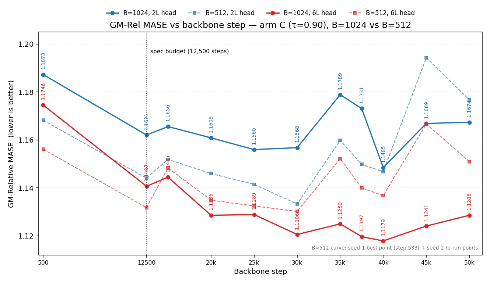
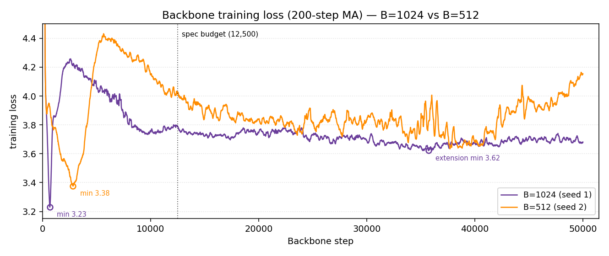

# Batch size and training length for the τ=0.90 winner (B=512 vs B=1024)

**Question: does doubling the training batch size (B=512 → B=1024,
everything else fixed) make forecasts better, and does training either
batch longer keep helping? Answer: at the issue's 12,500-step budget
the doubled batch is worse in every cell. Training longer helps both
batch sizes up to a point — B=512 bottoms near step 30,000, B=1024 at
40,000 — then hurts. The deep head decides the batch question: B=1024's
6L minimum (1.1179) beats every B=512 measurement from either seed; on
the shallow 2L head the best B=512 cell (1.1333) beats the best B=1024
cell (1.1485).**

The model is **arm C** (λ_e = 1, λ_h = 1, τ = 0.90), the winner of the
grid at `experiments/2026-06-28_sigreg_lambda_tau_cross/`; its B=512
original is the **parent**. This report closes two experiments: the
B=1024 retrain (#369, `experiments/2026-07-03_b1024_traj_ckpts/`) and
the B=512 seed-2 re-run + prolongation (#371,
`experiments/2026-07-07_b512_armC_seed2_traj/`). **GM-Rel MASE** =
geometric mean over the 97 GIFT-Eval-full tasks of `MASE / SN_MASE`
(seasonal-naive baseline); lower is better.

## B=1024 at the issue's checkpoints

B=1024 loses every spec cell and the issue's stop rule fired:

| head | ckpt | parent B=512 | B=1024 | Δ |
|:---:|:---:|:---:|:---:|:---:|
| 2L | best-loss step (500) | 1.1682 | 1.1873 | +0.0191 |
| 6L | best-loss step (500) | 1.1561 | 1.1746 | +0.0185 |
| 2L | last (12,500) | **1.1491** | **1.1621** | **+0.0130** |
| 6L | last (12,500) | **1.1254** | **1.1407** | **+0.0153** |

## Training longer

- **B=1024 bottoms at step 40,000** (extension past #369's stop rule):
  6L 1.1179 (−0.0075 vs parent last), below the B=512 re-run at every
  scored step from 15,000 through 50,000; 2L (oscillating
  1.1485 – 1.1789 past 25,000) never reaches B=512's best (1.1333).
  Both heads degrade past 40,000.
- **B=512 bottoms at step 30,000** (prolongation is #371's scope):
  2L 1.1333, 6L 1.1302 — then degrades hard: 45,000 spikes to
  1.1943 / 1.1667 and 50,000 stays worse than its own 12,500 cells.
  Per #371's stop rule (extended last must beat pre-extension last),
  that is a stop-and-report.
- **Seed spread, measured at 12,500 (B=512)**: seed 2 scores 1.1441 /
  1.1318 vs seed 1's 1.1491 / 1.1254 — |Δ| ≈ 0.005 – 0.006 with
  opposite signs per head. Cross-batch margins below ~0.006 should be
  read against that spread. The 6L gap at the respective minima
  (1.1302 − 1.1179 = 0.0123) is about twice it, and costs ≈ 2.7× the
  samples (40,000 × 1024 vs 30,000 × 512).
- Both batch sizes spike at step 35,000.

The B=1024 loss minimum (≈ 3.23 at step ~680 on the 200-step moving
average) does not coincide with its head-eval minimum (step 40,000);
within the extension its loss bottoms near 35,700. The B=512 re-run's
loss climbs from ≈ 42,000, matching its GM degradation.

## Protocol

- **B=1024** (#369): backbone retrained at B=1024, seed matched to the
  parent (20260520), 12,500 steps extended to 50,000, checkpoint every
  500 steps. The "best-loss step (500)" locus is the parent's measured
  best (step 533) snapped to that grid.
- **B=512 re-run** (#371): identical recipe at B=512 with a fresh seed
  (20260707) — the parent's own checkpoints did not survive its
  worktree — trained to 50,000 with the same trajectory protocol.
- **Heads and scoring** (both): two causal transformer quantile heads
  (2- and 6-layer) per scored checkpoint over the frozen backbone; the
  step-500 head trains 30,000 steps from scratch, later loci resume
  from it for a 10,000-step re-adapt; full 97-task GIFT-Eval per head.
- τ is the EMA rate of the target encoder; λ_e, λ_h are the SIGReg
  weights on the embedding and encoding branches.
- Parent numbers in the table: `#366`'s committed `gm_table.csv` at
  `ba1df52`, arm `cross_C`. The GM plot's B=512 curves: the parent's
  best point (step 533, seed 1) continued by the seed-2 re-run
  (`results/b512_seed2/` extracts); the loss plot's B=512 curve is the
  seed-2 run alone. One B=1024 run and two B=512 runs (the seeds
  above); apart from the one measured seed pair, margins are point
  estimates.
