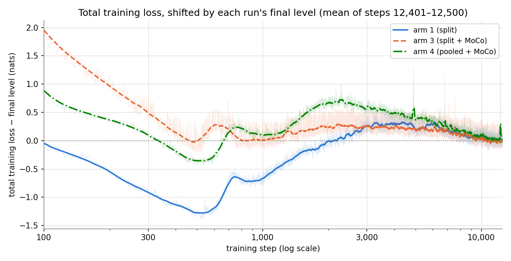

# Splitting the main loss into L_pred + L_rep does not improve GM-Relative MASE at 6L / last (+2.3 to +2.7 % vs the pooled champion, single seed)

**Question.** The champion backbone of the [SIGReg (λ_e, λ_h) × EMA-τ
sweep](../2026-06-28_sigreg_lambda_tau_cross/sigreg_lambda_tau_cross.md)
trains with the pooled loss `cosine_similarity_batch_full_hh_negs_xshh_allt`:
one softmax denominator holds both the f-anchored (prediction) and the
h-anchored (repulsion) negative families. Does splitting them into two
independent terms — `L_pred` (positive against the f-anchored negatives)
and `L_rep` (pooled logsumexp of the h-anchored negatives, no positive) —
improve the full-97 GM-Relative MASE? Two side arms probe alternative
f-side objectives: arm 4 keeps the pooled shape and adds MoCo teacher keys
to isolate the MoCo axis, and arm 5 drops the InfoNCE denominator on the
f side entirely, replacing `L_pred` with a BYOL-style alignment
(`L = L_align + L_rep`).

**Answer.** No at the 6L / last cell (arm 1 +2.7 %, arm 3 +2.3 %, arm 4
+1.3 %; champion-denominated). At the compute-matched `last` cells (all
at backbone step 12,500), the champion wins in every row. At the
non-compute-matched `best` cells (see backbone-step table below), arm 3,
arm 4 and arm 1 each sit at or below the champion in at least one row —
but each `best` cell head-trains on the arm's own `best_loss` step, which
is 600 for arm 4 and 11,800 for arm 3, so those margins mix backbone-step
differences into the ranking. Dropping the InfoNCE denominator on the
f side (arm 5, `L_align + L_rep`) is a clear regression: arm 5 / 6L / best
= 1.2554 = +8.6 % vs the champion. All quoted margins are single-seed
point differences (see Caveat).

## Downstream GM-Relative MASE

| arm | 2L / best | 2L / last | 6L / best | 6L / last |
| --- | --: | --: | --: | --: |
| arm 1 (split) | 1.1654 | 1.1669 | 1.1575 | 1.1557 |
| arm 3 (split + MoCo) | 1.1548 | 1.1683 | **1.1338** | 1.1511 |
| arm 4 (pooled + MoCo) | 1.1602 | 1.1546 | 1.1603 | 1.1405 |
| arm 5 (`L_align` + `L_rep`) | TODO | TODO | 1.2554 | TODO |
| arm C ref (champion) | 1.1682 | 1.1491 | 1.1561 | **1.1254** |

*GM-Relative MASE: geometric mean, over GIFT-Eval's 97 evaluation configs,
of model MASE divided by seasonal-naive MASE; 1.0 = seasonal-naive, lower
is better. One cell = one (head depth, checkpoint) evaluation of one arm.
Arms 1 / 3 values are `Aggregate GM-Relative MASE (97 configs)` in each
`summary.txt` under `experiments/2026-07-10_split_pred_rep/results/`;
arms 4 / 5 values are the same line under `results_arm4/` and
`results_arm5/`. Champion values are the four `cross_C` (λ_e = 1, λ_h = 1,
τ = 0.90) rows of `experiments/2026-06-28_sigreg_lambda_tau_cross/results/gm_table.csv`.
Boldface marks the minimum GM-Rel MASE in each column across all arms.
Arm 5's 2L cells and 6L / last are still evaluating.*

**Backbone step behind each cell.** The head-training protocol trains on
the arm's `FINAL.pth` for the `best` cell, then resumes on `final.pth`
for the `last` cell. Each launcher copies `best_loss.pth` into
`FINAL.pth` at end-of-training, so the `best` cell head-trains on
whatever step each arm's total loss was minimum at:

| arm | `best` cell backbone step | `last` cell backbone step |
| --- | --: | --: |
| arm 1 (split) | 12,500 | 12,500 |
| arm 3 (split + MoCo) | 11,800 | 12,500 |
| arm 4 (pooled + MoCo) | 600 | 12,500 |
| arm 5 (`L_align` + `L_rep`) | pending | pending |
| arm C ref (champion) | not on this branch | not on this branch |

The `last` column (backbone step 12,500 for every arm) is the only
matched-backbone comparison across arms; `best` cells mix objective
differences with backbone-step differences.

## Denominator share

`log_neg_cross_batch` holds 0.90–0.99 of `L_pred`'s denominator in the
split shape (arms 1 and 3, periodic and mixed batches). The same tensor
holds 0.003 in arm 4's pooled denominator on both batches, while the
h-anchored families (`log_neg_hh_all` + `log_neg_xs_allt`) hold 0.877
(periodic) / 0.860 (mixed).

*Measurement (`scripts/gradient_share_measurement.py`; full table
`results/gradient_share_measurement.csv`, 132 rows). Each backbone
checkpoint runs in `.eval()` mode on two fixed batches of B = 64,
T = 4096: "mixed" is the training HF stream, "periodic" is solar / H +
electricity / H windows from GIFT-Eval. Each family's share of its own
term's denominator is `exp(mean(log-family − log-denominator))` over
anchors at τ = 0.10, so segments in one bar need not sum to exactly 1.
Read the reported quantities as the loss landscape a frozen student sees,
not the training-time gradient shares of the MoCo arms: measurement
batch is B = 64 (training used B = 512, and the `log_neg_cross_batch`
count scales with B); `.eval()` disables the 0.70 encoder dropkey and
dropout that reshape h at training time; for the MoCo arms (3, 4) the
keys are student-side at measurement, while training routes them through
the EMA teacher.*

## Training loss

Each curve is the run's total training loss (contrastive + CPC + SIGReg
+ `L_align` if arm 5), tail-aligned by subtracting the mean of steps
12,401 – 12,500. The pooled shape (arm 4) keeps the champion's
`--pos-in-denominator --subtract-contrastive-floor`, the split shape
drops both, and arm 5 adds a BYOL alignment term; the absolute loss
levels are not the same functional and are not directly comparable.

## Arms

| arm | loss shape | `--moco-negatives` | defining feature |
| --- | --- | :-: | --- |
| arm 1 | `cosine_similarity_batch_split_pred_rep` | off | split objective `L = L_pred + L_rep`, equal weight |
| arm 3 | `cosine_similarity_batch_split_pred_rep` | on | split objective; cross-batch f ↔ h keys come from the EMA teacher (MoCo-style) instead of the student |
| arm 4 | `cosine_similarity_batch_full_hh_negs_xshh_allt` | on | pooled champion shape with teacher keys |
| arm 5 | `cosine_similarity_batch_rep_only` + `--align-loss-weight 1.0` | off | replace `L_pred` with BYOL-style alignment: `L = L_align + L_rep` (no InfoNCE denominator on the f side) |
| arm C ref | `cosine_similarity_batch_full_hh_negs_xshh_allt` | off | champion (λ_e = 1, λ_h = 1, τ = 0.90) of the earlier sweep, reused without retraining |

Arm 2 was reserved in the issue-card follow-up list (a λ-weighted
variant of the split, `α L_pred + β L_rep`) and was not run in this
experiment; it stays a follow-up card.

**Multi-axis confound.** Arm 1 vs arm C ref changes three things at
once: the loss functional (split vs pooled), `--pos-in-denominator`
(dropped by the split), and `--subtract-contrastive-floor` (dropped by
the split; both flags are derived for the pooled shape and are not
defined for the split). Arm 3 vs arm 4 is the single-axis contrast that
holds the loss functional's shape flags fixed and toggles only split vs
pooled at matched MoCo — that pair is the clean split-vs-pooled read.

Negative families (tensor names from the measurement CSV): the two
f-anchored families are `log_neg_cross_batch` (cross-batch f_t ↔ h′_{t+1})
and `log_neg_zy` (adjacent f_{t+1} ↔ f_t); the three h-anchored families
are `log_neg_hh_all` (within-series all-time h ↔ h), `log_neg_xs_allt`
(cross-series all-time h ↔ h′), and cross-channel `log_neg_xx`, which is
empty at C = 1. f is the forecaster's predicted latent, h the encoder
latent; primes mark other series of the batch. The pooled shape puts all
five families into one denominator; the split routes the two f-anchored
families to `L_pred` and the three h-anchored families to `L_rep`.

Glossary of specialised vocabulary used above: **MoCo** — replaces the
student `h` keys in the cross-batch f ↔ h′ negative with an EMA teacher
`h^T` (slow-moving copy of the encoder). **EMA teacher** — an
exponentially-moving-average shadow of the student encoder with decay
τ = 0.90 that supplies stable positive / key latents.
**BYOL-style alignment** — a negative-free InfoNCE-adjacent objective
that maximises cosine similarity between the student's forecaster latent
and the (teacher-side or stopgrad) encoder latent. **SIGReg** — a
regulariser that pushes the marginal of pooled `e` and pooled `h` toward
uniform on the sphere. **CPC** — a batch-cross InfoNCE auxiliary that
predicts `e` from `h` at matched (b, t) indices.

## Method

Each arm trains one backbone with the champion recipe (12,500 steps,
B = 512, T = 4096, C = 1, lr 1e-3, seed 20260520, dataset
`gift-pretrain-full-4096 / small_v1`, EMA teacher τ = 0.90, contrastive
τ = 0.10, SIGReg λ_e = λ_h = 1, CPC auxiliary loss). The arms differ in
`--loss-shape` and `--moco-negatives`; the pooled arm additionally keeps
the champion's `--pos-in-denominator --subtract-contrastive-floor`, which
the split shape does not define. For each backbone a quantile probe head
(2 or 6 layers) is trained for 30,000 steps on `FINAL.pth` (`best-loss`
copied), then for 10,000 more steps — resuming the same head — on
`final.pth` (step 12,500). Each head is evaluated on GIFT-Eval's 97
configs against the same seasonal-naive reference file as the champion.

## Caveat — single seed

Every evaluation is N = 1. Matched-cell point differences vs the
champion, over the twelve scored cells of arms 1 / 3 / 4 (arm 5 has one
scored cell so far, 6L / best = 1.2554 = +8.6 %), span −1.9 % (arm 3,
6L / best) to +2.7 % (arm 1, 6L / last); four of the twelve are within
±0.6 % and eight are within ±1.6 %. The spread between the `best` and
`last` cells of the same (arm, head) pair (last relative to best) spans
−1.7 % (arm 4, 6L: 1.1405 vs 1.1603) to +1.5 % (arm 3, 2L: 1.1683 vs
1.1548) here, i.e. bigger than most matched-cell margins. The card's
primary success criterion — paired-bootstrap CI vs arm C's per-task
MASE — needs arm C's per-task `all_results.csv`, which is not on this
branch; the arm 3 vs arm 4 contrast (single-axis, split vs pooled at
matched MoCo) can be computed from the committed `all_results.csv` for
both arms with `scripts/paired_bootstrap.py` — that CI is a follow-up
addition to this report. A multi-seed replicate would be needed to call
any ordering real.
