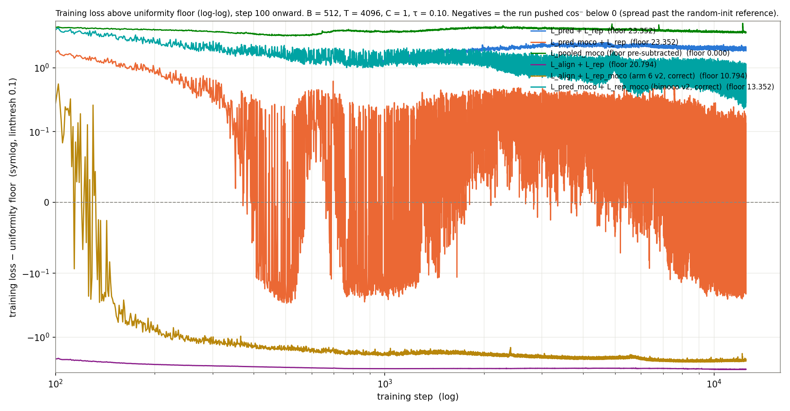

# Split L_pred + L_rep contrastive loss — arm sweep on the SIGReg-champion backbone

**Question.** Does splitting the pooled contrastive loss into `L_pred` (f-anchored, positive against next-step h) and `L_rep` (h-anchored, LSE only) improve GM-Relative MASE on the GIFT-Eval 97-config panel? What happens if we add MoCo teacher-side keys to one or both terms, or replace `L_pred` with BYOL alignment?

**Answer.** `L_pred_moco + L_rep_moco` (arm bimoco) is the column minimum on every (head, checkpoint) cell and clears Bonferroni α = 0.000833 on 10 of 12 arm-1/3/4 rows. Every other split variant is level with or worse than the single-term pooled baselines (arms 3, 4).

## Result

| arm | 2L / best | 2L / last | 6L / best | 6L / last |
| --- | --: | --: | --: | --: |
| arm 1 (split) | 1.1654 | 1.1669 | 1.1575 | 1.1557 |
| arm 3 (split + MoCo on `L_pred`) | 1.1548 | 1.1683 | 1.1338 | 1.1511 |
| arm 4 (pooled + MoCo) | 1.1602 | 1.1546 | 1.1603 | 1.1405 |
| arm 5 (`L_align` + `L_rep`) | 1.3374 | 1.2883 | 1.2554 | 1.2201 |
| arm 6 (`L_align` + `L_rep_moco`) | 1.1771 | 1.1712 | 1.1768 | 1.1767 |
| arm bimoco (`L_pred_moco` + `L_rep_moco`) | **1.1225** | **1.1180** | **1.1138** | **1.1087** |
| arm C ref (SIGReg-cross champion) | 1.1682 | 1.1491 | 1.1561 | 1.1254 |

## Training dynamics

## GM-Relative MASE across backbone step

## Alignment during training vs downstream forecast quality

`ff` is the per-step training mean of cos(f̂, next-step h) on L2-normalized vectors, logged in every backbone losses CSV; perfect alignment gives 1 − ff = 0. A lower 1 − ff during training does not translate into a lower GM-Relative MASE. Arm 5 reaches the lowest 1 − ff of the four arms whose alignment error decreases (minimum 0.383 vs 0.415–0.575 for arms 1, 3, 4) yet has the worst GM-Relative MASE at every evaluated step (1.221–1.337; every other arm stays at or below 1.208). In both `L_rep_moco` arms 1 − ff rises across training — arm 6 from ≈ 0.28 to ≈ 0.54 by step 50,000, bimoco from ≈ 0.23 to ≈ 0.34 by 25,000 — while arm 6's score stays within 1.160–1.191 and bimoco's moves from 1.118 at step 12,500 to 1.134 at 25,000. Arm 4, whose 1 − ff plateaus at ≈ 0.44, has the lowest score past step 12,500: 1.133 at 25,000 (bimoco: 1.134) and 1.141 at 50,000. Script: `plots/_make_gm_vs_cos_error.py`.

## Paired-bootstrap 95 % CIs on GM-Relative MASE ratios

Row inventory at task-level `n_boot` = 200,000 (see `results/pairwise_bootstrap_ci_*_nboot200k.csv`), quoted as X-vs-bimoco / X-vs-arm-6 / X-vs-arm-5, direction ratio > 1 → X worse:

| contrast set | rows | separated at 95 % (task) | clear α = 0.05 / 60 = 0.000833 |
| --- | --: | --: | --: |
| arm 1 / 3 / 4 pairwise | 12 | 2 / 12 (both step-confounded `best`) | 0 / 12 |
| arm 5 vs arm 1 / 3 / 4 | 12 | 12 / 12 | 10 / 12 |
| arm 6 vs arm 1 / 3 / 4 | 12 | 5 / 12 | 1 / 12 (6L / best arm 3 vs arm 6, p₂ = 1 × 10⁻⁵) |
| arm 5 vs arm 6 | 4 | 3 / 4 (arm 6 lower) | 2 / 4 |
| **arm 1 / 3 / 4 vs bimoco** | **12** | **12 / 12 (bimoco lower)** | **10 / 12** |
| arm 5 / arm 6 vs bimoco | 8 | 8 / 8 (bimoco lower) | 8 / 8 |

The two arm-1/3/4-vs-bimoco rows that miss α: 2L / best arm 4 vs bimoco p₂ = 0.00435, 6L / best arm 3 vs bimoco p₂ = 0.00426.

## f-anchored retrieval saturation

`auc` (ROC of the positive-score distribution against cross-batch f ↔ h′ negatives) and `top1` (fraction of anchors whose positive scores highest of the B = 512 candidates) are logged next to `loss` in every backbone losses CSV. Sampled step values:

| arm | step 600 | step 2,000 | step 6,000 | step 12,500 | `top1` min at step ≥ 600 |
| --- | --- | --- | --- | --- | --- |
| arm 1 | 1.0000 / 0.9998 | 0.9999 / 0.9835 | 1.0000 / 0.9952 | 1.0000 / 0.9926 | 0.8348 (step 3,343) |
| arm 3 | 1.0000 / 0.9998 | 1.0000 / 0.9992 | 1.0000 / 0.9996 | 1.0000 / 0.9993 | 0.9825 (step 3,538) |
| arm 4 | 1.0000 / 0.9993 | 1.0000 / 0.9995 | 1.0000 / 0.9994 | 1.0000 / 0.9974 | 0.9505 (step 934) |
| arm 5 | 1.0000 / 1.0000 | 1.0000 / 1.0000 | 1.0000 / 1.0000 | 1.0000 / 1.0000 | 1.0000 |
| arm 6 | 1.0000 / 0.9993 | 1.0000 / 0.9965 | 1.0000 / 0.9953 | 1.0000 / 0.9971 | 0.9753 (step 2,410) |
| arm bimoco | 1.0000 / 0.9992 | 1.0000 / 0.9980 | 1.0000 / 0.9983 | 0.9999 / 0.9974 | 0.9764 (step 651) |

## Denominator share

## Method (annex)

All backbones: B = 512, T = 4096, C = 1, τ = 0.10, `lr = 1e-3`, seed 20260520, dataset `gift-pretrain-full-4096 / small_v1`, EMA teacher τ = 0.90, SIGReg λ_e = λ_h = 1, CPC auxiliary, 12,500 steps. Downstream: fresh quantile head (2L or 6L) trains 30k steps on `FINAL.pth` = `best_loss.pth` (30k `best` cell), then resumes +10k more on `final.pth` = step 12,500 (`last` cell). Eval: GIFT-Eval 97 configs, strategy B4, quantile-median MASE divided by the branch-committed seasonal-naive reference (`results/seasonal_naive_all_results.csv`).

## Arms (annex)

| arm | loss shape | flags | key structure |
| --- | --- | --- | --- |
| arm 1 | `cosine_similarity_batch_split_pred_rep` | — | `L = L_pred + L_rep`, no MoCo |
| arm 3 | `cosine_similarity_batch_split_pred_rep` | `--moco-negatives` | `L_pred` uses EMA-teacher keys on cross-batch f ↔ h |
| arm 4 | `cosine_similarity_batch_full_hh_negs_xshh_allt` | `--moco-negatives --pos-in-denominator --subtract-contrastive-floor` | pooled champion shape with EMA-teacher keys |
| arm 5 | `cosine_similarity_batch_rep_only` | `--align-loss-weight 1.0` | `L = L_align + L_rep`; `L_align` is BYOL to teacher-encoder next-step latent |
| arm 6 | `cosine_similarity_batch_rep_only` | `--align-loss-weight 1.0 --moco-rep-keys` | arm 5's `L_align` + `L_rep_moco`: h-family KEYS routed through EMA teacher, same-batch same-time `<h_student, h_teacher> / τ` in both numerator and denominator LSE |
| arm bimoco | `cosine_similarity_batch_split_pred_rep` | `--moco-negatives --moco-rep-keys` | `L = L_pred_moco + L_rep_moco`; MoCo + positive-in-denominator on both terms |
| arm C ref | `cosine_similarity_batch_full_hh_negs_xshh_allt` | — | SIGReg-cross champion (λ_e = 1, λ_h = 1, EMA τ = 0.90), reused without retraining; per-task file not on this branch → no CI vs arm C computable here |

## Backbone step (annex)

| arm | `best` cell step | `last` cell step | `FINAL.pth` = |
| --- | --: | --: | --- |
| arm 1 | 12,500 | 12,500 | `final.pth` (no post-resume `best_loss.pth` save in run log) |
| arm 3 | 11,800 | 12,500 | `best_loss.pth` at step 11,800 |
| arm 4 | 600 | 12,500 | `best_loss.pth` at step 600 |
| arm 5 | 11,800 | 12,500 | `best_loss.pth` at step 11,800 |
| arm 6 | 8,700 | 12,500 | `best_loss.pth` at step 8,700 |
| arm bimoco | 12,400 | 12,500 | `best_loss.pth` at step 12,400 |
| arm C ref | not exported | 12,500 | — |

Selection-rule confound on the `best` column: arms 1 and 4's `best`-cell backbone is not the argmin of a comparable curve. Arm 1's shipped `FINAL.pth` = step 12,500 (no post-resume `best_loss.pth` was ever saved). Arm 4's shipped `FINAL.pth` = step 600 (its loss never returns below step 600). Six of the twelve arm-1/3/4 Bonferroni-family rows are `best` rows and mix the loss-shape axis with this checkpoint-selection axis.

## Definitions (annex)

- *GM-Relative MASE* — geometric mean over the 97 GIFT-Eval configs of `(model MASE) / (seasonal-naive MASE)`, at quantile 0.5. Lower is better; 1.0 = seasonal-naive.
- *MoCo* — cross-batch keys sourced from an EMA teacher (τ = 0.90) instead of the student.
- *BYOL alignment (`L_align`)* — `2 − 2·cos(f_t, sg(h^T_{t+1}))`; negative-free, minimum 0.
- *`L_rep_moco`* — normalized InfoNCE over the three h-anchored families with teacher-side keys; the same-batch same-time student ↔ teacher pair sits in both numerator and denominator LSE.
- *Bonferroni family* — 60 contrasts = 15 arm pairs × 4 (head, checkpoint) cells on the full-97 panel, α = 0.05 / 60 = 0.000833.
