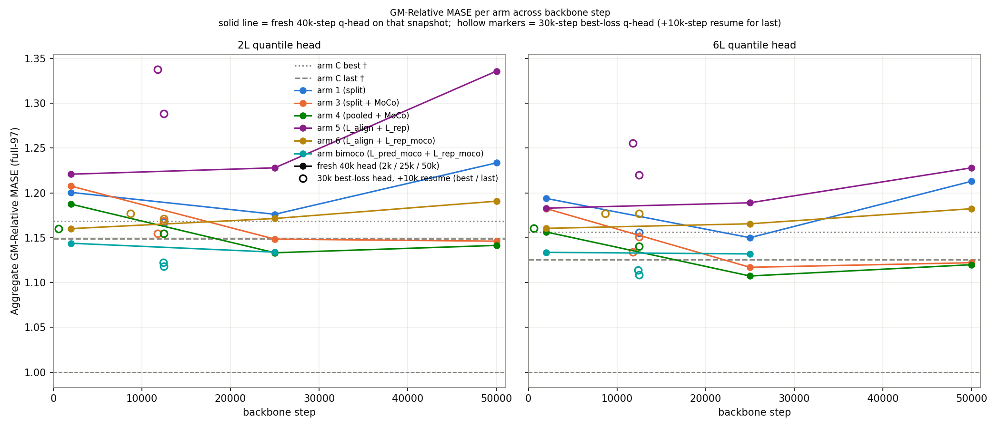
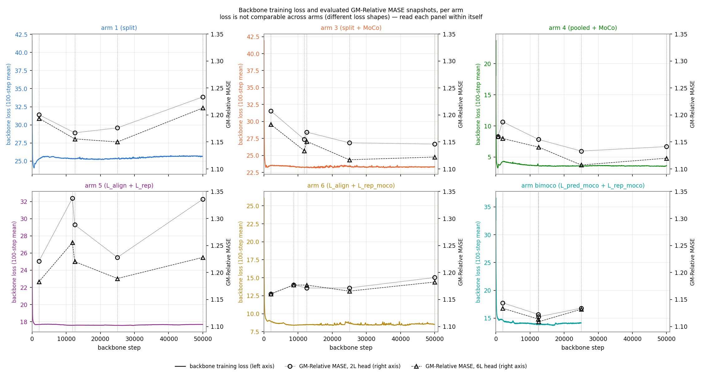
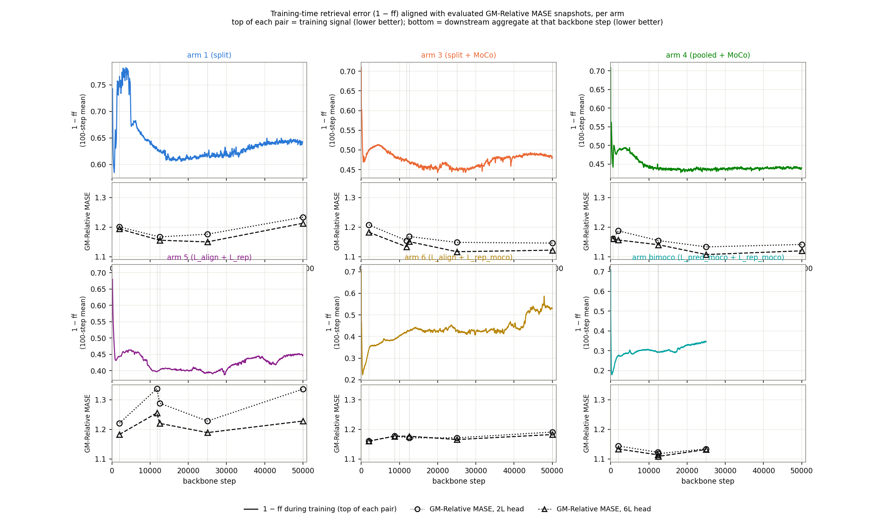
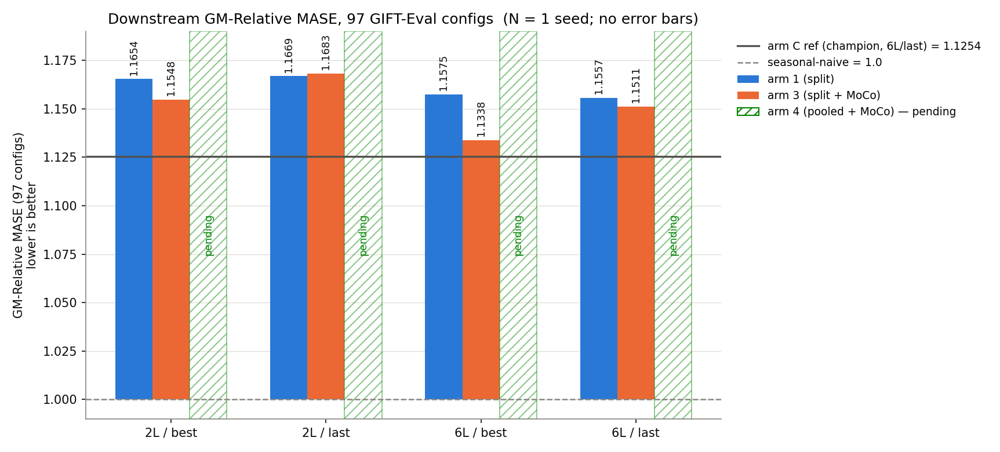
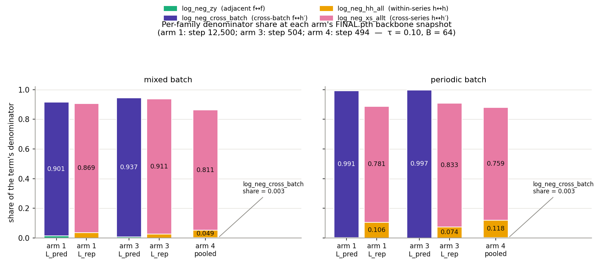
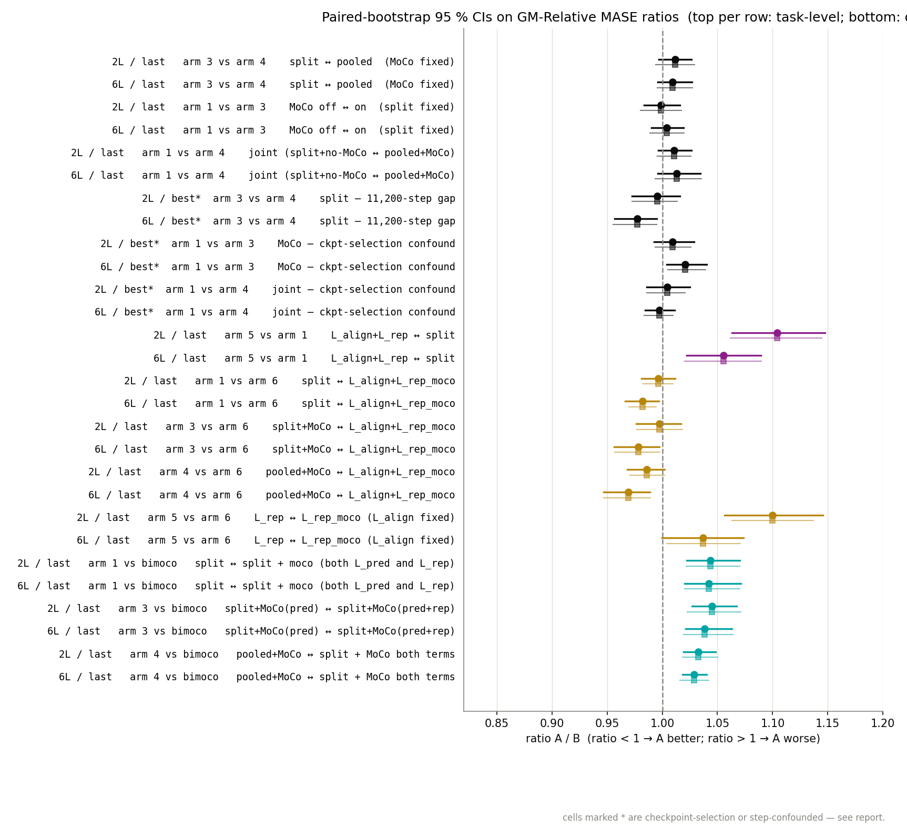

# Bimoco at 12,500 steps and pooled + MoCo (arm 4) from 25,000 onward are the lowest arms, and both beat the SIGReg champion with a 95 % paired-bootstrap CI.

**Question.** The champion loss puts every negative under a single log-sum-exp denominator. Does splitting it into `L_pred` (f-anchored) and `L_rep` (h-anchored) improve GM-Relative MASE (geometric mean, over the 97 GIFT-Eval configs, of per-task MASE / seasonal-naive MASE; lower is better), and does adding EMA-teacher MoCo keys or replacing `L_pred` with BYOL alignment change the answer?

**Answer.** Which arm is lowest depends on backbone step: bimoco at 12,500, arm 4 from 25,000 onward (bimoco has no 50k cell).



*Bimoco has no 50,000-step cell.*

## Aligning the training signal with downstream MASE





*`ff = cos(f̂_t, f_true_{t+1})`, the positive-pair cosine similarity — one numeric scale for every arm.*

## Snapshot at 12,500 backbone steps



*Arm C appears only in the `last` cells (no best-loss save). Separation is established by the CIs in the paired-bootstrap annex, not bar heights.*

## The arms

Notation: `h_t` = encoder latent; `f_t` = forecaster's next-step latent (the forecast); `h′` = cross-batch latent; `ᵀ` = EMA-teacher copy (τ_ema = 0.90); `sg` = stop-gradient. Cosine similarities at τ = 0.10.

```
L_pred        f-anchored NCE:  positive cos(f_t, h′_{t+1});  negatives  adjacent f_{t+1}↔f_t  ∪  cross-batch f_t↔h′_{t+1}
L_pred_moco   = L_pred with the cross-batch keys taken from the teacher
L_rep         h-anchored LSE:  cross-channel h↔h  ∪  within-series h↔h  ∪  cross-series h↔h′;  no positive term
L_rep_moco    = L_rep with teacher-side keys; the same-time student↔teacher pair is the positive and also sits in the denominator
L_align       2 − 2·cos(f_t, sg(hᵀ_{t+1}))   BYOL: negative-free
```

| arm | loss | shape (prefix `cosine_similarity_batch_`) + flags |
| --- | --- | --- |
| arm 1 | `L_pred + L_rep` | `split_pred_rep` |
| arm 3 | `L_pred_moco + L_rep` | `split_pred_rep` `--moco-negatives` |
| arm 4 | one pooled denominator over all five negative families, teacher keys | `full_hh_negs_xshh_allt` `--moco-negatives --pos-in-denominator --subtract-contrastive-floor` |
| arm 5 | `L_align + L_rep` | `rep_only` `--align-loss-weight 1.0` |
| arm 6 | `L_align + L_rep_moco` | `rep_only` `--align-loss-weight 1.0 --moco-rep-keys` |
| bimoco | `L_pred_moco + L_rep_moco` | `split_pred_rep` `--moco-negatives --moco-rep-keys` |
| arm C | arm 4's pooled shape with student keys | champion baseline; seed-2 retrain (Method annex) |

## Trajectory cells (annex)

The `2k` / `25k` / `50k` cells use a fresh 40k-step head; `best` / `last` use a 30k-step best-loss head (+10k resume for `last`); per-arm `best` steps in the backbone-step annex.

| arm | 2L 2k | 2L best | 2L last (12,500) | 2L 25k | 2L 50k | 6L 2k | 6L best | 6L last (12,500) | 6L 25k | 6L 50k |
| --- | --: | --: | --: | --: | --: | --: | --: | --: | --: | --: |
| arm 1 | 1.2005 | 1.1654 | 1.1669 | 1.1761 | 1.2334 | 1.1938 | 1.1575 | 1.1557 | 1.1500 | 1.2129 |
| arm 3 | 1.2075 | 1.1548 | 1.1683 | 1.1484 | 1.1461 | 1.1825 | 1.1338 | 1.1511 | 1.1170 | 1.1221 |
| arm 4 | 1.1874 | 1.1602 | 1.1546 | **1.1332** | 1.1414 | 1.1564 | 1.1603 | 1.1405 | **1.1073** | 1.1199 |
| arm 5 | 1.2208 | 1.3374 | 1.2883 | 1.2279 | 1.3357 | 1.1829 | 1.2554 | 1.2201 | 1.1889 | 1.2279 |
| arm 6 | 1.1601 | 1.1771 | 1.1712 | 1.1714 | 1.1907 | 1.1604 | 1.1768 | 1.1767 | 1.1655 | 1.1823 |
| arm bimoco | 1.1438 | **1.1225** | **1.1180** | 1.1339 | — | 1.1337 | **1.1138** | **1.1087** | 1.1319 | — |
| arm C ref (seed 2) | — | — | 1.1441 | 1.1415 | 1.1768 | — | — | 1.1318 | 1.1325 | 1.1510 |

Bold = column minimum.

## Method (annex)

All six arms' backbones: B = 512, T = 4096, C = 1, τ = 0.10, `lr = 1e-3`, seed 20260520, dataset `gift-pretrain-full-4096 / small_v1`, EMA teacher τ = 0.90, SIGReg λ_e = λ_h = 1, CPC auxiliary, 12,500 steps, prolonged to 25,000 and (five arms) 50,000. Arm C is the SIGReg-cross champion recipe (λ_e = 1, λ_h = 1, τ = 0.90); its per-task data is a same-recipe seed-2 retrain evaluated at steps 12,500 / 25,000 / 50,000.

Eval: GIFT-Eval 97 configs, strategy B4, quantile-median MASE / seasonal-naive. Per-cell source paths and checkpoint layout: `experiments/2026-07-10_split_pred_rep/README.md`.

f-anchored retrieval saturates by step 600 in every arm (`auc` ≥ 0.9975, lowest `top1` 0.8348) and does not separate the arms.

## Denominator share (annex)



*Per-family denominator share at each arm's best-cell backbone snapshot (arm 1: step 12,500; arm 3: 11,800; arm 4: 600), probed on a mixed and a periodic-only batch at τ = 0.10, B = 64. `share_i = exp(mean(logit_i − log-denominator))` is a per-anchor geometric mean, so families need not sum to 1; each bar's Σ is printed above it.*

Share of the cross-batch `f ↔ h′` family in the term carrying the prediction pairs (`results/gradient_share_measurement.csv`):

| arm | term | mixed batch | periodic batch |
| --- | --- | --: | --: |
| arm 1 (split, step 12,500) | `L_pred` | 0.901 | 0.991 |
| arm 3 (split + MoCo, step 11,800) | `L_pred` | 0.937 | 0.997 |
| arm 4 (pooled, step 600) | pooled | 0.003 | 0.003 |

Bimoco was not probed. The arms sit at different backbone steps and the probe's B = 64 differs from training's 512, so shares are indicative.

## Backbone step (annex)

| arm | `best` cell step | `last` cell step | best-cell backbone = |
| --- | --: | --: | --- |
| arm 1 | 12,500 | 12,500 | the step-12,500 checkpoint, not a loss-argmin checkpoint |
| arm 3 | 11,800 | 12,500 | `_best_loss.pth` at step 11,800 |
| arm 4 | 600 | 12,500 | `_best_loss.pth` at step 600 |
| arm 5 | 11,800 | 12,500 | `_best_loss.pth` at step 11,800 |
| arm 6 | 8,700 | 12,500 | `_best_loss.pth` at step 8,700 |
| arm bimoco | 12,400 | 12,500 | `_best_loss.pth` at step 12,400 |
| arm C ref | — (no best-loss save) | 12,500 | seed-2 retrain at steps 12,500 / 25,000 / 50,000 |

`best` rows mix loss shape with checkpoint selection: arms 1 and 4's `best` backbones are not loss-argmin picks.

## Paired-bootstrap 95 % CIs (annex)



*Circles = task-level bootstrap; faded squares = 28-dataset-clustered bootstrap (resamples the 28 source datasets instead of the 97 configs); `*` marks rows confounded by checkpoint selection or backbone step. n_boot = 20,000 (seed 42), raised to 200,000 for the arm-5/6/bimoco-reference and arm-C rows. The arm-C rows are task-level only (no clustered pass) against the seed-2 retrain at step 12,500.*

Separated = the task-level 95 % CI excludes ratio 1.0; ratio > 1 = the named arm is worse than the reference. Rows in the table below use the 12,500-step cells; source CSVs in the experiment README.

| contrast set | rows | separated at 95 % (task-level CI) |
| --- | --: | --: |
| arm 1 / 3 / 4 pairwise | 12 | 2 / 12 (both `best`, checkpoint-confounded) |
| arm 5 vs arm 1 / 3 / 4 | 12 | 12 / 12 (arm 5 worse) |
| arm 6 vs arm 1 / 3 / 4 | 12 | 4 / 12 (6L: best arm 3; last arms 1, 3, 4 lower than arm 6) |
| arm 5 vs arm 6 | 4 | 3 / 4 (arm 6 lower) |
| **arm 1 / 3 / 4 vs bimoco** | **12** | **12 / 12 (bimoco lower)** |
| arm 5 / arm 6 vs bimoco | 8 | 8 / 8 (bimoco lower) |

10 of the 12 arm-1/3/4-vs-bimoco rows also clear Bonferroni α = 0.05 / 60 = 0.000833 (60 = 15 arm pairs × 4 cells); the two misses are 2L / best arm 4 (p₂ = 0.00435) and 6L / best arm 3 (p₂ = 0.00426) (`two_sided_p` in `results/pairwise_bootstrap_ci_bimoco_nboot200k.csv`).

Contrasts vs arm C (seed-2 retrain at the matching backbone step):

| cell | arm 1 | arm 3 | arm 4 | arm 5 | arm 6 | bimoco |
| --- | --: | --: | --: | --: | --: | --: |
| 2L / last (vs step-12,500) | 1.020 [1.004, 1.039] | 1.021 [1.009, 1.034] | 1.009 [0.999, 1.021] | 1.126 [1.092, 1.162] | 1.024 [1.004, 1.046] | **0.977 [0.964, 0.991]** |
| 6L / last (vs step-12,500) | 1.021 [1.006, 1.038] | 1.017 [1.003, 1.032] | 1.008 [0.994, 1.021] | 1.078 [1.052, 1.105] | 1.040 [1.019, 1.065] | **0.980 [0.963, 0.994]** |
| 2L / 25k  (vs step-25,000) | 1.030 [1.010, 1.052] | 1.006 [0.987, 1.024] | 0.993 [0.980, 1.007] | 1.076 [1.055, 1.098] | 1.026 [1.006, 1.048] | 0.993 [0.978, 1.009] |
| 6L / 25k  (vs step-25,000) | 1.016 [0.997, 1.036] | 0.986 [0.969, 1.002] | **0.978 [0.967, 0.988]** | 1.050 [1.032, 1.069] | 1.029 [1.008, 1.052] | 0.999 [0.983, 1.018] |
| 2L / 50k  (vs step-50,000) | 1.048 [1.023, 1.075] | **0.974 [0.959, 0.988]** | **0.970 [0.950, 0.989]** | 1.135 [1.098, 1.173] | 1.012 [0.988, 1.038] | — |
| 6L / 50k  (vs step-50,000) | 1.054 [1.031, 1.078] | **0.975 [0.958, 0.991]** | **0.973 [0.959, 0.987]** | 1.067 [1.039, 1.095] | 1.027 [1.001, 1.057] | — |

Ratio = arm / arm C; below 1 the arm is better; bold = CI excludes 1.0 on the better side. These ratios also absorb the seed difference: the six arms train at seed 20260520, arm C at seed 2.

On the 37-config periodic subset (`results/pairwise_bootstrap_ci_periodic.csv`) bimoco is again lowest in every cell, separated on 10 of the 12 arm-1/3/4 rows; both exceptions are arm 4 `best` (2L CI 0.976–1.103, 6L CI 0.991–1.108).
