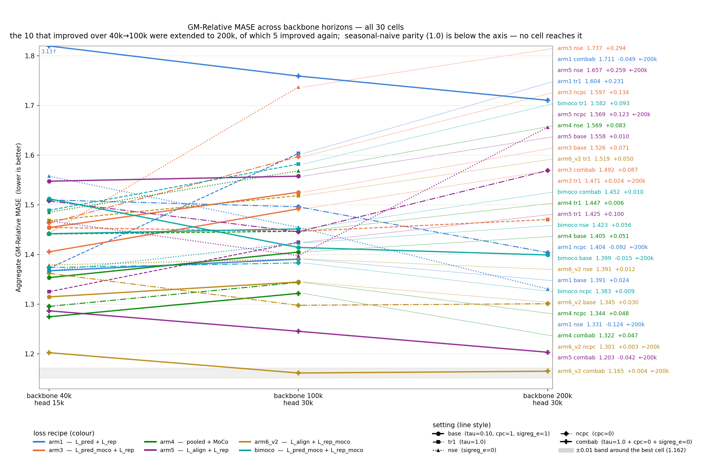

# No cell beats seasonal-naive at 40k or at 100k; `arm6_v2 combab` is the lowest at both

30 cells (6 loss recipes × 5 settings) evaluated at two backbone horizons — step 40k with a 15k-step quantile head, and step 100k with a 30k-step head. All 60 evaluations cover the full 97 GIFT-Eval B4 configs. Every value is above 1.0, i.e. worse than seasonal-naive on the geometric average. Going from 40k to 100k, 10 cells improve and 20 worsen; the sign of that change differs between cells inside every one of the six recipes.

Definitions of each recipe and each setting are in [Architectures](#architectures); all numbers are in [Results](#results).

## Figures

### 1. GM-Relative MASE, backbone 40k → 100k

Each line is one cell. Labels carry the 100k value and the change from 40k.

### 2. Ranking at backbone 40k

### 3. Ranking at backbone 100k

### 4. Latent movement between adjacent checkpoints

How far the latents of a fixed held-out batch rotate between one saved checkpoint and the next. Rows = setting, columns = `h_t` / `e_t`.

### 5. Forecast-to-latent distance `1 − ff` during training

### 6. Dimension usage `u_batchtime` during training

## Architectures

### Six loss recipes

Inherited verbatim from the split-pred/rep sweep (`reports/2026-07-10_split_pred_rep/`).

| Recipe    | Loss                       |
|-----------|----------------------------|
| `arm1`    | `L_pred + L_rep`           |
| `arm3`    | `L_pred_moco + L_rep`      |
| `arm4`    | `pooled + MoCo`            |
| `arm5`    | `L_align + L_rep`          |
| `arm6_v2` | `L_align + L_rep_moco`     |
| `bimoco`  | `L_pred_moco + L_rep_moco` |

### Five settings applied to each recipe

| Setting  | Change from base                                                            |
|----------|-----------------------------------------------------------------------------|
| `base`   | `τ = 0.10`, `cpc = 1`, `sigreg_e = 1`                                        |
| `tr1`    | all InfoNCE temperatures set to `τ = 1.0`                                     |
| `nse`    | SIGReg on `e_t` disabled (`sigreg_e = 0`)                                     |
| `ncpc`   | CPC auxiliary disabled (`cpc = 0`)                                            |
| `combab` | `τ = 1.0` and `cpc = 0`; additionally `sigreg_e = 0` for `arm1`/`arm3`/`arm4` |

### Metrics

- **GM-Relative MASE** — geometric mean over 97 GIFT-Eval configs of `MASE(model) / MASE(seasonal_naive)`, official GIFT-Eval **B4 strategy** (single-window in-context prediction, backbone context length matching the config's expected horizon), forecast horizon 16 (`experiments/2026-04-13_gift-eval/scripts/eval_gift_eval_official.py`). Lower is better; > 1 = beaten by seasonal-naive on that geometric average.
- **`h_t`, `e_t`** — the encoder-output latent and the patch-embedding latent, shape `[B, T, C, H]`.
- **`ff`** — mean `cos(f̂, h_{t+1})` between the forecaster's next-step prediction `f̂` and the encoder's next-step latent `h_{t+1}`, unit-normalised. `1 − ff` is a distance in [0, 2]; smaller = closer forecast.
- **Latent drift** at checkpoint pair `(step_i, step_j)` — `mean_{b,t,c} 1 − cos(h_t(model_j), h_t(model_i))` on a fixed held-out batch (`torch.manual_seed(20260722)`, `B=8`, ARMA-synthetic), and analogously for `e_t`. Range [0, 2]; low = the mapping the model applies to this fixed input has rotated little between the two checkpoints.
- **`u_batchtime`** — `1/(d · off-diag Gram mean)` over `(B×T)` samples of the given latent, clamped to [0, 1]. 1 = every `H` dimension carries independent information; low = collapsed onto a subspace. This is what SIGReg regularises.
- **InfoNCE** — the contrastive cross-entropy `−log(exp(pos/τ) / Σ_j exp(neg_j/τ))`, temperature `τ`.
- **SIGReg** — the LeJEPA-style spectral regulariser pushing each latent's Gram matrix toward a Gaussian off-diagonal; `--sigreg-embedding-weight` (`sigreg_e`) applies it to `e_t`, `--sigreg-encoding-weight` to `h_t`.
- **CPC** (`--cpc-infonce-weight`) — the CPC-InfoNCE auxiliary of van den Oord et al. 2018, predicting `e_{t+1}` from a bilinear projection of `h_t`.
- **MoCo** — negatives drawn from an EMA teacher (momentum contrast).

## Results

### GM-Relative MASE, all 30 cells at both horizons

Ranked by the 100k value. Per-cell summaries: `results/eval_gm_mase/`.

| Rank @100k | Cell | bb 40k (head 15k) | bb 100k (head 30k) | change |
|------|------------------|--------|--------|---------|
| 1  | `arm6_v2 combab` | 1.2025 | 1.1616 | −0.0409 |
| 2  | `arm5 combab`    | 1.2868 | 1.2456 | −0.0412 |
| 3  | `arm6_v2 ncpc`   | 1.3623 | 1.2978 | −0.0645 |
| 4  | `arm4 combab`    | 1.2748 | 1.3219 | +0.0471 |
| 5  | `arm4 ncpc`      | 1.2957 | 1.3441 | +0.0484 |
| 6  | `arm6_v2 base`   | 1.3149 | 1.3449 | +0.0300 |
| 7  | `bimoco ncpc`    | 1.3739 | 1.3833 | +0.0094 |
| 8  | `arm1 base`      | 1.3674 | 1.3909 | +0.0235 |
| 9  | `arm6_v2 nse`    | 1.3791 | 1.3914 | +0.0123 |
| 10 | `arm5 nse`       | 1.4682 | 1.3980 | −0.0702 |
| 11 | `arm4 base`      | 1.3537 | 1.4051 | +0.0514 |
| 12 | `bimoco base`    | 1.5123 | 1.4144 | −0.0979 |
| 13 | `bimoco nse`     | 1.3673 | 1.4234 | +0.0561 |
| 14 | `arm5 tr1`       | 1.3254 | 1.4249 | +0.0995 |
| 15 | `arm5 ncpc`      | 1.5079 | 1.4459 | −0.0620 |
| 16 | `arm3 tr1`       | 1.4547 | 1.4467 | −0.0080 |
| 17 | `arm4 tr1`       | 1.4414 | 1.4469 | +0.0055 |
| 18 | `bimoco combab`  | 1.4420 | 1.4517 | +0.0097 |
| 19 | `arm1 nse`       | 1.5579 | 1.4548 | −0.1031 |
| 20 | `arm3 combab`    | 1.4056 | 1.4921 | +0.0865 |
| 21 | `arm1 ncpc`      | 1.5100 | 1.4963 | −0.0137 |
| 22 | `arm6_v2 tr1`    | 1.4684 | 1.5188 | +0.0504 |
| 23 | `arm3 base`      | 1.4545 | 1.5255 | +0.0710 |
| 24 | `arm5 base`      | 1.5478 | 1.5579 | +0.0101 |
| 25 | `arm4 nse`       | 1.4852 | 1.5687 | +0.0835 |
| 26 | `bimoco tr1`     | 1.4892 | 1.5823 | +0.0931 |
| 27 | `arm3 ncpc`      | 1.4635 | 1.5973 | +0.1338 |
| 28 | `arm1 tr1`       | 1.3725 | 1.6036 | +0.2311 |
| 29 | `arm3 nse`       | 1.4432 | 1.7372 | +0.2940 |
| 30 | `arm1 combab`    | 3.1251 | 1.7595 | −1.3656 |

**On the ±0.01 error bars in figures 2 and 3.** Each cell is `N=1`, so this is not a measured seed-replicate interval for this experiment. It is a constant borrowed from the 2026-05-08 τ-sweep paired reruns via the [LeJEPA-SIGReg-τ report annex F](../2026-06-21_lejepa_sigreg_tau098/lejepa_sigreg_tau098.md#f-seed-noise-band), shown as a visual reference for "differences smaller than this have previously turned out to be within-seed noise", not as a confidence interval for this ranking.

### Latent drift, setting vs base

Paired Wilcoxon signed-rank on end-of-40k mean drift, N=6 recipe pairs, one-sided base > setting, `scipy.stats.wilcoxon(..., zero_method='wilcox')`. Underlying values: `results/wave_d_metrics.csv`.

| Setting | `h_t` drift lower vs base / 6 | `h_t` p | `e_t` drift lower vs base / 6 | `e_t` p |
|---------|-------------------------------|---------|-------------------------------|---------|
| `ncpc`  | 3/6 (arm 5 / 6_v2 / bimoco)   | 0.281   | 5/6 (all except arm 6_v2)     | 0.047   |
| `nse`   | 3/6 (arm 1 / 3 / 4)           | 0.344   | 3/6                           | 0.281   |
| `tr1`   | 1/6                           | 0.922   | 3/6                           | 0.656   |

## Setup

Backbone: `d_model=64, n_heads=8, num_encoder_layers=3, num_layers=3, batch_size=64, seed=20260520`, dataset `jeremycochoy/gift-pretrain-full-4096 / small_v1`.

Quantile head, trained on the frozen backbone:

| Param                | bb 40k        | bb 100k       |
|----------------------|---------------|---------------|
| `--head-arch`        | `transformer` | `transformer` |
| `--head-num-layers`  | 2             | 2             |
| `--head-nhead`       | 8             | 8             |
| `--head-ffn-mult`    | 4.0           | 4.0           |
| `--head-causal`      | true          | true          |
| `--head-train-input` | `e_then_f`    | `e_then_f`    |
| `--forecast-len`     | 16            | 16            |
| `--batch-size`       | 256           | 256           |
| `--lr`               | 1e-3          | 1e-3          |
| `--total-steps`      | 15,000        | 30,000        |
