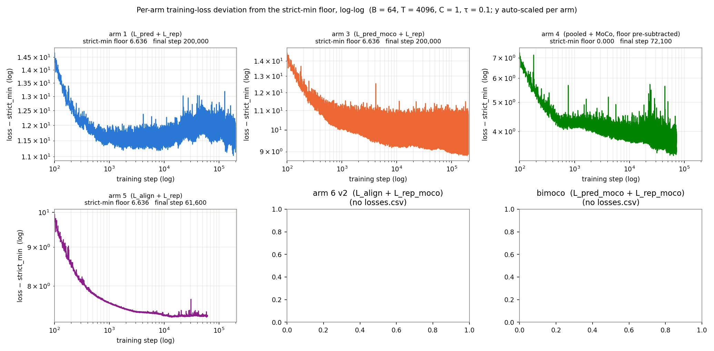

# Small-model long-training sweep — 6 arms × 200k steps (#379)

*v0 — implementation-only. Fills in as backbones finish.*

## Question

Do the training-dynamics observations from #374
([`reports/2026-07-10_split_pred_rep/split_pred_rep.md`](../2026-07-10_split_pred_rep/split_pred_rep.md))
at 12.5k–50k steps on a 17M-parameter backbone hold, amplify, or
reverse when the backbone is ~1–2M parameters and trained ≥4× longer?

Specifically:

1. Does bimoco / arm 6 v2's `1 − cos(f̂, h_{t+1})` continue to climb
   through 200k, or plateau, or reverse?
2. Does arm 5's alignment plateau (`1 − ff ≈ 0.4` at 50k in #374)
   break through at 100k or 200k?

## Design

Six arms, same loss recipes as #374 (see arm table in
[`../../experiments/2026-07-21_split_pred_rep_small/README.md`](../../experiments/2026-07-21_split_pred_rep_small/README.md)).
**Backbone-only** — no downstream q-head training, no GIFT-Eval.
Only backbone architecture and training length change:

- Backbone: `d_model=64, n_heads=8, num_encoder_layers=3, num_layers=3`
  — ~1–2M parameters, encoder-to-body ratio 1:1 (vs 1:2 in #374).
- Training: `batch_size=64, total_steps=200,000` — 12.8M samples over
  200k steps, no revisit against `gift-pretrain-full-4096`'s 42.7M rows.
- Checkpoints: `save_every=25000` + one early snapshot at step 2500
  (`_2k.pth`), giving 9 backbone-step cells per arm at
  `{2, 25, 50, 75, 100, 125, 150, 175, 200}k`.

## Results

*Filled in as arms complete.*

### Headline: `1 − ff` per arm across training steps

`1 − ff = 1 − ⟨cos(f̂, h_{t+1})⟩` on the unit sphere — a form of log
perplexity of the forecast under the future's von-Mises-Fisher. Lower
is better; 0 = perfect alignment. All six arms on one axes, x-axis on
log (temporal) scale, y-axis linear.

Regenerate: `python3 plots/_make_cos_error.py` → `plots/cos_error_per_arm.png`.

*Interpretation goes here once curves are populated.*

### Supporting: dim usage per arm (`u_batchtime` for `h_t` and `e_t`)

Regenerate: `python3 plots/_make_dim_usage.py` → `plots/dim_usage_per_arm.png`.

### Supporting: per-run training-loss curves

Regenerate: `python3 plots/_make_per_run_loss.py` → `plots/per_run_loss.png`.
Uses `B=64, T=4096, C=1, τ=0.10` for the strict-min floor.

## Answers to the two questions

*Filled in once all six backbones reach step 200,000.*

1. bimoco / arm 6 v2 `1 − cos(f̂, h_{t+1})` at 200k — *TBD*.
2. arm 5 `1 − ff` at 100k, 200k vs #374's 50k plateau of ≈ 0.4 — *TBD*.
