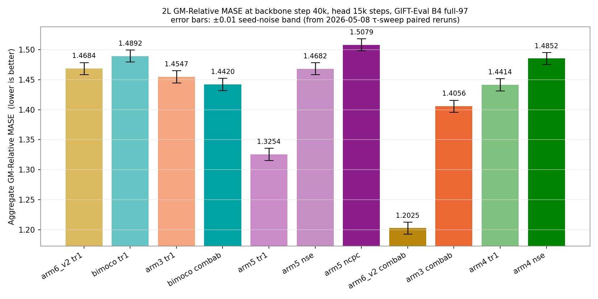
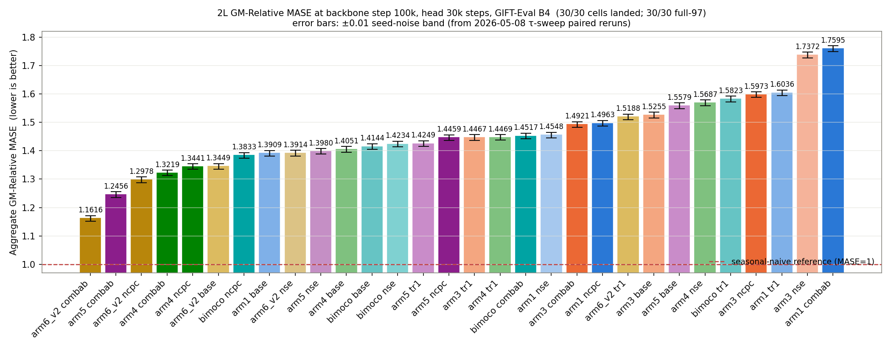
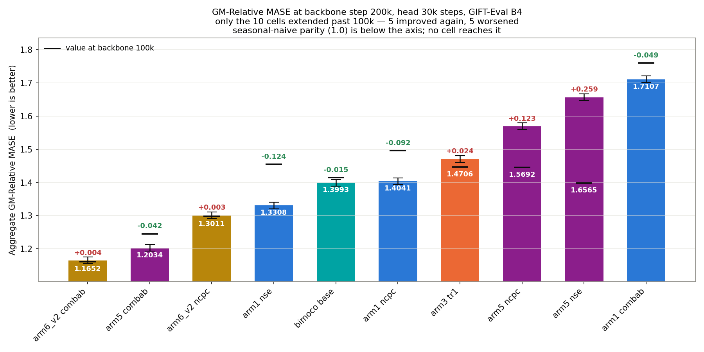
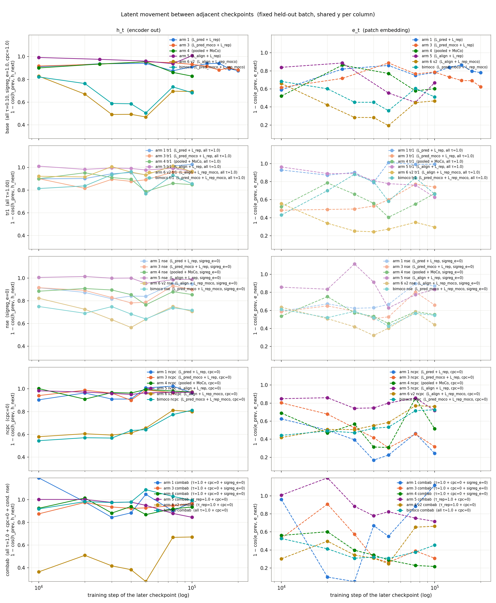
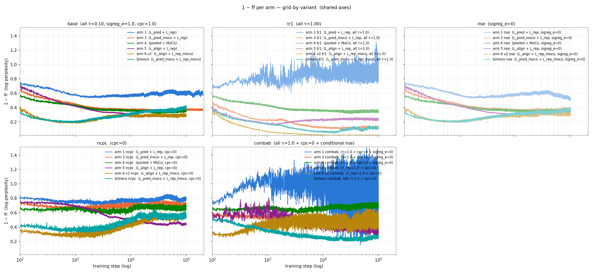
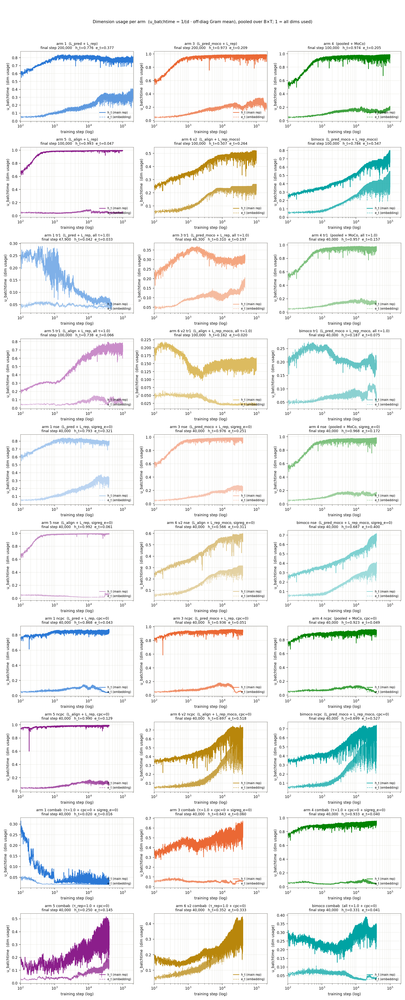
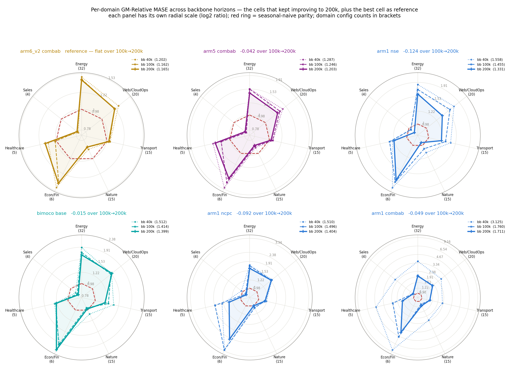

# No cell beats seasonal-naive at any backbone horizon; `arm6_v2 combab` is the lowest at all three

30 cells (6 loss recipes × 5 settings) evaluated at backbone step 40k with a 15k-step quantile head and at step 100k with a 30k-step head. The 10 cells that improved from 40k to 100k were then extended to step 200k and evaluated again with the same 30k-step head. All 70 evaluations cover the full 97 GIFT-Eval B4 configs. Every value is above 1.0, i.e. worse than seasonal-naive on the geometric average.

Going from 40k to 100k, 10 of 30 cells improve. Of those 10 taken on to 200k, 5 improve again and 5 worsen. The sign of the change differs between cells inside every one of the six recipes, at both steps.

Definitions of each recipe and each setting are in [Architectures](#architectures); all numbers are in [Results](#results).

## Figures

### 1. GM-Relative MASE across backbone horizons — all 30 cells

Every cell on one chart. Colour is the loss recipe, line style is the setting, and both are decoded in the legends. Labels carry the cell's last value and its change from the previous horizon; `←200k` marks the cells extended to 200k.

### 2. The same data, one panel per loss recipe

Each panel colours its own five settings and greys the other 25 cells, so a recipe can be read without tracing one line across the other 29.

### 3. GM-Relative MASE per dataset domain

The headline number is one geometric mean over all 97 configs. These radars apply that same geometric mean inside each of the 7 GIFT-Eval domains, so a cell's strong and weak domains are visible instead of averaged away. Left: the 5 lowest cells, each at its last evaluated backbone step. Right: every cell that improved from 100k to 200k.

### 4. Ranking at backbone 40k

### 5. Ranking at backbone 100k

### 6. Ranking at backbone 200k

Only the 10 cells extended past 100k, so this is a ranking of that subset, not of the full 30-cell field. Each bar carries the cell's 100k value as a black tick, so the extension's effect is readable here too.

### 7. Latent movement between adjacent checkpoints

How far the latents of a fixed held-out batch rotate between one saved checkpoint and the next. Rows = setting, columns = `h_t` / `e_t`. Curves run to each cell's last checkpoint, so the 10 extended cells continue past 10^5 where the other 20 stop.

### 8. Forecast-to-latent distance `1 − ff` during training

### 9. Dimension usage `u_batchtime` during training

## The cells that kept improving to 200k

### 10. Per-domain trajectory of each improving cell

One radar per cell, each with its own radial scale, overlaying the three backbone horizons. A shared scale would flatten the cells whose values move by only a few hundredths. `arm6_v2 combab` is included as the reference the others are chasing, even though it is flat over 100k→200k.

### 11. Latent movement against the improvement

Panels 1 and 2 put `h_t` drift and GM-Relative MASE on the same log-step axis for those same cells. Panel 3 is the test the first two cannot supply: panels 1 and 2 show only cells selected for having improved, so they cannot say whether drift distinguishes improvers from the rest. Panel 3 plots mean late-window drift against the 100k→200k change for all 10 extended cells, the 5 that worsened included.

Across the 10 extended cells, mean `h_t` drift over the 100k→200k checkpoints and the GM-Relative MASE change over the same stretch have Spearman ρ = −0.03. The two cells with the lowest late drift, `bimoco base` (0.587) and `arm6_v2 combab` (0.740), sit on opposite sides of zero change, and the four largest improvements all come from cells whose late drift is above 0.92. On these 10 cells, at this window, latent movement does not separate the cells that improved from the cells that did not.

## Architectures

### Six loss recipes

Inherited verbatim from the split-pred/rep sweep (`reports/2026-07-10_split_pred_rep/`).

| Recipe    | Loss                       |
|-----------|----------------------------|
| `arm1`    | `L_pred + L_rep`           |
| `arm3`    | `L_pred_moco + L_rep`      |
| `arm4`    | `pooled + MoCo`            |
| `arm5`    | `L_align + L_rep`          |
| `arm6_v2` | `L_align + L_rep_moco`     |
| `bimoco`  | `L_pred_moco + L_rep_moco` |

### Five settings applied to each recipe

| Setting  | Change from base                                                            |
|----------|-----------------------------------------------------------------------------|
| `base`   | `τ = 0.10`, `cpc = 1`, `sigreg_e = 1`                                        |
| `tr1`    | all InfoNCE temperatures set to `τ = 1.0`                                     |
| `nse`    | SIGReg on `e_t` disabled (`sigreg_e = 0`)                                     |
| `ncpc`   | CPC auxiliary disabled (`cpc = 0`)                                            |
| `combab` | `τ = 1.0` and `cpc = 0`; additionally `sigreg_e = 0` for `arm1`/`arm3`/`arm4` |

### Metrics

- **GM-Relative MASE** — geometric mean over 97 GIFT-Eval configs of `MASE(model) / MASE(seasonal_naive)`, official GIFT-Eval **B4 strategy** (single-window in-context prediction, backbone context length matching the config's expected horizon), forecast horizon 16 (`experiments/2026-04-13_gift-eval/scripts/eval_gift_eval_official.py`). Lower is better; > 1 = beaten by seasonal-naive on that geometric average.
- **`h_t`, `e_t`** — the encoder-output latent and the patch-embedding latent, shape `[B, T, C, H]`.
- **`ff`** — mean `cos(f̂, h_{t+1})` between the forecaster's next-step prediction `f̂` and the encoder's next-step latent `h_{t+1}`, unit-normalised. `1 − ff` is a distance in [0, 2]; smaller = closer forecast.
- **Latent drift** at checkpoint pair `(step_i, step_j)` — `mean_{b,t,c} 1 − cos(h_t(model_j), h_t(model_i))` on a fixed held-out batch (`torch.manual_seed(20260722)`, `B=8`, ARMA-synthetic), and analogously for `e_t`. Range [0, 2]; low = the mapping the model applies to this fixed input has rotated little between the two checkpoints.
- **`u_batchtime`** — `1/(d · off-diag Gram mean)` over `(B×T)` samples of the given latent, clamped to [0, 1]. 1 = every `H` dimension carries independent information; low = collapsed onto a subspace. This is what SIGReg regularises.
- **InfoNCE** — the contrastive cross-entropy `−log(exp(pos/τ) / Σ_j exp(neg_j/τ))`, temperature `τ`.
- **SIGReg** — the LeJEPA-style spectral regulariser pushing each latent's Gram matrix toward a Gaussian off-diagonal; `--sigreg-embedding-weight` (`sigreg_e`) applies it to `e_t`, `--sigreg-encoding-weight` to `h_t`.
- **CPC** (`--cpc-infonce-weight`) — the CPC-InfoNCE auxiliary of van den Oord et al. 2018, predicting `e_{t+1}` from a bilinear projection of `h_t`.
- **MoCo** — negatives drawn from an EMA teacher (momentum contrast).

## Results

### GM-Relative MASE, all 30 cells

Ranked by the 100k value. A dash in the 200k columns means the cell was not extended: only the 10 cells that improved from 40k to 100k were taken to 200k. Per-cell summaries and the per-config GIFT-Eval rows behind each aggregate: `results/eval_gm_mase/`.

| Rank @100k | Cell | bb 40k (head 15k) | bb 100k (head 30k) | 40k→100k | bb 200k (head 30k) | 100k→200k |
|------|------------------|--------|--------|---------|--------|---------|
| 1  | `arm6_v2 combab`  | 1.2025 | 1.1616 | −0.0409 | 1.1652 | +0.0036 |
| 2  | `arm5 combab`     | 1.2868 | 1.2456 | −0.0412 | 1.2034 | −0.0422 |
| 3  | `arm6_v2 ncpc`    | 1.3623 | 1.2978 | −0.0645 | 1.3011 | +0.0033 |
| 4  | `arm4 combab`     | 1.2748 | 1.3219 | +0.0471 | — | — |
| 5  | `arm4 ncpc`       | 1.2957 | 1.3441 | +0.0484 | — | — |
| 6  | `arm6_v2 base`    | 1.3149 | 1.3449 | +0.0300 | — | — |
| 7  | `bimoco ncpc`     | 1.3739 | 1.3833 | +0.0094 | — | — |
| 8  | `arm1 base`       | 1.3674 | 1.3909 | +0.0235 | — | — |
| 9  | `arm6_v2 nse`     | 1.3791 | 1.3914 | +0.0123 | — | — |
| 10 | `arm5 nse`        | 1.4682 | 1.3980 | −0.0702 | 1.6565 | +0.2585 |
| 11 | `arm4 base`       | 1.3537 | 1.4051 | +0.0514 | — | — |
| 12 | `bimoco base`     | 1.5123 | 1.4144 | −0.0979 | 1.3993 | −0.0151 |
| 13 | `bimoco nse`      | 1.3673 | 1.4234 | +0.0561 | — | — |
| 14 | `arm5 tr1`        | 1.3254 | 1.4249 | +0.0995 | — | — |
| 15 | `arm5 ncpc`       | 1.5079 | 1.4459 | −0.0620 | 1.5692 | +0.1233 |
| 16 | `arm3 tr1`        | 1.4547 | 1.4467 | −0.0080 | 1.4706 | +0.0239 |
| 17 | `arm4 tr1`        | 1.4414 | 1.4469 | +0.0055 | — | — |
| 18 | `bimoco combab`   | 1.4420 | 1.4517 | +0.0097 | — | — |
| 19 | `arm1 nse`        | 1.5579 | 1.4548 | −0.1031 | 1.3308 | −0.1240 |
| 20 | `arm3 combab`     | 1.4056 | 1.4921 | +0.0865 | — | — |
| 21 | `arm1 ncpc`       | 1.5100 | 1.4963 | −0.0137 | 1.4041 | −0.0922 |
| 22 | `arm6_v2 tr1`     | 1.4684 | 1.5188 | +0.0504 | — | — |
| 23 | `arm3 base`       | 1.4545 | 1.5255 | +0.0710 | — | — |
| 24 | `arm5 base`       | 1.5478 | 1.5579 | +0.0101 | — | — |
| 25 | `arm4 nse`        | 1.4852 | 1.5687 | +0.0835 | — | — |
| 26 | `bimoco tr1`      | 1.4892 | 1.5823 | +0.0931 | — | — |
| 27 | `arm3 ncpc`       | 1.4635 | 1.5973 | +0.1338 | — | — |
| 28 | `arm1 tr1`        | 1.3725 | 1.6036 | +0.2311 | — | — |
| 29 | `arm3 nse`        | 1.4432 | 1.7372 | +0.2940 | — | — |
| 30 | `arm1 combab`     | 3.1251 | 1.7595 | −1.3656 | 1.7107 | −0.0488 |

**On the ±0.01 error bars in figures 4, 5 and 6.** Each cell is `N=1`, so this is not a measured seed-replicate interval for this experiment. It is a constant borrowed from the 2026-05-08 τ-sweep paired reruns via the [LeJEPA-SIGReg-τ report annex F](../2026-06-21_lejepa_sigreg_tau098/lejepa_sigreg_tau098.md#f-seed-noise-band), shown as a visual reference for "differences smaller than this have previously turned out to be within-seed noise", not as a confidence interval for this ranking.

### GM-Relative MASE per domain, the cells evaluated at backbone 200k

Same geometric mean as the headline number, restricted to each domain. Values below 1.0 beat seasonal-naive on that domain. The reference is `results/seasonal_naive_all_results.csv`; the per-config rows are in `results/eval_gm_mase/<cell>/all_results.csv`.

| Cell (bb 200k) | Energy (32) | Web/CloudOps (20) | Transport (15) | Nature (15) | Econ/Fin (6) | Healthcare (5) | Sales (4) | all 97 |
|---|---|---|---|---|---|---|---|---|
| `arm6_v2 combab` | 1.420 | 1.216 | 1.023 | **0.857** | 1.387 | 1.144 | **0.785** | 1.1652 |
| `arm5 combab` | 1.437 | 1.291 | 1.030 | **0.864** | 1.578 | 1.278 | **0.787** | 1.2034 |
| `arm6_v2 ncpc` | 1.586 | 1.368 | 1.165 | **0.915** | 1.706 | 1.224 | **0.844** | 1.3011 |
| `arm1 nse` | 1.594 | 1.368 | 1.226 | **0.954** | 1.823 | 1.225 | **0.898** | 1.3308 |
| `bimoco base` | 1.668 | 1.554 | 1.195 | **0.978** | 2.192 | 1.234 | **0.840** | 1.3993 |
| `arm1 ncpc` | 1.617 | 1.559 | 1.173 | **0.998** | 2.442 | 1.329 | **0.886** | 1.4041 |
| `arm1 combab` | 1.985 | 1.799 | 1.379 | 1.208 | 3.934 | 1.572 | 1.068 | 1.7107 |
| *cells below 1.0, of 10* | 0/10 | 0/10 | 0/10 | 7/10 | 0/10 | 0/10 | 9/10 | 0/10 |

All 10 extended cells are above 1.0 on Energy, Web/CloudOps, Transport, Econ/Fin and Healthcare. On Nature 7 of 10 are below 1.0 and on Sales 9 of 10 are. Energy carries 32 of the 97 configs and Sales 4, so the domains where these cells beat seasonal-naive are the ones with least weight in the headline geometric mean.

### Latent drift, setting vs base

Paired Wilcoxon signed-rank on end-of-40k mean drift, N=6 recipe pairs, one-sided base > setting, `scipy.stats.wilcoxon(..., zero_method='wilcox')`. Underlying values: `results/wave_d_metrics.csv`.

| Setting | `h_t` drift lower vs base / 6 | `h_t` p | `e_t` drift lower vs base / 6 | `e_t` p |
|---------|-------------------------------|---------|-------------------------------|---------|
| `ncpc`  | 3/6 (arm 5 / 6_v2 / bimoco)   | 0.281   | 5/6 (all except arm 6_v2)     | 0.047   |
| `nse`   | 3/6 (arm 1 / 3 / 4)           | 0.344   | 3/6                           | 0.281   |
| `tr1`   | 1/6                           | 0.922   | 3/6                           | 0.656   |

## Setup

Backbone: `d_model=64, n_heads=8, num_encoder_layers=3, num_layers=3, batch_size=64, seed=20260520`, dataset `jeremycochoy/gift-pretrain-full-4096 / small_v1`. The 200k backbones continue the same run from its 100k checkpoint with the saved optimizer state, same seed and same flags.

Quantile head, trained on the frozen backbone:

| Param                | bb 40k        | bb 100k       | bb 200k       |
|----------------------|---------------|---------------|---------------|
| `--head-arch`        | `transformer` | `transformer` | `transformer` |
| `--head-num-layers`  | 2             | 2             | 2             |
| `--head-nhead`       | 8             | 8             | 8             |
| `--head-ffn-mult`    | 4.0           | 4.0           | 4.0           |
| `--head-causal`      | true          | true          | true          |
| `--head-train-input` | `e_then_f`    | `e_then_f`    | `e_then_f`    |
| `--forecast-len`     | 16            | 16            | 16            |
| `--batch-size`       | 256           | 256           | 256           |
| `--lr`               | 1e-3          | 1e-3          | 1e-3          |
| `--total-steps`      | 15,000        | 30,000        | 30,000        |
