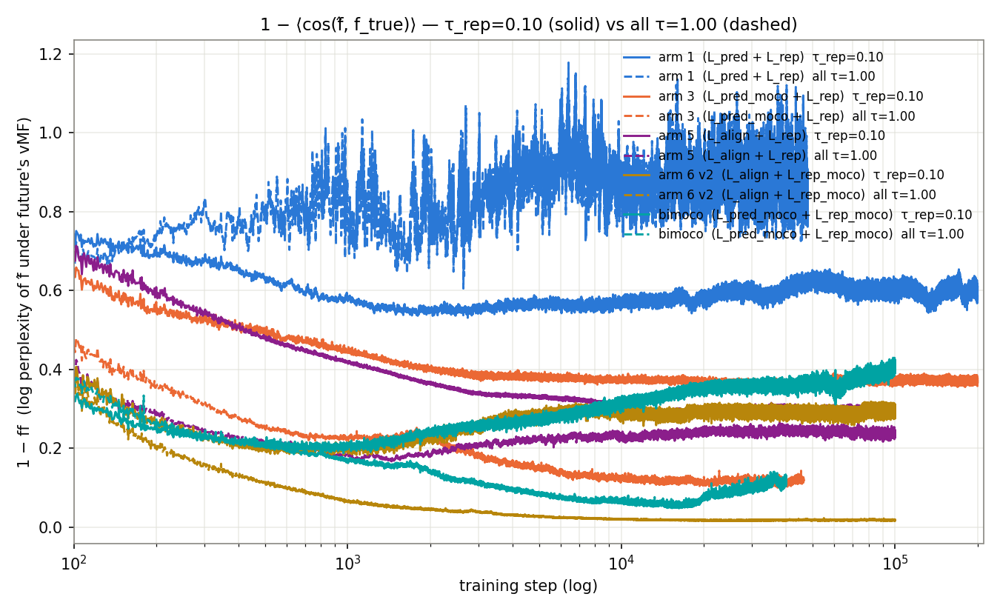

# Small-model long-training sweep — 11 arms × 200k steps (#379)

*v0 — implementation-only. Fills in as backbones finish.*

## Question

Do the training-dynamics observations from #374
([`reports/2026-07-10_split_pred_rep/split_pred_rep.md`](../2026-07-10_split_pred_rep/split_pred_rep.md))
at 12.5k–50k steps on a 17M-parameter backbone hold, amplify, or
reverse when the backbone is ~1–2M parameters and trained ≥4× longer?

Specifically:

1. Does bimoco / arm 6 v2's `1 − cos(f̂, h_{t+1})` continue to climb
   through 200k, or plateau, or reverse?
2. Does arm 5's alignment plateau (`1 − ff ≈ 0.4` at 50k in #374)
   break through at 100k or 200k?
3. For each of the 5 L_rep arms (arm 1/3/5/6_v2 + bimoco), does raising
   `τ_rep` from 0.10 to 1.0 change the `1 − ff` trajectory shape, the
   `u_batchtime(h_t)` collapse, or the alignment plateau?

## Design

Six base arms plus five `tau_rep=1.0` reruns of every L_rep-bearing arm
(all but arm 4 — its pooled shape has no separate L_rep term). Loss
recipes as in #374 (see arm table in
[`../../experiments/2026-07-21_split_pred_rep_small/README.md`](../../experiments/2026-07-21_split_pred_rep_small/README.md)).
**Backbone-only** — no downstream q-head training, no GIFT-Eval.
Only backbone architecture and training length change:

- Backbone: `d_model=64, n_heads=8, num_encoder_layers=3, num_layers=3`
  — ~1–2M parameters, encoder-to-body ratio 1:1 (vs 1:2 in #374).
- Training: `batch_size=64, total_steps=200,000` — 12.8M samples over
  200k steps, no revisit against `gift-pretrain-full-4096`'s 42.7M rows.
- Checkpoints: `save_every=25000` + one early snapshot at step 2500
  (`_2k.pth`), giving 9 backbone-step cells per arm at
  `{2, 25, 50, 75, 100, 125, 150, 175, 200}k`.

## Results

*Filled in as arms complete.*

### Headline: `1 − ff` per arm across training steps

`1 − ff = 1 − ⟨cos(f̂, h_{t+1})⟩` on the unit sphere — a form of log
perplexity of the forecast under the future's von-Mises-Fisher. Lower
is better; 0 = perfect alignment. All six arms on one axes, x-axis on
log (temporal) scale, y-axis linear.

Regenerate: `python3 plots/_make_cos_error.py` → `plots/cos_error_per_arm.png`.

*Interpretation goes here once curves are populated.*

### Supporting: dim usage per arm (`u_batchtime` for `h_t` and `e_t`)

Regenerate: `python3 plots/_make_dim_usage.py` → `plots/dim_usage_per_arm.png`.

### Supporting: per-run training-loss curves

Regenerate: `python3 plots/_make_per_run_loss.py` → `plots/per_run_loss.png`.
Uses `B=64, T=4096, C=1, τ=0.10` for the strict-min floor.

### Supporting: latent movement per arm

Per adjacent checkpoint pair `(step_i, step_j)` under one fixed
held-out batch (`torch.manual_seed(20260722)`, `B=64, T=4096, C=1`):

    movement_h = mean over (b, t, c) of  1 − cos(h_t(model_j), h_t(model_i))
    movement_e = mean over (b, t, c) of  1 − cos(e_t(model_j), e_t(model_i))

`h_t` is the encoder-output latent; `e_t` is the patch-embedding
latent. Two panels — solid `h_t` on top, dashed `e_t` below —
share the same log x-axis (training step of the LATER checkpoint) and
per-arm colours from the headline plot. Nine periodic snapshots per
arm at `{2, 25, 50, 75, 100, 125, 150, 175, 200}k` give 8 adjacent
pairs → 8 datapoints per curve.

Regenerate: `python3 plots/_make_latent_movement.py` →
`plots/latent_movement_per_arm.png`.

### `τ_rep=1.0` vs `τ_rep=0.10` overlay

Same `1 − ff` axis, one line per (base, rerun) pair — base τ_rep=0.10
solid, rerun τ_rep=1.00 dashed, shared colour per arm. Applies to the
five L_rep-bearing arms (arm 1/3/5/6_v2 + bimoco); arm 4 has no
separate L_rep term and is not rerun. Same figure is written by
`_make_cos_error.py` alongside the 6-arm headline plot.

Regenerate: `python3 plots/_make_cos_error.py` →
`plots/cos_error_tau_rep_overlay.png`.

*Interpretation goes here once curves are populated — does raising τ_rep
flatten the h_t collapse in bimoco / arm 6 v2? Does it change arm 5's
alignment plateau step? Does it move arm 1 / arm 3's `1 − ff` shape
at all, or is L_rep at τ=0.10 already effectively negligible relative to
L_pred?*

## Answers to the three questions

*Filled in once all eleven backbones reach step 200,000.*

1. bimoco / arm 6 v2 `1 − cos(f̂, h_{t+1})` at 200k — *TBD*.
2. arm 5 `1 − ff` at 100k, 200k vs #374's 50k plateau of ≈ 0.4 — *TBD*.
3. τ_rep=0.10 vs τ_rep=1.0 for each of arm 1/3/5/6_v2/bimoco — *TBD*.
