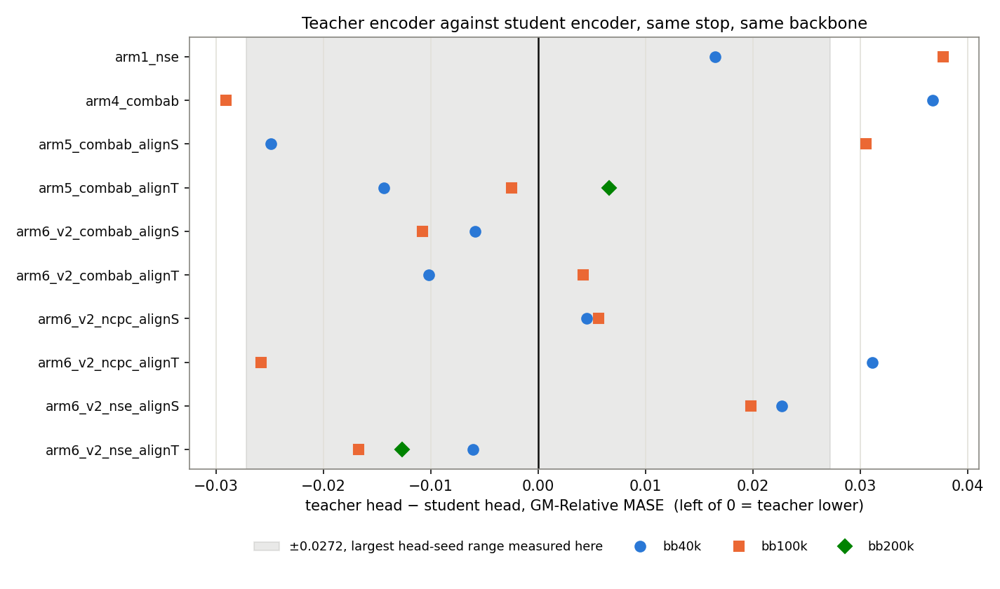
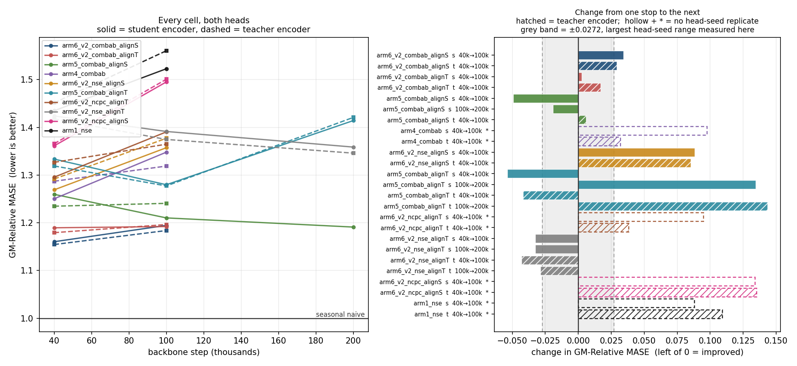
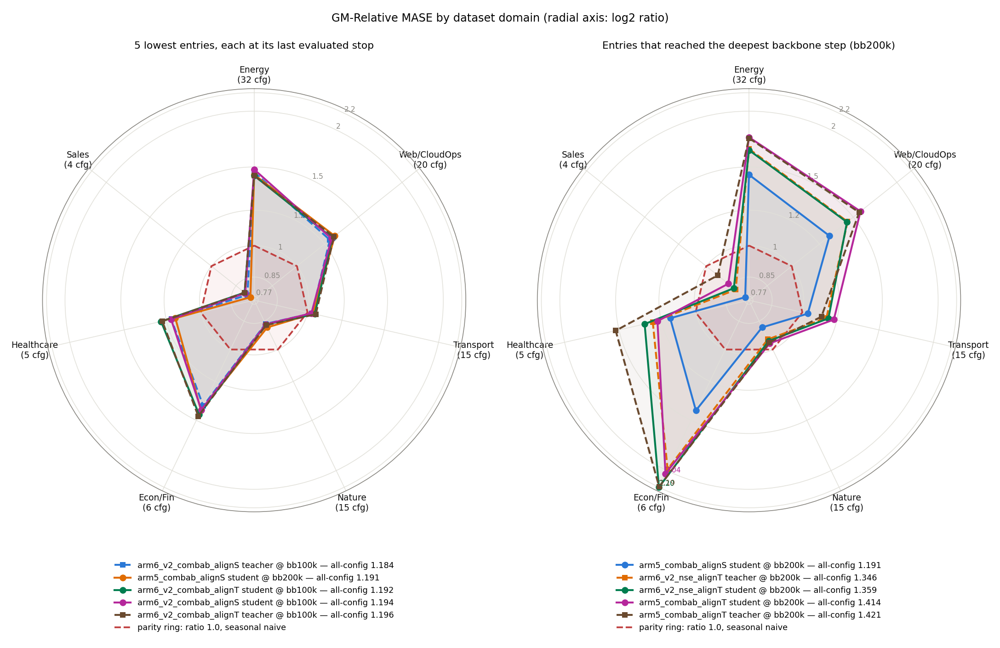
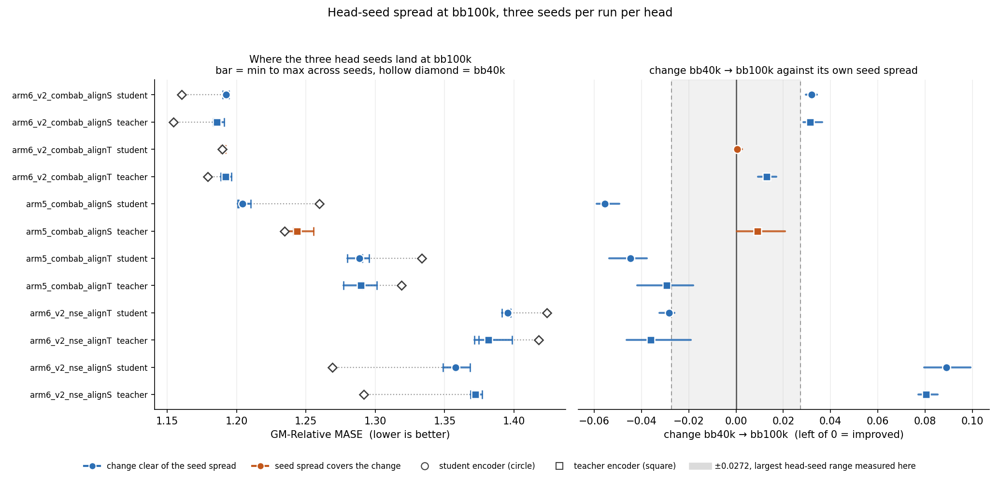
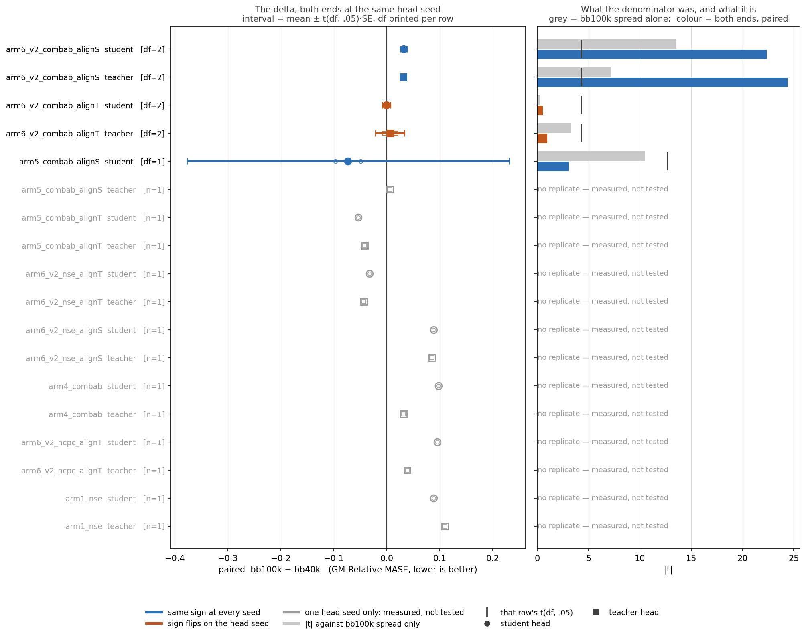
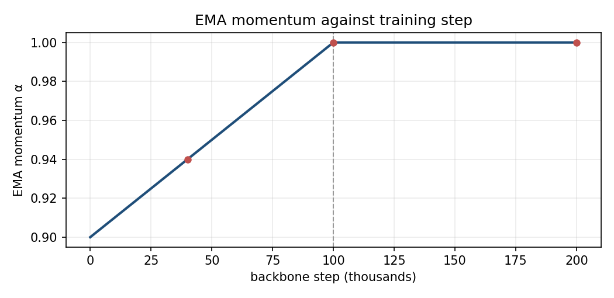

# Scheduling the EMA momentum to 1.0 by step 100k: the teacher encoder does not beat the student

Raising the EMA momentum to 1.0 by backbone step 100k does not make the teacher encoder better than the student: over 45 scored stops the two heads differ by at most 0.0377 GM-Relative MASE, the geometric mean over 97 GIFT-Eval configs of MASE against seasonal naive, where above 1.0 is worse than seasonal naive. Ten runs, each evaluated at every backbone stop through one head trained and evaluated on the student encoder and one head trained and evaluated on the teacher encoder.

## Teacher against student

Of the 22 paired differences, 17 fall inside the ±0.0272 head-seed band and 5 fall outside, and the teacher head is the lower one in 11 of them.

## The ladder

The extend rule reads each head against its own previous stop and ends the run when neither head went down: three runs reached bb200k and seven ended at bb100k.

Every 40k→100k change moves the head budget from 15,000 to 30,000 steps as well as the backbone, and `arm4_combab`, `arm1_nse`, `arm6_v2_ncpc_alignS` and `arm6_v2_ncpc_alignT` carry no head-seed replicate, so their changes are measured, not tested.

## Per-domain split

An entry is one run plus one head; every entry drawn is better than seasonal naive on Sales and Nature, and worse than it on the other five domains.

## Uncertainty

Two of the twelve replicated changes are inside their own seed spread.

With both ends held at the same head seed, the student head of `arm6_v2_combab_alignT` changes sign at two of its three seeds, so the head seed alone moves where that run stopped.

## The EMA schedule

α reaches 1.0 at step 100k in every run, and the teacher stops moving from there.

## Tables

### GM-Relative MASE per run, per stop, per head

Source: `results/ladder_all.csv`.

| Run | align | bb40k student | bb40k teacher | bb100k student | bb100k teacher | bb200k student | bb200k teacher |
|---|---|---|---|---|---|---|---|
| `arm6_v2 combab` | student | 1.1603 | **1.1544** | 1.1945 | 1.1837 | — | — |
| `arm6_v2 combab` | teacher | 1.1895 | **1.1793** | 1.1921 | 1.1963 | — | — |
| `arm5 combab` | student | 1.2596 | 1.2347 | 1.2102 | 1.2407 | **1.1910** | — |
| `arm5 combab` | teacher | 1.3334 | 1.3190 | 1.2797 | **1.2772** | 1.4141 | 1.4207 |
| `arm4 combab` | n/a | **1.2503** | 1.2870 | 1.3479 | 1.3188 | — | — |
| `arm6_v2 ncpc` | student | **1.3611** | 1.3656 | 1.4951 | 1.5007 | — | — |
| `arm6_v2 ncpc` | teacher | **1.2955** | 1.3266 | 1.3904 | 1.3646 | — | — |
| `arm6_v2 nse` | student | **1.2690** | 1.2917 | 1.3572 | 1.3770 | — | — |
| `arm6_v2 nse` | teacher | 1.4238 | 1.4177 | 1.3913 | 1.3746 | 1.3586 | **1.3459** |
| `arm1 nse` | n/a | **1.4347** | 1.4512 | 1.5227 | 1.5604 | — | — |

Bold = the row's lowest value. `arm5 combab / student` has no bb200k teacher value: the extend rule dropped its teacher head from the evaluation at bb100k.

### The union table, extended

Parent columns from `results/union_parents.csv`: `prev` is the 30-cell sweep with `L_align` on the student, `new` is the retrain against the EMA teacher, each publishing one head. `top5` is that report's own five-lowest placement, which is a placement and not a score. `this study` columns are `student / teacher`, from `results/ladder_all.csv`.

| Run | align | parent | parent bb40k | parent bb100k | parent bb200k | top5 | this bb40k S / T | this bb100k S / T | this bb200k S / T | this best |
|---|---|---|---|---|---|---|---|---|---|---|
| `arm6_v2 combab` | student | prev | 1.2025 | 1.1616 | 1.1652 | prev | 1.1603 / 1.1544 | 1.1945 / 1.1837 | — | **1.1544** @40k T |
| `arm6_v2 combab` | teacher | new | 1.2765 | 1.2514 | 1.1850 | new | 1.1895 / 1.1793 | 1.1921 / 1.1963 | — | 1.1793 @40k T |
| `arm5 combab` | student | prev | 1.2868 | 1.2456 | 1.2034 | prev | 1.2596 / 1.2347 | 1.2102 / 1.2407 | 1.1910 / — | 1.1910 @200k S |
| `arm5 combab` | teacher | new | 1.2728 | 1.3678 | — | — | 1.3334 / 1.3190 | 1.2797 / 1.2772 | 1.4141 / 1.4207 | 1.2772 @100k T |
| `arm4 combab` | n/a | prev + new | 1.2748 | 1.3219 | — | both | 1.2503 / 1.2870 | 1.3479 / 1.3188 | — | 1.2503 @40k S |
| `arm6_v2 ncpc` | student | prev | 1.3623 | 1.2978 | 1.3011 | prev | 1.3611 / 1.3656 | 1.4951 / 1.5007 | — | 1.3611 @40k S |
| `arm6_v2 ncpc` | teacher | new | 1.3159 | 1.3012 | 1.3325 | new | 1.2955 / 1.3266 | 1.3904 / 1.3646 | — | 1.2955 @40k S |
| `arm6_v2 nse` | teacher | new | 1.3074 | 1.3368 | — | new | 1.4238 / 1.4177 | 1.3913 / 1.3746 | 1.3586 / 1.3459 | 1.3459 @200k T |
| `arm1 nse` | n/a | prev + new | 1.5579 | 1.4548 | 1.3308 | both | 1.4347 / 1.4512 | 1.5227 / 1.5604 | — | 1.4347 @40k S |
| `arm6_v2 nse` | student | prev | 1.3791 | 1.3914 | — | — | 1.2690 / 1.2917 | 1.3572 / 1.3770 | — | 1.2690 @40k S |

A `—` under `top5` means the row never placed in its parent report's five lowest. A `—` in a per-stop column means that stop was never evaluated.

### The raw change the extend rule read

Source: `results/per_stop_changes.csv`. Each row is the change one head made from the previous stop, which is the only quantity the rule compares. Negative is down. Bold marks a change smaller than 0.0272, the largest head-seed range measured here.

| Run | head | transition | from | to | change | rule read | branch |
|---|---|---|---|---|---|---|---|
| `arm1_nse` | student | 40k→100k | 1.4347 | 1.5227 | +0.0880 | not down | `none_down` |
| `arm1_nse` | teacher | 40k→100k | 1.4512 | 1.5604 | +0.1092 | not down | `none_down` |
| `arm4_combab` | student | 40k→100k | 1.2503 | 1.3479 | +0.0976 | not down | `none_down` |
| `arm4_combab` | teacher | 40k→100k | 1.2870 | 1.3188 | +0.0318 | not down | `none_down` |
| `arm5_combab_alignS` | student | 40k→100k | 1.2596 | 1.2102 | -0.0494 | down | `one_down` |
| `arm5_combab_alignS` | teacher | 40k→100k | 1.2347 | 1.2407 | **+0.0060** | not down | `one_down` |
| `arm5_combab_alignS` | student | 100k→200k | 1.2102 | 1.1910 | **-0.0192** | down | `one_down` |
| `arm5_combab_alignT` | student | 40k→100k | 1.3334 | 1.2797 | -0.0537 | down | `both_down` |
| `arm5_combab_alignT` | teacher | 40k→100k | 1.3190 | 1.2772 | -0.0418 | down | `both_down` |
| `arm5_combab_alignT` | student | 100k→200k | 1.2797 | 1.4141 | +0.1344 | not down | `none_down` |
| `arm5_combab_alignT` | teacher | 100k→200k | 1.2772 | 1.4207 | +0.1435 | not down | `none_down` |
| `arm6_v2_combab_alignS` | student | 40k→100k | 1.1603 | 1.1945 | +0.0342 | not down | `none_down` |
| `arm6_v2_combab_alignS` | teacher | 40k→100k | 1.1544 | 1.1837 | +0.0293 | not down | `none_down` |
| `arm6_v2_combab_alignT` | student | 40k→100k | 1.1895 | 1.1921 | **+0.0026** | not down | `none_down` |
| `arm6_v2_combab_alignT` | teacher | 40k→100k | 1.1793 | 1.1963 | **+0.0170** | not down | `none_down` |
| `arm6_v2_ncpc_alignS` | student | 40k→100k | 1.3611 | 1.4951 | +0.1340 | not down | `none_down` |
| `arm6_v2_ncpc_alignS` | teacher | 40k→100k | 1.3656 | 1.5007 | +0.1351 | not down | `none_down` |
| `arm6_v2_ncpc_alignT` | student | 40k→100k | 1.2955 | 1.3904 | +0.0949 | not down | `none_down` |
| `arm6_v2_ncpc_alignT` | teacher | 40k→100k | 1.3266 | 1.3646 | +0.0380 | not down | `none_down` |
| `arm6_v2_nse_alignS` | student | 40k→100k | 1.2690 | 1.3572 | +0.0882 | not down | `none_down` |
| `arm6_v2_nse_alignS` | teacher | 40k→100k | 1.2917 | 1.3770 | +0.0853 | not down | `none_down` |
| `arm6_v2_nse_alignT` | student | 40k→100k | 1.4238 | 1.3913 | -0.0325 | down | `both_down` |
| `arm6_v2_nse_alignT` | teacher | 40k→100k | 1.4177 | 1.3746 | -0.0431 | down | `both_down` |
| `arm6_v2_nse_alignT` | student | 100k→200k | 1.3913 | 1.3586 | -0.0327 | down | `both_down` |
| `arm6_v2_nse_alignT` | teacher | 100k→200k | 1.3746 | 1.3459 | -0.0287 | down | `both_down` |

Four of 25 changes are inside that band. Two stops rest entirely on them: `arm6_v2_combab_alignT` at 100k, whose `none_down` ended the run on +0.0026 and +0.0170, and `arm5_combab_alignS` at 200k, whose `one_down` rests on -0.0192.

### How each run ended

Source: `results/stop_reason.csv`.

| Run | last stop | branch that fired | extended | heads kept | ended by |
|---|---|---|---|---|---|
| `arm6_v2_combab_alignS` | 100k | `none_down` | no | student, teacher | extend rule |
| `arm6_v2_combab_alignT` | 100k | `none_down` | no | student, teacher | extend rule |
| `arm6_v2_ncpc_alignS` | 100k | `none_down` | no | student, teacher | extend rule |
| `arm6_v2_ncpc_alignT` | 100k | `none_down` | no | student, teacher | extend rule |
| `arm6_v2_nse_alignS` | 100k | `none_down` | no | student, teacher | extend rule |
| `arm4_combab` | 100k | `none_down` | no | student, teacher | extend rule |
| `arm1_nse` | 100k | `none_down` | no | student, teacher | extend rule |
| `arm5_combab_alignT` | 200k | `none_down` | no | student, teacher | extend rule |
| `arm5_combab_alignS` | 200k | `one_down` | yes | student | ladder ceiling |
| `arm6_v2_nse_alignT` | 200k | `both_down` | yes | student, teacher | ladder ceiling |

No run was stopped by the compute budget. The two rows marked *ladder ceiling* were still improving at bb200k; the study stopped there, not the rule.

### Head-seed replicates at bb100k

Source: `results/seed_spread.csv`. Head seeds 20260722, 20260723 and 20260724, for six of the ten runs. The card specifies one head seed; these replicates go beyond that spec and are reported here, not in the body.

| Run | head | mean | sd | range | bb40k-to-bb100k change clears the spread |
|---|---|---|---|---|---|
| `arm6_v2_combab_alignS` | student | 1.1923 | 0.0024 | 0.0047 | yes |
| `arm6_v2_combab_alignS` | teacher | 1.1858 | 0.0044 | 0.0080 | yes |
| `arm6_v2_combab_alignT` | student | 1.1900 | 0.0019 | 0.0036 | **no** |
| `arm6_v2_combab_alignT` | teacher | 1.1922 | 0.0039 | 0.0077 | yes |
| `arm5_combab_alignS` | student | 1.2041 | 0.0053 | 0.0095 | yes |
| `arm5_combab_alignS` | teacher | 1.2437 | 0.0106 | 0.0206 | **no** |
| `arm5_combab_alignT` | student | 1.2887 | 0.0082 | 0.0159 | yes |
| `arm5_combab_alignT` | teacher | 1.2896 | 0.0119 | 0.0238 | yes |
| `arm6_v2_nse_alignS` | student | 1.3580 | 0.0098 | 0.0195 | yes |
| `arm6_v2_nse_alignS` | teacher | 1.3721 | 0.0043 | 0.0082 | yes |
| `arm6_v2_nse_alignT` | student | 1.3955 | 0.0037 | 0.0064 | yes |
| `arm6_v2_nse_alignT` | teacher | 1.3815 | 0.0149 | 0.0272 | yes |

Two files record whether a branch survives a change of head seed, and they answer different questions. `results/seed_branches.csv` holds the bb40k end fixed at the ladder seed 20260722 and varies only bb100k; `results/paired_branches.csv` moves both ends to the same seed. The report uses the paired file. Both mark `arm6_v2_combab_alignT` as the one run whose branch flips, and only its destination differs: `one_down` under the unpaired comparison, `both_down` at seed 20260723 and `one_down` at seed 20260724 under the paired one. The other five replicated runs keep their recorded branch in both files.

## Protocol

- Backbone `d_model=64, n_heads=8, num_encoder_layers=3, num_layers=3, batch_size=64, seed=20260520`; dataset `gift-pretrain-full-4096 / small_v1`.
- EMA momentum α rises linearly from 0.9 at step 0 to 1.0 at step 100k, anchored to the fixed step 100k in every run, and held at 1.0 after (`results/alpha_schedule.csv`).
- Loss recipes, relative to the base recipe `τ = 0.10, cpc = 1, sigreg_e = 1`: `nse` disables SIGReg on `e_t`; `ncpc` disables the CPC auxiliary; `combab` sets `τ = 1.0` and `cpc = 0`, and additionally `sigreg_e = 0` on `arm1` / `arm3` / `arm4`.
- Each run starts fresh at step 0 and trains as one continuous run, checkpointed at each stop and resumed with its optimizer state.
- Step cap: `results/dataset_rows.json` records `total_rows = 42,571,692` and `hf_rows_per_step = 64`, so one pass over the dataset is `step_cap = 665,182` steps. That is far above the deepest run's 200k, so no run was limited by the data.
- Stops: 40k and 100k unconditionally, then +100k per extension. Extend rule, per head against its own previous stop: both heads down → extend and keep both; one head down → extend and keep that head; neither down → stop.
- Two heads per checkpoint, trained separately, each evaluated on its own encoder: student head on the student encoder, teacher head on the teacher encoder. Head budget 15,000 steps at bb40k, 30,000 steps from bb100k.
- 97 GIFT-Eval configs, official B4 strategy, forecast horizon 16. The seasonal-naive denominator file is byte-identical on every machine (`results/denominator_checksums.txt`), so every score is on one scale.
- Head seed 20260722 for the ladder. Six runs carry two extra head seeds at bb100k; `arm4_combab`, `arm1_nse`, `arm6_v2_ncpc_alignS` and `arm6_v2_ncpc_alignT` carry one seed only, so no significance claim is made on their changes.
- The head keeps `--grad-clip 1.0`. The project rule bans grad clipping; the previous study kept it, and it is kept here for comparability with those numbers.

## Annex

Artefacts: `experiments/2026-08-04_ema_sched_ladder/`. In the CSV files the column named `cell` is the run.

| File | Contents |
|---|---|
| `results/ladder_all.csv` | 45 scored stops, every machine pooled |
| `results/ladder.csv` | the same table before pooling |
| `results/per_machine/` | per-machine decision tables the pooled table is built from |
| `results/per_stop_changes.csv` | the change each head made per stop, and the branch it produced |
| `results/stop_reason.csv` | last stop, branch and cause per run |
| `results/decisions.csv`, `results/decisions_all.csv` | the extend-rule decision recorded at each stop |
| `results/union_parents.csv` | the two parent reports' per-stop values and five-lowest placements |
| `results/domain_scores.csv` | per-domain GM-Relative MASE behind both radar panels |
| `results/seed_spread.csv` | three head seeds per run per head at bb100k |
| `results/seed_spread_rows.csv` | the individual replicate scores behind that table |
| `results/seed_branches.csv` | branch survival with the bb40k end fixed at seed 20260722 |
| `results/paired_delta.csv` | bb40k-to-bb100k change with both ends at the same head seed |
| `results/paired_rows.csv` | the individual replicate scores behind that table |
| `results/paired_branches.csv` | branch survival with both ends seed-matched |
| `results/parent_seed_spread.csv` | the parent study's eight head-seed ranges, spanning 0.0018 to 0.0908 |
| `results/alpha_schedule.csv` | α per 1,000 steps |
| `results/dataset_rows.json` | row count, batch composition and derived step cap |
| `results/config_costs.csv` | evaluation wall-clock per GIFT-Eval config |
| `results/denominator_checksums.txt` | seasonal-naive denominator hash per machine |
| `results/eval/<run>/eval/bb<stop>_<head>/gift/all_results.csv` | per-config MASE behind every score |

Pairing all twelve replicated rows at both extra seeds needs 24 bb40k replicate evaluations; 9 were run (`results/paired_rows.csv`). `results/paired_delta.csv` carries three seeds for four rows, two for one row and one for the other thirteen; rows below three seeds are measured, not tested.

Plot sources: `plots/_make_domain_radar.py`, `plots/_make_teacher_vs_student.py`, and `scripts/plot_ladder.py`, `scripts/plot_seed_spread.py`, `scripts/plot_paired_delta.py`, `scripts/alpha_schedule.py`, `scripts/union_parents.py`.
