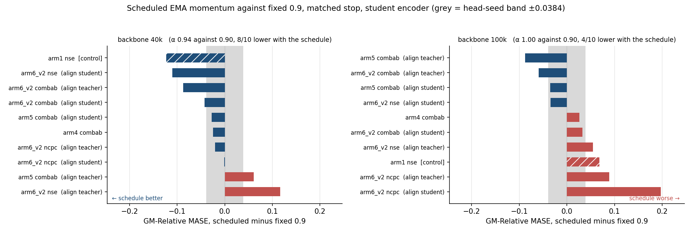

# Raising the EMA momentum to 1.0 by step 100k does not lower GM-Relative MASE

Ten loss recipes were retrained with the EMA momentum α raised linearly from 0.9 to 1.0 by backbone step 100k, and compared at matched stops against the same ten recipes trained with α held at 0.9. The scheduled teacher wins 8 of 10 cells at backbone 40k and 4 of 10 at backbone 100k, and the control that never reads the teacher moves further than either.

The metric is GM-Relative MASE, the geometric mean over 97 GIFT-Eval configs of MASE against seasonal naive; above 1.0 is worse than seasonal naive. **Scheduled teacher** = the runs of this study. **Fixed teacher** = the runs of the two parent reports, α = 0.9 throughout.

## 1. The schedule against the fixed 0.9 reference

Mean change is −0.0259 at backbone 40k, where α is 0.94, and +0.0251 at backbone 100k, where α has reached 1.0; both sit inside the ±0.0384 head-seed band. `arm1 nse`, whose loss never reads the teacher and which the schedule therefore cannot reach, changes by −0.1232 at backbone 40k, more than every other cell in that panel.

The lowest score of this study, 1.1544, and the lowest of the parent reports, 1.1616, are best-of-N over different numbers of stops, so that pair is biased toward this study and is not read here.

## 2. Second question, same runs: which encoder to evaluate

Over the 22 stops that carry both heads, the student encoder and the teacher encoder differ by at most 0.0377, inside the head-seed band, and the teacher encoder is the lower one in 11 of the 22.

## 3. Per-domain split

An entry is one run plus one head; every entry drawn beats seasonal naive on Sales and Nature and loses to it on the other five domains.

## 4. Uncertainty

Four head-rows carry three head seeds at both ends: both heads of `arm6_v2 combab, L_align on student` move up at every seed, both heads of `arm6_v2 combab, L_align on teacher` change sign on the head seed, and `arm5 combab, L_align on student` student, at two seeds, does not resolve.

The right panel uses the backbone-100k spread alone as the denominator, which puts two of the twelve replicated changes inside the spread.

## 5. The EMA schedule

α reaches 1.0 at step 100k in every run, and the teacher stops moving from there.

## Tables

### Matched-stop comparison: scheduled against fixed 0.9

Source: `results/schedule_vs_fixed.csv`, built from `results/ladder_all.csv` and `results/union_parents.csv`. Rows are matched on cell, on the encoder `L_align` targets, and on the backbone stop. The parent reports publish one head per row, trained on the student encoder, so the scheduled column is this study's student-encoder head. Negative delta = the schedule scores lower. Bold = outside the ±0.0384 head-seed band.

| Cell | `L_align` target | stop | fixed 0.9 | scheduled | delta |
|---|---|---|---|---|---|
| `arm1 nse` | none (control) | 40k | 1.5579 | 1.4347 | **−0.1232** |
| `arm6_v2 nse` | student | 40k | 1.3791 | 1.2690 | **−0.1101** |
| `arm6_v2 combab` | teacher | 40k | 1.2765 | 1.1895 | **−0.0870** |
| `arm6_v2 combab` | student | 40k | 1.2025 | 1.1603 | **−0.0422** |
| `arm5 combab` | student | 40k | 1.2868 | 1.2596 | −0.0272 |
| `arm4 combab` | none | 40k | 1.2748 | 1.2503 | −0.0245 |
| `arm6_v2 ncpc` | teacher | 40k | 1.3159 | 1.2955 | −0.0204 |
| `arm6_v2 ncpc` | student | 40k | 1.3623 | 1.3611 | −0.0012 |
| `arm5 combab` | teacher | 40k | 1.2728 | 1.3334 | **+0.0606** |
| `arm6_v2 nse` | teacher | 40k | 1.3074 | 1.4238 | **+0.1164** |
| `arm5 combab` | teacher | 100k | 1.3678 | 1.2797 | **−0.0881** |
| `arm6_v2 combab` | teacher | 100k | 1.2514 | 1.1921 | **−0.0593** |
| `arm5 combab` | student | 100k | 1.2456 | 1.2102 | −0.0354 |
| `arm6_v2 nse` | student | 100k | 1.3914 | 1.3572 | −0.0342 |
| `arm4 combab` | none | 100k | 1.3219 | 1.3479 | +0.0260 |
| `arm6_v2 combab` | student | 100k | 1.1616 | 1.1945 | +0.0329 |
| `arm6_v2 nse` | teacher | 100k | 1.3368 | 1.3913 | **+0.0545** |
| `arm1 nse` | none (control) | 100k | 1.4548 | 1.5227 | **+0.0679** |
| `arm6_v2 ncpc` | teacher | 100k | 1.3012 | 1.3904 | **+0.0892** |
| `arm6_v2 ncpc` | student | 100k | 1.2978 | 1.4951 | **+0.1973** |
| `arm5 combab` | student | 200k | 1.2034 | 1.1910 | −0.0124 |

Six parent rows reach backbone 200k and three runs of this study do; only `arm5 combab, L_align on student` is matched at that stop, so the 200k line is one pair, not a comparison.

### GM-Relative MASE per run, per stop, per head

Source: `results/ladder_all.csv`.

| Run | `L_align` target | bb40k student | bb40k teacher | bb100k student | bb100k teacher | bb200k student | bb200k teacher |
|---|---|---|---|---|---|---|---|
| `arm6_v2 combab` | student | 1.1603 | **1.1544** | 1.1945 | 1.1837 | — | — |
| `arm6_v2 combab` | teacher | 1.1895 | **1.1793** | 1.1921 | 1.1963 | — | — |
| `arm5 combab` | student | 1.2596 | 1.2347 | 1.2102 | 1.2407 | **1.1910** | — |
| `arm5 combab` | teacher | 1.3334 | 1.3190 | 1.2797 | **1.2772** | 1.4141 | 1.4207 |
| `arm4 combab` | none | **1.2503** | 1.2870 | 1.3479 | 1.3188 | — | — |
| `arm6_v2 ncpc` | student | **1.3611** | 1.3656 | 1.4951 | 1.5007 | — | — |
| `arm6_v2 ncpc` | teacher | **1.2955** | 1.3266 | 1.3904 | 1.3646 | — | — |
| `arm6_v2 nse` | student | **1.2690** | 1.2917 | 1.3572 | 1.3770 | — | — |
| `arm6_v2 nse` | teacher | 1.4238 | 1.4177 | 1.3913 | 1.3746 | 1.3586 | **1.3459** |
| `arm1 nse` | none | **1.4347** | 1.4512 | 1.5227 | 1.5604 | — | — |

The student and teacher columns name the encoder each head was trained and evaluated on. Bold = the row's lowest value. `arm5 combab, L_align on student` has no bb200k teacher value: the extend rule dropped its teacher head at bb100k.

### The raw change the extend rule read

Source: `results/per_stop_changes.csv`. Each row is the change one head made from the previous stop, which is the only quantity the rule compares. Negative is down. Bold marks a change smaller than 0.0384, the pooled head-seed band.

| Run | `L_align` target | head | transition | from | to | change | rule read | branch |
|---|---|---|---|---|---|---|---|---|
| `arm1 nse` | none | student | 40k→100k | 1.4347 | 1.5227 | +0.0880 | not down | `none_down` |
| `arm1 nse` | none | teacher | 40k→100k | 1.4512 | 1.5604 | +0.1092 | not down | `none_down` |
| `arm4 combab` | none | student | 40k→100k | 1.2503 | 1.3479 | +0.0976 | not down | `none_down` |
| `arm4 combab` | none | teacher | 40k→100k | 1.2870 | 1.3188 | **+0.0318** | not down | `none_down` |
| `arm5 combab` | student | student | 40k→100k | 1.2596 | 1.2102 | −0.0494 | down | `one_down` |
| `arm5 combab` | student | teacher | 40k→100k | 1.2347 | 1.2407 | **+0.0060** | not down | `one_down` |
| `arm5 combab` | student | student | 100k→200k | 1.2102 | 1.1910 | **−0.0192** | down | `one_down` |
| `arm5 combab` | teacher | student | 40k→100k | 1.3334 | 1.2797 | −0.0537 | down | `both_down` |
| `arm5 combab` | teacher | teacher | 40k→100k | 1.3190 | 1.2772 | −0.0418 | down | `both_down` |
| `arm5 combab` | teacher | student | 100k→200k | 1.2797 | 1.4141 | +0.1344 | not down | `none_down` |
| `arm5 combab` | teacher | teacher | 100k→200k | 1.2772 | 1.4207 | +0.1435 | not down | `none_down` |
| `arm6_v2 combab` | student | student | 40k→100k | 1.1603 | 1.1945 | **+0.0342** | not down | `none_down` |
| `arm6_v2 combab` | student | teacher | 40k→100k | 1.1544 | 1.1837 | **+0.0293** | not down | `none_down` |
| `arm6_v2 combab` | teacher | student | 40k→100k | 1.1895 | 1.1921 | **+0.0026** | not down | `none_down` |
| `arm6_v2 combab` | teacher | teacher | 40k→100k | 1.1793 | 1.1963 | **+0.0170** | not down | `none_down` |
| `arm6_v2 ncpc` | student | student | 40k→100k | 1.3611 | 1.4951 | +0.1340 | not down | `none_down` |
| `arm6_v2 ncpc` | student | teacher | 40k→100k | 1.3656 | 1.5007 | +0.1351 | not down | `none_down` |
| `arm6_v2 ncpc` | teacher | student | 40k→100k | 1.2955 | 1.3904 | +0.0949 | not down | `none_down` |
| `arm6_v2 ncpc` | teacher | teacher | 40k→100k | 1.3266 | 1.3646 | **+0.0380** | not down | `none_down` |
| `arm6_v2 nse` | student | student | 40k→100k | 1.2690 | 1.3572 | +0.0882 | not down | `none_down` |
| `arm6_v2 nse` | student | teacher | 40k→100k | 1.2917 | 1.3770 | +0.0853 | not down | `none_down` |
| `arm6_v2 nse` | teacher | student | 40k→100k | 1.4238 | 1.3913 | **−0.0325** | down | `both_down` |
| `arm6_v2 nse` | teacher | teacher | 40k→100k | 1.4177 | 1.3746 | −0.0431 | down | `both_down` |
| `arm6_v2 nse` | teacher | student | 100k→200k | 1.3913 | 1.3586 | **−0.0327** | down | `both_down` |
| `arm6_v2 nse` | teacher | teacher | 100k→200k | 1.3746 | 1.3459 | **−0.0287** | down | `both_down` |

Eleven of 25 changes are inside that band, including every 100k→200k change except `arm5 combab, L_align on teacher`'s. Two stops rest entirely on changes inside it: `arm6_v2 combab, L_align on teacher` at 100k, whose `none_down` ended the run on +0.0026 and +0.0170, and `arm5 combab, L_align on student` at 200k, whose `one_down` rests on −0.0192.

`arm5 combab, L_align on teacher`'s +0.1344 and +0.1435 at bb200k are at least four times every other 100k→200k change, which all sit between −0.0327 and −0.0192, and its 100k→200k leg trained clean: `results/run_cf393_arm5_combab_alignT.log` records no NaN and `ema_loss` falling from 13.1111 at step 100k to 13.0581 at step 200k.

### How each run ended

Source: `results/stop_reason.csv`.

| Run | `L_align` target | last stop | branch that fired | extended | heads kept | ended by |
|---|---|---|---|---|---|---|
| `arm6_v2 combab` | student | 100k | `none_down` | no | student, teacher | extend rule |
| `arm6_v2 combab` | teacher | 100k | `none_down` | no | student, teacher | extend rule |
| `arm6_v2 ncpc` | student | 100k | `none_down` | no | student, teacher | extend rule |
| `arm6_v2 ncpc` | teacher | 100k | `none_down` | no | student, teacher | extend rule |
| `arm6_v2 nse` | student | 100k | `none_down` | no | student, teacher | extend rule |
| `arm4 combab` | none | 100k | `none_down` | no | student, teacher | extend rule |
| `arm1 nse` | none | 100k | `none_down` | no | student, teacher | extend rule |
| `arm5 combab` | teacher | 200k | `none_down` | no | student, teacher | extend rule |
| `arm5 combab` | student | 200k | `one_down` | yes | student | ladder ceiling |
| `arm6_v2 nse` | teacher | 200k | `both_down` | yes | student, teacher | ladder ceiling |

No run was stopped by the compute budget. The two rows marked *ladder ceiling* were extended by the rule and then stopped by the study at the ceiling, not by the rule; every one of their 100k→200k changes falls inside the ±0.0384 band, so neither is measured as still improving.

### Head-seed replicates at backbone 100k

Source: `results/seed_spread.csv`. Head seeds 20260722, 20260723 and 20260724, for six of the ten runs. The card specifies one head seed; these replicates go beyond that spec and are reported here, not in the body.

| Run | `L_align` target | head | mean | sd | range | change clears the bb100k spread (superseded denominator) |
|---|---|---|---|---|---|---|
| `arm6_v2 combab` | student | student | 1.1923 | 0.0024 | 0.0047 | yes |
| `arm6_v2 combab` | student | teacher | 1.1858 | 0.0044 | 0.0080 | yes |
| `arm6_v2 combab` | teacher | student | 1.1900 | 0.0019 | 0.0036 | **no** |
| `arm6_v2 combab` | teacher | teacher | 1.1922 | 0.0039 | 0.0077 | yes |
| `arm5 combab` | student | student | 1.2041 | 0.0053 | 0.0095 | yes |
| `arm5 combab` | student | teacher | 1.2437 | 0.0106 | 0.0206 | **no** |
| `arm5 combab` | teacher | student | 1.2887 | 0.0082 | 0.0159 | yes |
| `arm5 combab` | teacher | teacher | 1.2896 | 0.0119 | 0.0238 | yes |
| `arm6_v2 nse` | student | student | 1.3580 | 0.0098 | 0.0195 | yes |
| `arm6_v2 nse` | student | teacher | 1.3721 | 0.0043 | 0.0082 | yes |
| `arm6_v2 nse` | teacher | student | 1.3955 | 0.0037 | 0.0064 | yes |
| `arm6_v2 nse` | teacher | teacher | 1.3815 | 0.0149 | 0.0272 | yes |

Two files record whether a branch survives a change of head seed, and they answer different questions. `results/seed_branches.csv` holds the bb40k end fixed at the ladder seed 20260722 and varies only bb100k; `results/paired_branches.csv` moves both ends to the same seed. The report uses the paired file. Both mark `arm6_v2 combab, L_align on teacher` as the one run whose branch flips, and only its destination differs: `one_down` under the unpaired comparison, `both_down` at seed 20260723 and `one_down` at seed 20260724 under the paired one. The other five replicated runs keep their recorded branch in both files.

## Protocol

- Backbone `d_model=64, n_heads=8, num_encoder_layers=3, num_layers=3, batch_size=64, seed=20260520`; dataset `gift-pretrain-full-4096 / small_v1`.
- EMA momentum α rises linearly from 0.9 at step 0 to 1.0 at step 100k, anchored to the fixed step 100k in every run, and held at 1.0 after (`results/alpha_schedule.csv`). The fixed-teacher reference runs hold α at 0.9 at every step.
- The reference numbers come from two parent reports: the 30-cell sweep with `L_align` on the student, and the retrain of the ten `L_align` cells with `L_align` on the teacher. Each publishes one head per cell, trained on the student encoder. A student-target row of this study is matched against the sweep, a teacher-target row against the retrain, and the two rows with no `L_align` term carry the same numbers in both (`results/union_parents.csv`).
- Loss recipes, relative to the base recipe `τ = 0.10, cpc = 1, sigreg_e = 1`: `nse` disables SIGReg on `e_t`; `ncpc` disables the CPC auxiliary; `combab` sets `τ = 1.0` and `cpc = 0`, and additionally `sigreg_e = 0` on `arm1` / `arm3` / `arm4`.
- Each run starts fresh at step 0 and trains as one continuous run, checkpointed at each stop and resumed with its optimizer state.
- Step cap: `results/dataset_rows.json` records `total_rows = 42,571,692` and `hf_rows_per_step = 64`, so one pass over the dataset is `step_cap = 665,182` steps. That is far above the deepest run's 200k, so no run was limited by the data.
- Stops: 40k and 100k unconditionally, then +100k per extension up to a ladder ceiling of 200k. Extend rule, per head against its own previous stop: both heads down → extend and keep both; one head down → extend and keep that head; neither down → stop.
- Two heads per checkpoint, trained separately, each evaluated on its own encoder: student head on the student encoder, teacher head on the teacher encoder. Head budget 15,000 steps at bb40k, 30,000 steps from bb100k.
- 97 GIFT-Eval configs, official B4 strategy, forecast horizon 16. The seasonal-naive denominator file is byte-identical on every machine (`results/denominator_checksums.txt`), so every score is on one scale.
- Head seed 20260722 for the ladder. Six runs carry two extra head seeds at bb100k, but only nine of the 24 bb40k replicates were run: four head-rows carry three seeds at both ends, one carries two, and the other fifteen carry one, so no significance claim is made on those fifteen.
- The head keeps `--grad-clip 1.0`. The project rule bans grad clipping; the parent reports kept it, and it is kept here for comparability with those numbers.

## Annex

Artefacts: `experiments/2026-08-04_ema_sched_ladder/`. In the CSV files the column named `cell` holds the run's directory slug; the suffix `_alignS` or `_alignT` records which encoder `L_align` targets, and `scripts/cell_label.py` maps a slug to the name the report and the figures print.

| File | Contents |
|---|---|
| `results/schedule_vs_fixed.csv` | the matched-stop comparison against the fixed-0.9 reference |
| `results/union_parents.csv` | the two parent reports' per-stop values and five-lowest placements |
| `results/ladder_all.csv` | 45 scored stops, every machine pooled |
| `results/per_machine/` | the per-machine ladder and decision tables both pooled tables are built from |
| `results/per_stop_changes.csv` | the change each head made per stop, and the branch it produced |
| `results/stop_reason.csv` | last stop, branch and cause per run |
| `results/decisions_all.csv` | the extend-rule decision recorded at each stop, every machine pooled |
| `results/domain_scores.csv` | per-domain GM-Relative MASE behind both radar panels |
| `results/seed_spread.csv` | three head seeds per run per head at bb100k |
| `results/seed_spread_rows.csv` | the individual replicate scores behind that table |
| `results/seed_branches.csv` | branch survival with the bb40k end fixed at seed 20260722 |
| `results/paired_delta.csv` | bb40k-to-bb100k change with both ends at the same head seed, and the source of the pooled band |
| `results/paired_rows.csv` | the individual replicate scores behind that table |
| `results/paired_branches.csv` | branch survival with both ends seed-matched |
| `results/parent_seed_spread.csv` | the parent study's eight head-seed ranges, spanning 0.0018 to 0.0908 |
| `results/alpha_schedule.csv` | α per 1,000 steps |
| `results/dataset_rows.json` | row count, batch composition and derived step cap |
| `results/config_costs.csv` | evaluation wall-clock per GIFT-Eval config |
| `results/denominator_checksums.txt` | seasonal-naive denominator hash per machine |
| `results/eval/<run>/eval/bb<stop>_<head>/gift/all_results.csv` | per-config MASE behind every score |

Pairing all twelve replicated rows at both extra seeds needs 24 bb40k replicate evaluations; 9 were run (`results/paired_rows.csv`). `results/paired_delta.csv` carries three seeds for four rows, two for one row and one for the other fifteen; rows below three seeds are measured, not tested.

Plot sources, all under `experiments/2026-08-04_ema_sched_ladder/scripts/`: `schedule_vs_fixed.py`, `plot_ladder.py`, `plot_domain_radar.py`, `plot_paired_delta.py`, `plot_seed_spread.py`, `alpha_schedule.py`, and `union_parents.py` for the reference table. The ±0.0384 band comes from `noise_band.py`; run it to print each measured range and the pooled maximum. `schedule_vs_fixed.py`, `plot_ladder.py` and `plot_seed_spread.py` draw that band; `plot_paired_delta.py` draws no band, and shows each row's own interval instead.
