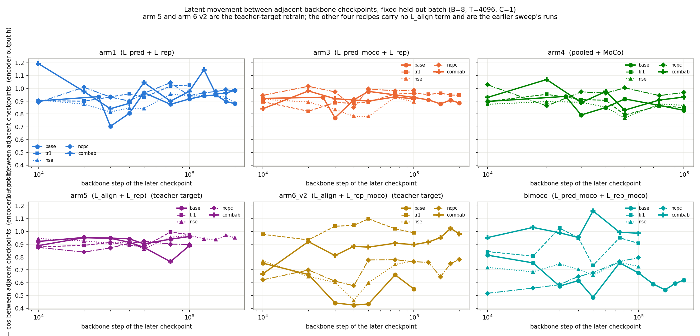
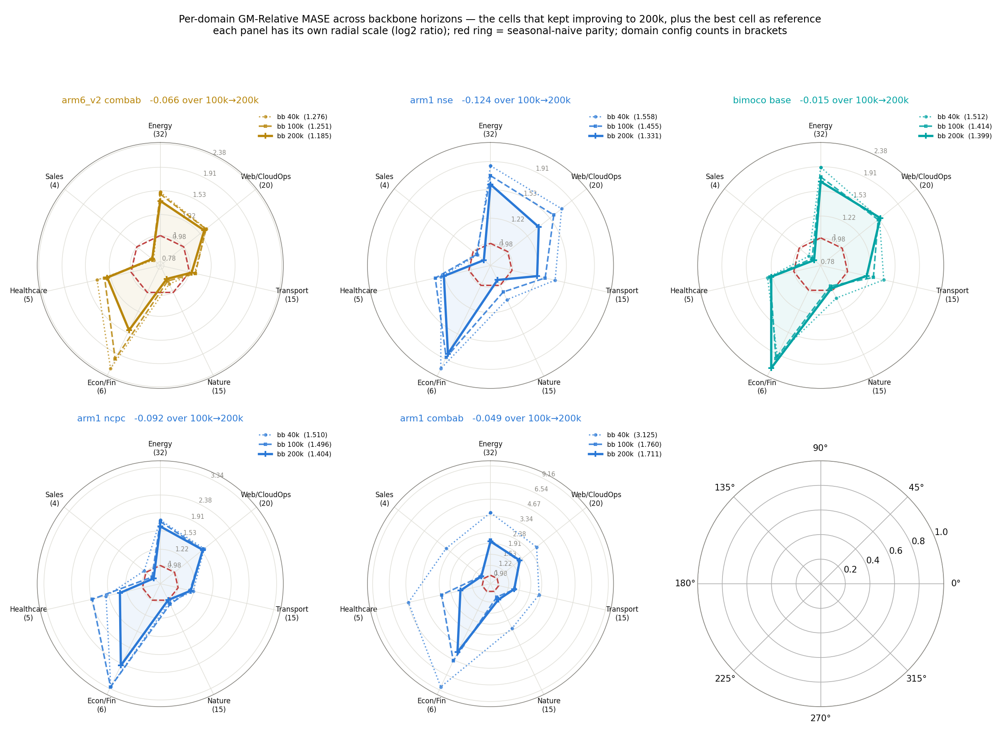

# Pointing the alignment loss at the EMA teacher does not move the sweep off seasonal-naive

Every one of the 30 cells scores above 1.0, so every model in this report is worse than seasonal naive. Against a control trained on the same branch, the teacher target lowers 2 of the 5 measured cells by more than both their bootstrap interval and the head-seed spread, moves 3 by less than that spread, and brings none below 1.0.

> **Cell** here is one loss recipe plus one setting, e.g. `arm5 combab`. The CSVs name it `arm_slug`. A cell measured under several head seeds is still one cell.

## 1. The comparison that isolates the flag

*Left: teacher against student, both trained on this branch, same backbone seed, same head seed, same code — the flag is the only difference. Right: the same teacher runs against the earlier sweep's student numbers, which changes the flag and the code snapshot at once. Five controls are still training; their cells read "pending".*

| Cell | teacher | student control (this branch) | Δ = teacher − student | 95% CI | CI excludes 0 |
|---|---|---|---|---|---|
| `arm5 base` | 1.3515 | 1.4501 | **−0.0986** | [−0.1504, −0.0450] | yes |
| `arm5 tr1` | 1.3396 | 1.3254 | +0.0142 | [−0.0241, +0.0471] | no |
| `arm5 nse` | 1.4536 | 1.4682 | −0.0146 | [−0.1073, +0.0467] | no |
| `arm5 ncpc` | 1.2923 | 1.5079 | **−0.2156** | [−0.2964, −0.1611] | yes |
| `arm5 combab` | 1.2728 | 1.2868 | −0.0140 | [−0.0536, +0.0195] | no |
| `arm6_v2 base` | 1.4322 | *pending* | *pending* | *pending* | *pending* |
| `arm6_v2 tr1` | 1.5315 | *pending* | *pending* | *pending* | *pending* |
| `arm6_v2 nse` | 1.3074 | *pending* | *pending* | *pending* | *pending* |
| `arm6_v2 ncpc` | 1.3159 | *pending* | *pending* | *pending* | *pending* |
| `arm6_v2 combab` | 1.2765 | *pending* | *pending* | *pending* | *pending* |

*Backbone 40k, head 15k, 97 GIFT-Eval B4 configs, forecast horizon 16. Intervals are dataset-level paired cluster bootstraps over the 28 base datasets, 10 000 resamples (`results/controlled_delta_40k.csv`, `experiments/2026-08-01_lalign_teacher/scripts/controlled_delta.py`).*

Of the five finished controls, four reproduce the earlier sweep's number exactly and one, `arm5 base`, differs from it by 0.0977; no mechanism for that difference was tested here.

## 2. How far one cell moves under nothing but a head seed

*Four frozen backbones, the quantile head retrained under extra seeds, the full 97-config eval re-run each time. The largest range is 0.0908 on `arm5 nse` at 200k, 5.1% of its own value. Eleven of the 20 cross-experiment teacher-vs-student ratios exceed that range (`results/seed_spread.csv`).*

## 3. Figures

### 1. GM-Relative MASE across backbone horizons, all 30 cells

*The 1.0 parity line sits below the axis.*

### 2. The same data, one panel per loss recipe

### 3. GM-Relative MASE per dataset domain

*`Nature` and `Sales` are the only domains where cells fall below 1.0.*

### 4. Ranking at backbone 40k

### 5. Ranking at backbone 100k

### 6. Ranking at backbone 200k

*The 8 cells here were promoted by their own 40k→100k trajectory, teacher and copied cells separately, so this row is a different selection on each side.*

### 7. Latent movement between adjacent checkpoints

### 8. Forecast-to-latent distance `1 − ff` during training

### 9. Dimension usage `u_batchtime` during training

### 10. Per-domain radar of each cell that kept improving to 200k

### 11. Latent movement against the improvement

## 4. Tables

### GM-Relative MASE, all 30 cells

Ranked by the 100k value. `⟲` marks a cell retrained with `--align-target teacher`; the other 20 carry no `L_align` term and are the earlier sweep's numbers, on the same seasonal-naive denominator. A dash means the cell was not extended: only cells that improved from 40k to 100k were taken to 200k.

| Rank @100k | Cell | bb 40k (head 15k) | bb 100k (head 30k) | 40k→100k | bb 200k (head 30k) | 100k→200k |
|---|---|---|---|---|---|---|
| 1 | `arm6_v2 combab` ⟲ | 1.2765 | 1.2514 | −0.0251 | 1.1850 | −0.0664 |
| 2 | `arm6_v2 ncpc` ⟲ | 1.3159 | 1.3012 | −0.0147 | 1.3325 | +0.0313 |
| 3 | `arm4 combab` | 1.2748 | 1.3219 | +0.0471 | — | — |
| 4 | `arm6_v2 nse` ⟲ | 1.3074 | 1.3368 | +0.0294 | — | — |
| 5 | `arm5 ncpc` ⟲ | 1.2923 | 1.3419 | +0.0496 | — | — |
| 6 | `arm4 ncpc` | 1.2957 | 1.3441 | +0.0484 | — | — |
| 7 | `arm5 combab` ⟲ | 1.2728 | 1.3678 | +0.0950 | — | — |
| 8 | `arm5 tr1` ⟲ | 1.3396 | 1.3710 | +0.0314 | — | — |
| 9 | `bimoco ncpc` | 1.3739 | 1.3833 | +0.0094 | — | — |
| 10 | `arm1 base` | 1.3674 | 1.3909 | +0.0235 | — | — |
| 11 | `arm5 nse` ⟲ | 1.4536 | 1.4017 | −0.0519 | 1.8887 | +0.4870 |
| 12 | `arm4 base` | 1.3537 | 1.4051 | +0.0514 | — | — |
| 13 | `bimoco base` | 1.5123 | 1.4144 | −0.0979 | 1.3993 | −0.0151 |
| 14 | `bimoco nse` | 1.3673 | 1.4234 | +0.0561 | — | — |
| 15 | `arm3 tr1` | 1.4547 | 1.4467 | −0.0080 | 1.4706 | +0.0239 |
| 16 | `arm4 tr1` | 1.4414 | 1.4469 | +0.0055 | — | — |
| 17 | `arm5 base` ⟲ | 1.3515 | 1.4510 | +0.0995 | — | — |
| 18 | `bimoco combab` | 1.4420 | 1.4517 | +0.0097 | — | — |
| 19 | `arm1 nse` | 1.5579 | 1.4548 | −0.1031 | 1.3308 | −0.1240 |
| 20 | `arm3 combab` | 1.4056 | 1.4921 | +0.0865 | — | — |
| 21 | `arm1 ncpc` | 1.5100 | 1.4963 | −0.0137 | 1.4041 | −0.0922 |
| 22 | `arm3 base` | 1.4545 | 1.5255 | +0.0710 | — | — |
| 23 | `arm4 nse` | 1.4852 | 1.5687 | +0.0835 | — | — |
| 24 | `bimoco tr1` | 1.4892 | 1.5823 | +0.0931 | — | — |
| 25 | `arm3 ncpc` | 1.4635 | 1.5973 | +0.1338 | — | — |
| 26 | `arm1 tr1` | 1.3725 | 1.6036 | +0.2311 | — | — |
| 27 | `arm6_v2 tr1` ⟲ | 1.5315 | 1.7064 | +0.1749 | — | — |
| 28 | `arm3 nse` | 1.4432 | 1.7372 | +0.2940 | — | — |
| 29 | `arm1 combab` | 3.1251 | 1.7595 | −1.3656 | 1.7107 | −0.0488 |
| 30 | `arm6_v2 base` ⟲ | 1.4322 | 1.9057 | +0.4735 | — | — |

### GM-Relative MASE per domain, the cells evaluated at backbone 200k

Configs per domain in brackets. Bold = below 1.0, i.e. better than seasonal naive on that domain.

| Cell (bb 200k) | Energy (32) | Web/CloudOps (20) | Transport (15) | Nature (15) | Econ/Fin (6) | Healthcare (5) | Sales (4) | all 97 |
|---|---|---|---|---|---|---|---|---|
| `arm6_v2 combab` ⟲ | 1.388 | 1.283 | 1.021 | **0.867** | 1.489 | 1.261 | **0.830** | 1.1850 |
| `arm1 nse` | 1.594 | 1.368 | 1.226 | **0.954** | 1.823 | 1.225 | **0.898** | 1.3308 |
| `arm6_v2 ncpc` ⟲ | 1.553 | 1.470 | 1.133 | **0.943** | 2.070 | 1.230 | **0.917** | 1.3325 |
| `bimoco base` | 1.668 | 1.554 | 1.195 | **0.978** | 2.192 | 1.234 | **0.840** | 1.3993 |
| `arm1 ncpc` | 1.617 | 1.559 | 1.173 | **0.998** | 2.442 | 1.329 | **0.886** | 1.4041 |
| `arm3 tr1` | 1.744 | 1.693 | 1.202 | **0.980** | 2.469 | 1.386 | **0.897** | 1.4706 |
| `arm1 combab` | 1.985 | 1.799 | 1.379 | 1.208 | 3.934 | 1.572 | 1.068 | 1.7107 |
| `arm5 nse` ⟲ | 2.394 | 2.111 | 1.836 | 1.324 | 2.075 | 1.340 | **0.912** | 1.8887 |
| *cells below 1.0, of 8* | 0/8 | 0/8 | 0/8 | 6/8 | 0/8 | 0/8 | 7/8 | 0/8 |

### Latent drift, setting against base

For one loss recipe, a setting counts as *lower* when its mean `1 − cos` displacement over every adjacent-checkpoint pair of that run falls below the base setting's mean of the same recipe. Six recipes; p is a two-sided exact binomial test.

| Setting | `h_t` drift lower than base / 6 | `h_t` p | `e_t` drift lower than base / 6 | `e_t` p |
|---|---|---|---|---|
| `ncpc` | 1/6 (arm5) | 0.219 | 4/6 | 0.688 |
| `nse` | 3/6 (arm3 / arm4 / arm5) | 1.000 | 2/6 | 0.688 |
| `tr1` | 1/6 (arm5) | 0.219 | 2/6 | 0.688 |
| `combab` | 1/6 (arm5) | 0.219 | 4/6 | 0.688 |

### The retrained cells against the earlier sweep

This table moves the flag and the code snapshot together, so it does not attribute a difference to the flag. The controlled table in section 1 is the one that does.

| Cell | 40k earlier | 40k teacher | 100k earlier | 100k teacher | 200k earlier | 200k teacher |
|---|---|---|---|---|---|---|
| `arm5 base` | 1.5478 | 1.3515 | 1.5579 | 1.4510 | — | — |
| `arm5 tr1` | 1.3254 | 1.3396 | 1.4249 | 1.3710 | — | — |
| `arm5 nse` | 1.4682 | 1.4536 | 1.3980 | 1.4017 | 1.6565 | 1.8887 |
| `arm5 ncpc` | 1.5079 | 1.2923 | 1.4459 | 1.3419 | 1.5692 | — |
| `arm5 combab` | 1.2868 | 1.2728 | 1.2456 | 1.3678 | 1.2034 | — |
| `arm6_v2 base` | 1.3149 | 1.4322 | 1.3449 | 1.9057 | — | — |
| `arm6_v2 tr1` | 1.4684 | 1.5315 | 1.5188 | 1.7064 | — | — |
| `arm6_v2 nse` | 1.3791 | 1.3074 | 1.3914 | 1.3368 | — | — |
| `arm6_v2 ncpc` | 1.3623 | 1.3159 | 1.2978 | 1.3012 | 1.3011 | 1.3325 |
| `arm6_v2 combab` | 1.2025 | 1.2765 | 1.1616 | 1.2514 | 1.1652 | 1.1850 |

Lower with the teacher target at 40k: `arm5 base`, `arm5 nse`, `arm5 ncpc`, `arm5 combab`, `arm6_v2 nse`, `arm6_v2 ncpc`. Higher: `arm5 tr1`, `arm6_v2 base`, `arm6_v2 tr1`, `arm6_v2 combab`. At 100k the split is 4 lower, 6 higher. Across the ten arms the sign test gives p = 0.75 at both steps (`results/eval_paired_tests.csv`).

### Where the three unusual cells come from

Three different causes, not one (`results/anomaly_inspection.csv`, `results/anomaly_windows.csv`; no non-finite loss or gap in any of the 40 backbones).

| Cell | What the curves show |
|---|---|
| `arm1 combab` 3.1251 at 40k (copied) | never trained. Loss sits at 19–20 the whole run and is higher at 40k (19.82) than at step 0 (19.03), the largest rise-from-minimum of the 40 runs. Every other `arm1` setting fell by 3.1 to 7.1 over the same window. |
| `arm5 nse` 1.8887 at 200k | clean loss curve, extreme attention. Loss 19.80 → 14.11 → 13.95, then flat; rise-from-minimum at the 18th percentile. Mean attention logit magnitude grows 7.63 → 14.28 → 35.09 across the three waves, peak 259.94, the largest of the 40 runs. |
| `arm6_v2 base` 1.4322 → 1.9057 (40k → 100k) | no backbone signature. Loss 12.98 → 4.92 in the first wave, flat 4.98 → 4.92 in the second. Attention bounded and near the bottom of the set. |

## 5. Protocol

### Loss recipes

| Recipe | Loss |
|---|---|
| `arm1` | `L_pred + L_rep` |
| `arm3` | `L_pred_moco + L_rep` |
| `arm4` | `pooled + MoCo` |
| `arm5` | `L_align + L_rep` ⟲ |
| `arm6_v2` | `L_align + L_rep_moco` ⟲ |
| `bimoco` | `L_pred_moco + L_rep_moco` |

### Settings applied to each recipe

| Setting | Change from base |
|---|---|
| `base` | `τ = 0.10`, `cpc = 1`, `sigreg_e = 1` |
| `tr1` | all InfoNCE temperatures set to `τ = 1.0` |
| `nse` | SIGReg on `e_t` disabled (`sigreg_e = 0`) |
| `ncpc` | CPC auxiliary disabled (`cpc = 0`) |
| `combab` | `τ = 1.0` and `cpc = 0`; additionally `sigreg_e = 0` for `arm1`/`arm3`/`arm4` |

### Metrics

- **GM-Relative MASE** — geometric mean over 97 GIFT-Eval configs of `MASE(model) / MASE(seasonal_naive)`, official GIFT-Eval **B4 strategy** (single-window in-context prediction, backbone context length matching the config's expected horizon), forecast horizon 16. Lower is better; above 1.0 means seasonal naive wins on that geometric average. All 30 arms share one seasonal-naive denominator file, byte-identical to the earlier sweep's, so all of them sit on one scale.
- **`h_t`, `e_t`** — the encoder-output latent and the patch-embedding latent, shape `[B, T, C, H]`.
- **`ff`** — mean `cos(f̂, h_{t+1})` between the forecaster's next-step prediction and the encoder's next-step latent, unit-normalised. `1 − ff` is a distance in [0, 2]; smaller = closer forecast.
- **Latent drift** at checkpoint pair `(step_i, step_j)` — `mean_{b,t,c} 1 − cos(h_t(model_j), h_t(model_i))` on a fixed held-out batch (`torch.manual_seed(20260722)`, `B=8`, `T=4096`, `C=1`, ARMA-synthetic), and the same for `e_t`.
- **`u_batchtime`** — `1/(d · off-diagonal Gram mean)` over `(B×T)` samples of the given latent, clamped to [0, 1]. 1 = every `H` dimension carries independent information.
- **`L_align`** — `(2 − 2·cos(f_t, h_target_{t+1})).mean()`, pulling the forecaster output toward the next encoder latent, gradient through the forecaster only. `--align-target student` takes `h_target` from the student encoder under stop-gradient; `--align-target teacher` takes it from the EMA teacher. The ten `⟲` cells are the teacher setting.

### Training

Backbone: `d_model=64, n_heads=8, num_encoder_layers=3, num_layers=3, batch_size=64, seed=20260520`, dataset `jeremycochoy/gift-pretrain-full-4096 / small_v1`, EMA teacher throughout (`--ema-embedding --ema-encoder --ema-tau 0.9`). The 200k backbones continue the same run from its 100k checkpoint with the saved optimizer state, same seed and same flags.

Quantile head, trained on the frozen backbone, `--grad-clip 1.0` at every horizon, kept for comparability with the earlier sweep:

| Param | bb 40k | bb 100k | bb 200k |
|---|---|---|---|
| `--head-arch` | `transformer` | `transformer` | `transformer` |
| `--head-num-layers` | 2 | 2 | 2 |
| `--head-nhead` | 8 | 8 | 8 |
| `--head-ffn-mult` | 4.0 | 4.0 | 4.0 |
| `--head-causal` | true | true | true |
| `--head-train-input` | `e_then_f` | `e_then_f` | `e_then_f` |
| `--forecast-len` | 16 | 16 | 16 |
| `--batch-size` | 256 | 256 | 256 |
| `--lr` | 1e-3 | 1e-3 | 1e-3 |
| `--total-steps` | 15,000 | 30,000 | 30,000 |
| head seed | 20260722 | 20260722 | 20260722 |

### What a comparison here can and cannot carry

- The head budget changes with the backbone step (15k at 40k, 30k at 100k and 200k), so any within-arm statement across backbone steps moves two things at once.
- The 200k row compares a teacher-selected subset against a differently selected subset of the earlier sweep, so no like-for-like 200k claim is available.
- The cross-experiment table changes the flag and the code snapshot together.
- Five same-branch student controls and one head-seed replicate are still training; their cells read *pending* and will be filled in place.

## 6. Data

Every CSV behind this report is in [`results/`](results/), documented in [`results/README.md`](results/README.md). The plot scripts are in [`plots/`](plots/); the analysis scripts are in `experiments/2026-08-01_lalign_teacher/scripts/`.

---

This run corrects an implementation mistake in `L_align`: the earlier small-model sweep, [`reports/2026-07-21_split_pred_rep_small/small_long.md`](../2026-07-21_split_pred_rep_small/small_long.md), computed `L_align` against the student encoder under stop-gradient rather than against the EMA teacher it was meant to target.
