# The EMA-teacher alignment target does not move the ten-cell set at backbone 40k, within a bound of 0.088 GM-Relative MASE

Six of the ten controlled pairs favour the teacher and four the student, a split the paired tests do not separate from zero. Of the two cells re-headed under three head seeds, the larger effect changes sign under re-heading and the smaller one, `arm5 combab`, does not.

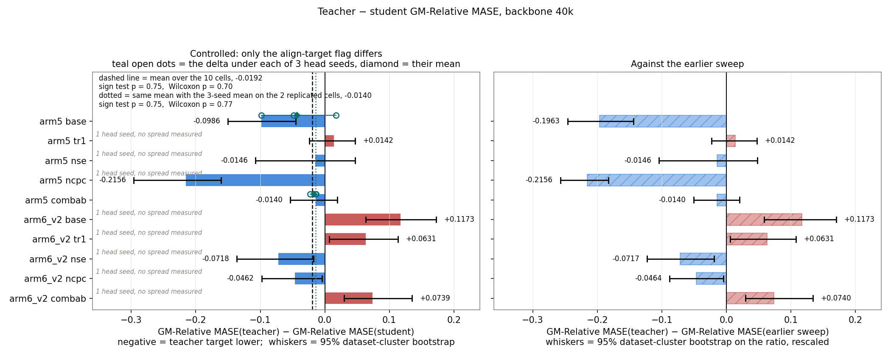

*Teacher minus student GM-Relative MASE at backbone 40k. Left: controlled, only the flag differs. Right: against the earlier sweep.*

> **Cell** — one loss recipe plus one setting, e.g. `arm5 combab`. The CSVs name it `arm_slug`. A cell measured under several head seeds is still one cell. The recipes and the settings are tabulated in [Protocol](#9-protocol).
>
> **`⟲`** — the cell was retrained with `--align-target teacher`.
>
> **GM-Relative MASE** — the metric of every figure here; lower is better, 1.0 is parity with seasonal naive (full definition in [Protocol](#9-protocol)).

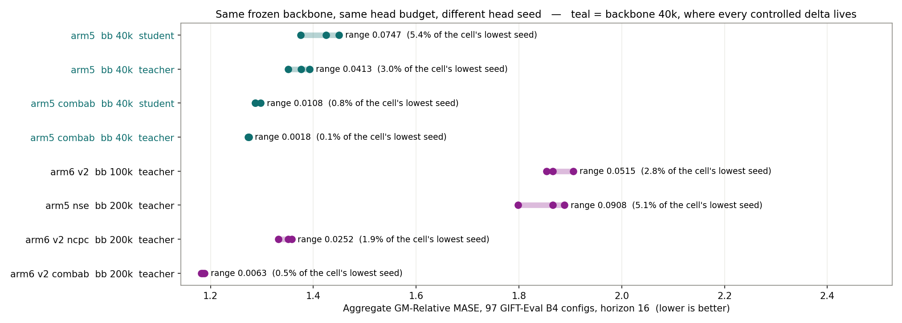

*Eight frozen backbones, every cell in this report carrying replicate head seeds (`results/seed_spread.csv`). Teal = backbone 40k, both sides of the controlled comparison.*

## 1. Across backbone horizons

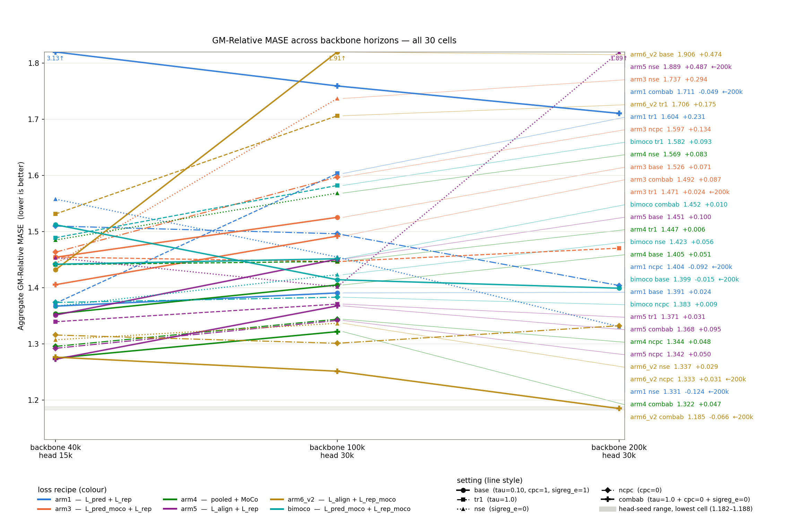

*All 30 cells; the 8 that improved over 40k→100k were extended to 200k.*

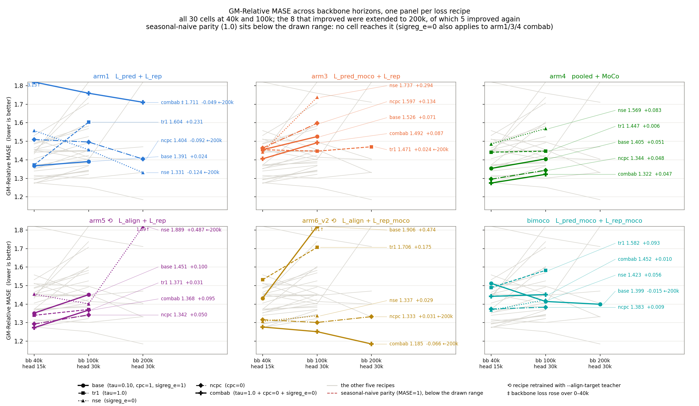

*The same 30 cells, one panel per loss recipe; the other five recipes stay in grey behind each panel. ⟲ retrained with `--align-target teacher`, ‡ the backbone whose loss rose over the whole 0–40k window (section 5).*

In both retrained recipes `base` is the highest setting at backbone 100k, and in `arm6_v2` the `combab` setting is the lowest at all three backbone steps.

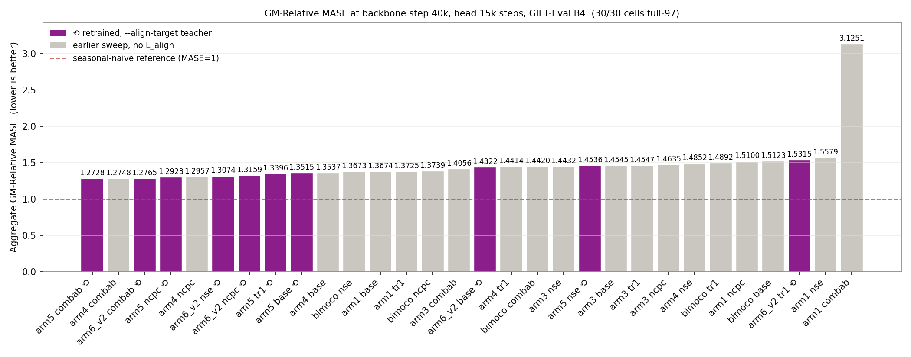

*All 30 cells at backbone 40k. Dashed line = seasonal-naive parity. ‡ = the backbone whose loss rose over the whole 0–40k window (section 5). † = measured head-seed range.*

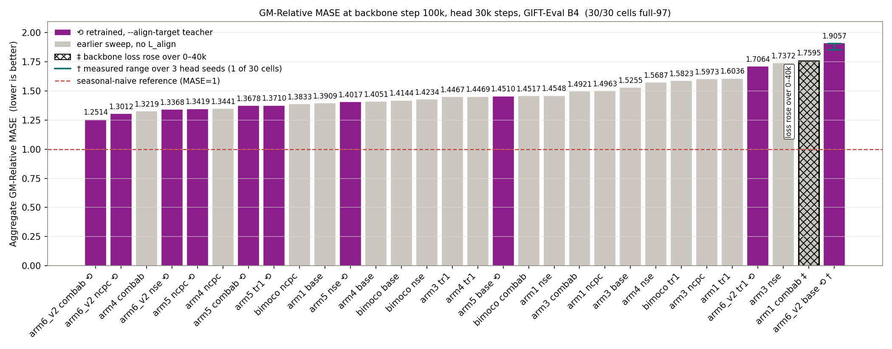

*All 30 cells at backbone 100k, same marks and same scale convention as the 40k ranking.*

Four of the five lowest cells at backbone 100k are retrained ones, and so is the highest.

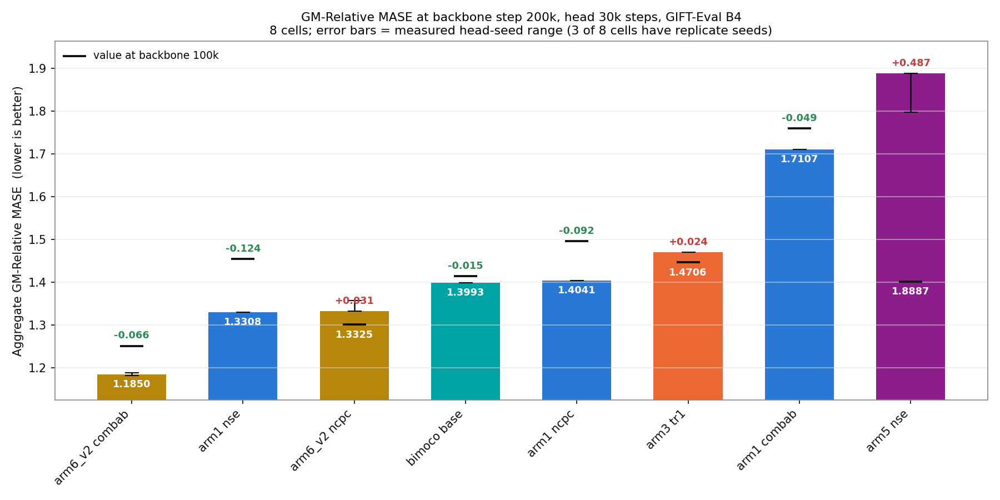

*The 8 cells extended to backbone 200k.*

## 2. Per-domain

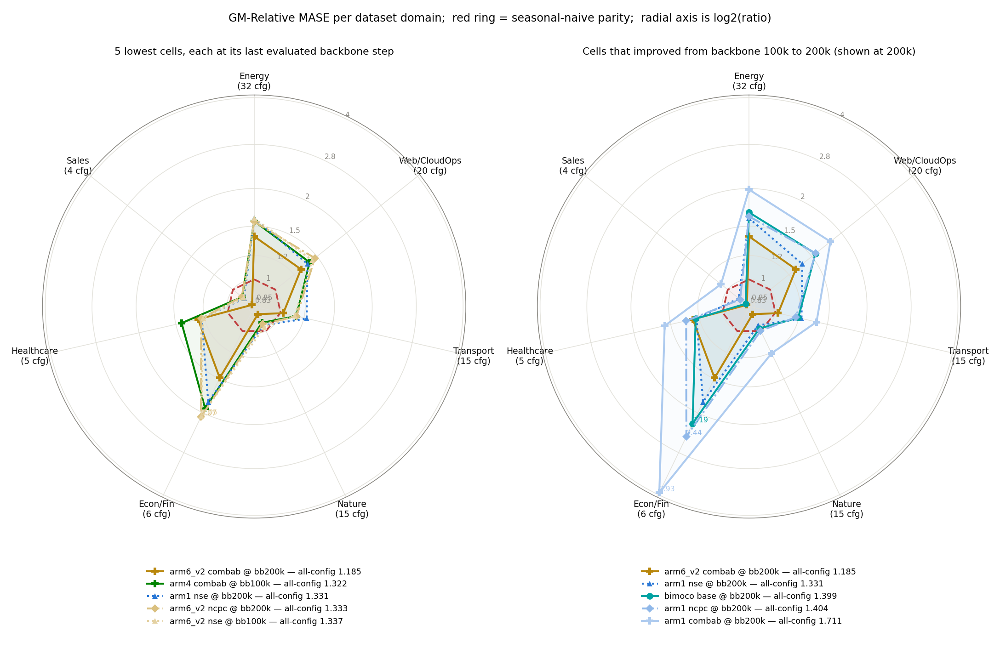

*Per-domain GM-Relative MASE. Left: the 5 lowest cells. Right: the per-domain radar of the 8 cells that kept improving, at backbone 200k.*

Those eight cells fall below parity on Nature (6 of 8) and on Sales (7 of 8), and on no other domain.

## 3. The retrained cells against the earlier sweep

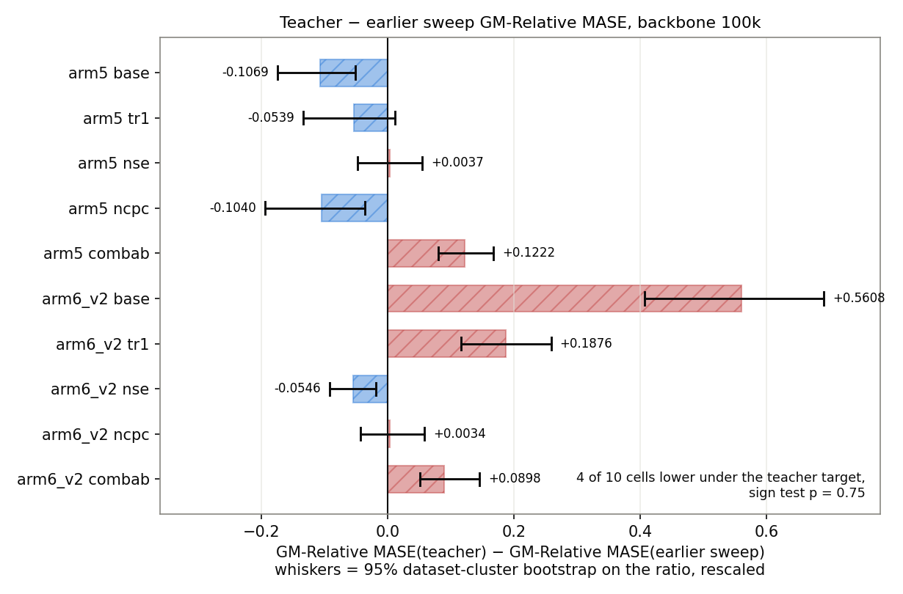

*Teacher minus earlier-sweep GM-Relative MASE at backbone 100k (`results/eval_bootstrap_ci.csv`, `results/eval_paired_tests.csv`).*

Four of the ten retrained cells score lower than the earlier sweep at backbone 100k (sign test p = 0.75), and this comparison moves the flag and the code snapshot together, so it does not isolate the flag.

## 4. Latent drift does not separate the improvers

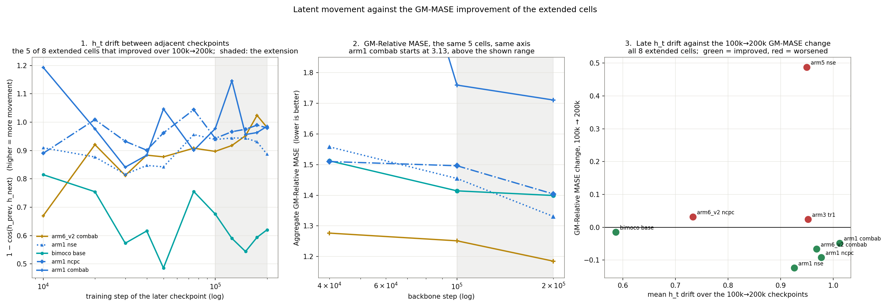

*Panel 1 is the latent movement between adjacent checkpoints; panel 2 the GM-Relative MASE of the same cells; panel 3 late `h_t` drift against the 100k→200k change (`results/latent_movement_pairs.csv`).*

## 5. The worst cell at each horizon

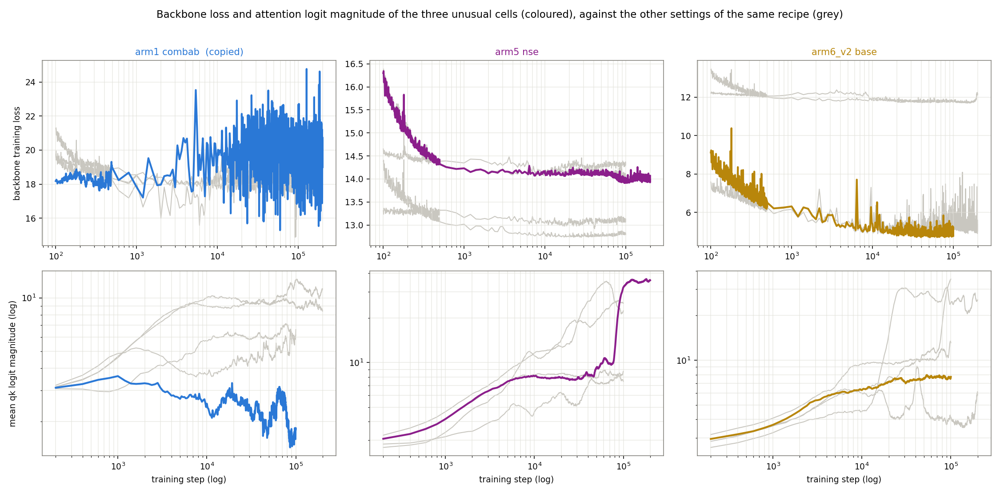

*The three cells with the highest GM-Relative MASE of the field at backbone 40k, at 100k and at 200k (`results/gm_relative_mase.csv`, `results/training_curves/`, `results/attn_amplitude/`). Selected run in colour, the other four settings of the same recipe in grey.*

No non-finite loss or gap appears in any of the 40 backbones, and `arm1 combab` is the only one whose loss ends the 0–40k window above where it started ([table](#loss-and-attention-of-the-worst-cell)).

## 6. Training-curve diagnostics

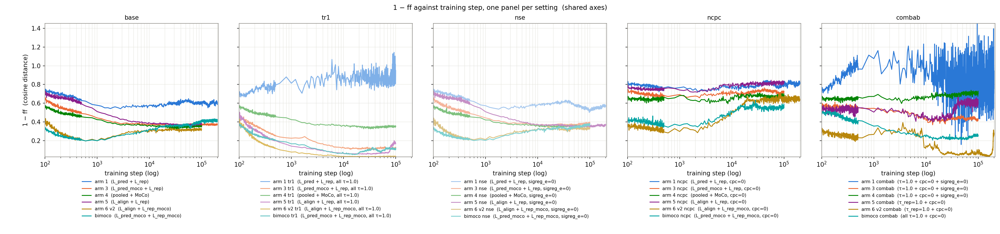

*`1 − ff`, the cosine distance between the forecaster's next-step output and the encoder's next-step latent, per training step (`results/training_curves/`). Shared y-scale across panels.*

Under `tr1` and `combab`, the two settings at `τ = 1.0`, `arm1` rises across training and ends far above every other cell.

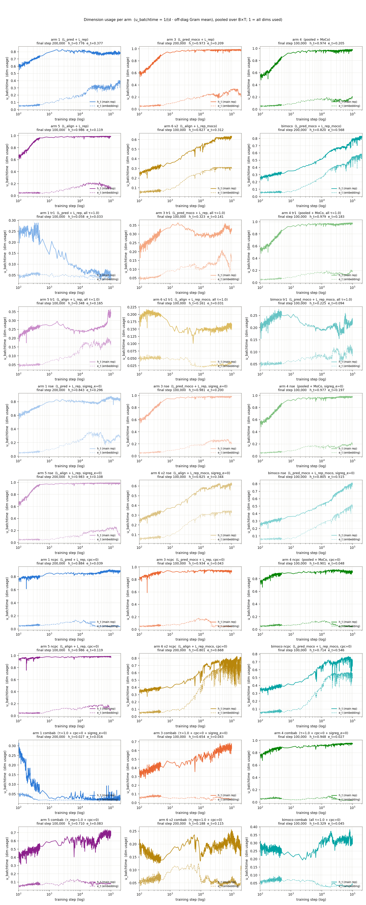

*`u_batchtime` on `h_t` and on `e_t`, per training step (`results/training_curves/`). Per-panel y-scale.*

In all 30 panels the encoder output `h_t` ends above the patch embedding `e_t`.

## 7. Reproduction control

Nine of the ten student controls reproduce the earlier sweep's number and share their backbone trace with it step for step. `arm5 base` ⧗ differs by backbone replicate, not by code: the earlier sweep published r3, this branch reproduces r1 at all 40 000 steps and r3 at none ([table](#student-control-against-the-earlier-sweep-backbone-40k), `results/replicate_provenance_40k.csv`, [`results/README.md`](results/README.md)).

## 8. Tables

### The 30 cells across backbone horizons

| Cell | bb 40k (head 15k) | bb 100k (head 30k) | 40k→100k | bb 200k (head 30k) | 100k→200k |
|---|---|---|---|---|---|
| `arm6_v2 combab` ⟲ | 1.2765 | 1.2514 | −0.0251 | 1.1850 † | −0.0664 |
| `arm6_v2 ncpc` ⟲ | 1.3159 | 1.3012 | −0.0147 | 1.3325 † | +0.0313 |
| `arm4 combab` | 1.2748 | 1.3219 | +0.0471 | — | — |
| `arm6_v2 nse` ⟲ | 1.3074 | 1.3368 | +0.0294 | — | — |
| `arm5 ncpc` ⟲ | 1.2923 | 1.3419 | +0.0496 | — | — |
| `arm4 ncpc` | 1.2957 | 1.3441 | +0.0484 | — | — |
| `arm5 combab` ⟲ | 1.2728 † | 1.3678 | +0.0950 | — | — |
| `arm5 tr1` ⟲ | 1.3396 | 1.3710 | +0.0314 | — | — |
| `bimoco ncpc` | 1.3739 | 1.3833 | +0.0094 | — | — |
| `arm1 base` | 1.3674 | 1.3909 | +0.0235 | — | — |
| `arm5 nse` ⟲ | 1.4536 | 1.4017 | −0.0519 | 1.8887 † | +0.4870 |
| `arm4 base` | 1.3537 | 1.4051 | +0.0514 | — | — |
| `bimoco base` | 1.5123 | 1.4144 | −0.0979 | 1.3993 | −0.0151 |
| `bimoco nse` | 1.3673 | 1.4234 | +0.0561 | — | — |
| `arm3 tr1` | 1.4547 | 1.4467 | −0.0080 | 1.4706 | +0.0239 |
| `arm4 tr1` | 1.4414 | 1.4469 | +0.0055 | — | — |
| `arm5 base` ⟲ | 1.3515 † | 1.4510 | +0.0995 | — | — |
| `bimoco combab` | 1.4420 | 1.4517 | +0.0097 | — | — |
| `arm1 nse` | 1.5579 | 1.4548 | −0.1031 | 1.3308 | −0.1240 |
| `arm3 combab` | 1.4056 | 1.4921 | +0.0865 | — | — |
| `arm1 ncpc` | 1.5100 | 1.4963 | −0.0137 | 1.4041 | −0.0922 |
| `arm3 base` | 1.4545 | 1.5255 | +0.0710 | — | — |
| `arm4 nse` | 1.4852 | 1.5687 | +0.0835 | — | — |
| `bimoco tr1` | 1.4892 | 1.5823 | +0.0931 | — | — |
| `arm3 ncpc` | 1.4635 | 1.5973 | +0.1338 | — | — |
| `arm1 tr1` | 1.3725 | 1.6036 | +0.2311 | — | — |
| `arm6_v2 tr1` ⟲ | 1.5315 | 1.7064 | +0.1749 | — | — |
| `arm3 nse` | 1.4432 | 1.7372 | +0.2940 | — | — |
| `arm1 combab` | 3.1251 ‡ | 1.7595 | −1.3656 | 1.7107 | −0.0488 |
| `arm6_v2 base` ⟲ | 1.4322 | 1.9057 † | +0.4735 | — | — |

*Backing data for section 1, sorted by the 100k value; neighbouring rows are not separated by this measurement. `⟲` retrained with `--align-target teacher`. A dash: the cell was not extended. † that value's cell carries replicate head seeds ([table](#head-seed-range-per-cell-at-backbone-40k)); the two 40k daggers also carry them on the student side. ‡ this backbone's loss rose over the whole 0–40k window (section 5). Values are head seed 20260722.*

### Student control against the earlier sweep, backbone 40k

| Cell | earlier sweep | this branch | difference | configs identical / 97 | largest per-config relative difference |
|---|---|---|---|---|---|
| `arm5 base` ⧗ | 1.547783 | 1.450053 | −0.097730 | 0 | 2.70e−01 |
| `arm5 tr1` | 1.325372 | 1.325372 | +0.000000 | 97 | 0.00e+00 |
| `arm5 nse` | 1.468179 | 1.468179 | +0.000000 | 97 | 0.00e+00 |
| `arm5 ncpc` | 1.507886 | 1.507886 | +0.000000 | 97 | 0.00e+00 |
| `arm5 combab` | 1.286777 | 1.286803 | +0.000026 | 0 | 7.01e−04 |
| `arm6_v2 base` | 1.314899 | 1.314870 | −0.000028 | 0 | 5.67e−04 |
| `arm6_v2 tr1` | 1.468361 | 1.468361 | +0.000000 | 97 | 0.00e+00 |
| `arm6_v2 nse` | 1.379123 | 1.379195 | +0.000072 | 0 | 1.44e−03 |
| `arm6_v2 ncpc` | 1.362271 | 1.362114 | −0.000157 | 0 | 2.26e−03 |
| `arm6_v2 combab` | 1.202512 | 1.202512 | +0.000000 | 97 | 0.00e+00 |

*Backing data for section 7 (`results/snapshot_reproduction_40k.csv`). A row counts as reproducing at a difference of at most 0.0002 in absolute value. ⧗ the row measured on a different backbone replicate.*

### The retrained cells against the earlier sweep, backbone 100k

| Cell | teacher | earlier sweep | ratio | CI 95% lo | CI 95% hi | CI excludes 1 |
|---|---|---|---|---|---|---|
| `arm5 base` ⧗ | 1.4510 | 1.5579 | 0.9314 | 0.8881 | 0.9669 | yes |
| `arm5 tr1` | 1.3710 | 1.4249 | 0.9622 | 0.9061 | 1.0084 | no |
| `arm5 nse` | 1.4017 | 1.3980 | 1.0026 | 0.9657 | 1.0395 | no |
| `arm5 ncpc` | 1.3419 | 1.4459 | 0.9281 | 0.8658 | 0.9753 | yes |
| `arm5 combab` | 1.3678 | 1.2456 | 1.0981 | 1.0645 | 1.1346 | yes |
| `arm6_v2 base` | 1.9057 | 1.3449 | 1.4169 | 1.3030 | 1.5135 | yes |
| `arm6_v2 tr1` | 1.7064 | 1.5188 | 1.1236 | 1.0766 | 1.1705 | yes |
| `arm6_v2 nse` | 1.3368 | 1.3914 | 0.9608 | 0.9343 | 0.9864 | yes |
| `arm6_v2 ncpc` | 1.3012 | 1.2978 | 1.0027 | 0.9672 | 1.0452 | no |
| `arm6_v2 combab` | 1.2514 | 1.1616 | 1.0773 | 1.0439 | 1.1254 | yes |

*Backing data for section 3. Ratio = teacher ÷ earlier sweep, below 1.0 means the teacher run scored lower. Intervals are 95% dataset-cluster bootstraps (`results/eval_bootstrap_ci.csv`) and cover eval sampling only. All ten arms left more than one backbone replicate in the earlier sweep, but they are sequential continuations with disjoint step ranges, and on all ten exactly one replicate spans step 100 000 (`results/replicate_provenance_40k.csv`), so no row here had a replicate to pick wrong. ⧗ marks the one arm whose 40k row sits on a different replicate, where the mismatch is worth 0.0977.*

### The controlled comparison at backbone 40k

| Cell | teacher | student | difference | head seeds | difference per seed | mean | range | sign holds |
|---|---|---|---|---|---|---|---|---|
| `arm5 base` | 1.3515 | 1.4501 | −0.0986 | 3 | −0.0986 / −0.0482 / +0.0174 | −0.0431 | 0.1160 | no |
| `arm5 tr1` | 1.3396 | 1.3254 | +0.0142 | 1 | — | — | not measured | — |
| `arm5 nse` | 1.4536 | 1.4682 | −0.0146 | 1 | — | — | not measured | — |
| `arm5 ncpc` | 1.2923 | 1.5079 | −0.2156 | 1 | — | — | not measured | — |
| `arm5 combab` | 1.2728 | 1.2868 | −0.0140 | 3 | −0.0140 / −0.0133 / −0.0230 | −0.0168 | 0.0097 | yes |
| `arm6_v2 base` | 1.4322 | 1.3149 | +0.1173 | 1 | — | — | not measured | — |
| `arm6_v2 tr1` | 1.5315 | 1.4684 | +0.0631 | 1 | — | — | not measured | — |
| `arm6_v2 nse` | 1.3074 | 1.3792 | −0.0718 | 1 | — | — | not measured | — |
| `arm6_v2 ncpc` | 1.3159 | 1.3621 | −0.0462 | 1 | — | — | not measured | — |
| `arm6_v2 combab` | 1.2765 | 1.2025 | +0.0739 | 1 | — | — | not measured | — |

*Backing data for the headline figure (`results/controlled_delta_40k.csv`). Both sides of every row ran on this branch. `teacher`, `student` and `difference` are head seed 20260722 throughout, so the column is comparable across all ten. The last four columns exist only where a cell was replicated; `not measured` is not a small spread. Per-seed differences are ordered 20260722 / 20260723 / 20260724, and the pairing by seed index is a convention: the two sides are separate backbones with separate head draws.*

### Head-seed range per cell at backbone 40k

| Cell | target | seed 20260722 | 20260723 | 20260724 | mean | range | % of the cell's lowest seed |
|---|---|---|---|---|---|---|---|
| `arm5 base` | student | 1.4501 | 1.4248 | 1.3754 | 1.4167 | 0.0747 | 5.4% |
| `arm5 base` | teacher | 1.3515 | 1.3765 | 1.3927 | 1.3736 | 0.0413 | 3.0% |
| `arm5 combab` | student | 1.2868 | 1.2873 | 1.2976 | 1.2906 | 0.0108 | 0.8% |
| `arm5 combab` | teacher | 1.2728 | 1.2739 | 1.2746 | 1.2738 | 0.0018 | 0.1% |

*Backing data for the head-seed figure (`results/seed_spread.csv`). Same frozen backbone, same 15 000-step head budget, `--seed` on the head the only change, full 97-config eval re-run each time.*

### The aggregate over the ten cells, on both head-seed bases

| Basis | mean | 95% interval on the mean | median | teacher lower / student lower | sign test p | Wilcoxon p |
|---|---|---|---|---|---|---|
| head seed 20260722, all ten cells | −0.0192 | −0.0882 to +0.0497 | −0.0143 | 6 / 4 | 0.75 | 0.70 |
| three-seed mean where measured (2 of 10) | −0.0140 | −0.0804 to +0.0525 | −0.0157 | 6 / 4 | 0.75 | 0.77 |

*Backing data for the opening (`results/controlled_paired_tests_40k.csv`). Both rows are the same ten cells and the same paired tests; they differ only in which head seed each of the two replicated cells contributes. The interval is a t interval over the ten paired differences, sd 0.0964 and 0.0928 respectively; the ten pairs are not independent (see [Protocol](#9-protocol)).*

### Latent drift of each setting against its recipe's base

| Setting | `h_t` drift lower than base / 6 | `h_t` p | `e_t` drift lower than base / 6 | `e_t` p |
|---|---|---|---|---|
| `ncpc` | 1/6 (arm5) | 0.219 | 4/6 | 0.688 |
| `nse` | 3/6 (arm3 / arm4 / arm5) | 1.000 | 2/6 | 0.688 |
| `tr1` | 1/6 (arm5) | 0.219 | 2/6 | 0.688 |
| `combab` | 1/6 (arm5) | 0.219 | 4/6 | 0.688 |

*Backing data for section 4, per latent. Counts and p-values: `results/latent_drift_setting_vs_base.csv`, built from `results/latent_movement_pairs.csv` by `experiments/2026-08-01_lalign_teacher/scripts/make_report_tables.py`.*

### Loss and attention of the worst cell

| Cell | GM-Rel MASE | loss, start of 0–40k | end of 0–40k | end of 40–100k | end of 100–200k | peak qk logit | qk rank / 40 | rise-from-min | rise rank / 40 |
|---|---|---|---|---|---|---|---|---|---|
| `arm1 combab` | 3.1251 @ 40k | 19.03 | 19.82 | 19.54 | 19.75 | 6.51 | 1 | 4.4648 | 40 |
| `arm5 nse` ⟲ | 1.8887 @ 200k | 19.80 | 14.11 | 13.95 | 13.97 | 259.94 | 40 | 0.0688 | 7 |
| `arm6_v2 base` ⟲ | 1.9057 @ 100k | 12.98 | 4.92 | 4.92 | — | 12.75 | 7 | 0.2342 | 16 |

*Backing data for section 5 (`results/anomaly_windows.csv`, `results/anomaly_inspection.csv`). The next two peak qk logits of the field are 256.76 and 234.74.*

### Per-domain GM-Relative MASE, backbone 200k

| Cell (bb 200k) | Energy (32) | Web/CloudOps (20) | Transport (15) | Nature (15) | Econ/Fin (6) | Healthcare (5) | Sales (4) | all 97 |
|---|---|---|---|---|---|---|---|---|
| `arm6_v2 combab` ⟲ | 1.388 | 1.283 | 1.021 | **0.867** | 1.489 | 1.261 | **0.830** | 1.1850 |
| `arm1 nse` | 1.594 | 1.368 | 1.226 | **0.954** | 1.823 | 1.225 | **0.898** | 1.3308 |
| `arm6_v2 ncpc` ⟲ | 1.553 | 1.470 | 1.133 | **0.943** | 2.070 | 1.230 | **0.917** | 1.3325 |
| `bimoco base` | 1.668 | 1.554 | 1.195 | **0.978** | 2.192 | 1.234 | **0.840** | 1.3993 |
| `arm1 ncpc` | 1.617 | 1.559 | 1.173 | **0.998** | 2.442 | 1.329 | **0.886** | 1.4041 |
| `arm3 tr1` | 1.744 | 1.693 | 1.202 | **0.980** | 2.469 | 1.386 | **0.897** | 1.4706 |
| `arm1 combab` | 1.985 | 1.799 | 1.379 | 1.208 | 3.934 | 1.572 | 1.068 | 1.7107 |
| `arm5 nse` ⟲ | 2.394 | 2.111 | 1.836 | 1.324 | 2.075 | 1.340 | **0.912** | 1.8887 |
| *cells below 1.0, of 8* | 0/8 | 0/8 | 0/8 | 6/8 | 0/8 | 0/8 | 7/8 | 0/8 |

*Backing data for section 2. Configs per domain in brackets. Bold = below 1.0.*

## 9. Protocol

### Loss recipes

| Recipe | Loss |
|---|---|
| `arm1` | `L_pred + L_rep` |
| `arm3` | `L_pred_moco + L_rep`, MoCo = a momentum-encoder queue of negatives |
| `arm4` | `pooled + MoCo` |
| `arm5` | `L_align + L_rep` ⟲ |
| `arm6_v2` | `L_align + L_rep_moco` ⟲ |
| `bimoco` | `L_pred_moco + L_rep_moco` |

### Settings applied to each recipe

| Setting | Change from base |
|---|---|
| `base` | `τ = 0.10`, `cpc = 1`, `sigreg_e = 1` |
| `tr1` | all InfoNCE (softmax contrastive loss over positive and negative pairs) temperatures set to `τ = 1.0` |
| `nse` | SIGReg (the LeJEPA sketched isotropic-Gaussian regulariser) on `e_t` disabled (`sigreg_e = 0`) |
| `ncpc` | CPC (contrastive predictive coding) auxiliary disabled (`cpc = 0`) |
| `combab` | `τ = 1.0` and `cpc = 0`; additionally `sigreg_e = 0` for `arm1`/`arm3`/`arm4` |

### Metrics

- **GM-Relative MASE** — geometric mean over 97 GIFT-Eval configs of `MASE(model) / MASE(seasonal_naive)`, official GIFT-Eval **B4 strategy** (single-window in-context prediction, backbone context length matching the config's expected horizon), forecast horizon 16. Lower is better; above 1.0 means seasonal naive wins on that geometric average. All 30 cells share one seasonal-naive denominator file, byte-identical to the earlier sweep's, so all of them sit on one scale. The 20 cells without `⟲` carry no `L_align` term and are the earlier sweep's numbers, on that same denominator.
- **Per-config sources** — `results/eval_gm_mase/<cell>_bb<step>k_hd<head>s/all_results.csv`, one directory per cell, backbone step and head seed. The per-domain figure and table read from those files.
- **Rounding** — every aggregate in this report is computed at full precision from the per-config `all_results.csv` files and rounded once, to four decimals, at print time. A per-seed difference can therefore differ by 0.0001 from the difference of the two rounded numbers printed beside it. The reproduction-control table is the exception: it prints six decimals, and a row counts as reproducing when the difference is at most 0.0002 in absolute value, the resolution of the four-decimal tables elsewhere.
- **95% dataset-cluster bootstrap** — the one interval used everywhere in this report: a dataset-level paired cluster bootstrap over the 28 base datasets, 10 000 resamples (`experiments/2026-08-01_lalign_teacher/scripts/controlled_delta.py`). It covers eval sampling only, conditional on the two trained models. The interval is computed on the ratio of the two GM-Relative MASE values; the whiskers in the delta figures are `(bound − 1) ×` the reference cell's GM-Relative MASE, which is what "rescaled" means in those figures.
- **Head-seed range** — the spread of a cell's GM-Relative MASE when the quantile head is retrained on the frozen backbone under extra seeds, changing its init and its data order, with the full 97-config eval re-run each time. It covers head retraining, which the bootstrap interval does not. **It is a property of one cell.** The eight frozen backbones measured here range from 0.0018 to 0.0908, and the four measured at backbone 40k with a 15 000-step head, where every controlled delta sits, range from 0.0018 to 0.0747. The 0.0908 comes from a backbone-200k cell with a 30 000-step head, so it does not gate a 40k delta; `results/seed_spread.csv` keys on arm, backbone step, align target and code snapshot, and never merges a teacher cell with a student cell.
- **`h_t`, `e_t`** — the encoder-output latent and the patch-embedding latent, shape `[B, T, C, H]`.
- **`ff`** — mean `cos(f̂, h_{t+1})` between the forecaster's next-step prediction and the encoder's next-step latent, unit-normalised. `1 − ff` is a cosine distance in [0, 2]; smaller = closer forecast.
- **Latent drift** at checkpoint pair `(step_i, step_j)` — `mean_{b,t,c} 1 − cos(h_t(model_j), h_t(model_i))` on a fixed held-out batch (`torch.manual_seed(20260722)`, `B=8`, `T=4096`, `C=1`, ARMA-synthetic), and the same for `e_t`. A setting counts as *lower* than base when its mean drift over adjacent-checkpoint pairs falls below the base setting of the same recipe; the section-4 denominator is the six recipes and the p is a two-sided exact binomial test.
- **Late drift** — the mean `h_t` drift over adjacent-checkpoint pairs beyond backbone step 100 000.
- **`u_batchtime`** — `1/(d · off-diagonal Gram mean)` over `(B×T)` samples of the given latent, clamped to [0, 1]. 1 = every `H` dimension carries independent information.
- **`L_align`** — `(2 − 2·cos(f_t, h_target_{t+1})).mean()`, pulling the forecaster output toward the next encoder latent, gradient through the forecaster only. `--align-target student` takes `h_target` from the student encoder under stop-gradient; `--align-target teacher` takes it from the EMA teacher, an exponential-moving-average copy of the encoder weights. The student target is the comparison side of every controlled delta here; the ten `⟲` cells are the teacher setting.
- **Re-headed** — the quantile head was retrained on the same frozen backbone under a different `--seed`. The backbone is unchanged.
- **Code snapshot** — which checkout produced a number: `#390-branch` is this branch, `#379-sweep` is the earlier sweep it is compared against. The column is `code_snapshot` in `results/gm_relative_mase.csv`.
- **Loss window** — each loss value in section 5 is the mean over the first, or the last, 5% of the logged steps of that window, not the value at a single step. **Rise-from-minimum** is the run's final loss minus the lowest loss it ever recorded; rank 1 = lowest of the 40 backbones, the same direction as the peak qk logit rank.
- **Peak qk logit** — `qk_logit_maxabs`, the peak absolute pre-softmax attention logit, logged every 200 steps; the table value is the maximum over layers, over the `enc` and `fcst` blocks, and over the run, while the lower panels of the section-5 figure plot it averaged over layers and blocks. Rank 1 = lowest of the 40 backbones.

### Training

Backbone: `d_model=64, n_heads=8, num_encoder_layers=3, num_layers=3, batch_size=64, seed=20260520`, dataset `jeremycochoy/gift-pretrain-full-4096 / small_v1`, EMA teacher throughout (`--ema-embedding --ema-encoder --ema-tau 0.9`). The 200k backbones continue the same run from its 100k checkpoint with the saved optimizer state, same seed and same flags.

Quantile head, trained on the frozen backbone, `--grad-clip 1.0` at every horizon, kept for comparability with the earlier sweep:

| Param | bb 40k | bb 100k | bb 200k |
|---|---|---|---|
| `--head-arch` | `transformer` | `transformer` | `transformer` |
| `--head-num-layers` | 2 | 2 | 2 |
| `--head-nhead` | 8 | 8 | 8 |
| `--head-ffn-mult` | 4.0 | 4.0 | 4.0 |
| `--head-causal` | true | true | true |
| `--head-train-input` | `e_then_f` | `e_then_f` | `e_then_f` |
| `--forecast-len` | 16 | 16 | 16 |
| `--batch-size` | 256 | 256 | 256 |
| `--lr` | 1e-3 | 1e-3 | 1e-3 |
| `--total-steps` | 15,000 | 30,000 | 30,000 |
| head seed | 20260722 | 20260722 | 20260722 |

Eight cells were additionally re-headed under seeds 20260723 and 20260724 on the same frozen backbone, everything else unchanged: `arm5 base` and `arm5 combab` at 40k on both the teacher and the student side, `arm6_v2 base` at 100k, and `arm5 nse`, `arm6_v2 ncpc` and `arm6_v2 combab` at 200k on the teacher side. `experiments/2026-08-01_lalign_teacher/scripts/run_head_seeds.sh` runs them; `scripts/verify_head_seeds_40k.py` gates the twelve 40k measurements on 97 configs, one shared config set, and an aggregate that reproduces the committed summary.

### What a comparison here can and cannot carry

- The head budget changes with the backbone step (15k at 40k, 30k at 100k and 200k), so any within-arm statement across backbone steps moves two things at once.
- The left radar of section 2 mixes cells measured at backbone 100k and at 200k, so it moves the backbone step as well as the cell.
- The 200k row compares a teacher-selected subset against a differently selected subset of the earlier sweep, so no like-for-like 200k claim is available.
- The ten per-cell intervals in the headline figure are 95% and uncorrected for the ten comparisons, so a per-cell reading is not a family-wise claim. The aggregate tests over the set of ten are the right frame (`results/controlled_paired_tests_40k.csv`).
- Every backbone in this report, both targets, is seed 20260520. Nine of ten controls reproducing the earlier sweep therefore measures determinism given that seed, not the spread across backbone seeds. No cell here carries a second backbone seed.
- One cell does carry a second backbone *trajectory*, and it is the largest replication datum in the run: the `arm5 base` replicate mismatch of section 7. That 0.0977 is larger than every 40k head-seed range measured here (0.0018 to 0.0747) and larger than the aggregate bound in the opening, and it sits within 0.001 of that same cell's own controlled delta, −0.0986: retraining this configuration from the same seed moves the cell about as much as switching the flag does. It is `n = 1` and it comes from a resume-induced divergence rather than a fresh backbone seed, so read it as a lower bound on backbone-trajectory spread, not as a seed-spread measurement. Everything else in this report's uncertainty budget is head seeds and eval sampling.
- The head-seed spread is measured on 2 of the 10 controlled cells, `arm5 base` and `arm5 combab`; the other eight are marked `not measured`, not given a borrowed spread. Those two were picked by hand after their single-seed deltas were known, with no selection rule fixed in advance, and `arm5 ncpc` carries the largest single-seed difference of the run, −0.2156, and was never re-headed. So the surviving cell is one of two tested, not one of ten, and its 3-of-3 sign observation is p = 0.25 on its own, over per-seed differences running −0.0133 to −0.0230.
- The ten pairs are two loss recipes by five settings on one backbone seed, and every pair shares the student baseline of its recipe's design, so `n = 10` in the sign and Wilcoxon tests is a nominal ten, not ten independent pairs. The two recipe means are −0.0657 (`arm5`) and +0.0273 (`arm6_v2`); with two clusters the support of a cluster-resampled mean is exactly those two values, so that enumeration is degenerate and the interval quoted in the opening is the t over the ten pairs.
- Backbone provenance was checked by span query at backbone 40k and at backbone 100k. At 40k exactly one arm, `arm5`, carries two replicates spanning the step, and that is the one mismatch section 7 finds; at 100 000 no arm does, because the extra replicates are sequential continuations with disjoint ranges. A replicate deleted before the manifest was built would not appear in either query.
- The 30-cell table is one head seed per cell. Its 40k→100k changes run from −1.3656 to +0.4735 and the four 40k head-seed ranges measured against them span 0.0018 to 0.0747, so rank order in that table is not separable from head-seed noise.
- The 6/4 direction split feeding the sign test is single-seed on 8 of the 10 cells, and one of the two tested splits flipped under re-heading. That widens the null rather than narrowing it, so it does not weaken the aggregate verdict.

### Data

The pre-teacher measurements of the same ten cells are in [`reports/2026-07-21_split_pred_rep_small/small_long.md`](../2026-07-21_split_pred_rep_small/small_long.md).
