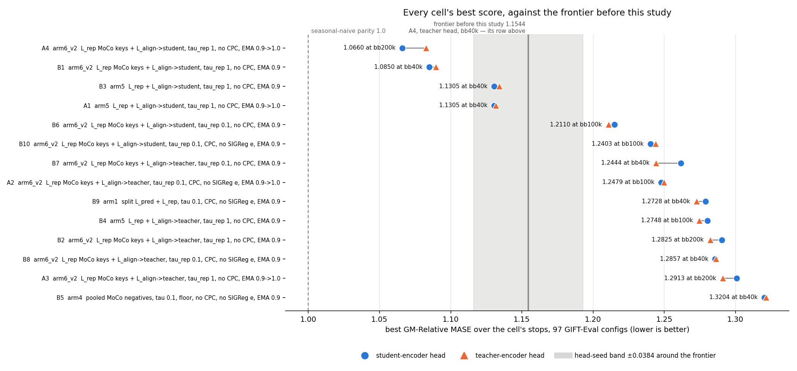
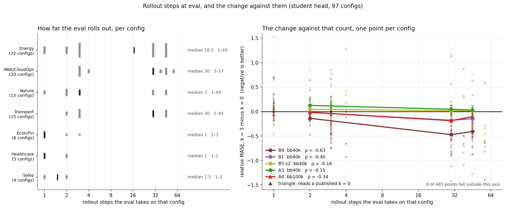
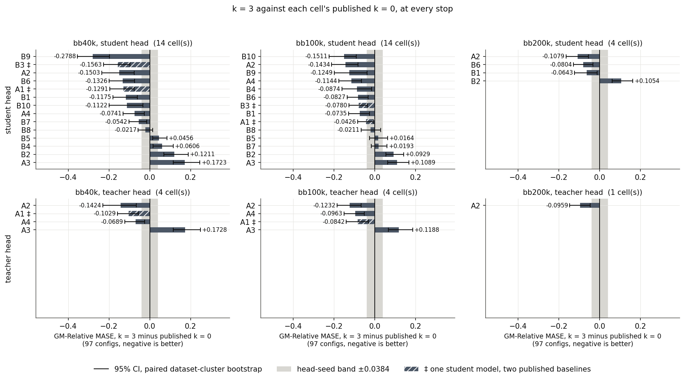
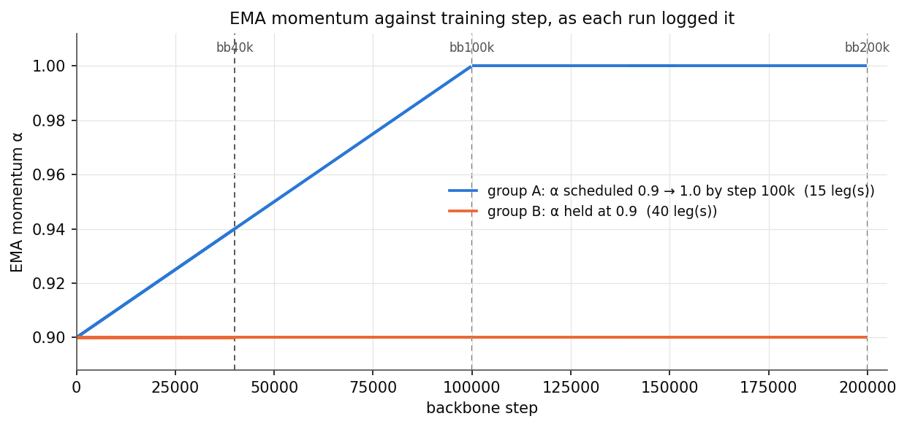
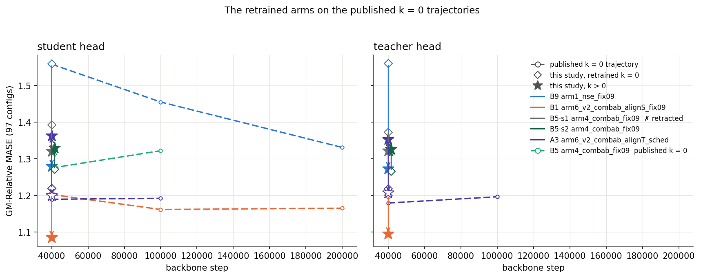

# Rollout depth 3 sets the project's best GM-Relative MASE

The best GM-Relative MASE before this study was 1.1544. The best now is 1.0660,
which is 0.0884 lower. The configuration is arm6_v2 (L_rep MoCo keys, tau_rep 1
+ L_align on the student, no CPC, EMA 0.9 to 1.0). It reached that number at
200,000 backbone steps, on the student head [cell A4]. Every cell ran once, on
one backbone seed. This study measures a frontier and a direction, not a
per-recipe ranking.

Five terms come first. Section 14 has the glossary for every other term.

- **GM-Relative MASE.** The geometric mean over the 97 GIFT-Eval configs of each
  config's MASE divided by the seasonal-naive MASE. Lower is better. 1.0 is
  seasonal-naive parity.
- **Configuration.** An arm, its loss terms, `L_align`'s target and the EMA
  regime. The four together name one of the card's 14 recipes. Three of the four
  alone do not.
- **Cell.** The card's short id for a configuration, `A1` to `A4` and `B1` to
  `B10`. A figure or a table uses it after the configuration appears in its
  legend or header.
- **bb40k, bb100k, bb200k.** Backbone step 40,000, 100,000 and 200,000.
- **The card.** The issue this study answers. It names the 14 cells, the stops
  and the criteria.

`scripts/cell_config.py` builds every configuration name in this report from the
launcher sources.

## 1. The frontier

*Best score per cell, one mark per head, sorted best at the top.*

*GM-Relative MASE against backbone train step, all 14 cells, both heads.*

At bb100k, arm6_v2, L_align on the student, EMA 0.9 to 1.0 [A4] improves on its
own published `k = 0`. The gain is 0.1144 on the student head.

## 2. The hardest families

*Per-domain, student-encoder head. Grey is the best per-domain result before
this study. The black ring is seasonal-naive parity at 1.0. Config count
under each family name.*

*The same pairs on the teacher-encoder head, without B2.*

All four hard families move toward 1.0 on arm6_v2, L_align on the student,
EMA 0.9 to 1.0 [A4] at bb100k. None of them reaches it. All four move away from
1.0 on arm6_v2, L_align on the teacher, EMA 0.9 [B2] at bb200k.

### The numbers behind the radar

<!-- DOMAIN:BEGIN -->

**arm6_v2 (L_rep MoCo keys, tau_rep 1 + L_align on the student, no CPC, EMA 0.9 to 1.0).** At bb100k, on the student-encoder head [A4]. The cell that sets this study's frontier, at the deepest stop its parent published. Published `k = 0`.

| family | configs | rollout steps | k = 0 | k = 3 | difference | where k = 3 leaves it |
|---|---:|---:|---:|---:|---:|---|
| Energy ⚑ | 32 | 16.5 (1–45) | 1.481 | 1.279 | -0.201 | toward 1.0 |
| Web/CloudOps ⚑ | 20 | 30 (3–57) | 1.257 | 1.199 | -0.057 | toward 1.0 |
| Nature | 15 | 3 (1–45) | 0.866 | 0.822 | -0.044 | stays below 1.0, lower |
| Transport | 15 | 30 (2–45) | 1.021 | 0.901 | -0.120 | **past 1.0** |
| Econ/Fin ⚑ | 6 | 1 (1–3) | 1.414 | 1.150 | -0.263 | toward 1.0 |
| Healthcare ⚑ | 5 | 1 (1–2) | 1.171 | 1.113 | -0.058 | toward 1.0 |
| Sales | 4 | 1.5 (1–2) | 0.800 | 0.797 | -0.003 | stays below 1.0, lower |

**arm6_v2 (L_rep MoCo keys, tau_rep 1 + L_align on the student, no CPC, EMA 0.9).** At bb40k, on the student-encoder head [B1]. The pair whose `k = 0` side this study trained, so the depth is the only change.

| family | configs | rollout steps | k = 0 | k = 3 | difference | where k = 3 leaves it |
|---|---:|---:|---:|---:|---:|---|
| Energy ⚑ | 32 | 16.5 (1–45) | 1.471 | 1.270 | -0.200 | toward 1.0 |
| Web/CloudOps ⚑ | 20 | 30 (3–57) | 1.288 | 1.211 | -0.077 | toward 1.0 |
| Nature | 15 | 3 (1–45) | 0.884 | 0.840 | -0.044 | stays below 1.0, lower |
| Transport | 15 | 30 (2–45) | 1.040 | 0.907 | -0.133 | **past 1.0** |
| Econ/Fin ⚑ | 6 | 1 (1–3) | 1.466 | 1.212 | -0.254 | toward 1.0 |
| Healthcare ⚑ | 5 | 1 (1–2) | 1.103 | 1.077 | -0.026 | toward 1.0 |
| Sales | 4 | 1.5 (1–2) | 0.772 | 0.775 | +0.004 | stays below 1.0, higher |

**arm6_v2 (L_rep MoCo keys, tau_rep 1 + L_align on the teacher, no CPC, EMA 0.9).** At bb200k, on the student-encoder head [B2]. The arm and stop the card quotes its own per-family numbers from. Published `k = 0`.

| family | configs | rollout steps | k = 0 | k = 3 | difference | where k = 3 leaves it |
|---|---:|---:|---:|---:|---:|---|
| Energy ⚑ | 32 | 16.5 (1–45) | 1.388 | 1.587 | +0.198 | away from 1.0 |
| Web/CloudOps ⚑ | 20 | 30 (3–57) | 1.283 | 1.347 | +0.064 | away from 1.0 |
| Nature | 15 | 3 (1–45) | 0.867 | 0.914 | +0.047 | stays below 1.0, higher |
| Transport | 15 | 30 (2–45) | 1.021 | 1.077 | +0.056 | away from 1.0 |
| Econ/Fin ⚑ | 6 | 1 (1–3) | 1.489 | 1.869 | +0.380 | away from 1.0 |
| Healthcare ⚑ | 5 | 1 (1–2) | 1.261 | 1.283 | +0.022 | away from 1.0 |
| Sales | 4 | 1.5 (1–2) | 0.830 | 0.824 | -0.006 | stays below 1.0, lower |

⚑ marks the four families the card names as the ones seasonal naive wins by the largest margin: Energy, Econ/Fin, Web/CloudOps, Healthcare.

`rollout steps` is how many times the eval runs `rollout_latent` on a config of that family, median and range. It is the same column for every table here, because it depends on the config and not on the run.

<!-- DOMAIN:END -->

## 3. How far the eval rolls out, and what the depth does there

*Left: rollout steps per config, by family. Right: the same count against
`k = 3` minus `k = 0` per config, student head. The Protocol gives the
formula and the source of every horizon.*

<!-- ROLLOUTCORR:BEGIN -->

| configuration | cell, stop | rho(rollout steps, `k = 0`) | rho(rollout steps, `k = 3` minus `k = 0`) |
|---|---|---:|---:|
| arm1 (split L_pred + L_rep, tau 0.1, CPC, no SIGReg on e, EMA 0.9) | B9, bb40k | +0.407 | -0.629 |
| arm6_v2 (L_rep MoCo keys, tau_rep 1 + L_align on the student, no CPC, EMA 0.9) | B1, bb40k | +0.415 | -0.399 |
| arm4 (pooled contrastive, MoCo negatives, floor subtracted, tau 0.1, no CPC, no SIGReg on e, EMA 0.9) | B5·s2, bb40k | +0.201 | -0.160 |
| arm6_v2 (L_rep MoCo keys, tau_rep 1 + L_align on the teacher, no CPC, EMA 0.9 to 1.0) | A3, bb40k | +0.237 | -0.152 |
| arm6_v2 (L_rep MoCo keys, tau_rep 1 + L_align on the student, no CPC, EMA 0.9 to 1.0) | A4 †, bb100k | +0.350 | -0.345 |
| arm4 (pooled contrastive, MoCo negatives, floor subtracted, tau 0.1, no CPC, no SIGReg on e, EMA 0.9) | B5·s1 ✗, bb40k | +0.051 | +0.211 |

Spearman rank correlation over the 97 configs, on relative MASE, student head. Every row has n = 97.

**Left column.** Every pair is positive, +0.051 to +0.415. A config the eval rolls out further is a harder config at `k = 0` as well.

**Right column.** It reads: the further the eval rolls out on a config, the more `k = 3` improves that config. The one positive value is B5·s1 ✗, the backbone this report retracts. The pairs it carries all run one way, -0.152 to -0.629.

† this pair reads a published `k = 0`. Every other row trained both sides here. ✗ a retracted backbone.

<!-- ROLLOUTCORR:END -->

Per config, the two move together. Across families, they do not. Econ/Fin needs
a median of 1 rollout step. It also gains the most on arm6_v2, L_align on the
student, EMA 0.9 to 1.0 [A4], at -0.263. The per-family table under the radar
holds that number.

## 4. Where the change lands, by horizon

*GM-Relative MASE by horizon term, each depth against the same arm's own
`k = 0`, bb40k, student-encoder head.*

*The same, on the teacher-encoder head.*

B9 and B1 gain most on medium and long, and B5·s2 and A3 lose most on short.

## 5. Per-depth forecast error during training

*`1 − cos(f^(j)_t, h_{t+1+j})` during training, one line per depth `j`,
against the `k = 0` run's single line. One panel per trained run.*

The error grows with the depth in every run. Only B9 and B1 hold a lower depth-0
error than their own `k = 0`, over every end-of-run window.

*The depth-0 line of every run, on one axis. `1 − ff` is the same quantity on
both depths, unlike the loss.*

## 6. Rollout fidelity against depth

*`cos` between the rolled latent and the true `h_{T_0+d}`, `d = 1..16`, bb40k
checkpoints. Top: one panel per cell, all 14. Bottom: the change against the
same arm's own `k = 0`. One fixed diagnostic batch carries every curve, and
it is not held out against the pre-training data.*

<!-- FIDELITY:BEGIN -->

Every one of the 5 arms that trained `k = 3` rolls out more faithfully than its own `k = 0`, at all 16 depths. The scores do not follow. The fixed-point approximation does what it was built to do. So where a score did not improve, the approximation is not the part that failed.

<!-- FIDELITY:END -->

## 7. `k = 3` minus `k = 0`, per cell, at every stop

*The parent report's `schedule_vs_fixed` mapped onto this study.*

Every cell reached bb100k. There, 10 of the 14 cells improve on their published
`k = 0` on the student head. Four move the wrong way, and 2 of those pass the
±0.0384 band.

## 8. The EMA schedule each group trained under

*The `ema_tau` column every backbone leg logged. Group A raises α from 0.9 to
1.0 by step 100k. Group B holds α at 0.9.*

## 9. Which encoder the head reads

*Teacher head minus student head.*

The two heads sit inside the ±0.0384 head-seed band on 34 of the 36 cell-stops.
A3 at bb200k is the widest gap in the grid.

## 10. Latent movement across the checkpoints

*`1 − cos` on `h_t` and on `e_t` between two adjacent checkpoints of one run,
on the fixed diagnostic batch.*

The deeper run moves the encoder-output latent further than its own `k = 0`, on
5 of the 6 matched intervals. B1 moves it furthest, over steps 25,000 to 40,000.

## 11. Training curves

*`u_batchtime` on `h_t` and on `e_t` during training. 1.0 is every dimension
in use and the rule at `1/H` is one direction.*

No run's dimension usage reaches zero, and the lowest value on `h_t` over a
run's second half is A3 at `k = 3`.

*Training loss.*

Every run's loss falls and none diverges. A `k = 3` loss sums three more terms
than a `k = 0` loss, so the two levels are not comparable.

## 12. Collapse watch

<!-- COLLAPSE:BEGIN -->

The first line of a cell is the mean over the last 10% of the run. The second line is the lowest value over the run's second half.

`ff` is `cos(f_t, h_{t+1})` and `cos_err_dj` is `1 − cos(f^(j)_t, h_{t+1+j})`, so `cos_err_d0` is `1 − ff` and `cos_err_dj` is the card's per-depth `ff`. A collapsed latent points one way, so `u_batchtime` runs toward zero WHILE `ff` runs toward 1. It is that pair, not `ff` alone, that separates collapse from a good forecast.

**Not logged: `qk_logit_maxabs`.** No run in this study writes that column at any depth, so this study does not watch it.

| arm | k | `ff` | `cos_err_d0` | `cos_err_d1` | `cos_err_d2` | `cos_err_d3` | `u_batchtime` on `h_t` | `u_batchtime` on `e_t` |
|---|---|---|---|---|---|---|---|---|
| B9 | 0 | 0.3838 0.3594 | — | — | — | — | 0.7782 0.7561 | 0.3174 0.2039 |
| B9 | 3 | 0.4776 0.4250 | 0.5224 0.5000 | 0.6384 0.6042 | 0.7043 0.6706 | 0.7451 0.7132 | 0.3892 0.2808 | 0.1184 0.0950 |
| B1 | 0 | 0.5226 0.4204 | — | — | — | — | 0.3904 0.2118 | 0.3696 0.1992 |
| B1 | 3 | 0.6347 0.4832 | 0.3653 0.2469 | 0.4471 0.3029 | 0.4734 0.3109 | 0.4857 0.3166 | 0.1526 0.1231 | 0.1125 0.0968 |
| B5·s1 ✗ | 0 | 0.2946 0.2679 | — | — | — | — | 0.9312 0.8393 | 0.0423 0.0301 |
| B5·s1 ✗ | 3 | 0.2824 0.2578 | 0.7176 0.6555 | 0.7354 0.6785 | 0.7516 0.6901 | 0.7611 0.7047 | 0.9354 0.8693 | 0.0624 0.0525 |
| B5·s2 | 0 | 0.3060 0.2674 | — | — | — | — | 0.9296 0.8405 | 0.0443 0.0381 |
| B5·s2 | 3 | 0.3037 0.2717 | 0.6963 0.6270 | 0.7138 0.6555 | 0.7289 0.6750 | 0.7403 0.6886 | 0.9250 0.8409 | 0.0515 0.0328 |
| A3 | 0 | 0.9279 0.6831 | — | — | — | — | 0.1445 0.1127 | 0.0370 0.0284 |
| A3 | 1 | 0.8120 0.6187 | 0.1880 0.0800 | 0.2272 0.1008 | — | — | 0.1791 0.1166 | 0.0697 0.0374 |
| A3 | 3 | 0.8790 0.8505 | 0.1210 0.0676 | 0.1352 0.0725 | 0.1508 0.0788 | 0.1592 0.0820 | 0.1730 0.0800 | 0.0561 0.0372 |

The lowest `u_batchtime` any arm reaches over its second half is 0.0284, on `u_batchtime_e`, A3 at k = 0. One direction would give `1/H` = 0.0156 at `d_model = 64`, so that arm sits 1.8× above it. No arm reaches zero at any depth.

On `h_t`, 1 of the 5 arms that trained both depths ends the deeper run below half its own `k = 0` usage. The drop is B1 0.3904 → 0.1526. That is a reading and not a verdict. No arm reaches zero, and this study runs no control that separates a lower usage from a worse score.

<!-- COLLAPSE:END -->

## 13. The card's success criteria, cell by cell

<!-- CRITERIA:BEGIN -->

| cell | med+long, 42 configs | short, 55 configs | PRIMARY | full-97 Δ | SECONDARY |
|---|---|---|---|---|---|
| A1 | -5.9% | -1.7% | **PASS** | -0.0426 | **PASS** |
| A2 | -17.6% | -4.3% | **PASS** | -0.1434 | **PASS** |
| A3 | -3.2% | +19.6% | fail | +0.1089 | fail |
| A4 | -13.5% | -6.5% | **PASS** | -0.1144 | **PASS** |
| B1 | -9.4% | -3.9% | **PASS** | -0.0735 | **PASS** |
| B2 | +1.0% | +12.6% | fail | +0.0929 | fail |
| B3 | -7.9% | -5.0% | **PASS** | -0.0780 | **PASS** |
| B4 | -19.5% | +5.0% | fail | -0.0874 | **PASS** |
| B5 | -3.6% | +5.1% | fail | +0.0164 | fail |
| B6 | -10.7% | -2.9% | **PASS** | -0.0827 | **PASS** |
| B7 | -2.9% | +4.9% | fail | +0.0193 | fail |
| B8 | -10.8% | +6.1% | fail | -0.0211 | fail |
| B9 | -21.4% | +2.6% | fail | -0.1249 | **PASS** |
| B10 | -15.4% | -7.2% | **PASS** | -0.1511 | **PASS** |

**7 of 14 cells meet the primary criterion at bb100k, and 9 of 14 meet the secondary one.** At bb40k it is 8 and 9 of 14. At bb200k it is 3 and 3 of 4. On the teacher head at bb100k, where only group A publishes a baseline, it is 3 and 3 of 4.

Primary: medium+long at least 5% better AND short losing less than 2%. Secondary: full-97 Δ at or below −0.0384, the head-seed band. Δ is `k = 3` minus the cell's published `k = 0`, so negative is a gain. Student head at bb100k, the stop every one of the 14 cells reached.

The count is over CELLS. A1 and B3 share one student model, so the 14 cells hold 13 student models. The secondary criterion therefore counts one model fewer than it counts cells.

**Every cell here ran once, on one backbone seed.** The spread over the rows does not rank the recipes.

<!-- CRITERIA:END -->

## 14. Tables

<!-- TABLES:BEGIN -->

### Coverage

The card names 14 cells. This study scored **14 of them**: A1, A2, A3, A4, B1, B2, B3, B4, B5, B6, B7, B8, B9, B10. Every cell carries a number.

| configuration | cell | loss terms that use `f` | depths trained | stops scored |
|---|---|---|---|---|
| arm5 (L_rep, tau_rep 1 + L_align on the student, no CPC, EMA 0.9 to 1.0) | A1 | L_align only | k = 3 | bb40k, bb100k |
| arm6_v2 (L_rep MoCo keys, tau_rep 0.1 + L_align on the teacher, CPC, no SIGReg on e, EMA 0.9 to 1.0) | A2 | L_align + CPC auxiliary | k = 3 | bb40k, bb100k, bb200k |
| arm6_v2 (L_rep MoCo keys, tau_rep 1 + L_align on the teacher, no CPC, EMA 0.9 to 1.0) | A3 | L_align only | k = 0, k = 1, k = 3 | bb40k, bb100k, bb200k |
| arm6_v2 (L_rep MoCo keys, tau_rep 1 + L_align on the student, no CPC, EMA 0.9 to 1.0) | A4 | L_align only | k = 3 | bb40k, bb100k, bb200k |
| arm6_v2 (L_rep MoCo keys, tau_rep 1 + L_align on the student, no CPC, EMA 0.9) | B1 | L_align only | k = 0, k = 3 | bb40k, bb100k, bb200k |
| arm6_v2 (L_rep MoCo keys, tau_rep 1 + L_align on the teacher, no CPC, EMA 0.9) | B2 | L_align only | k = 3 | bb40k, bb100k, bb200k |
| arm5 (L_rep, tau_rep 1 + L_align on the student, no CPC, EMA 0.9) | B3 | L_align only | k = 3 | bb40k, bb100k |
| arm5 (L_rep, tau_rep 1 + L_align on the teacher, no CPC, EMA 0.9) | B4 | L_align only | k = 3 | bb40k, bb100k, bb200k |
| arm4 (pooled contrastive over batch and channels, MoCo negatives, floor subtracted, tau 0.1, no CPC, no SIGReg on e, EMA 0.9) | B5 | pooled xshh_allt, floor subtracted | k = 0, k = 3 | bb40k, bb100k |
| arm6_v2 (L_rep MoCo keys, tau_rep 0.1 + L_align on the student, no CPC, EMA 0.9) | B6 | L_align only | k = 3 | bb40k, bb100k, bb200k |
| arm6_v2 (L_rep MoCo keys, tau_rep 0.1 + L_align on the teacher, no CPC, EMA 0.9) | B7 | L_align only | k = 3 | bb40k, bb100k |
| arm6_v2 (L_rep MoCo keys, tau_rep 0.1 + L_align on the teacher, CPC, no SIGReg on e, EMA 0.9) | B8 | L_align + CPC auxiliary | k = 3 | bb40k, bb100k |
| arm1 (split L_pred + L_rep, tau 0.1, CPC, no SIGReg on e, EMA 0.9) | B9 | split L_pred + CPC auxiliary | k = 0, k = 3 | bb40k, bb100k |
| arm6_v2 (L_rep MoCo keys, tau_rep 0.1 + L_align on the student, CPC, no SIGReg on e, EMA 0.9) | B10 | L_align + CPC auxiliary | k = 3 | bb40k, bb100k, bb200k |

Stops scored: bb40k, bb100k, bb200k. The card's extend rule reads a cell's bb40k number against its bb100k number, so it fires only where this study has both.

### This study's k = 3 against the published k = 0

GM-Relative MASE over the same 97 GIFT-Eval configs, strategy B4, horizon 16. Δ is this study minus the published number, so negative is a gain. A verdict reads Δ against the ±0.0384 head-seed band: closer than that is `flat`. A dash is a number no parent published. ‡ marks the two cells that share one student model. The second line of a verdict cell is its 95% paired dataset-cluster interval.

At bb100k, the stop every one of the 14 cells reached, counted over distinct models. Student head: 13 distinct models, **8 better, 3 flat, 2 worse**. Teacher head, group A only: 4 distinct models, **3 better, 0 flat, 1 worse**.

| cell | head | 40k k=3 | 40k pub | Δ | | 100k k=3 | 100k pub | Δ | | 200k k=3 | 200k pub | Δ | |
|---|---|---|---|---|---|---|---|---|---|---|---|---|---|
| A1 | student ‡ | 1.1305 | 1.2596 | -0.1291 | better [-0.1966, -0.0758] | 1.1676 | 1.2102 | -0.0426 | better [-0.0835, -0.0069] | — | 1.1910 | — | — |
| A1 | teacher | 1.1318 | 1.2347 | -0.1029 | better [-0.1590, -0.0560] | 1.1565 | 1.2407 | -0.0842 | better [-0.1396, -0.0314] | — | — | — | — |
| A2 | student | 1.2735 | 1.4238 | -0.1503 | better [-0.2357, -0.0762] | 1.2479 | 1.3913 | -0.1434 | better [-0.2112, -0.0820] | 1.2507 | 1.3586 | -0.1079 | better [-0.1653, -0.0546] |
| A2 | teacher | 1.2753 | 1.4177 | -0.1424 | better [-0.2301, -0.0659] | 1.2514 | 1.3746 | -0.1232 | better [-0.1841, -0.0660] | 1.2500 | 1.3459 | -0.0959 | better [-0.1472, -0.0462] |
| A3 | student | 1.3618 | 1.1895 | +0.1723 | worse [+0.1159, +0.2454] | 1.3010 | 1.1921 | +0.1089 | worse [+0.0627, +0.1672] | 1.3998 | — | — | — |
| A3 | teacher | 1.3521 | 1.1793 | +0.1728 | worse [+0.1161, +0.2480] | 1.3151 | 1.1963 | +0.1188 | worse [+0.0672, +0.1857] | 1.2913 | — | — | — |
| A4 | student | 1.0862 | 1.1603 | -0.0741 | better [-0.1305, -0.0268] | 1.0801 | 1.1945 | -0.1144 | better [-0.1763, -0.0648] | 1.0660 | — | — | — |
| A4 | teacher | 1.0855 | 1.1544 | -0.0689 | better [-0.1223, -0.0249] | 1.0874 | 1.1837 | -0.0963 | better [-0.1505, -0.0506] | 1.0828 | — | — | — |
| B1 | student | 1.0850 | 1.2025 | -0.1175 | better [-0.1801, -0.0615] | 1.0881 | 1.1616 | -0.0735 | better [-0.1287, -0.0255] | 1.1009 | 1.1652 | -0.0643 | better [-0.1230, -0.0130] |
| B1 | teacher | 1.0948 | — | — | — | 1.0897 | — | — | — | 1.1001 | — | — | — |
| B2 | student | 1.3976 | 1.2765 | +0.1211 | worse [+0.0690, +0.1889] | 1.3443 | 1.2514 | +0.0929 | worse [+0.0541, +0.1415] | 1.2904 | 1.1850 | +0.1054 | worse [+0.0609, +0.1621] |
| B2 | teacher | 1.4041 | — | — | — | 1.3117 | — | — | — | 1.2825 | — | — | — |
| B3 | student ‡ | 1.1305 | 1.2868 | -0.1563 | better [-0.2263, -0.0966] | 1.1676 | 1.2456 | -0.0780 | better [-0.1265, -0.0365] | — | 1.2034 | — | — |
| B3 | teacher | 1.1343 | — | — | — | 1.1618 | — | — | — | — | — | — | — |
| B4 | student | 1.3334 | 1.2728 | +0.0606 | worse [+0.0166, +0.1147] | 1.2804 | 1.3678 | -0.0874 | better [-0.1607, -0.0155] | 1.3182 | — | — | — |
| B4 | teacher | 1.3339 | — | — | — | 1.2748 | — | — | — | 1.3202 | — | — | — |
| B5 | student | 1.3204 | 1.2748 | +0.0456 | worse [+0.0145, +0.0846] | 1.3383 | 1.3219 | +0.0164 | flat [-0.0256, +0.0634] | — | — | — | — |
| B5 | teacher | 1.3216 | — | — | — | 1.3428 | — | — | — | — | — | — | — |
| B6 | student | 1.2297 | 1.3623 | -0.1326 | better [-0.1998, -0.0742] | 1.2151 | 1.2978 | -0.0827 | better [-0.1356, -0.0321] | 1.2207 | 1.3011 | -0.0804 | better [-0.1287, -0.0340] |
| B6 | teacher | 1.2184 | — | — | — | 1.2110 | — | — | — | 1.2339 | — | — | — |
| B7 | student | 1.2617 | 1.3159 | -0.0542 | better [-0.1016, -0.0147] | 1.3205 | 1.3012 | +0.0193 | flat [-0.0166, +0.0601] | — | 1.3325 | — | — |
| B7 | teacher | 1.2444 | — | — | — | 1.2780 | — | — | — | — | — | — | — |
| B8 | student | 1.2857 | 1.3074 | -0.0217 | flat [-0.0565, +0.0140] | 1.3157 | 1.3368 | -0.0211 | flat [-0.0674, +0.0292] | — | — | — | — |
| B8 | teacher | 1.2865 | — | — | — | 1.3239 | — | — | — | — | — | — | — |
| B9 | student | 1.2791 | 1.5579 | -0.2788 | better [-0.3543, -0.1978] | 1.3299 | 1.4548 | -0.1249 | better [-0.1982, -0.0383] | — | 1.3308 | — | — |
| B9 | teacher | 1.2728 | — | — | — | 1.3094 | — | — | — | — | — | — | — |
| B10 | student | 1.2669 | 1.3791 | -0.1122 | better [-0.1996, -0.0340] | 1.2403 | 1.3914 | -0.1511 | better [-0.2239, -0.0908] | 1.2624 | — | — | — |
| B10 | teacher | 1.2730 | — | — | — | 1.2499 | — | — | — | 1.2440 | — | — | — |

### Stop reasons: what the extend rule read at each cell

The rule reads one cell's bb40k number against its bb100k number, per head. A head that moved down earns the second 100,000 steps. A head that moved up stops. Both columns are bb100k minus bb40k, so negative is an improvement. It held 6 cells at 100k. `last stop` and `ended by` are the parent report's two columns: where each cell finished, and what finished it.

| cell | 40k→100k student | 40k→100k teacher | decision | last stop | ended by | why |
|---|---|---|---|---|---|---|
| A1 | +0.0371 | +0.0248 | **stop at 100k** | bb100k | extend rule | both heads moved up |
| A2 | -0.0256 | -0.0239 | **extend both heads** | bb200k | ladder ceiling | both heads moved down |
| A3 | -0.0608 | -0.0370 | **extend both heads** | bb200k | ladder ceiling | both heads moved down |
| A4 | -0.0061 | +0.0019 | **extend both heads** | bb200k | ladder ceiling | the student head moved down. The teacher head moved +0.0019, 5% of the ±0.0384 head-seed band, so the rule decides nothing there. Extended by hand, on free hardware |
| B1 | +0.0030 | -0.0051 | **extend both heads** | bb200k | ladder ceiling | the card's call: both moves sit inside the ±0.0384 head-seed band, so the rule decides nothing |
| B2 | -0.0533 | -0.0924 | **extend both heads** | bb200k | ladder ceiling | both heads moved down |
| B3 | +0.0371 | +0.0276 | **stop at 100k** | bb100k | extend rule | both heads moved up |
| B4 | -0.0530 | -0.0591 | **extend both heads** | bb200k | ladder ceiling | both heads moved down |
| B5 | +0.0179 | +0.0212 | **stop at 100k** | bb100k | extend rule | both heads moved up |
| B6 | -0.0146 | -0.0074 | **extend both heads** | bb200k | ladder ceiling | both heads moved down |
| B7 | +0.0587 | +0.0336 | **stop at 100k** | bb100k | extend rule | both heads moved up |
| B8 | +0.0300 | +0.0374 | **stop at 100k** | bb100k | extend rule | both heads moved up |
| B9 | +0.0508 | +0.0365 | **stop at 100k** | bb100k | extend rule | both heads moved up |
| B10 | -0.0266 | -0.0231 | **extend both heads** | bb200k | ladder ceiling | both heads moved down |

**The rule chooses which cells reach bb200k.** It sent 8 cells there. On 4 of the 6 cells it stopped (A1, B3, B5, B8) the move it read was smaller than the ±0.0384 band. Both hand overrides extended a cell.

### Glossary

| term | what it means here |
|---|---|
| the card | the issue this study answers, and the 14 cells, stops and criteria it names |
| cell | the card's short id for one of those 14 configurations, `A1`..`A4` and `B1`..`B10`. A figure or a table uses it after the configuration appears in its legend or header |
| arm | a (cell, backbone seed, machine) triple. B5 trained three, so the cell is not the unit a delta lives in |
| `k`, rollout depth | the value of `--train-rollout-depth`. It copies every loss term the forecast operator `f` enters at depths 1..`k` and sums the copies. `k = 0` is today's training |
| the fixed-point approximation | how training rolls the forecast out: the depth-`j` input is the model's own depth-`j-1` predictions, not the true prefix. It buys one parallel pass over every `t`, and it is the card's alternative suspect to the objective |
| bb40k, bb100k, bb200k | backbone step 40,000 / 100,000 / 200,000. bb40k is the one stop every run here reached |
| GM-Relative MASE | geometric mean over the 97 GIFT-Eval configs of each config's MASE divided by the seasonal-naive MASE. Lower is better. 1.0 is seasonal-naive parity |
| B4 eval strategy | GIFT-Eval's official evaluation strategy, the one the parent reports use |
| rollout steps at eval | how many times the eval calls `rollout_latent` on one config: `ceil(prediction_length / 16)`, since B4 asks for one token per patch of the horizon and the function takes one autoregressive step per token. It is a property of the config, not of the run |
| student / teacher head | the quantile head is trained twice per backbone, once on the student encoder and once on its EMA copy, the teacher. The two are separate measurements of one backbone |
| f-bearing term | the loss term that the forecast operator `f` enters. `--train-rollout-depth K` duplicates it at depth 1..K |
| `rep_only` | the representation loss with no forecast term |
| `L_align` | the term that aligns `f`'s output with the future latent |
| `L_pred` | the predictive contrastive term, split from the representation term |
| `xshh_allt` | negatives pooled across the batch and across channels, taken over every time index |
| `u_batchtime` | dimension usage of a latent over the pooled (batch × time) sample axis: `1 / (H · mean off-diagonal squared cosine)`, capped at 1. 1.0 is all `H` dimensions in use and a value near `1/H` is one direction. `h_t` is the encoder latent, `e_t` the embedding it reads |
| collapse | the latent falling onto few directions, so `u_batchtime` runs toward zero. The card watches for it because a model can win the deeper f-bearing terms by flattening `f` |
| `arm1 nse` | split L_pred + L_rep, tau 0.1, CPC, no SIGReg on e. Cell B9 |
| `arm4 combab` | pooled contrastive over batch and channels, MoCo negatives, floor subtracted, tau 0.1, no CPC, no SIGReg on e. Cell B5. Note: its launcher's own label says tau 1.0, and its `--tau 1.0` sits before the shared `--tau 0.10`, so argparse kept 0.10 |
| `arm5 combab` | L_rep, tau_rep 1 + L_align, no CPC. Cells A1, B3, B4 |
| `arm6_v2 combab` | L_rep MoCo keys, tau_rep 1 + L_align, no CPC. Cells A3, A4, B1, B2 |
| `arm6_v2 ncpc` | L_rep MoCo keys, tau_rep 0.1 + L_align, no CPC. Cells B6, B7 |
| `arm6_v2 nse` | L_rep MoCo keys, tau_rep 0.1 + L_align, CPC, no SIGReg on e. Cells A2, B8, B10 |
| the align target | `L_align` compares `f`'s output against the student encoder's future latent or against the EMA teacher's. Two cells that share an arm and differ only here are two configurations |
| head-seed band ±0.0384 | how far the head seed alone moved a score in `ema_sched_ladder.md`, pooled. It bounds the head seed and nothing else |
| dataset-cluster | the resampling unit of every interval here. `<ds>/short`, `/medium` and `/long` are three configs of one series, so the bootstrap resamples the dataset, not the config |
| `mixup` | the count of examples the batch mixer touched in a 200-step window. Two runs on one data order print one count |
| ✗ | a retracted arm: its `k = 0` baseline is a rented-box artifact, so its depth delta is withdrawn |

<!-- TABLES:END -->

## 15. What this study cannot support

<!-- LIMITS:BEGIN -->

| the claim | what stops it |
|---|---|
| Any group-A delta against a published `k = 0` | The card's baseline validity gate fails on group A: A3 misses its published number by 0.0294 against a gate of 0.0002. The card then asks for the `k = 0` side of every group-A cell to be retrained, and this study reads those baselines from the parent report. |
| That `k = 3` helps, or that it hurts | This study trained both depths on 4 arms, and they do not point one way: B9 -0.2791, B1 -0.1175, B5·s2 +0.0575, A3 +0.1429 (`depth_response.png`). Each is one draw in the backbone seed, so this study reads a direction and not a per-recipe ranking. |
| That the gain is the depth alone | B1 carries the `L_align` ×4 re-weighting control, and the re-weighting moves the score on its own. The annex's B1 table and its figure print the share of the move, per head. |
| That one of the two pays more than the other | The re-weighting's move and the depth's move sit inside each other's 95% intervals, in the same B1 table in the annex. That cell measures both and ranks neither. |
| Any per-cell verdict | Every cell is n = 1 in the backbone seed. The ±0.0384 band bounds the HEAD seed alone, and backbone-seed variance is unmeasured. |
| That depth 3 is the right depth | Only `k = 3` ran on the 14 cells. One ladder holds a second depth, on A3, and its `k = 1` delta covers zero: -0.0195 [-0.0537, +0.0148] on the student. |
| The per-horizon criterion of the card, the issue this study answers, at scale | This study trained the `k = 0` side on 4 arms, and only at bb40k. Every other pair reads its baseline from a parent report, so it is a screen and not a test. |
| That `k = 3` leads at 200k | 4 cells hold a published `k = 0` at 200k. A2 by -0.1079, B6 by -0.0804, B1 by -0.0643 lead it. B2 by +0.1054 loses it, against a largest gain of -0.1079, so the 4 cells do not point one way. |
| The cost of the depth | Two solo probes agree. The annex step-time tables carry them. A3's reading covers 127 of its 273 timing windows, so it is not comparable to them. |
| That the 200k reading is unconditional | The extend rule reads the bb40k-to-bb100k contrast, which the Protocol calls not head-matched. It fired inside its own ±0.0384 band on 4 stopped cells, and both manual overrides extended. |

<!-- LIMITS:END -->

## Annex

Each item here says why it exists. Every one answers a question from a review of
this study. None of them is a deliverable the card names.

### Every trained depth against its own retrained `k = 0`

The card's criterion is a test against the same recipe at `k = 0`, and only
five arms trained both depths. This figure asks what the depth is worth on
those five. The four it does not retract read B9 −0.2791, B1 −0.1175,
B5·s2 +0.0575 and A3 +0.1429. They do not point one way. Each is one draw in
the backbone seed.

### B1: the `L_align` ×4 control against the depth

Summing the depths also multiplies the f-bearing term's weight by four, so a
win at `k = 3` could be either. This figure separates them on B1, the cell
whose retrained `k = 0` reproduces its published number exactly. It shows the
re-weighting alone taking 44% of the student's move and 49% of the teacher's.

### A3: the same control on the cell the depth damages most

A3 is where `k = 3` costs the most, so the same question runs there. Its
columns are separate draws, so it reads as direction only. It shows the ×4
re-weighting hurting A3 on its own, +0.0401 on the student.

### Does this study's trainer reproduce the published `k = 0`?

This runs the card's validity gate on every retrained `k = 0`: two rows miss
it, A3 by 0.0294 and B5·s1 by 0.1169.

### What the box and the backbone seed are worth

B5 trained three backbones on one recipe. This measures the box at 0.1166 and
the backbone seed at 0.0035. Both are nuisance draws, and the frontier does not
carry them.

### A3's bb200k student head, drawn twice

A3's bb200k student number is the largest student/teacher gap in the grid,
so it could be a bad head draw. This figure trains a second head off the
same backbone at a second seed. It shows the two draws 0.0100 apart, so the
first draw stands.

### What the second 100,000 backbone steps buys

The 200k column decides part of the frontier, so it needs its own contrast
against 100k on the same backbone. It shows more of the extended
measurements getting worse at bb200k than better.

### Each cell's ladder against its own published `k = 0`

The ladder figure draws all 14 cells against one rule, which hides each cell's
own baseline. This small-multiple draws every cell against the number its
parent published, with seasonal-naive parity marked. It shows nine cells below
their own baseline at every stop, three above it at every stop, and two that
change sign.

### The retrained arms on the published trajectories

A cell's `k = 3` at 40,000 steps lands somewhere on the `k = 0` trajectory.
That place says how many `k = 0` steps the depth is worth. This figure marks
the five retrained arms on those trajectories. It shows B1's `k = 3` at bb40k below
every published B1 point, including bb200k.

<!-- TABLES_ANNEX:BEGIN -->

### The stop ladder, cell by cell

Δ is bb200k minus bb100k, so a negative number is an improvement: GM-Relative MASE is a ratio against seasonal-naive and lower is better. Of the 16 extended measurements in hand, **7 improved** at bb200k and 9 got worse. The largest gain is B2 student, -0.0539. Over all 16: mean +0.0079, median +0.0042. The ±0.0384 head-seed band covers 13 of them.

The interval is a 95% paired dataset-cluster bootstrap over the pair's 97 configs. It bounds the eval sample, not run-to-run variance. The head-seed band is ±0.0384.

| cell | head | bb40k | bb100k | bb200k | Δ | 95% CI | % | note |
|---|---|---|---|---|---|---|---|---|
| A1 | student | 1.1305 | 1.1676 | — | — | — | — | the extend rule held this cell at 100k |
| A1 | teacher | 1.1318 | 1.1565 | — | — | — | — | the extend rule held this cell at 100k |
| A2 | student | 1.2735 | 1.2479 | 1.2507 | +0.0028 | [-0.0103, +0.0190] | +0.2% |  |
| A2 | teacher | 1.2753 | 1.2514 | 1.2500 | -0.0014 | [-0.0145, +0.0122] | -0.1% |  |
| A3 | student | 1.3618 | 1.3010 | 1.3998 | +0.0988 | [+0.0602, +0.1509] | +7.6% |  |
| A3 | teacher | 1.3521 | 1.3151 | 1.2913 | -0.0238 | [-0.0646, +0.0067] | -1.8% |  |
| A4 | student | 1.0862 | 1.0801 | 1.0660 | -0.0141 | [-0.0265, -0.0024] | -1.3% |  |
| A4 | teacher | 1.0855 | 1.0874 | 1.0828 | -0.0046 | [-0.0199, +0.0123] | -0.4% | extended by hand. The rule's move is inside the band |
| B1 | student | 1.0850 | 1.0881 | 1.1009 | +0.0128 | [+0.0001, +0.0284] | +1.2% |  |
| B1 | teacher | 1.0948 | 1.0897 | 1.1001 | +0.0104 | [-0.0037, +0.0280] | +1.0% |  |
| B2 | student | 1.3976 | 1.3443 | 1.2904 | -0.0539 | [-0.0935, -0.0197] | -4.0% |  |
| B2 | teacher | 1.4041 | 1.3117 | 1.2825 | -0.0292 | [-0.0604, -0.0016] | -2.2% |  |
| B3 | student | 1.1305 | 1.1676 | — | — | — | — | the extend rule held this cell at 100k |
| B3 | teacher | 1.1343 | 1.1618 | — | — | — | — | the extend rule held this cell at 100k |
| B4 | student | 1.3334 | 1.2804 | 1.3182 | +0.0379 | [+0.0089, +0.0742] | +3.0% |  |
| B4 | teacher | 1.3339 | 1.2748 | 1.3202 | +0.0454 | [+0.0181, +0.0807] | +3.6% |  |
| B5 | student | 1.3204 | 1.3383 | — | — | — | — | the extend rule held this cell at 100k |
| B5 | teacher | 1.3216 | 1.3428 | — | — | — | — | the extend rule held this cell at 100k |
| B6 | student | 1.2297 | 1.2151 | 1.2207 | +0.0056 | [-0.0101, +0.0212] | +0.5% |  |
| B6 | teacher | 1.2184 | 1.2110 | 1.2339 | +0.0230 | [+0.0032, +0.0440] | +1.9% |  |
| B7 | student | 1.2617 | 1.3205 | — | — | — | — | the extend rule held this cell at 100k |
| B7 | teacher | 1.2444 | 1.2780 | — | — | — | — | the extend rule held this cell at 100k |
| B8 | student | 1.2857 | 1.3157 | — | — | — | — | trained from step 0, scored at bb100k only |
| B8 | teacher | 1.2865 | 1.3239 | — | — | — | — | trained from step 0, scored at bb100k only |
| B9 | student | 1.2791 | 1.3299 | — | — | — | — | the extend rule held this cell at 100k |
| B9 | teacher | 1.2728 | 1.3094 | — | — | — | — | the extend rule held this cell at 100k |
| B10 | student | 1.2669 | 1.2403 | 1.2624 | +0.0221 | [+0.0032, +0.0481] | +1.8% |  |
| B10 | teacher | 1.2730 | 1.2499 | 1.2440 | -0.0059 | [-0.0220, +0.0105] | -0.5% |  |

### A3's two draws, the numbers

A3 at bb200k reads 1.3998 on the student and 1.2913 on the teacher, off one backbone file. That 0.1084 gap is the largest in the grid. It is 6.5x the next-largest in group A (0.0168), and 2.6x the largest of the other 35 gaps (0.0425). Every gap in the grid is in [`results/head_gap.tsv`](results/head_gap.tsv).

The second draw changes two things: the head seed, and the computer that trained the head. Draw 1 trained on the rented computer, draw 2 on elisa. Both read the same 200,000-step backbone checkpoint, the rented computer's original and elisa's synced copy of it. Held across the two draws: 30,000 head steps, the recipe, and the 97-config eval, which ran on elisa's cores for both. Only elisa's copy carries a recorded md5 (`9f0e8da71ff595523d2bf0dabdf80445`, [`results/eval/A3_k3_bb200k_student_s20260723/backbone_md5.txt`](results/eval/A3_k3_bb200k_student_s20260723/backbone_md5.txt)). The rented computer was released before anyone could checksum its original.

| draw | head seed | GM-Relative MASE | against draw 1 |
|---|---|---|---|
| 1, student | 20260722 | 1.3998 | — |
| 2, student | 20260723 | 1.4098 | +0.0100 |
| teacher | 20260722 | 1.2913 | -0.1084 |

**The two draws agree.** They sit 0.0100 apart [-0.0163, +0.0378], so 1.3998 is not a bad draw. The student/teacher gap survives the redraw at -0.1185 [-0.1819, -0.0718], teacher minus student. The two draws used different computers, so this agreement bounds the head seed and the computer together, not the seed alone.

A3's is the ladder's largest reversal. It is not the only one. 5 of the 8 three-stop student trajectories reverse at bb200k, in the stop-ladder table above.

### The four same-arm pairs: two models, or one

Each pair runs ONE arm under the two EMA regimes: group A's schedule, against the fixed 0.9 of group B. Every tensor of both backbones is compared. The comparison splits the student side from the `teacher_*` side, one per head.

Each entry is the count of tensors that agree exactly, out of the count compared. A head's file md5 differs between two cells even when every weight agrees, so the comparison is tensor by tensor and never by md5.

| pair | arm | stop | student | teacher | student head | teacher head |
|---|---|---|---|---|---|---|
| A1/B3 | `arm5_combab_alignS` | bb40k | 110/110 | 0/52 | 28/28 | 0/28 |
| A1/B3 | `arm5_combab_alignS` | bb100k | 110/110 | 0/52 | 28/28 | 0/28 |
| A4/B1 | `arm6_v2_combab_alignS` | bb40k | 4/110 | 0/52 | — | — |
| A4/B1 | `arm6_v2_combab_alignS` | bb100k | 4/110 | 0/52 | 0/28 | 0/28 |
| A4/B1 | `arm6_v2_combab_alignS` | bb200k | 4/110 | 0/52 | 0/28 | 0/28 |
| A3/B2 | `arm6_v2_combab_alignT` | bb40k | 4/110 | 0/52 | — | — |
| A3/B2 | `arm6_v2_combab_alignT` | bb100k | 4/110 | 0/52 | 0/28 | 0/28 |
| A3/B2 | `arm6_v2_combab_alignT` | bb200k | 4/110 | 0/52 | 0/28 | 0/28 |
| A2/B8 | `arm6_v2_nse_alignT` | bb40k | 4/111 | 0/52 | 0/28 | 0/28 |
| A2/B8 | `arm6_v2_nse_alignT` | bb100k | 4/111 | 0/52 | 0/28 | 0/28 |

Full table, with the largest absolute difference on each side: [`results/pair_identity.tsv`](results/pair_identity.tsv).

**A1/B3 hold one student, not two.** arm5 combab (L_rep, tau_rep 1 + L_align, no CPC) aligns to the student and carries no MoCo keys. No loss term reads the EMA encoder, so the regime sends no gradient into the student. One student number for both cells is the right answer. It is ONE measurement: one cell's student row does not replicate the other's. The teacher side differs at every stop, and the teacher numbers do too.

**A2/B8, A3/B2, A4/B1 hold two students.** Their arms carry `--moco-rep-keys`, whose keys come from the EMA encoder, or align to the teacher. Either path reaches the student's gradient, so the regime moves it.

### The A1/B3 duplicate, re-run end to end

Each row trains a fresh student head from the checkpoint its own cell names, at seed 20260722. It then runs the 97 configs into `results/eval/<cell>rep_…`, a directory no other cell writes. A path that ignored the cell would land the re-run on the other cell's number.

| cell | stop | backbone md5 | first pass | re-run | Δ |
|---|---|---|---|---|---|
| A1 | bb40k | `f99fa42c` | 1.1305 | 1.1447 | +0.0141 |
| A1 | bb100k | `dbd23cbe` | 1.1676 | 1.1610 | -0.0066 |
| B3 | bb40k | `b3a51f06` | 1.1305 | 1.1447 | +0.0141 |
| B3 | bb100k | `0efbb813` | 1.1676 | 1.1610 | -0.0066 |

The two cells carry different backbone md5s and reproduce their own first-pass numbers. So the head and the eval read the file each cell names. The duplicate is the student weights, not the path. The largest re-run move is 0.0141.

### Reproduction of the published k = 0

Same cell, same recipe, same head seed 20260722, same 97-config B4 eval, student head. Rows are grouped by computer.

A row at any other seed must meet the seed band. A row at the parents' own backbone seed 20260520 must meet the card's gate of 0.0002.

| backbone | seed | computer | published k = 0 | retrained k = 0 | \|Δ\| | gate | verdict |
|---|---|---|---|---|---|---|---|
| B1 | 20260520 | elisa | 1.2025 | 1.2025 | 0.0000 | 0.0002, the card | PASS |
| B5·s3 | 20260520 | elisa | 1.2748 | 1.2751 | 0.0003 | 0.0002, the card | at the re-run floor |
| B9 | 20260520 | elisa | 1.5579 | 1.5583 | 0.0004 | 0.0002, the card | at the re-run floor |
| B5·s2 | 20260521 | elisa | 1.2748 | 1.2716 | 0.0032 | 0.0230, the seed band | inside the seed band |
| A3 | 20260520 | vast box d | 1.1895 | 1.2189 | 0.0294 | 0.0002, the card | FAIL |
| B5·s1 ✗ | 20260520 | vast box d | 1.2748 | 1.3917 | 0.1169 | 0.0002, the card | FAIL |
| B5·pub | 20260520 | the parent report's box | 1.2748 | 1.2751 | 0.0003 | 0.0002, the card | at the re-run floor |

This comparison cannot resolve two things. The head and the eval move the score by 0.0003, which is what `B5·pub` moves it while training nothing. The parents' four printed decimals add 0.0001. Together they give 0.0004: a |Δ| at or below that is a run this pipeline cannot separate from the published one. The card's gate of 0.0002 is stricter than that.

The seed band is 0.0230. This study measured a seed change once: `B5·s2` against `B5·s3`, one computer, one recipe, +0.0035 [-0.0183, +0.0230]. The band is the far end of that interval. The interval covers the pair's eval sample and not the seeds. So the band is a floor on what a seed can move, not a bound on it. B5·s2 is the only row it gates, because every other row carries the parents' own seed.

`B5·pub` is not a training. It puts this study's head and eval on the parent report's own published B5 checkpoint. Its row therefore bounds the head and the eval, not the trainer. `B5·s3` is a training, at the protocol seed, on elisa. Its 97-config eval output is byte-identical to `B5·pub`'s (`results/eval/G7_B5_k0_e_bb40k_student/all_results.csv` against `results/eval/G1_B5pub_bb40k_student/all_results.csv`). So the elisa retrain reproduced the parent's backbone exactly, and the 0.0003 both rows carry is the head and the eval.

**The card's baseline validity gate, group by group.** It retrains one cell of the group at `k = 0`, on this study's code. It then asks for the published number to within the 0.0002 gate. **FAIL** Group A: A3 at `k = 0`, on vast box d, misses its published number by 0.0294. **PASS** Group B: B1 at `k = 0`, on elisa, misses its published number by 0.0000.

On a failure the card asks for a retrain of the `k = 0` side of every cell of that group. It must not come from the parent report. This study did not do that for group A. So every group-A delta against a published `k = 0` is a screen and not a test.

### Depth response, against each arm's own k = 0

| arm | seed | same computer? | head | k | k = 0 | this k | Δ | all | short | med+long | criterion |
|---|---|---|---|---|---|---|---|---|---|---|---|
| B9 | 20260520 | no, elisa → vast box c | student | 3 | 1.5583 | 1.2791 | -0.2791 | -17.9% | -12.6% | -24.4% | **MET** |
| B9 | 20260520 | no, elisa → vast box c | teacher | 3 | 1.5599 | 1.2728 | -0.2871 | -18.4% | -12.8% | -25.2% | **MET** |
| B1 | 20260520 | yes, elisa | student | 3 | 1.2025 | 1.0850 | -0.1175 | -9.8% | -5.4% | -15.2% | **MET** |
| B1 | 20260520 | yes, elisa | teacher | 3 | 1.2001 | 1.0948 | -0.1053 | -8.8% | -5.1% | -13.4% | **MET** |
| B5·s1 ✗ | 20260520 | no, vast box d → vast box a | student | 3 | 1.3917 | 1.3204 | -0.0713 | -5.1% | -6.4% | -3.4% | not met |
| B5·s1 ✗ | 20260520 | no, vast box d → vast box a | teacher | 3 | 1.3719 | 1.3216 | -0.0503 | -3.7% | -4.4% | -2.6% | not met |
| B5·s2 | 20260521 | yes, elisa | student | 3 | 1.2716 | 1.3292 | +0.0575 | +4.5% | +7.0% | +1.4% | not met |
| B5·s2 | 20260521 | yes, elisa | teacher | 3 | 1.2661 | 1.3260 | +0.0599 | +4.7% | +8.1% | +0.5% | not met |
| A3 | 20260520 | no, vast box d → elisa | student | 1 | 1.2189 | 1.1995 | -0.0195 | -1.6% | -2.6% | -0.2% | not met |
| A3 | 20260520 | no, vast box d → vast box b | student | 3 | 1.2189 | 1.3618 | +0.1429 | +11.7% | +17.1% | +5.1% | not met |
| A3 | 20260520 | no, vast box d → elisa | teacher | 1 | 1.2184 | 1.2063 | -0.0121 | -1.0% | -1.5% | -0.4% | not met |
| A3 | 20260520 | no, vast box d → vast box b | teacher | 3 | 1.2184 | 1.3521 | +0.1337 | +11.0% | +15.8% | +4.9% | not met |

Criterion, from the card: medium+long (42 configs) at least 5% better, short (55 configs) losing less than 2%.

**This table is the only place the card's criterion runs as a test.** Every row here trains its own `k = 0`. Every row is at one stop, bb40k. The card also asks about bb100k and bb200k. This study trained no `k = 0` at either stop, so there the report has the screen and nothing else. The same criterion runs over every pair of the published-baseline table as well. There it is a screen, because the `k = 0` side comes from a parent report. 25 of 41 pairs meet it, and 10 of 18 at bb100k ([`results/criterion_screen.csv`](results/criterion_screen.csv)).

`same computer?` records where the two runs trained. The B5 table below measures that change alone, at one seed, at 0.1166, and the backbone seed at 0.0035. Both are nuisance draws.

✗ marks a retracted row: B5·s1's `k = 0` trained on a rented box. It misses its published value by 0.1169 on the student head. `B5·s3` retrains it at the same seed on elisa and lands 0.0003 away. The baseline the -5.1% rests on is therefore a rented-box artifact, and the delta is retracted.

Head-seed band ±0.0384 (`ema_sched_ladder.md`, pooled). It bounds the head seed alone. It does not bound the computer. It does not bound the BACKBONE seed either. This study holds one backbone seed in 14 cells, and one replicate of it: B5·s2 against B5·s3, at k = 0, at bb40k. Backbone-seed variance is therefore unmeasured. Every better / flat / worse verdict in this report rests on a band that bounds one of the two seeds in play.

The depths trained are k = 1, k = 3, and only k = 3 ran on the 14 cells. One ladder holds more than a single depth: A3's, the cell where k = 3 does the most damage. Its k = 1 interval covers zero. So this study supports **depth 3 moves the score**. It does NOT support *depth 3 is the right depth*: one cell measures a second depth, and no cell measures a third.

### Paired dataset-cluster bootstrap, per horizon subset

The resampling unit is the dataset. `<ds>/short`, `/medium` and `/long` are three configs of one series, so they are not independent draws. 95% percentile interval over 10,000 resamples. Each interval is over one run pair's 97 configs, so it bounds the eval sample and not run-to-run variance.

| arm | head | k | subset | n | Δ | 95% CI | resamples improved |
|---|---|---|---|---|---|---|---|
| B9 | student | 3 | all | 97 | -0.2791 | [-0.3548, -0.1980] | 100.0% |
| B9 | student | 3 | short | 55 | -0.1736 | [-0.2470, -0.1038] | 100.0% |
| B9 | student | 3 | medium_long | 42 | -0.4472 | [-0.5655, -0.3382] | 100.0% |
| B9 | teacher | 3 | all | 97 | -0.2871 | [-0.3644, -0.2032] | 100.0% |
| B9 | teacher | 3 | short | 55 | -0.1751 | [-0.2501, -0.1018] | 100.0% |
| B9 | teacher | 3 | medium_long | 42 | -0.4670 | [-0.5952, -0.3523] | 100.0% |
| B1 | student | 3 | all | 97 | -0.1175 | [-0.1801, -0.0615] | 100.0% |
| B1 | student | 3 | short | 55 | -0.0556 | [-0.1017, -0.0184] | 99.9% |
| B1 | student | 3 | medium_long | 42 | -0.2244 | [-0.3504, -0.1243] | 100.0% |
| B1 | teacher | 3 | all | 97 | -0.1053 | [-0.1661, -0.0515] | 100.0% |
| B1 | teacher | 3 | short | 55 | -0.0523 | [-0.0980, -0.0146] | 99.7% |
| B1 | teacher | 3 | medium_long | 42 | -0.1963 | [-0.3129, -0.1047] | 100.0% |
| B5·s1 ✗ | student | 3 | all | 97 | -0.0713 | [-0.1327, -0.0267] | 100.0% |
| B5·s1 ✗ | student | 3 | short | 55 | -0.0848 | [-0.1732, -0.0068] | 98.3% |
| B5·s1 ✗ | student | 3 | medium_long | 42 | -0.0504 | [-0.0972, -0.0137] | 99.7% |
| B5·s1 ✗ | teacher | 3 | all | 97 | -0.0503 | [-0.0965, -0.0108] | 99.4% |
| B5·s1 ✗ | teacher | 3 | short | 55 | -0.0571 | [-0.1215, +0.0086] | 95.8% |
| B5·s1 ✗ | teacher | 3 | medium_long | 42 | -0.0395 | [-0.0882, +0.0028] | 96.6% |
| B5·s2 | student | 3 | all | 97 | +0.0575 | [+0.0173, +0.1094] | 0.2% |
| B5·s2 | student | 3 | short | 55 | +0.0809 | [+0.0231, +0.1549] | 0.2% |
| B5·s2 | student | 3 | medium_long | 42 | +0.0199 | [-0.0215, +0.0745] | 19.0% |
| B5·s2 | teacher | 3 | all | 97 | +0.0599 | [+0.0214, +0.1105] | 0.1% |
| B5·s2 | teacher | 3 | short | 55 | +0.0925 | [+0.0345, +0.1701] | 0.0% |
| B5·s2 | teacher | 3 | medium_long | 42 | +0.0074 | [-0.0268, +0.0543] | 38.7% |
| A3 | student | 1 | all | 97 | -0.0195 | [-0.0537, +0.0148] | 86.9% |
| A3 | student | 1 | short | 55 | -0.0294 | [-0.0652, +0.0007] | 97.1% |
| A3 | student | 1 | medium_long | 42 | -0.0029 | [-0.0565, +0.0628] | 55.8% |
| A3 | student | 3 | all | 97 | +0.1429 | [+0.0893, +0.2122] | 0.0% |
| A3 | student | 3 | short | 55 | +0.1899 | [+0.1254, +0.2739] | 0.0% |
| A3 | student | 3 | medium_long | 42 | +0.0698 | [+0.0226, +0.1415] | 0.0% |
| A3 | teacher | 1 | all | 97 | -0.0121 | [-0.0479, +0.0261] | 74.0% |
| A3 | teacher | 1 | short | 55 | -0.0163 | [-0.0596, +0.0275] | 77.9% |
| A3 | teacher | 1 | medium_long | 42 | -0.0052 | [-0.0572, +0.0602] | 59.5% |
| A3 | teacher | 3 | all | 97 | +0.1337 | [+0.0839, +0.2004] | 0.0% |
| A3 | teacher | 3 | short | 55 | +0.1760 | [+0.1177, +0.2537] | 0.0% |
| A3 | teacher | 3 | medium_long | 42 | +0.0673 | [+0.0197, +0.1414] | 0.0% |

### One cell, three backbones

Cell B5 trained three times. Its configuration is arm4 (pooled contrastive over batch and channels, MoCo negatives, floor subtracted, tau 0.1, no CPC, no SIGReg on e, EMA 0.9) [B5]. The three share one recipe, one code snapshot, one head seed and one eval. They differ by backbone seed and by machine. Each contrast below names which of the two it changes. The machine contrast is the larger of the two, and each contrast is one run pair.

| backbone | seed | machine | k = 0 | k = 3 | k = 3 − k = 0 |
|---|---|---|---|---|---|
| B5·s1 ✗ | 20260520 | a rented box | 1.3917 | 1.3204 | -0.0713 |
| B5·s2 | 20260521 | elisa | 1.2716 | 1.3292 | +0.0575 |
| B5·s3 | 20260520 | elisa | 1.2751 | — | — |

| contrast | what changes | k | Δ | 95% CI |
|---|---|---|---|---|
| B5·s1 against B5·s3 | the machine, at one seed | 0 | -0.1166 | [-0.1885, -0.0645] |
| B5·s2 against B5·s3 | the seed, on one machine | 0 | +0.0035 | [-0.0183, +0.0230] |
| B5·s1 against B5·s2 | the seed AND the machine | 0 | -0.1200 | [-0.1825, -0.0742] |
| B5·s1 against B5·s2 | the seed AND the machine | 3 | +0.0088 | [-0.0306, +0.0520] |

Student head, 97 configs. `B5·s3` holds `B5·s1`'s seed and `B5·s2`'s machine.

Every interval here is a paired dataset-cluster bootstrap over the 97 eval configs of ONE run pair. It bounds the eval sample: how far the difference between these two runs could move if the datasets had been drawn again. It does not bound run-to-run variance, and neither contrast has a replicate to bound it with. No two of B5's three backbones share both a seed and a machine.

`mixup` counts the examples the mixer touched in the 200-step window, so one count at every step is one data order. `B5·s1` and `B5·s3` carry one seed, print one count at every step, and their losses still part.

| step | B5·s1 seed 20260520, a rented box | B5·s2 seed 20260521, elisa | B5·s3 seed 20260520, elisa |
|---|---|---|---|
| 200 | 5.5767  `61/200` | 5.6595  `53/200` | 5.5610  `61/200` |
| 400 | 5.1220  `58/200` | 5.3568  `62/200` | 5.2078  `58/200` |
| 600 | 4.9019  `65/200` | 5.0143  `51/200` | 4.9412  `65/200` |
| 800 | 4.9475  `65/200` | 5.1256  `65/200` | 5.1249  `65/200` |

### B1: is the win the depth, or the weight?

B1 carries `L_align` as its only f-bearing term. Its `k = 3` run therefore multiplies that term's weight against the f-free terms by 4, as well as adding depth. The `L_align x4` row applies the re-weighting at k = 0, with no depth at all.

| head | k = 0 | k = 0, `L_align` x4 | k = 3 |
|---|---|---|---|
| student | 1.2025 | 1.1513 -0.0512 [-0.1001, -0.0023] | 1.0850 -0.1175 [-0.1801, -0.0615] |
| teacher | 1.2001 | 1.1482 -0.0519 [-0.0987, -0.0066] | 1.0948 -0.1053 [-0.1661, -0.0515] |

Second line of each cell: the difference against `k = 0` and its 95% paired dataset-cluster interval.

Every column trained on elisa at backbone seed 20260520, on the same head budget. This is the study's one such table, so it may divide one column by another.

| head | the re-weighting k = 0 → x4 | the depth x4 → k = 3 | total k = 0 → k = 3 | the re-weighting's share |
|---|---|---|---|---|
| student | -0.0512 | -0.0663 | -0.1175 | 44% |
| teacher | -0.0519 | -0.0534 | -0.1053 | 49% |

### A3: is the damage the depth, or the weight?

Summing the depths multiplies `L_align`'s weight against the f-free terms by k + 1. The `L_align x4` row applies that re-weighting at k = 0, with no depth at all.

| head | k = 0 | k = 0, `L_align` x4 | k = 1 | k = 3 |
|---|---|---|---|---|
| student | 1.2189 | 1.2590 +0.0401 [+0.0116, +0.0767] | 1.1995 -0.0195 [-0.0537, +0.0148] | 1.3618 +0.1429 [+0.0893, +0.2122] |
| teacher | 1.2184 | 1.2558 +0.0374 [+0.0058, +0.0756] | 1.2063 -0.0121 [-0.0479, +0.0261] | 1.3521 +0.1337 [+0.0839, +0.2004] |

Second line of each cell: the difference against `k = 0` and its 95% paired dataset-cluster interval.

Where each column trained: A3_k0: vast box d · G3_A3_k0_aw4: elisa · G3_A3_k1: elisa · A3_k3: vast box b. The columns are separate draws, so read the two controls as direction and not as magnitude. This table does not divide one column by another.

### What the depth costs

Median `fwd + bwd` per step, from each run's own trainer log. A median is a cost of the depth only where the run had the card to itself, so the table says which did. `run_provenance.py` reads that off the driver logs and [`results/steptime_solo.csv`](results/steptime_solo.csv) carries it per run. A3's `k = 3` shared vast box b with a clone of itself up to step 14,800. Its 131.5 ms is the median over the 127 windows after that.

| arm | f-bearing term | k | machine | card | fwd+bwd | alone? |
|---|---|---|---|---|---|---|
| B9 | split L_pred + L_rep, tau 0.1, CPC, no SIGReg on e | 0 | elisa | RTX 4090 | 212.6 ms, shared | no, another backbone for 96% of the run and head training for 4% of it |
| B9 | split L_pred + L_rep, tau 0.1, CPC, no SIGReg on e | 3 | vast box c | RTX 4090 | 425.2 ms | yes |
| B1 | L_rep MoCo keys, tau_rep 1 + L_align, no CPC | 0 | elisa | RTX 4090 | 178.6 ms, shared | no, another backbone for 100% of the run and head training for 100% of it |
| B1 | L_rep MoCo keys, tau_rep 1 + L_align, no CPC | 3 | elisa | RTX 4090 | 235.1 ms, shared | no, another backbone for 68% of the run and head training for 100% of it |
| B5·s1 | pooled contrastive, MoCo negatives, floor subtracted, tau 0.1, no CPC, no SIGReg on e | 0 | vast box d | RTX 5090 | 117.6 ms | yes |
| B5·s1 | pooled contrastive, MoCo negatives, floor subtracted, tau 0.1, no CPC, no SIGReg on e | 3 | vast box a | RTX 5090 | 301.9 ms | yes |
| B5·s2 | pooled contrastive, MoCo negatives, floor subtracted, tau 0.1, no CPC, no SIGReg on e | 0 | elisa | RTX 4090 | 201.1 ms, shared | no, another backbone for 100% of the run and head training for 98% of it |
| B5·s2 | pooled contrastive, MoCo negatives, floor subtracted, tau 0.1, no CPC, no SIGReg on e | 3 | elisa | RTX 4090 | 500.9 ms, shared | no, another backbone for 43% of the run and head training for 100% of it |
| A3 | L_rep MoCo keys, tau_rep 1 + L_align, no CPC | 0 | vast box d | RTX 5090 | 115.9 ms | yes |
| A3 | L_rep MoCo keys, tau_rep 1 + L_align, no CPC | 1 | elisa | RTX 4090 | 214.7 ms, shared | no, another backbone for 72% of the run and head training for 100% of it |
| A3 | L_rep MoCo keys, tau_rep 1 + L_align, no CPC | 3 | vast box b | RTX 5090 | 131.5 ms | yes |

The two probes that agree:

| probe | k = 0 | k = 3 | change | what the two sides hold | source |
|---|---|---|---|---|---|
| B5·s1, over its own run | 117.6 ms | 301.9 ms | +157% | each side solo on its own box, vast box d → vast box a | [`results/steptime_solo.csv`](results/steptime_solo.csv) |
| B5, alternating on one elisa card | 190.2 ms | 509.9 ms | +168% | one card, 3 reps of 600 steps | [`results/steptime_B5_solo.log`](results/steptime_B5_solo.log) |

A3 reads +13% (115.9 ms against 131.5 ms) and is not comparable to those two: its `k = 3` median covers 127 of its 273 windows. **Carry +157% to +168% and do not carry the low row.** No cell of the 14 has a same-card `k = 0` / `k = 3` pair. Such a pair is what would settle it.

### The depth-0 forecast error, deeper run minus its own k = 0

`1 - cos(f_t, h_{t+1})` during training: the same quantity on both runs, unlike the loss. Negative means the deeper run forecasts one step ahead better. Four end-of-run windows, because a gap that changes sign between them is not a result.

| arm | k | last 50% | last 25% | last 10% | final step | one sign over all four |
|---|---|---|---|---|---|---|
| B9 | 3 | -0.0707 | -0.0893 | -0.0938 | -0.0817 | yes |
| B1 | 3 | -0.0968 | -0.0915 | -0.1122 | -0.0807 | yes |
| B5·s1 ✗ | 3 | +0.0157 | +0.0102 | +0.0121 | +0.0150 | yes |
| B5·s2 | 3 | +0.0121 | +0.0061 | +0.0023 | -0.0129 | **no** |
| A3 | 1 | +0.0871 | +0.0902 | +0.1159 | +0.0401 | yes |
| A3 | 3 | -0.0469 | -0.0004 | +0.0489 | +0.0623 | **no** |

<!-- TABLES_ANNEX:END -->

## Protocol

- **Backbone.** `d_model=64, n_heads=8, num_encoder_layers=3, num_layers=3,
  batch_size=64`, seed 20260520. B5's second training uses seed 20260521.
- **Dataset.** `gift-pretrain-full-4096 / small_v1`.
- **EMA.** `--ema-embedding --ema-encoder`. Group B holds α at 0.9. Group A
  raises it linearly from 0.9 to 1.0 by step 100k.
- **Start.** Every cell starts fresh at step 0.
- **Heads.** Two per checkpoint, student and teacher. Each one trains
  separately on its own encoder, at head seed 20260722, with `--grad-clip 1.0`.
- **Eval.** 97 GIFT-Eval configs, official B4 strategy, forecast horizon 16,
  one shared seasonal-naive denominator file.

**14 cells at `k = 3`.** All 14 carry bb40k and bb100k on both heads. Eight
extended to bb200k. The extend rule stopped A1, B3, B5, B7, B8 and B9 at
bb100k. One backbone seed runs throughout, and one head seed, 20260722. The
coverage grid is 36 cell-stops × 2 heads = 72 deliverables. A1 and B3 hold one
student model between them, so those 72 deliverables hold 70 distinct
measurements.

**The grey baseline of the two lead figures** is the lowest GM-Relative MASE the
three parent reports printed. That is 1.1544, on cell A4, teacher-encoder head,
bb40k, from
[`ema_sched_ladder`](../2026-08-04_ema_sched_ladder/ema_sched_ladder.md).
The band is that report's pooled head-seed band, ±0.0384, which bounds the
head seed alone. `published.best_published()` is the one place the value is
computed, and both figures call it.

**The grey polygon of the two radars** is the per-family form of that baseline.
Per family, it is the lowest value any published run reached. The search covers
every (cell, stop, head) whose own CSV reproduces the number its parent printed.
`parent_splits.py` accepts those CSVs and the radar reads its file.

**The rollout count at eval** is `ceil(prediction_length / W)`, with `W = 16`,
the backbone patch width the eval runs at. Strategy B4 asks
`rollout_latent` for one token per patch of the horizon and that function
takes one autoregressive step per token. Every `prediction_length` comes
from the GIFT-Eval library itself, per config, so no count here is read off
a config name. [`results/rollout_count.csv`](results/rollout_count.csv)
carries all 97, and re-deriving it needs the benchmark data on disk.

**The head budget differs by column.** Every bb40k head trains 15,000 steps
and every bb100k and bb200k head trains 30,000. A comparison down one column
is head-matched and a comparison across columns is not. Group B's parents
publish the student-encoder head only, so group B has no published teacher
number to meet. The parent reports
are [`split_pred_rep_small`](../2026-07-21_split_pred_rep_small/small_long.md),
[`lalign_teacher`](../2026-08-04_lalign_teacher/lalign_teacher.md) and
[`ema_sched_ladder`](../2026-08-04_ema_sched_ladder/ema_sched_ladder.md).

**The grad-clip is an exemption from a project rule.** `CLAUDE.md` says
never use grad-clip in this project. The head here is the measuring
instrument, and the parent reports whose numbers this study is read against
trained it with `--grad-clip 1.0`. No backbone in this study clips.

**Deviation from the card.** The card's default is to compute the h-anchored
negative families once and reuse them unshifted at every depth. This
implementation takes the card's stated alternative and **shifts them with the
depth**. A depth-`j` copy is then a literal copy of the depth-0 objective under
one rule: every `h` index moves by `j`. It touches one of the 14 cells, B5.

**One quantity the card names was never logged.** No run writes
`qk_logit_maxabs` at any depth, so the collapse watch runs on the other two.

**Rebuild.** `bash scripts/make_report_assets.sh` re-derives every figure and
every table in this report from the committed tree. `scripts/verify_close.sh`
re-checks the scores, the coverage grid, the re-weighting control, the training
machines and the seasonal-naive denominator. Each check writes its own log
under `results/`.

## Notes on the material

**`B5·s3` has no teacher-head number.** Its teacher head aborted for want of
VRAM on elisa ([`results/stops.log`](results/stops.log)). The group-B parent
reports publish the student-encoder head only, so the student number is the
comparison the reproduction check needs.

**The fidelity batch is not held out.** It is the parent reports' committed
`_latent_movement_batch.pt`. Nothing here establishes it is disjoint from
`gift-pretrain-full-4096 / small_v1`, which is what these backbones trained
on. It holds every curve on one scale, and that is what it is for.

**One step-time measurement holds the card fixed.** B5 alternating `k = 0`
and `k = 3` on elisa's GPU 1, 3 reps of 600 steps, 190.2 ms against
509.9 ms, +168%
([`results/steptime_B5_solo.log`](results/steptime_B5_solo.log)). That card
carried another session's job throughout, so the probe alternates on a
shared card rather than owning one.

**Two figures need more than the repository holds.** `rollout_fidelity.png`
and `latent_movement.png` load backbone checkpoints, which stay out of git.
Their `results/*.csv` are committed, so the numbers are auditable and only
the re-derivation needs the checkpoint store.

**Full bootstraps, including the per-domain splits:**
[`results/bootstrap.csv`](results/bootstrap.csv). Operational events are in
[`results/execution_log.md`](results/execution_log.md).
