# Training the forecaster on its own output: one clean cell gains 9.8%, and the training machine moves the baseline by 9.1%

Every backbone retrained on elisa reproduces its published `k = 0`, neither
retrained on a rented box does, and the box alone moved one cell's `k = 0` by
0.1166 GM-Relative MASE at a fixed seed. On the study's one comparison with
both sides on one machine, depth 3 improves B1 by 9.8%, 1.2025 → 1.0850, at
one seed, one stop, unreplicated.

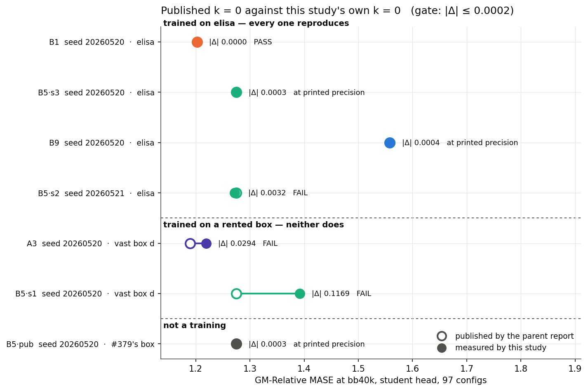

*Each retrained `k = 0` against the value its parent report published.
GM-Relative MASE at bb40k, student head, 97 GIFT-Eval configs.*

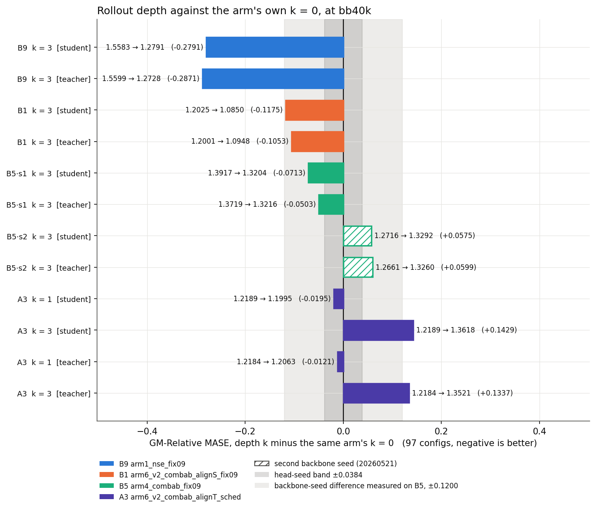

*Every trained depth against the same arm's own retrained `k = 0`. Whiskers
are 95% paired dataset-cluster bootstrap intervals over the pair's 97
configs.*

`--train-rollout-depth K` duplicates every f-bearing loss term at depth
1..K, so training composes the operator that eval composes.

## The machine, and the seed

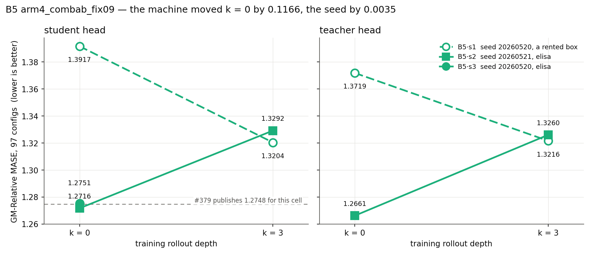

*B5 trained three times on one recipe, one code snapshot, one head seed and
one eval.*

`B5·s3` holds `B5·s1`'s seed and `B5·s2`'s machine, so the pair separates
them: the machine moves `k = 0` by 0.1166 and the seed by 0.0035.

## A1 and B3 hold one student, so the student column holds one number

A1 and B3 run `arm5_combab`, align to the student, and differ only in the
EMA schedule. Their student scores agree exactly: 1.1305 at bb40k and 1.1676
at bb100k. Their teacher scores do not: 1.1318 against 1.1343 at bb40k.

The two cells are two runs. They read two different backbone files,
`cf393_arm5_combab_alignS_cf373k3_40k.pth` and
`bb_small_arm5_combab_lalign_lrep_..._cf373k3_40k.pth`, and they wrote four
head files at four cell-id paths with four different md5 sums
(`results/pair_head_files.tsv`).

The weights inside those files are equal. All 110 student tensors match at
both stops, to a maximum absolute difference of 0.000e+00
(`results/pair_identity.tsv`). The two head trainings then match step for
step: both curves start at 0.4780377745628357 and end at 0.21291811764240265.

`arm5_combab` passes no `--moco-rep-keys`, so the loss reads no teacher
output and the EMA copy has no gradient path into the student. The EMA
schedule moves the teacher alone. The three other same-arm pairs run
`arm6_v2_*`, which does pass `--moco-rep-keys`, and their students differ at
every stop measured: 2.377 and 2.086 for A4/B1, 3.103 and 3.550 for A3/B2,
5.025 and 9.518 for A2/B8, maximum absolute difference at bb40k and bb100k.
A1/B3 is the only pair that holds one student.

Read A1 and B3's student column as one model measured once and printed
twice. The teacher column holds two models.

## Where the change lands

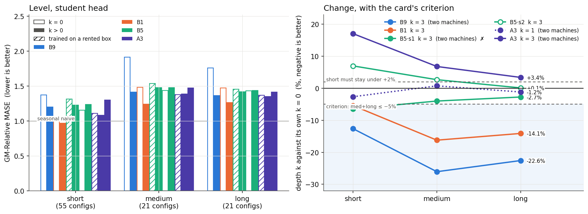

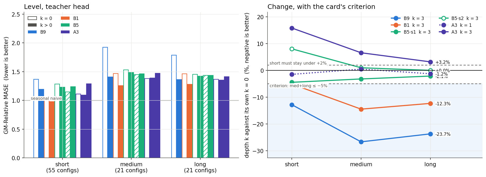

*GM-Relative MASE by horizon term, each depth against the same arm's
`k = 0`, bb40k.*

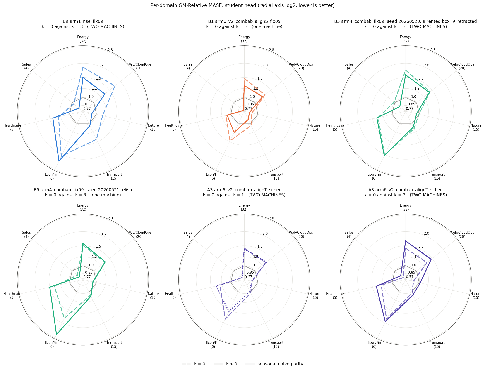

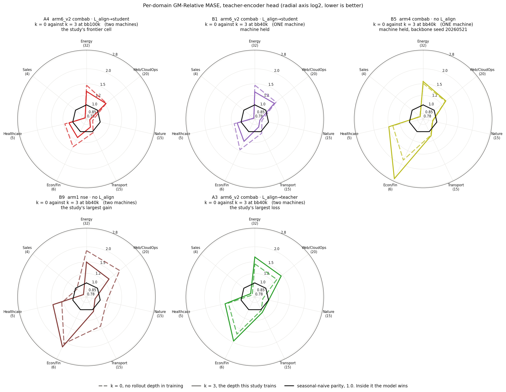

*Per-domain GM-Relative MASE, each arm against its own `k = 0`, bb40k.*

## A3: the depth, or the weight it carries

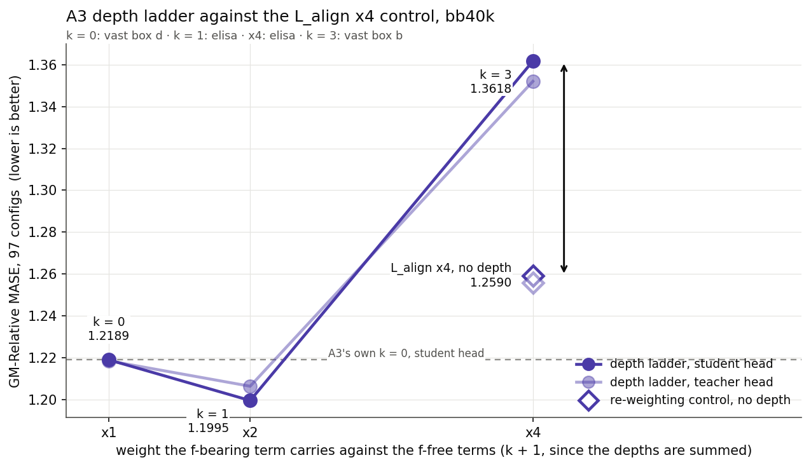

*A3's depth ladder against the `L_align` ×4 re-weighting control, both
heads, bb40k.*

Each of A3's four points trained on a different box from at least one other,
and the machine is worth more than either control, so the ladder gives a
direction and not a magnitude.

## The composed operator does get more faithful

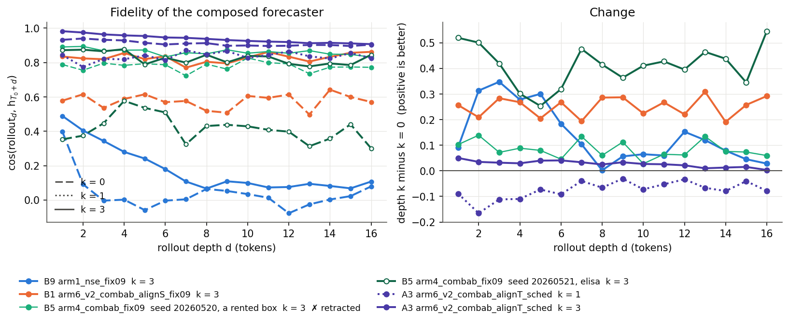

*`cos` between the rolled latent and the true `h_{t+d}` for `d = 1..16`, no
head in the way, on a fixed diagnostic batch.*

Every `k = 3` run is more faithful than its own `k = 0` at all 16 rollout
depths, by +0.002 to +0.545, including the two that score worse, while A3's
`k = 1` is worse at all 16, by -0.031 to -0.165.

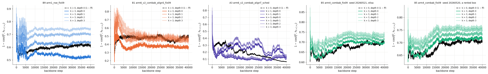

*`1 − cos(f^(j)_t, h_{t+1+j})` during training, one line per depth, against
the `k = 0` run's single line.*

Of the four `k = 3` arms the report stands behind, B9 and B1 hold one sign
over all four end-of-run windows and B5·s2 and A3 do not.

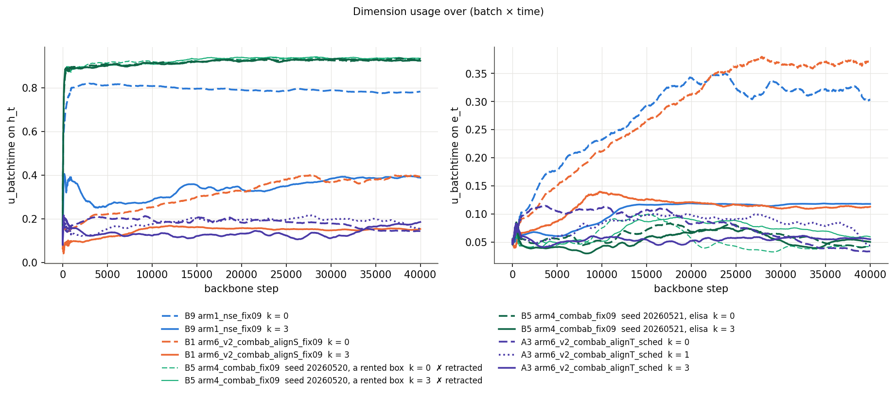

*`u_batchtime` on `h_t` and on `e_t` during training.*

No run reaches zero at any depth.

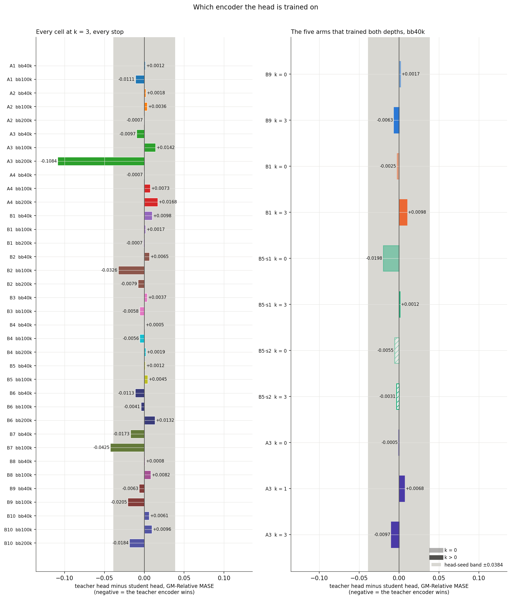

*Teacher-encoder head minus student-encoder head, per arm per depth.*

Every value is inside ±0.0198, and the head-seed band is ±0.0384.

### B1's bb40k number is B1's own

Round 1 wrote it under a non-standard name, `score_G6_B1_k3_bb40k_student`.
The head behind it trained off
`bb_small_arm6_v2_combab_lalign_lrepmoco_..._cf373k3_40k.pth`, B1's own 40k
checkpoint and the file round 2 resumed, for 15,000 steps at seed 20260722.
That is the same head every other cell's bb40k carries. The head, its
optimizer and the full 97-config eval sit in
`checkpoints_backup/cf-373/eval/G6_B1_k3_bb40k_student/`. Round 3 normalised
the score to `score_B1_k3_bb40k_student`, and it reads the same 1.0850. The
name was non-standard. The measurement was not.

## Tables

<!-- TABLES:BEGIN -->

### Coverage

The card names 14 cells. This study scored **14 of them**: A1, A2, A3, A4, B1, B2, B3, B4, B5, B6, B7, B8, B9, B10. Every cell carries a number.

| cell | f-bearing term | EMA α | depths trained | stops scored |
|---|---|---|---|---|
| A1 | L_align only | scheduled | k = 3 | bb40k, bb100k |
| A2 | L_align + CPC auxiliary | scheduled | k = 3 | bb40k, bb100k, bb200k |
| A3 | L_align only | scheduled | k = 0, k = 1, k = 3 | bb40k, bb100k |
| A4 | L_align only | scheduled | k = 3 | bb40k, bb100k |
| B1 | L_align only | fixed 0.9 | k = 0, k = 3 | bb40k, bb100k |
| B2 | L_align only | fixed 0.9 | k = 3 | bb40k, bb100k |
| B3 | L_align only | fixed 0.9 | k = 3 | bb40k, bb100k |
| B4 | L_align only | fixed 0.9 | k = 3 | bb40k, bb100k, bb200k |
| B5 | pooled xshh_allt, floor subtracted | fixed 0.9 | k = 0, k = 3 | bb40k, bb100k |
| B6 | L_align only | fixed 0.9 | k = 3 | bb40k, bb100k |
| B7 | L_align only | fixed 0.9 | k = 3 | bb40k, bb100k |
| B8 | L_align + CPC auxiliary | fixed 0.9 | k = 3 | bb40k, bb100k |
| B9 | split L_pred + CPC auxiliary | fixed 0.9 | k = 0, k = 3 | bb40k, bb100k |
| B10 | L_align + CPC auxiliary | fixed 0.9 | k = 3 | bb40k, bb100k, bb200k |

Stops scored: bb40k, bb100k, bb200k. The card's extend rule reads a cell's bb40k number against its bb100k number, so it fires only where both are in hand.

### The stop ladder: what the second 100,000 steps buys

Δ is bb200k minus bb100k, so a negative number is an improvement: GM-Relative MASE is a ratio against seasonal-naive and lower is better. Of the 5 extended measurements in hand, **2 improved** at bb200k and 3 got worse. The largest gain is B10 teacher, -0.0059.

| cell | head | bb40k | bb100k | bb200k | Δ | % | note |
|---|---|---|---|---|---|---|---|
| A1 | student | 1.1305 | 1.1676 | — | — | — | the extend rule held this cell at 100k |
| A1 | teacher | 1.1318 | 1.1565 | — | — | — | the extend rule held this cell at 100k |
| A2 | student | 1.2735 | 1.2479 | 1.2507 | +0.0028 | +0.2% |  |
| A2 | teacher | 1.2753 | 1.2514 | 1.2500 | -0.0014 | -0.1% |  |
| A3 | student | 1.3618 | 1.3010 | — | — | — |  |
| A3 | teacher | 1.3521 | 1.3151 | — | — | — |  |
| A4 | student | 1.0862 | 1.0801 | — | — | — |  |
| A4 | teacher | 1.0855 | 1.0874 | — | — | — | student head only, by the extend rule |
| B1 | student | 1.0850 | 1.0881 | — | — | — |  |
| B1 | teacher | 1.0948 | 1.0897 | — | — | — |  |
| B2 | student | 1.3976 | 1.3443 | — | — | — |  |
| B2 | teacher | 1.4041 | 1.3117 | — | — | — |  |
| B3 | student | 1.1305 | 1.1676 | — | — | — | the extend rule held this cell at 100k |
| B3 | teacher | 1.1343 | 1.1618 | — | — | — | the extend rule held this cell at 100k |
| B4 | student | 1.3334 | 1.2804 | 1.3182 | +0.0378 | +3.0% |  |
| B4 | teacher | 1.3339 | 1.2748 | — | — | — |  |
| B5 | student | 1.3204 | 1.3383 | — | — | — | the extend rule held this cell at 100k |
| B5 | teacher | 1.3216 | 1.3428 | — | — | — | the extend rule held this cell at 100k |
| B6 | student | 1.2297 | 1.2151 | — | — | — |  |
| B6 | teacher | 1.2184 | 1.2110 | — | — | — |  |
| B7 | student | 1.2617 | 1.3205 | — | — | — | the extend rule held this cell at 100k |
| B7 | teacher | 1.2444 | 1.2780 | — | — | — | the extend rule held this cell at 100k |
| B8 | student | 1.2857 | 1.3157 | — | — | — | trained from 0 this round; queued to 100k only |
| B8 | teacher | 1.2865 | 1.3239 | — | — | — | trained from 0 this round; queued to 100k only |
| B9 | student | 1.2791 | 1.3299 | — | — | — | the extend rule held this cell at 100k |
| B9 | teacher | 1.2728 | 1.3094 | — | — | — | the extend rule held this cell at 100k |
| B10 | student | 1.2669 | 1.2403 | 1.2624 | +0.0221 | +1.8% |  |
| B10 | teacher | 1.2730 | 1.2499 | 1.2440 | -0.0059 | -0.5% |  |

### Reproduction of the published k = 0

Same cell, same recipe, same head seed 20260722, same 97-config B4 eval, student head. Rows are grouped by machine.

A row at the parents' own backbone seed 20260520 takes the card's 0.0002; a row at any other seed takes the seed band.

| backbone | seed | machine | published k = 0 | retrained k = 0 | \|Δ\| | gate | verdict |
|---|---|---|---|---|---|---|---|
| B1 | 20260520 | elisa | 1.2025 | 1.2025 | 0.0000 | 0.0002, the card | PASS |
| B5·s3 | 20260520 | elisa | 1.2748 | 1.2751 | 0.0003 | 0.0002, the card | at the re-run floor |
| B9 | 20260520 | elisa | 1.5579 | 1.5583 | 0.0004 | 0.0002, the card | at the re-run floor |
| B5·s2 | 20260521 | elisa | 1.2748 | 1.2716 | 0.0032 | 0.0230, the seed band | inside the seed band |
| A3 | 20260520 | vast box d | 1.1895 | 1.2189 | 0.0294 | 0.0002, the card | FAIL |
| B5·s1 ✗ | 20260520 | vast box d | 1.2748 | 1.3917 | 0.1169 | 0.0002, the card | FAIL |
| B5·pub | 20260520 | the parent report's box | 1.2748 | 1.2751 | 0.0003 | 0.0002, the card | at the re-run floor |

Two things this comparison cannot resolve, added: 0.0003 for the head and the eval, which is what `B5·pub` moves the score by while training nothing, and 0.0001 for the parents' four printed decimals. A |Δ| at or below 0.0004 is a run this pipeline cannot separate from the published one. The card's gate of 0.0002 is stricter than that.

The seed band is 0.0230, the far end of the 95% interval on this study's one measurement of a seed change: `B5·s2` against `B5·s3`, one machine, one recipe, +0.0035 [-0.0183, +0.0230]. It is one run pair, and the interval is over that pair's eval sample rather than over seeds, so the band is a floor on what a seed can move and not a bound on it. B5·s2 is the only row it gates; every other row here carries the parents' own seed.

`B5·pub` is not a training: it takes the parent report's own published B5 checkpoint and puts this study's head and eval on it, so its row bounds the head and the eval rather than the trainer. `B5·s3` is a training, at the protocol seed, on elisa, and its 97-config eval output is byte-identical to `B5·pub`'s (`results/eval/G7_B5_k0_e_bb40k_student/all_results.csv` against `results/eval/G1_B5pub_bb40k_student/all_results.csv`): the elisa retrain reproduced the parent's backbone exactly, and the 0.0003 both rows carry is the head and the eval.

### Depth response, against each arm's own k = 0

| arm | seed | machine held | head | k | k = 0 | this k | Δ | all | short | med+long | criterion |
|---|---|---|---|---|---|---|---|---|---|---|---|
| B9 | 20260520 | no, elisa → vast box c | student | 3 | 1.5583 | 1.2791 | -0.2791 | -17.9% | -12.6% | -24.4% | **MET** |
| B9 | 20260520 | no, elisa → vast box c | teacher | 3 | 1.5599 | 1.2728 | -0.2871 | -18.4% | -12.8% | -25.2% | **MET** |
| B1 | 20260520 | yes, elisa | student | 3 | 1.2025 | 1.0850 | -0.1175 | -9.8% | -5.4% | -15.2% | **MET** |
| B1 | 20260520 | yes, elisa | teacher | 3 | 1.2001 | 1.0948 | -0.1053 | -8.8% | -5.1% | -13.4% | **MET** |
| B5·s1 ✗ | 20260520 | no, vast box d → vast box a | student | 3 | 1.3917 | 1.3204 | -0.0713 | -5.1% | -6.4% | -3.4% | not met |
| B5·s1 ✗ | 20260520 | no, vast box d → vast box a | teacher | 3 | 1.3719 | 1.3216 | -0.0503 | -3.7% | -4.4% | -2.6% | not met |
| B5·s2 | 20260521 | yes, elisa | student | 3 | 1.2716 | 1.3292 | +0.0575 | +4.5% | +7.0% | +1.4% | not met |
| B5·s2 | 20260521 | yes, elisa | teacher | 3 | 1.2661 | 1.3260 | +0.0599 | +4.7% | +8.1% | +0.5% | not met |
| A3 | 20260520 | no, vast box d → elisa | student | 1 | 1.2189 | 1.1995 | -0.0195 | -1.6% | -2.6% | -0.2% | not met |
| A3 | 20260520 | no, vast box d → vast box b | student | 3 | 1.2189 | 1.3618 | +0.1429 | +11.7% | +17.1% | +5.1% | not met |
| A3 | 20260520 | no, vast box d → elisa | teacher | 1 | 1.2184 | 1.2063 | -0.0121 | -1.0% | -1.5% | -0.4% | not met |
| A3 | 20260520 | no, vast box d → vast box b | teacher | 3 | 1.2184 | 1.3521 | +0.1337 | +11.0% | +15.8% | +4.9% | not met |

Criterion, from the card: medium+long (42 configs) at least 5% better, short (55 configs) losing less than 2%.

`machine held` = did the two sides train on the same box. A `no` row carries a machine change as well as a depth change. The B5 table below measures the machine alone, at one seed, at 0.1166, so a `no` row carries a term larger than most of the deltas in this table. Only the `yes` rows report the depth and nothing else.

✗ marks a retracted row: B5·s1's `k = 0` trained on a rented box and misses its published value by 0.1169; `B5·s3` retrains it at the same seed on elisa and lands 0.0003 away, so the baseline the -5.1% rests on is a rented-box artefact and the delta is retracted.

Head-seed band ±0.0384 (`ema_sched_ladder.md`, pooled). It bounds the head seed alone. It does not bound the machine.

### Paired dataset-cluster bootstrap, per horizon subset

The resampling unit is the dataset: `<ds>/short`, `/medium` and `/long` are three configs of one series and are not independent draws. 95% percentile interval over 10,000 resamples. Each interval is over one run pair's 97 configs, so it bounds the eval sample and not run-to-run variance.

| arm | head | k | subset | n | Δ | 95% CI | resamples improved |
|---|---|---|---|---|---|---|---|
| B9 | student | 3 | all | 97 | -0.2791 | [-0.3548, -0.1980] | 100.0% |
| B9 | student | 3 | short | 55 | -0.1736 | [-0.2470, -0.1038] | 100.0% |
| B9 | student | 3 | medium_long | 42 | -0.4472 | [-0.5655, -0.3382] | 100.0% |
| B9 | teacher | 3 | all | 97 | -0.2871 | [-0.3644, -0.2032] | 100.0% |
| B9 | teacher | 3 | short | 55 | -0.1751 | [-0.2501, -0.1018] | 100.0% |
| B9 | teacher | 3 | medium_long | 42 | -0.4670 | [-0.5952, -0.3523] | 100.0% |
| B1 | student | 3 | all | 97 | -0.1175 | [-0.1801, -0.0615] | 100.0% |
| B1 | student | 3 | short | 55 | -0.0556 | [-0.1017, -0.0184] | 99.9% |
| B1 | student | 3 | medium_long | 42 | -0.2244 | [-0.3504, -0.1243] | 100.0% |
| B1 | teacher | 3 | all | 97 | -0.1053 | [-0.1661, -0.0515] | 100.0% |
| B1 | teacher | 3 | short | 55 | -0.0523 | [-0.0980, -0.0146] | 99.7% |
| B1 | teacher | 3 | medium_long | 42 | -0.1963 | [-0.3129, -0.1047] | 100.0% |
| B5·s1 ✗ | student | 3 | all | 97 | -0.0713 | [-0.1327, -0.0267] | 100.0% |
| B5·s1 ✗ | student | 3 | short | 55 | -0.0848 | [-0.1732, -0.0068] | 98.3% |
| B5·s1 ✗ | student | 3 | medium_long | 42 | -0.0504 | [-0.0972, -0.0137] | 99.7% |
| B5·s1 ✗ | teacher | 3 | all | 97 | -0.0503 | [-0.0965, -0.0108] | 99.4% |
| B5·s1 ✗ | teacher | 3 | short | 55 | -0.0571 | [-0.1215, +0.0086] | 95.8% |
| B5·s1 ✗ | teacher | 3 | medium_long | 42 | -0.0395 | [-0.0882, +0.0028] | 96.6% |
| B5·s2 | student | 3 | all | 97 | +0.0575 | [+0.0173, +0.1094] | 0.2% |
| B5·s2 | student | 3 | short | 55 | +0.0809 | [+0.0231, +0.1549] | 0.2% |
| B5·s2 | student | 3 | medium_long | 42 | +0.0199 | [-0.0215, +0.0745] | 19.0% |
| B5·s2 | teacher | 3 | all | 97 | +0.0599 | [+0.0214, +0.1105] | 0.1% |
| B5·s2 | teacher | 3 | short | 55 | +0.0925 | [+0.0345, +0.1701] | 0.0% |
| B5·s2 | teacher | 3 | medium_long | 42 | +0.0074 | [-0.0268, +0.0543] | 38.7% |
| A3 | student | 1 | all | 97 | -0.0195 | [-0.0537, +0.0148] | 86.9% |
| A3 | student | 1 | short | 55 | -0.0294 | [-0.0652, +0.0007] | 97.1% |
| A3 | student | 1 | medium_long | 42 | -0.0029 | [-0.0565, +0.0628] | 55.8% |
| A3 | student | 3 | all | 97 | +0.1429 | [+0.0893, +0.2122] | 0.0% |
| A3 | student | 3 | short | 55 | +0.1899 | [+0.1254, +0.2739] | 0.0% |
| A3 | student | 3 | medium_long | 42 | +0.0698 | [+0.0226, +0.1415] | 0.0% |
| A3 | teacher | 1 | all | 97 | -0.0121 | [-0.0479, +0.0261] | 74.0% |
| A3 | teacher | 1 | short | 55 | -0.0163 | [-0.0596, +0.0275] | 77.9% |
| A3 | teacher | 1 | medium_long | 42 | -0.0052 | [-0.0572, +0.0602] | 59.5% |
| A3 | teacher | 3 | all | 97 | +0.1337 | [+0.0839, +0.2004] | 0.0% |
| A3 | teacher | 3 | short | 55 | +0.1760 | [+0.1177, +0.2537] | 0.0% |
| A3 | teacher | 3 | medium_long | 42 | +0.0673 | [+0.0197, +0.1414] | 0.0% |

### One cell, three backbones

B5 (`arm4_combab_fix09`) trained three times on one recipe, one code snapshot, one head seed and one eval. They differ by backbone seed and by machine, and each contrast below names which of the two it changes. The machine moves the score and the seed does not.

| backbone | seed | machine | k = 0 | k = 3 | k = 3 − k = 0 |
|---|---|---|---|---|---|
| B5·s1 ✗ | 20260520 | a rented box | 1.3917 | 1.3204 | -0.0713 |
| B5·s2 | 20260521 | elisa | 1.2716 | 1.3292 | +0.0575 |
| B5·s3 | 20260520 | elisa | 1.2751 | — | — |

| contrast | what changes | k | Δ | 95% CI |
|---|---|---|---|---|
| B5·s1 against B5·s3 | the machine, at one seed | 0 | -0.1166 | [-0.1885, -0.0645] |
| B5·s2 against B5·s3 | the seed, on one machine | 0 | +0.0035 | [-0.0183, +0.0230] |
| B5·s1 against B5·s2 | the seed AND the machine | 0 | -0.1200 | [-0.1825, -0.0742] |
| B5·s1 against B5·s2 | the seed AND the machine | 3 | +0.0088 | [-0.0306, +0.0520] |

Student head, 97 configs. `B5·s3` holds `B5·s1`'s seed and `B5·s2`'s machine.

Every interval here is a paired dataset-cluster bootstrap over the 97 eval configs of ONE run pair. It bounds the eval sample: how far the difference between these two runs could move if the datasets had been drawn again. It does not bound run-to-run variance, and neither contrast has a replicate to bound it with. No two of B5's three backbones share both a seed and a machine.

`mixup` counts the examples the mixer touched in the 200-step window, so one count at every step is one data order. `B5·s1` and `B5·s3` carry one seed, print one count at every step, and their losses still part.

| step | B5·s1 seed 20260520, a rented box | B5·s2 seed 20260521, elisa | B5·s3 seed 20260520, elisa |
|---|---|---|---|
| 200 | 5.5767  `61/200` | 5.6595  `53/200` | 5.5610  `61/200` |
| 400 | 5.1220  `58/200` | 5.3568  `62/200` | 5.2078  `58/200` |
| 600 | 4.9019  `65/200` | 5.0143  `51/200` | 4.9412  `65/200` |
| 800 | 4.9475  `65/200` | 5.1256  `65/200` | 5.1249  `65/200` |

### A3: is the damage the depth, or the weight?

Summing the depths multiplies `L_align`'s weight against the f-free terms by k + 1. The `L_align x4` row applies that re-weighting at k = 0, with no depth at all.

| head | k = 0 | k = 0, `L_align` x4 | k = 1 | k = 3 |
|---|---|---|---|---|
| student | 1.2189 | 1.2590 +0.0401 [+0.0116, +0.0767] | 1.1995 -0.0195 [-0.0537, +0.0148] | 1.3618 +0.1429 [+0.0893, +0.2122] |
| teacher | 1.2184 | 1.2558 +0.0374 [+0.0058, +0.0756] | 1.2063 -0.0121 [-0.0479, +0.0261] | 1.3521 +0.1337 [+0.0839, +0.2004] |

Second line of each cell: the difference against `k = 0` and its 95% paired dataset-cluster interval.

Every column trained on a different box from at least one other. A3_k0: vast box d · G3_A3_k0_aw4: elisa · G3_A3_k1: elisa · A3_k3: vast box b. The machine alone is worth 0.1166 on this study's one controlled measurement of it, which is more than either control's own size, so read the two controls as direction and not as magnitude. This table therefore does not divide one column by another.

### What the depth costs

Median `fwd + bwd` per step, from each run's own trainer log. A median is a cost of the depth only where the run had the card to itself, so the table says which did. `run_provenance.py` reads that off the driver logs and [`results/steptime_solo.csv`](results/steptime_solo.csv) carries it per run. A3's `k = 3` shared vast box b with a clone of itself up to step 14,800, and its 131.5 ms is the median over the 127 windows after that.

| arm | f-bearing term | k | machine | card | fwd+bwd | alone? |
|---|---|---|---|---|---|---|
| B9 | split L_pred | 0 | elisa | RTX 4090 | 212.6 ms, shared | no — another backbone for 96% of the run; head training for 4% of it |
| B9 | split L_pred | 3 | vast box c | RTX 4090 | 425.2 ms | yes |
| B1 | rep_only + L_align | 0 | elisa | RTX 4090 | 178.6 ms, shared | no — another backbone for 100% of the run; head training for 100% of it |
| B1 | rep_only + L_align | 3 | elisa | RTX 4090 | 235.1 ms, shared | no — another backbone for 68% of the run; head training for 100% of it |
| B5·s1 | pooled xshh_allt | 0 | vast box d | RTX 5090 | 117.6 ms | yes |
| B5·s1 | pooled xshh_allt | 3 | vast box a | RTX 5090 | 301.9 ms | yes |
| B5·s2 | pooled xshh_allt | 0 | elisa | RTX 4090 | 201.1 ms, shared | no — another backbone for 100% of the run; head training for 98% of it |
| B5·s2 | pooled xshh_allt | 3 | elisa | RTX 4090 | 500.9 ms, shared | no — another backbone for 43% of the run; head training for 100% of it |
| A3 | rep_only + L_align | 0 | vast box d | RTX 5090 | 115.9 ms | yes |
| A3 | rep_only + L_align | 1 | elisa | RTX 4090 | 214.7 ms, shared | no — another backbone for 72% of the run; head training for 100% of it |
| A3 | rep_only + L_align | 3 | vast box b | RTX 5090 | 131.5 ms | yes |

The ratios that survive that test:

| arm | f-bearing term | k = 0 | k = 3 | change | both sides |
|---|---|---|---|---|---|
| B5·s1 | pooled xshh_allt | 117.6 ms | 301.9 ms | +157% | vast box d → vast box a |
| A3 | rep_only + L_align | 115.9 ms | 131.5 ms | +13% | vast box d → vast box b |

### The depth-0 forecast error, deeper run minus its own k = 0

`1 - cos(f_t, h_{t+1})` during training: the same quantity on both runs, unlike the loss. Negative means the deeper run forecasts one step ahead better. Four end-of-run windows, because a gap that changes sign between them is not a result.

| arm | k | last 50% | last 25% | last 10% | final step | one sign over all four |
|---|---|---|---|---|---|---|
| B9 | 3 | -0.0707 | -0.0893 | -0.0938 | -0.0817 | yes |
| B1 | 3 | -0.0968 | -0.0915 | -0.1122 | -0.0807 | yes |
| B5·s1 ✗ | 3 | +0.0157 | +0.0102 | +0.0121 | +0.0150 | yes |
| B5·s2 | 3 | +0.0121 | +0.0061 | +0.0023 | -0.0129 | **no** |
| A3 | 1 | +0.0871 | +0.0902 | +0.1159 | +0.0401 | yes |
| A3 | 3 | -0.0469 | -0.0004 | +0.0489 | +0.0623 | **no** |

### Glossary

| term | what it means here |
|---|---|
| the card | the issue this study answers, and the 14 cells, stops and criteria it names |
| cell | one of those 14 recipes, `A1`..`A4` and `B1`..`B10` |
| arm | a (cell, backbone seed, machine) triple. B5 trained three, so the cell is not the unit a delta lives in |
| bb40k | backbone step 40,000, the one stop every run here reached |
| GM-Relative MASE | geometric mean over the 97 GIFT-Eval configs of each config's MASE divided by the seasonal-naive MASE. Lower is better; 1.0 is seasonal-naive parity |
| B4 eval strategy | GIFT-Eval's official evaluation strategy, the one the parent reports use |
| student / teacher head | the quantile head is trained twice per backbone, once on the student encoder and once on its EMA copy, the teacher. The two are separate measurements of one backbone |
| f-bearing term | the loss term that the forecast operator `f` enters. `--train-rollout-depth K` duplicates it at depth 1..K |
| `rep_only` | the representation loss with no forecast term |
| `L_align` | the term that aligns `f`'s output with the future latent |
| `L_pred` | the predictive contrastive term, split from the representation term |
| `xshh_allt` | negatives pooled across the batch and across channels, taken over every time index |
| `u_batchtime` | dimension usage of a latent over the pooled (batch × time) sample axis: `1 / (H · mean off-diagonal squared cosine)`, capped at 1. 1.0 is all `H` dimensions in use and a value near `1/H` is one direction. `h_t` is the encoder latent, `e_t` the embedding it reads |
| collapse | the latent falling onto few directions, so `u_batchtime` runs toward zero. The card watches for it because a model can win the deeper f-bearing terms by flattening `f` |
| `arm4`, `arm6_v2 combab` | the launcher recipes the cells run; the Coverage table gives each cell's |
| head-seed band ±0.0384 | how far the head seed alone moved a score in `ema_sched_ladder.md`, pooled. It bounds the head seed and nothing else |
| `mixup` | the count of examples the batch mixer touched in a 200-step window. Two runs on one data order print one count |

<!-- TABLES:END -->

*Full paired dataset-cluster bootstraps, including the per-domain splits:
[`results/bootstrap.csv`](results/bootstrap.csv). Every table above comes
from `scripts/tables.py`, which writes
[`results/scores.md`](results/scores.md) in the same pass. `bash
scripts/make_report_assets.sh` rebuilds every figure and table here from the
committed tree.*

## Protocol

Backbone `d_model=64, n_heads=8, num_encoder_layers=3, num_layers=3,
batch_size=64`, seed 20260520 (B5's second training uses 20260521); dataset
`gift-pretrain-full-4096 / small_v1`; `--ema-embedding --ema-encoder`. Group
B holds EMA α at 0.9; group A raises it linearly from 0.9 to 1.0 by step
100k. Every cell starts fresh at step 0. Two heads per checkpoint, student
and teacher, trained separately on their own encoder, 15,000 steps, head seed
20260722, `--grad-clip 1.0` on the head for comparability with the parents.
97 GIFT-Eval configs, official B4 strategy, forecast horizon 16, one shared
seasonal-naive denominator file. The parent reports are
[`split_pred_rep_small`](../2026-07-21_split_pred_rep_small/small_long.md),
[`lalign_teacher`](../2026-08-04_lalign_teacher/lalign_teacher.md) and
[`ema_sched_ladder`](../2026-08-04_ema_sched_ladder/ema_sched_ladder.md).

**Deviation from the card.** The card's default is to compute the h-anchored
negative families once and reuse them unshifted at every depth. This
implementation takes the card's stated alternative and **shifts them with the
depth**, so a depth-`j` copy is a literal copy of the depth-0 objective under
one rule: every `h` index moves by `j`. It touches exactly one of the 14
cells. B5 (`arm4`, pooled `xshh_allt`) is the only cell whose f-bearing
denominator holds h-anchored families; B9's `L_pred` denominator is
f-anchored only, and the other twelve cells' f-bearing term is `L_align`,
which has no denominator.

## Annex

**`B5·s3` has no teacher-head number.** Its teacher head aborted for want of
VRAM on elisa ([`results/stops.log`](results/stops.log),
[`results/eval/G7_B5_k0_e_bb40k_teacher/stop.log`](results/eval/G7_B5_k0_e_bb40k_teacher/stop.log)).
The group-B parent reports publish the student-encoder head only, so the
student number is the comparison the reproduction check needs.

**The fidelity batch is not held out.** It is the parent report's committed
`_latent_movement_batch.pt`, the same batch the two parent reports'
latent-movement figures use. Nothing here establishes it is disjoint from
`gift-pretrain-full-4096 / small_v1`, which is what these backbones trained
on. It holds every curve on one scale, and that is what it is for.

**One step-time measurement holds the card fixed**, and it is a controlled
probe: B5 alternating `k = 0` and `k = 3` on elisa's GPU 1, 3 reps of 600
steps, 190.2 ms against 509.9 ms, +168%. That card carried another session's
job throughout, so the probe alternates on a shared card rather than owning
one
([`results/steptime_B5_solo_card.csv`](results/steptime_B5_solo_card.csv)).

**Operational events**, and the training-curve diagnostics this report does
not read, are in
[`results/execution_log.md`](results/execution_log.md).
