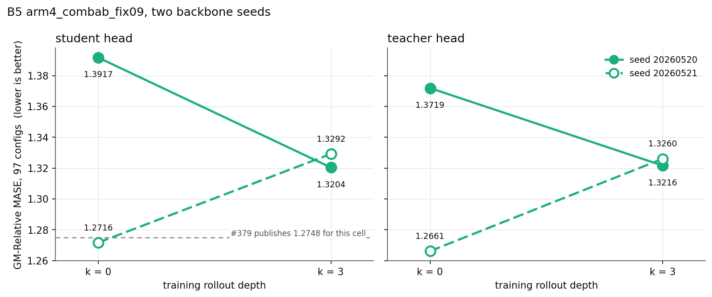

# Rollout depth k: training the composed forecaster

At eval the forecaster runs on its own output, up to about 45 times. Training
never did. `--train-rollout-depth K` duplicates every f-bearing loss term at
depth 1..K, so training composes the operator the eval composes.

**The flag helps two of the four cells this study trained, and helps them a
lot.** B1 at `k = 3` scores **1.0850** GM-Relative MASE at bb40k. That is
lower than every number the three parent reports publish for these 14 cells,
at any backbone step, and B1's own retrained `k = 0` reproduces its published
1.2025 exactly. B9 improves 17.9%. Both meet the card's primary criterion.
A3 degrades 11.7% at `k = 3` and improves 1.6% at `k = 1`. B5 is undecided:
two backbone seeds of it disagree.

Four of the card's 14 cells ran. The compute bought no more.

---

## 1. The answer

Two arms improve well outside any noise this study can measure, one is
undecided between its two seeds, and one degrades.

The two shaded spans are not the same kind of thing. The narrow one is the
parents' pooled head-seed range. The wide one is the only backbone-seed
difference this study measured, and every bar in the figure is the difference
of two independent backbone trainings. Section 4 says what that wide span is
and is not.

## 2. Where the change lands

The mechanism predicts the gain concentrates on medium and long. For the two
arms that improve it does: B9 gains 24.4% on the 42 medium and long configs
against 12.6% on the 55 short ones, and B1 gains 15.2% against 5.4%. Both
clear the card's criterion on both heads.

The two arms that do not improve lose most on short, which is the opposite
pattern.

Teacher head: [`horizon_split_teacher.png`](plots/horizon_split_teacher.png).
It says the same thing.

## 3. B1 at k = 3 is the lowest number in the protocol

B1's star sits below its own published trajectory at every stop the parent
reached, including bb200k at 1.1652. It also sits below the best published
number of all 14 cells, A4's 1.1544.

Per domain, B1 at `k = 3` improves on six of seven and holds level on the
seventh: Econ/Fin −17%, Energy −14%, Transport −13%, Web/CloudOps −6%, Nature
−5%, Healthcare −2%, Sales +0%. It beats seasonal naive on three domains
(Nature 0.840, Sales 0.775, Transport 0.907). Its own `k = 0` beats it on two
(Nature 0.884, Sales 0.772).

Each panel holds one arm against its own `k = 0`. B9 and B1 pull inward on
almost every domain; A3 and B5 seed 20260521 push outward. Teacher head:
[`domain_radar_teacher.png`](plots/domain_radar_teacher.png).

## 4. Two backbone seeds of one cell, and where they disagree

B5 trained twice. Same code, same recipe, same head seed, same eval; only the
backbone seed differs. The two seeds give opposite answers about the depth,
and the figure shows why: they land 0.0088 apart at `k = 3` and 0.1200 apart
at `k = 0`. The disagreement is a `k = 0` disagreement.

Seed 20260521's `k = 0` lands on #379's published 1.2748, 0.0032 away. Seed
20260520's misses it by 0.1169. So one backbone training out of this study's
set is anomalous, and it is the one that made B5 look like an improvement.
**B5 has no depth verdict.** Its best guess, from the seed whose baseline
reproduces, is that `k = 3` is 4.5% worse.

This is the study's uncertainty statement, and it has n = 1. A single
backbone training moved by 0.1200 once. That is about the size of B1's whole
effect and less than half of B9's. B1's `k = 0` reproducing its published
value exactly is direct evidence that B1's baseline is not the anomalous kind
of run; its `k = 3` side is unreplicated.

## 5. The code reproduces the published k = 0

The card gates every group-B delta on this check, because a delta against a
published number crosses a code snapshot as well as the flag.

B1 reproduces exactly. B9 lands 0.0004 away and the published-backbone
control 0.0003 away, both inside the four decimals the parents print. The two
rows that miss are one anomalous backbone (B5 seed 20260520) and one
scheduled-EMA cell (A3, 0.0294).

The control row is the decisive one. It takes #379's own published B5
checkpoint, trains this study's head on it and runs this study's eval:
1.2751 against a published 1.2748. The head and the eval are therefore not
what moved. Nothing here points at the trainer.

Every delta in this report is against the same arm's own retrained `k = 0`
anyway. No published number is used as a baseline.

## 6. The loss shape does not decide the sign

B1 and A3 train the same f-bearing term, `rep_only` + `L_align`, on the same
`arm6_v2 combab` arm. They differ in the EMA schedule.

| arm | EMA α | student Δ% | teacher Δ% |
|---|---|---|---|
| B1 | fixed 0.9 | **−9.8%** | **−8.8%** |
| A3 | scheduled 0.9 → 1.0 | +11.7% | +11.0% |

Holding the shape fixed and changing the EMA regime flips the sign. So the
shape alone does not predict it.

The regime alone does not predict it either. All three of B9, B1 and B5 hold
α at 0.9, and B5 does not improve. Four cells is not enough to name the
factor that decides this, and this report does not name one.

## 7. A3: the depth, not the weight it carries

Summing the depths multiplies the f-bearing term's weight against the f-free
terms by `k + 1`, so a `k = 3` run changes two things at once. The control
applies the ×4 re-weighting with no depth at all.

Re-weighting alone costs +0.0401, which is 28% of `k = 3`'s +0.1429. The
remaining +0.1028 is the depth. Re-weighting does not explain A3.

The ladder is not monotonic. `k = 1` scores 1.1995 against `k = 0`'s 1.2189,
an improvement of 1.6%; its bootstrap CI is [−0.0537, +0.0148], so it is
inside the noise rather than a win. `k = 3` then costs 11.7%. Whatever breaks
in A3 does not break at the first depth.

## 8. The composed operator does get more faithful

On a fixed held-out batch, `cos` between the rolled latent and the true
`h_{t+d}` for `d = 1..16`, with no head in the way. **Every arm improves at
`k = 3` at every one of the 16 depths, including the two that score worse.**
A3 gains between +0.003 and +0.050, B5 seed 20260521 between +0.253 and
+0.545.

So the fixed-point approximation is not what failed. The flag does what it
says: it makes the model better at consuming its own output. On A3 and B5 a
more faithful latent rollout did not turn into a better forecast.

## 9. Depth 0 does not pay, where the depth helps

`1 − cos(f^(j)_t, h_{t+1+j})` per step, one line per depth, against the
`k = 0` run's single line. The deeper depths carry more error than depth 0 in
every run, as expected.

The `k = 3` run's own depth-0 curve is the diagnostic. On B9 and B1 it sits
**below** the `k = 0` run's: depth 0 got better, not worse. On A3 and B5 it
sits above. The sign of that gap matches the sign of the eval result in all
four cells.

No run destabilised. Training loss is flat on all eleven depth runs
([`per_run_loss.png`](plots/per_run_loss.png)), and the latent-movement and
dimension-usage diagnostics show nothing unusual
([`latent_movement.png`](plots/latent_movement.png),
[`dim_usage_per_arm.png`](plots/dim_usage_per_arm.png),
[`cos_error_per_arm.png`](plots/cos_error_per_arm.png)).

## 10. Which head encoder to train on does not matter

Teacher minus student, per arm per depth. Every value is inside ±0.0198,
which is half the head-seed band. The choice does not change any conclusion
here.

## 11. What the depth costs

The extra depths cost forward and backward passes, and how much depends on
the loss shape. A shape whose `f` sits in the numerator and in every
denominator family rebuilds all of that per depth. `L_align` has no
denominator.

| arm | f-bearing term | GPU | k = 0 | k = 3 | change |
|---|---|---|---|---|---|
| B5·s1 | pooled `xshh_allt` | RTX 5090 | 117.6 ms | 301.9 ms | +157% |
| B5·s2 | pooled `xshh_allt` | RTX 4090 | 201.0 ms | 500.7 ms | +149% |
| B1 | `rep_only` + `L_align` | RTX 4090 | 178.6 ms | 235.2 ms | +32% |
| A3 | `rep_only` + `L_align` | RTX 5090 | 115.9 ms | 137.8 ms | +19% |

Median forward-plus-backward per step, from each run's own trainer log, and
only ever compared within one GPU class. The controlled probe agrees: B5
alternating `k = 0` and `k = 3` on one card, 3 reps of 600 steps, gives
190.2 ms against 509.9 ms, +168%.

So B1's 9.8% gain costs 32% more wall clock per step. B9 is missing from the
table because its two runs landed on different GPU classes, and a cross-card
ratio measures the cards. Its `L_pred` puts `f` in the numerator and in every
denominator family, so its overhead should be the pooled kind rather than the
`L_align` kind.

## 12. What did not run

Ten of the card's 14 cells never trained: **A1, A2, A4, B2, B3, B4, B6, B7,
B8, B10**. The four that did are A3, B1, B5 and B9, and B5 ran twice.

Every run stopped at bb40k. No cell reached bb100k or bb200k, so the card's
extend rule never fired and every number here is one stop.

The card's secondary criterion asks for the full-97 score to beat `k = 0` by
more than the head-seed band. B9 and B1 clear it. It also asks for a bb100k
and bb200k comparison, which this study cannot give.

## 13. Tables

Generated from the score files and the per-config CSVs by
`scripts/tables.py`, which writes this section and
[`results/scores.md`](results/scores.md) from the same pass.

<!-- TABLES:BEGIN -->

### Coverage

The card names 14 cells. This study trained **4 of them**: A3, B1, B5, B9. It never ran **10**: A1, A2, A4, B2, B3, B4, B6, B7, B8, B10.

| cell | f-bearing term | EMA α | depths trained |
|---|---|---|---|
| A1 | — | — | **never ran** |
| A2 | — | — | **never ran** |
| A3 | rep_only + L_align | scheduled 0.9 -> 1.0 | k = 0, k = 1, k = 3 |
| A4 | — | — | **never ran** |
| B1 | rep_only + L_align | fixed 0.9 | k = 0, k = 3 |
| B2 | — | — | **never ran** |
| B3 | — | — | **never ran** |
| B4 | — | — | **never ran** |
| B5 | pooled xshh_allt | fixed 0.9 | k = 0, k = 3 |
| B6 | — | — | **never ran** |
| B7 | — | — | **never ran** |
| B8 | — | — | **never ran** |
| B9 | split L_pred | fixed 0.9 | k = 0, k = 3 |
| B10 | — | — | **never ran** |

Every trained stop is bb40k. No cell reached bb100k or bb200k, so the card's extend rule never fired and this study publishes one stop.

### Reproduction of the published k = 0

Same cell, same recipe, same head seed 20260722, same 97-config B4 eval. The only thing that differs from the parent report is the code snapshot.

| arm | published k = 0 | retrained k = 0 | \|Δ\| | verdict (threshold 0.0002) |
|---|---|---|---|---|
| B9 | 1.5579 | 1.5583 | 0.0004 | at printed precision |
| B1 | 1.2025 | 1.2025 | 0.0000 | PASS |
| B5·s1 | 1.2748 | 1.3917 | 0.1169 | FAIL |
| B5·s2 | 1.2748 | 1.2716 | 0.0032 | FAIL |
| A3 | 1.1895 | 1.2189 | 0.0294 | FAIL |

The parents print four decimals, so a difference below 0.0005 is the smallest the published table can resolve. The card's gate of 0.0002 is stricter than that.

And one control that changes the backbone instead of the code: #379's own published B5 backbone, re-headed and re-scored by this study.

| backbone | head + eval | GM-Relative MASE |
|---|---|---|
| #379's published B5 bb40k | this study | 1.2751 |
| #379's published B5 bb40k | as published | 1.2748 |

### Depth response, against each arm's own k = 0

| arm | EMA α | f-bearing term | head | k | k = 0 | this k | Δ | all | short | med+long | criterion |
|---|---|---|---|---|---|---|---|---|---|---|---|
| B9 | fixed 0.9 | split L_pred | student | 3 | 1.5583 | 1.2791 | -0.2792 | -17.9% | -12.6% | -24.4% | **MET** |
| B9 | fixed 0.9 | split L_pred | teacher | 3 | 1.5599 | 1.2728 | -0.2871 | -18.4% | -12.8% | -25.2% | **MET** |
| B1 | fixed 0.9 | rep_only + L_align | student | 3 | 1.2025 | 1.0850 | -0.1175 | -9.8% | -5.4% | -15.2% | **MET** |
| B1 | fixed 0.9 | rep_only + L_align | teacher | 3 | 1.2001 | 1.0948 | -0.1053 | -8.8% | -5.1% | -13.4% | **MET** |
| B5·s1 | fixed 0.9 | pooled xshh_allt | student | 3 | 1.3917 | 1.3204 | -0.0713 | -5.1% | -6.4% | -3.4% | not met |
| B5·s1 | fixed 0.9 | pooled xshh_allt | teacher | 3 | 1.3719 | 1.3216 | -0.0503 | -3.7% | -4.4% | -2.6% | not met |
| B5·s2 | fixed 0.9 | pooled xshh_allt | student | 3 | 1.2716 | 1.3292 | +0.0576 | +4.5% | +7.0% | +1.4% | not met |
| B5·s2 | fixed 0.9 | pooled xshh_allt | teacher | 3 | 1.2661 | 1.3260 | +0.0599 | +4.7% | +8.1% | +0.5% | not met |
| A3 | scheduled 0.9 -> 1.0 | rep_only + L_align | student | 1 | 1.2189 | 1.1995 | -0.0194 | -1.6% | -2.6% | -0.2% | not met |
| A3 | scheduled 0.9 -> 1.0 | rep_only + L_align | student | 3 | 1.2189 | 1.3618 | +0.1429 | +11.7% | +17.1% | +5.1% | not met |
| A3 | scheduled 0.9 -> 1.0 | rep_only + L_align | teacher | 1 | 1.2184 | 1.2063 | -0.0121 | -1.0% | -1.5% | -0.4% | not met |
| A3 | scheduled 0.9 -> 1.0 | rep_only + L_align | teacher | 3 | 1.2184 | 1.3521 | +0.1337 | +11.0% | +15.8% | +4.9% | not met |

Criterion, from the card: medium+long (42 configs) at least 5% better, short (55 configs) losing less than 2%.

Head-seed band ±0.0384 (`ema_sched_ladder.md`, pooled). It bounds the head seed alone. The backbone-seed table below measures the backbone seed, which is larger.

### Two backbone seeds of one cell

B5 (`arm4_combab_fix09`) trained twice. Same code, same recipe, same head seed, same eval; the backbone seed is the only difference.

| head | k | seed 20260520 | seed 20260521 | seed spread |
|---|---|---|---|---|
| student | 0 | 1.3917 | 1.2716 | -0.1201 |
| student | 3 | 1.3204 | 1.3292 | +0.0088 |
| teacher | 0 | 1.3719 | 1.2661 | -0.1058 |
| teacher | 3 | 1.3216 | 1.3260 | +0.0044 |

| head | seed | k = 0 | k = 3 | k = 3 − k = 0 |
|---|---|---|---|---|
| student | 20260520 | 1.3917 | 1.3204 | -0.0713 |
| student | 20260521 | 1.2716 | 1.3292 | +0.0576 |
| teacher | 20260520 | 1.3719 | 1.3216 | -0.0503 |
| teacher | 20260521 | 1.2661 | 1.3260 | +0.0599 |

### One loss shape, two EMA regimes

B1 and A3 train the same f-bearing term, `rep_only` + `L_align`, on the same `arm6_v2 combab` arm. They differ in the EMA schedule.

| arm | EMA α | head | k = 0 | k = 3 | Δ | Δ% |
|---|---|---|---|---|---|---|
| B1 | fixed 0.9 | student | 1.2025 | 1.0850 | -0.1175 | -9.8% |
| B1 | fixed 0.9 | teacher | 1.2001 | 1.0948 | -0.1053 | -8.8% |
| A3 | scheduled 0.9 -> 1.0 | student | 1.2189 | 1.3618 | +0.1429 | +11.7% |
| A3 | scheduled 0.9 -> 1.0 | teacher | 1.2184 | 1.3521 | +0.1337 | +11.0% |

### A3: is the damage the depth, or the weight?

Summing the depths multiplies `L_align`'s weight against the f-free terms by k + 1. The `L_align x4` row applies that re-weighting at k = 0, with no depth at all.

| head | k = 0 | k = 0, `L_align` x4 | k = 1 | k = 3 | share of the k = 3 damage the re-weighting explains |
|---|---|---|---|---|---|
| student | 1.2189 | 1.2590 | 1.1995 | 1.3618 | 28% |
| teacher | 1.2184 | 1.2558 | 1.2063 | 1.3521 | 28% |

<!-- TABLES:END -->

Paired dataset-cluster bootstraps for every comparison in this report:
[`results/bootstrap.csv`](results/bootstrap.csv). The resampling unit is the
dataset, because `<ds>/short`, `/medium` and `/long` are three configs of one
series and are not independent draws.

Selected bootstrap results, student head, full 97 configs:

| comparison | Δ | 95% CI | resamples improved |
|---|---|---|---|
| B9 `k = 3` against its own `k = 0` | −0.2791 | [−0.3548, −0.1980] | 100.0% |
| B1 `k = 3` against its own `k = 0` | −0.1175 | [−0.1801, −0.0615] | 100.0% |
| B5·s2 `k = 3` against its own `k = 0` | +0.0575 | [+0.0173, +0.1094] | 0.2% |
| A3 `k = 3` against its own `k = 0` | +0.1429 | [+0.0893, +0.2122] | 0.0% |
| A3 `k = 1` against its own `k = 0` | −0.0195 | [−0.0537, +0.0148] | 86.9% |
| A3 `L_align` ×4, no depth | +0.0401 | [+0.0116, +0.0767] | 0.2% |
| B5 backbone seed, at `k = 0` | −0.1200 | [−0.1825, −0.0742] | 100.0% |
| B5 backbone seed, at `k = 3` | +0.0088 | [−0.0306, +0.0520] | 34.0% |

## 14. What to run next

1. **Replicate B1 at `k = 3` on a second backbone seed.** It is the study's
   best result and the only unreplicated side of it. One training.
2. **B1 to bb100k and bb200k.** The published B1 trajectory keeps improving
   to 1.1616; whether the depth's 0.1175 survives that is the question the
   card's extend rule would have answered.
3. **`k = 1` and `k = 2` on B1 and B9.** A3's ladder is not monotonic, so the
   best depth for the arms that improve is not known either.

Do not spend the next run on the ten cells that did not train. Two
replications of the result that worked are worth more than ten first looks.

## Protocol

Backbone `d_model=64, n_heads=8, num_encoder_layers=3, num_layers=3,
batch_size=64`, seed 20260520 (B5's second training uses 20260521); dataset
`gift-pretrain-full-4096 / small_v1`; `--ema-embedding --ema-encoder`. Group
B holds EMA α at 0.9; group A raises it linearly from 0.9 to 1.0 by step
100k. Every cell starts fresh at step 0. Two heads per checkpoint, student
and teacher, trained separately on their own encoder, 15,000 steps, head seed
20260722, `--grad-clip 1.0` on the head for comparability with the parents.
97 GIFT-Eval configs, official B4 strategy, forecast horizon 16, one shared
seasonal-naive denominator file.

`bash scripts/make_report_assets.sh` rebuilds every figure and table in this
report from the artefacts under `results/`. Operational events are in
[`results/execution_log.md`](results/execution_log.md).
