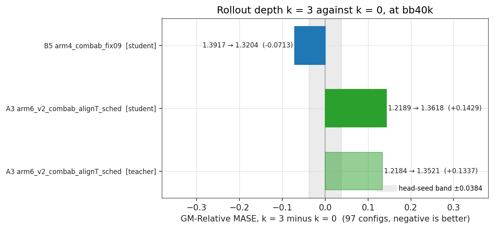
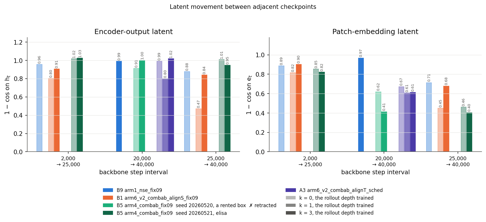
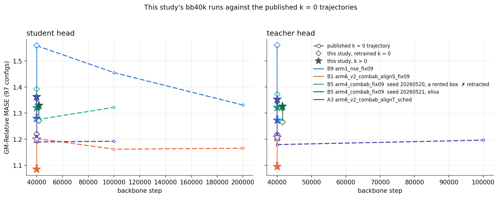
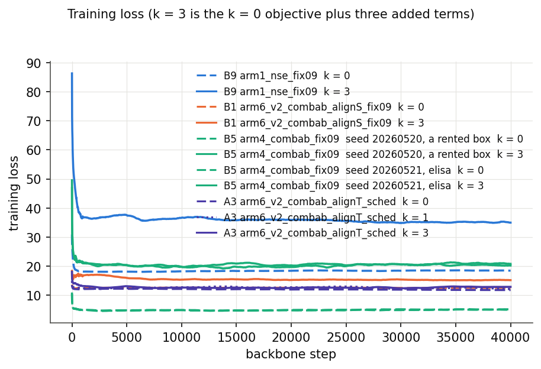
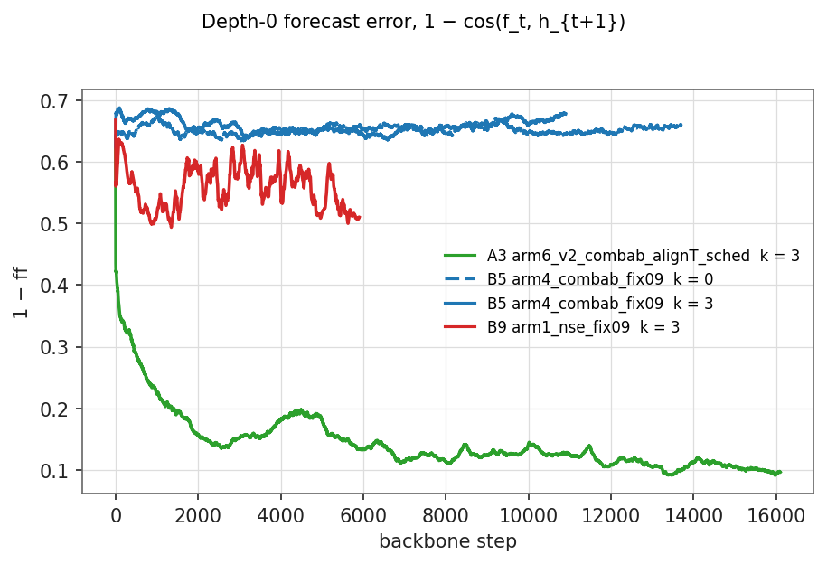

# Rollout depth k = 3

Whether training the composed forecaster helps depends on the loss shape it
is added to. On the cell where `f` sits in the numerator **and** the
denominator it wins by 5%. On the cell whose only f-bearing term has no
denominator it loses by 12%.

`--train-rollout-depth 3` duplicates every loss term that ties `f` to `h` at
depths 1, 2 and 3, so the forecaster is trained on its own output. Both
cells with a same-code baseline confirm the depths reached the objective,
and the composed operator got better on both. Only one of them turned that
into forecast accuracy.

## The result

GM-Relative MASE over the 97 GIFT-Eval configs, this study's own `k = 0`
against its `k = 3` at bb40k. The grey band is `ema_sched_ladder.md`'s
pooled head-seed range, ±0.0384; every bar is wider than it. Both heads of
a cell agree on the sign.

| cell | f-bearing term | head | k = 0 | k = 3 | Δ | 95% CI | better in (% of dataset resamples) |
|---|---|---|---|---|---|---|---|
| B5 `arm4_combab_fix09` | pooled `xshh_allt`, f in numerator and every denominator family | student | 1.3917 | **1.3204** | −0.0713 | [−0.133, −0.027] | 100% |
| B5 | | teacher | 1.3719 | **1.3216** | −0.0503 | [−0.097, −0.011] | 99.4% |
| A3 `arm6_v2_combab_alignT_sched` | `L_align` only, no denominator | student | 1.2189 | 1.3618 | +0.1429 | [+0.089, +0.212] | 0% |
| A3 | | teacher | 1.2184 | 1.3521 | +0.1337 | [+0.084, +0.200] | 0% |

Intervals are a paired bootstrap that resamples DATASETS, one cluster per
dataset, over the 97 configs. The last column is the share of those
resamples in which `k = 3` came out lower. Both quantities move the config
sample and nothing else: neither carries the head seed, and neither carries
the spread between two backbone trainings.

**B9** (`arm1_nse_fix09`, split `L_pred` + CPC, the other cell with `f` in
both places) has no same-code `k = 0`, so it gets no row above. Its `k = 3`
levels are **1.2791** student and **1.2728** teacher, against a published
`k = 0` of 1.5579. That is the direction B5 moved, and the gate's own bias
runs the same way — this code scored B5's `k = 0` 0.117 *worse* than
published, so a same-code B9 `k = 0` would most likely be above 1.5579, not
below. It is still not a measurement, and it is not counted as one.

The card itself drew this line. B5 and B9 are "the only two cells whose main
contrastive term carries `f` in both places", and it asked for them first
precisely because "if the flag is wrong there, the other nine will not show
it". They are also the two cells where a depth is a **complete extra
InfoNCE**, with its own positive and its own normalisation. On A3 the only
f-bearing term is `L_align`, `2 − 2·cos(f^(j)_t, sg(h_{t+1+j}))`, which has
no denominator — so `k = 3` there does not add a normalised rollout
objective. It quadruples `L_align`'s weight against the f-free `L_rep` and
SIGReg.

## The objective did what it was designed to do, on both cells

`cos(rollout_d, h_{T0+d})` on one fixed batch for d = 1..16, through the
eval's own `rollout_latent`. No head, no metric — the composed operator
measured directly. `k = 3` is above `k = 0` at every depth on both cells and
never below.

| cell | d = 1 | d = 4 | d = 16 |
|---|---|---|---|
| B5 k = 0 → k = 3 | 0.788 → 0.891 | 0.784 → 0.872 | 0.772 → 0.832 |
| A3 k = 0 → k = 3 | 0.932 → 0.982 | 0.929 → 0.958 | 0.904 → 0.907 |
| B9 k = 3 (no pair) | 0.489 | 0.280 | 0.107 |

B9's rollout collapses by d = 4 even at `k = 3`. The split shape trains
`L_pred` and `L_rep` on separate halves of the latent, and nothing in this
study says what its `k = 0` rollout looks like.

So the mechanism is not in doubt. The gap between the two cells is in what
the head does with it.

## The gain is not where the mechanism predicted

The rollout deficit is a horizon effect — #327 reports short 0.976, medium
1.41, long 1.37 — so a per-step gain that compounds should land on medium
and long and leave short alone. It does not.

| cell | head | short (55) | medium+long (42) |
|---|---|---|---|
| B5 | student | **−6.4%** | −3.4% |
| B5 | teacher | −4.4% | −2.6% |
| A3 | student | +17.1% | +5.1% |
| A3 | teacher | +15.8% | +4.9% |

B5 improves more on short than on long; A3 degrades more on short than on
long. Both are the same shape: the depth moves short horizons about twice
as far as long ones, in whichever direction the cell moves. The card's
criterion — medium+long at least 5% better with short losing under 2% — is
met by neither.

That is evidence against the compounding story as the route by which the
depth acts, on the two cells that ran.

## Why A3 loses: depth 0 pays

`1 − cos(f^(j)_t, h_{t+1+j})` per training step. On B5 the `k = 3` run's own
depth-0 curve sits above the `k = 0` run's `1 − ff` for the whole run: the
one-step prediction, which is the only one the quantile head reads, gets
worse even where the composed operator gets better.

The depths are summed, so at `k = 3` the f-side carries four times its
baseline weight and three quarters of that is on predictions the head never
sees. On B5 that cost is paid inside a normalised term and the cell still
comes out ahead. On A3 there is no denominator to absorb it, and the
re-weighting against `L_rep` and SIGReg is the dominant effect.

## What it costs

From the production runs' own timing lines, both depths of a cell on
identical RTX 5090s:

| | k = 0 | k = 3 | change |
|---|---|---|---|
| B5 forward + backward | 117.6 ms | 301.9 ms | **+157%** |
| A3 forward + backward | 115.9 ms | 137.8 ms | **+19%** |
| B5 GPU memory | 5375 MiB | 5585 MiB | +4% |

The depth is expensive exactly where it works. B5's pooled shape rebuilds
`log_pos`, `log_neg_zy` and `log_neg_cross_batch` at every depth; A3's
`L_align` has nothing to rebuild.

Memory is nearly free: `FCST_GRAD_CKPT=1`, which all 14 cells already set,
checkpoints each depth's non-last forecaster layers. The depth costs time,
not VRAM.

A separate 600-step probe on elisa's shared 4090, alternating the two depths
three times, read +139% on B5's fwd+bwd. PR #400's CPU-only estimate was
+40%; the GPU number is the one to plan with.

## The published k = 0 numbers are not a baseline for this code

The card puts a gate before the comparison: retrain one cell per group at
`k = 0` on the new code and match the published number to within 0.0002.

| group | cell | head | published | retrained here | \|Δ\| |
|---|---|---|---|---|---|
| A | A3 | student | 1.1895 | 1.2189 | 0.0294 |
| B | B5 | student | 1.2748 | 1.3917 | **0.1169** |

Both miss. Group A's miss sits inside the pooled head-seed band of 0.0384
and is the size of ordinary run-to-run noise. Group B's does not: 0.1169 is
three times that band and **larger than the effect this study set out to
measure**.

So every delta above is against this study's own `k = 0`, retrained on the
same commit, the same protocol and the same hardware — which is what the
card prescribes when the gate fails. The consequence is that **B9 has no
baseline**: it has no same-code `k = 0`, and the published 1.5579 cannot
stand in for one. Its `k = 3` numbers are reported as levels only.

What moved between the two snapshots is not identified here. It is not the
loss: 48 frozen values and a digit-for-digit trainer reproduction pin
`k = 0` to the pre-change objective (PR #400). It is somewhere else in the
trainer, the head, the eval, or the hardware.

## The depth reached the loss, on every cell

Twelve of the fourteen cells carry `L_align` as their only f-bearing term.
Unwire the depth on that arm and the run completes, writes k+1 plausible
`cos_err_dj` curves, and reproduces the `k = 0` loss to the last digit. So
every cell was checked, not assumed — including the eleven that did not go
on to train.

Each cell ran its own launcher twice for one step, at `k = 0` and at
`k = 3`. Step 1 is the discriminating row: both runs start from the same
weights and draw the same batch, so `loss_tau_ref` — pinned to depth 0 —
must match, and `loss` must not. All fourteen pass
(`results/verify_summary.tsv`).

## Collapse watch

The card names `u_batchtime` on `h_t` and `e_t` as the thing to watch: a
model can win the deeper terms by flattening `f`. Neither curve collapses on
any cell.

Latent movement between the 20k and 40k checkpoints, on #379's committed
fixed batch. `k = 3` moves the encoder-output latent slightly more and the
patch-embedding latent less.

## Deviation from the card

**The h-anchored negative families shift with the depth.** The card's
default was to compute them once and reuse them unshifted, and it asks the
implementation to state which one it does. PR #400 takes the alternative, so
that a depth-`j` copy is a literal copy of the depth-0 objective under one
rule: every `h` index shifts by `j`.

It touches exactly one cell, and it is the cell that won. B5 is the only
cell whose f-bearing denominator holds h-anchored families. B9's `L_pred`
denominator is f-anchored only, and the other twelve cells' f-bearing term
is `L_align`, which has no denominator at all. So B5's +5% is a result about
the shifted variant, and the unshifted variant is untested.

## What ran, and what did not

The card lists 14 cells, each to bb40k and bb100k and conditionally bb200k,
two heads per stop, 97 configs per head — over 200 GPU-hours at the rates
measured here. The study had $7.31 of vast.ai credit and two elisa 4090s
that another session was already holding above 90% utilisation. It ran the
front of the card's own run order and stopped.

| | ran | did not run |
|---|---|---|
| cells at k = 3 | B5, B9, A3 (all 10 stops scored) | A1, A2, A4, B1, B2, B3, B4, B6, B7, B8, B10 |
| same-code k = 0 | B5, A3 (the two gates) | the rest |
| stops | bb40k | bb100k, bb200k |
| head-seed replicates | none | the card's annex figures |

Two of the five cells the card names as its run-early set ran, so rule 2 is
exercised by the pooled shape and the split shape but not by the CPC
auxiliary. Nine of the ten cells whose only f-bearing term is `L_align` did
not run — and A3, the one that did, is the cell that lost.

Two consequences. There is no bb100k, so nothing here says whether a `k = 3`
cell that starts behind catches up; the parents show cells moving by 0.05
between 40k and 100k. And there is no head-seed replicate here, so the noise
band is the parents' pooled ±0.0384 rather than one measured in this study.

## Uncertainty

Three sources, one of them measured here.

- **Config sampling.** A paired dataset-cluster bootstrap, resampling
  datasets rather than configs because `<ds>/short`, `/medium` and `/long`
  are three configs of one series. `results/bootstrap.csv`. Every full-97
  interval excludes zero.
- **Head seed.** Not measured here; the parents' pooled range is ±0.0384.
  Both heads of both cells agree on the sign, which is the cheap check
  available.
- **Backbone training.** Not measured here, and not measured by the parents
  either. The gate failure is the only handle on it, and it says the spread
  across code snapshots reaches 0.1169 on one cell — the same size as the
  effect. Read every delta with that in mind. **One cell's win and one
  cell's loss, each from a single training pair, is not a result that should
  change the objective on its own.**

## Method

#393's protocol, unchanged.

Backbone `d_model=64, n_heads=8, num_encoder_layers=3, num_layers=3,
batch_size=64, seed=20260520`; dataset `gift-pretrain-full-4096 /
small_v1`. Group A raises the EMA α linearly from 0.9 towards 1.0, anchored
to step 100k; group B holds α at 0.9. Every cell starts fresh at step 0.

Two heads per checkpoint, student and teacher, trained separately, each
evaluated on the encoder it was trained on. Head budget 15,000 steps at
bb40k, head seed 20260722, `--grad-clip 1.0` on the head. 97 GIFT-Eval
configs, official B4 strategy, forecast horizon 16, and #379's committed
seasonal-naive denominator.

GM-Relative MASE over a subset of the 97 is the geometric mean of
`our MASE / seasonal-naive MASE` over that subset. Over all 97 the number is
the eval's own, from `summary.txt`, not recomputed;
`scripts/split_scores.py` reproduces one of those aggregates as 1.414099
against a published 1.4141, which pins the subsets to the same definition.

Head training ran on elisa's GPU, GIFT-Eval on elisa's 32 cores, backbones
on rented RTX 5090s and one 4090. That split is what made five backbone runs
affordable on $7.31: PR #394 measured the eval at 2.86 core-hours for the 97
configs, with no VRAM at all.

**How a cell gets the flag.** Both published launchers ASSIGN `EXTRA_ARGS`
inside their per-cell `case` block and never read the environment, so an
exported value is silently overwritten. `scripts/make_launchers.sh` copies
each of the three launchers that carry the 14 cells and adds
`--train-rollout-depth "$K"` to the SHARED flag block. `diff` against the
parent is this study's whole deviation from the baseline protocol: that
flag, `OUT` moved to this directory, checkpoints moved to the durable root,
a `_cf373k<K>` run-name suffix, and `--log-every` made an env override with
its default unchanged.

## Tables

[`results/scores.md`](results/scores.md) — per cell, per head, with the gate
and the horizon split.
[`results/bootstrap.csv`](results/bootstrap.csv) — the intervals.
[`results/steptime_runs.csv`](results/steptime_runs.csv) — per-run step times.
[`results/verify_summary.tsv`](results/verify_summary.tsv) — the per-cell depth check.
[`results/rollout_fidelity.csv`](results/rollout_fidelity.csv),
[`results/latent_movement.csv`](results/latent_movement.csv),
[`results/splits.csv`](results/splits.csv) — the figure data.
[`results/execution_log.md`](results/execution_log.md) — what happened while running it.

## Annex: the parent report's figure set

The card asks for every figure `ema_sched_ladder.md` and
`lalign_teacher.md` publish, rebuilt on this study's cells. Five of them
carry the result above; the rest are here.

Each cell's published `k = 0` trajectory over the stops its parent report
reached, with this study's bb40k points on it: a diamond for the retrained
`k = 0`, a star for `k = 3`. B5's `k = 3` at 40k steps lands below its
published `k = 0` at 100k, and B9's below its published `k = 0` at 200k.
Read that as suggestive only — the gate above says those published curves
are not on this code's scale.

Teacher head minus student head. The depth does not change which encoder
the head is better trained on: the two heads land within 0.02 of each other
on every cell at both depths.

The training loss. It is NOT comparable across the two depths — a `k = 3`
loss is the `k = 0` objective plus three added terms — so this panel is
here to show the shape and to catch a divergence. There is none.

`1 − ff`, the depth-0 forecast error, which IS comparable across depths.
This is the same quantity as the depth-0 curve of the per-depth figure
above, drawn for every run in one axis.

The teacher-head versions of the two result figures:
[`plots/horizon_split_teacher.png`](plots/horizon_split_teacher.png) and
[`plots/domain_radar_teacher.png`](plots/domain_radar_teacher.png). Both
repeat the student-head picture.

`alpha_schedule.png` is not rebuilt: group A's α is the parent's own
schedule, 0.94 at bb40k, and group B holds α at 0.9. `paired_delta.png` and
`seed_spread.png` are the parent's head-seed annex, and this study ran no
head-seed replicate.
