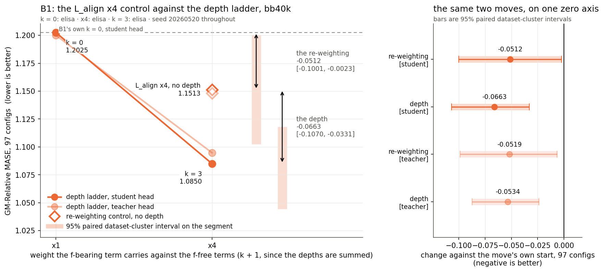
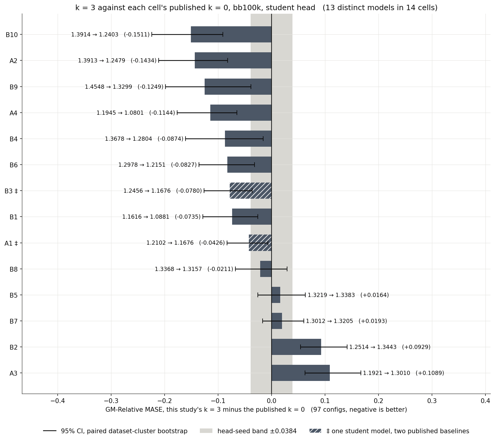
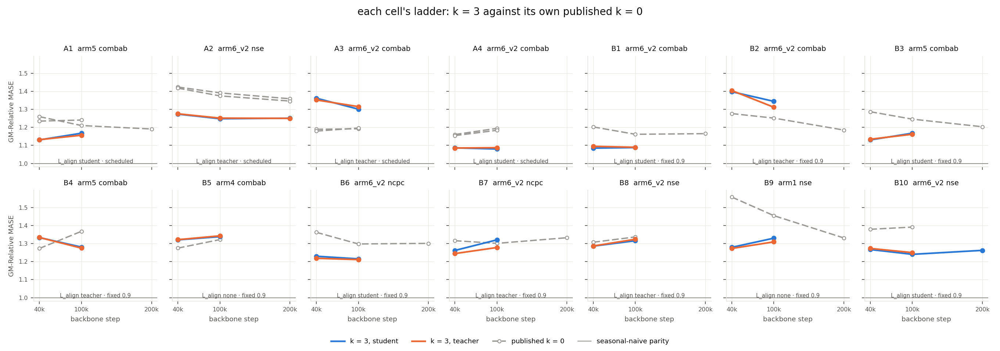
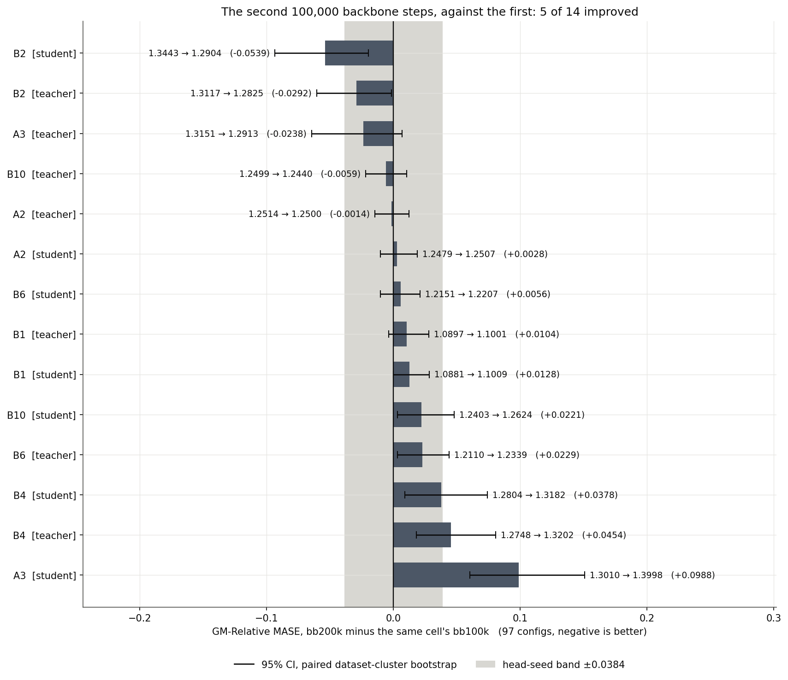
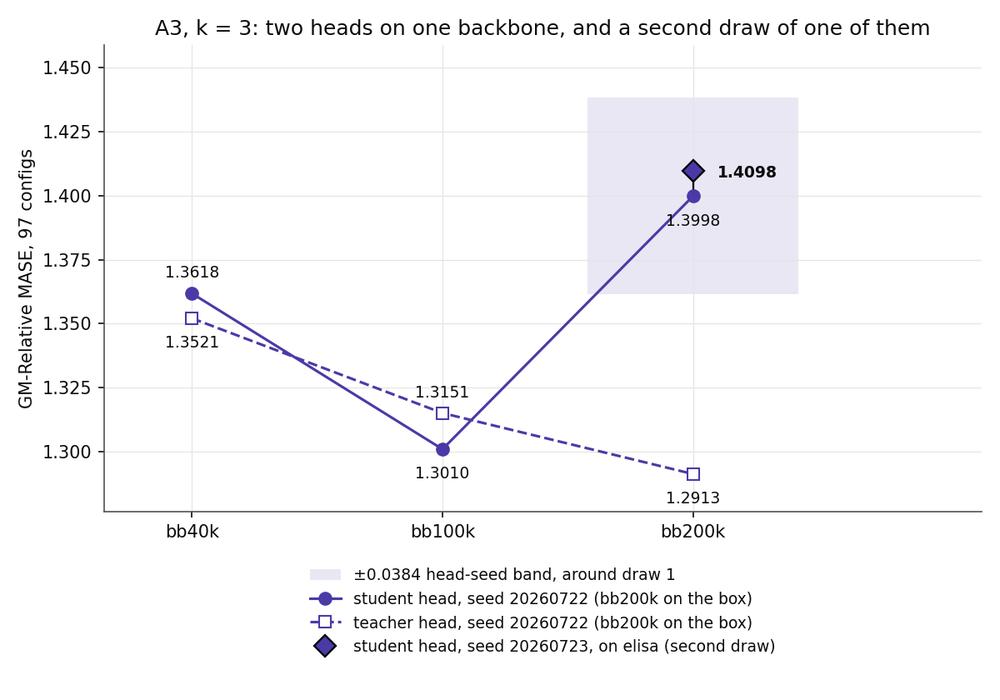

# Training on deeper rollouts also multiplies the forecast loss weight, and on the one cell that separates them each pays about half

`--train-rollout-depth 3` adds a copy of every f-bearing loss term at depths
1, 2 and 3 to the depth-0 term, so it also multiplies that term's weight by 4.
B1 is the study's only `k = 0` / `k = 3` pair that holds the machine, the
backbone seed and the head budget, so it is the one cell that separates the
depth from the weight.

## The depth, and the weight it carries

*B1 at bb40k, both heads: `k = 0`, the `L_align` ×4 re-weighting applied at
`k = 0`, and `k = 3`. Backbone seed 20260520, head seed 20260722, 15,000 head
steps, elisa throughout, 97 GIFT-Eval configs. Interval bounds in the tables
below.*

On the student head the re-weighting alone carries -0.0512 of the -0.1175
total, and the extra horizons carry -0.0663.

## The 14 cells, screened against the published k = 0

*Each cell's `k = 3` at bb100k minus the `k = 0` its parent report published,
student head, 97 configs. bb100k is the stop all 14 cells reached. The two
sides of every bar trained on different machines. The grey band is the
parents' pooled head-seed band, ±0.0384. A1 and B3 hold one student model
against two published baselines: their arm aligns to the student and passes no
`--moco-rep-keys`, so the EMA regime that separates the two cells cannot reach
the student encoder. 14 cells therefore carry 13 student models.*

Of the 13 distinct student models, 8 beat their published `k = 0` by more
than the head-seed band, 3 sit inside it and 2 lose.

*All 14 cells, both heads, every stop scored. The dashed line is the parent
report's published `k = 0`, which trained on another machine for most cells.*

## The baseline the screen reads against

*Each retrained `k = 0` against the value its parent report published.
GM-Relative MASE at bb40k, student head, 97 configs, grouped by training
machine.*

*B5 trained three times on one recipe, one code snapshot, one head seed and
one eval. `B5·s3` holds `B5·s1`'s seed and `B5·s2`'s machine, so the pair
separates the machine, 0.1166, from the seed, 0.0035.*

## The second 100,000 backbone steps

*Every cell that reached bb200k, against its own bb100k, both heads, 97
configs. The bb200k backbone resumes the bb100k checkpoint, so only the second
100,000 steps differ.*

Of the 16 extended measurements, 7 improved and 9 got worse, with mean +0.0079
and median +0.0042. A4 improves on both heads and holds the study's best
score, 1.0660 on the student. The extend rule sent a cell to 200k when its
first leg improved, so this panel is selected and the 200k reading is
conditional on it.

*A3's bb200k student head, trained twice off one backbone checkpoint, at two
head seeds and on two machines. The band is ±0.0384, drawn around the first
draw.*

## What this study cannot support

| the claim | what stops it |
|---|---|
| That the gain is the depth alone | On B1, the one cell that carries the control, the ×4 re-weighting takes 44% of the student's move and 49% of the teacher's. No other cell holds that control on one machine. |
| That one of the two pays more than the other | The two shares sit inside each other's 95% intervals: -0.0512 [-0.1001, -0.0023] against -0.0663 [-0.1070, -0.0331]. This cell measures both and ranks neither. |
| Any per-cell verdict | Every cell is n = 1 in the backbone seed. The ±0.0384 band bounds the HEAD seed alone, and backbone-seed variance is unmeasured. |
| That depth 3 is the right depth | Only `k = 3` ran on the 14 cells. One ladder holds a second depth, on A3, and its `k = 1` delta covers zero: -0.0195 [-0.0537, +0.0148] on the student. |
| The card's per-horizon criterion at scale | It is applied as a test on 2 machine-held arms, B1 and B5·s2, at one stop, bb40k. Every other pair crosses a machine, and the machine is worth 0.1166. |
| That `k = 3` leads at 200k | Four cells hold a published `k = 0` at 200k. A2 by -0.1079, B6 by -0.0804 and B1 by -0.0643 lead it. B2 loses by +0.1054, more than any of the three gains. |
| The cost of the depth | Two probes agree at +157% and +168% step time. A3's +13% covers 127 of its 273 timing windows and crosses a box, so it is not comparable to them. |
| That the 200k reading is unconditional | The extend rule reads the bb40k-to-bb100k contrast, which the Protocol calls not head-matched. It fired inside its own ±0.0384 band on four stopped cells, and both manual overrides extended. |

## Depth against the arm's own k = 0, on the 4 cells that hold one

*Every trained depth against the same arm's own retrained `k = 0`, bb40k, 97
configs. Whiskers are 95% paired dataset-cluster bootstrap intervals.*

*GM-Relative MASE by horizon term, each depth against the same arm's `k = 0`,
bb40k.*

*Per-domain GM-Relative MASE, each arm against its own `k = 0`, bb40k.*

*A3's depth ladder against the `L_align` ×4 control, both heads, bb40k. Every
column trained on a different box from at least one other.*

## Inside the model, on 4 of the 14 cells

*`cos` between the rolled latent and the true `h_{t+d}` for `d = 1..16`, no
head in the way, on the parent reports' fixed diagnostic batch. B9, B1, B5·s2
and A3.*

Every `k = 3` run is more faithful than its own `k = 0` at all 16 depths, and
the diagnostic batch is not held out against the pre-training data, so the
rise may be memorisation.

*`1 − cos(f^(j)_t, h_{t+1+j})` during training, one line per depth, against
the `k = 0` run's single line. Signs per window in the tables below.*

*`u_batchtime` on `h_t` and on `e_t` during training. No run reaches zero at
any depth.*

*Teacher-encoder head minus student-encoder head, per arm per depth, bb40k.
Every value is inside ±0.0198, against a head-seed band of ±0.0384.*

## Tables

<!-- TABLES:BEGIN -->

### Coverage

The card names 14 cells. This study scored **14 of them**: A1, A2, A3, A4, B1, B2, B3, B4, B5, B6, B7, B8, B9, B10. Every cell carries a number.

| cell | f-bearing term | EMA α | depths trained | stops scored |
|---|---|---|---|---|
| A1 | L_align only | scheduled | k = 3 | bb40k, bb100k |
| A2 | L_align + CPC auxiliary | scheduled | k = 3 | bb40k, bb100k, bb200k |
| A3 | L_align only | scheduled | k = 0, k = 1, k = 3 | bb40k, bb100k, bb200k |
| A4 | L_align only | scheduled | k = 3 | bb40k, bb100k, bb200k |
| B1 | L_align only | fixed 0.9 | k = 0, k = 3 | bb40k, bb100k, bb200k |
| B2 | L_align only | fixed 0.9 | k = 3 | bb40k, bb100k, bb200k |
| B3 | L_align only | fixed 0.9 | k = 3 | bb40k, bb100k |
| B4 | L_align only | fixed 0.9 | k = 3 | bb40k, bb100k, bb200k |
| B5 | pooled xshh_allt, floor subtracted | fixed 0.9 | k = 0, k = 3 | bb40k, bb100k |
| B6 | L_align only | fixed 0.9 | k = 3 | bb40k, bb100k, bb200k |
| B7 | L_align only | fixed 0.9 | k = 3 | bb40k, bb100k |
| B8 | L_align + CPC auxiliary | fixed 0.9 | k = 3 | bb40k, bb100k |
| B9 | split L_pred + CPC auxiliary | fixed 0.9 | k = 0, k = 3 | bb40k, bb100k |
| B10 | L_align + CPC auxiliary | fixed 0.9 | k = 3 | bb40k, bb100k, bb200k |

Stops scored: bb40k, bb100k, bb200k. The card's extend rule reads a cell's bb40k number against its bb100k number, so it fires only where both are in hand.

### This study's k = 3 against the published k = 0

GM-Relative MASE over the same 97 GIFT-Eval configs, strategy B4, horizon 16. Δ is this study minus the published number, so negative is a gain. A verdict reads Δ against the ±0.0384 head-seed band: closer than that is `flat`.

A dash is a number no parent published. Group B's two parents print one head per row, the student, so group B has no published teacher to meet.

At bb100k, the stop every one of the 14 cells reached. The count is over distinct MODELS. ‡ marks the one student two cells share, so 14 cells hold 13 student models and the shared one counts once. Student head: 13 distinct models, **8 better, 3 flat, 2 worse**. Teacher head, group A only: 4 distinct models, **3 better, 0 flat, 1 worse**.

Read the verdict column as a screen and not as a test. It compares against a baseline this study did not retrain on its own machine, and the ±0.0384 band it thresholds on bounds the HEAD seed alone. The card's own criterion is the per-horizon one, and the depth-response table below is where it is applied.

The second line of a verdict cell is its 95% paired dataset-cluster interval. Every one of the 41 deltas in this table carries one. The three parents' per-config CSVs are all in reach, so the pairing against them is recoverable: same 97 configs, same seasonal-naive denominator file, same resampling unit as every other interval in this report. `published_bootstrap.py` accepts a parent CSV for a cell only after that CSV reproduces the number the parent printed, to four decimals. All 41 did, and none was dropped. The interval bounds the eval sample. It does not bound the machine, which separates the two sides of every one of these deltas.

| cell | head | 40k k=3 | 40k pub | Δ | | 100k k=3 | 100k pub | Δ | | 200k k=3 | 200k pub | Δ | |
|---|---|---|---|---|---|---|---|---|---|---|---|---|---|
| A1 | student | 1.1305 | 1.2596 | -0.1291 | better [-0.1966, -0.0758] | 1.1676 | 1.2102 | -0.0426 | better [-0.0835, -0.0069] | — | 1.1910 | — | — |
| A1 | teacher | 1.1318 | 1.2347 | -0.1029 | better [-0.1590, -0.0560] | 1.1565 | 1.2407 | -0.0842 | better [-0.1396, -0.0314] | — | — | — | — |
| A2 | student | 1.2735 | 1.4238 | -0.1503 | better [-0.2357, -0.0762] | 1.2479 | 1.3913 | -0.1434 | better [-0.2112, -0.0820] | 1.2507 | 1.3586 | -0.1079 | better [-0.1653, -0.0546] |
| A2 | teacher | 1.2753 | 1.4177 | -0.1424 | better [-0.2301, -0.0659] | 1.2514 | 1.3746 | -0.1232 | better [-0.1841, -0.0660] | 1.2500 | 1.3459 | -0.0959 | better [-0.1472, -0.0462] |
| A3 | student | 1.3618 | 1.1895 | +0.1723 | worse [+0.1159, +0.2454] | 1.3010 | 1.1921 | +0.1089 | worse [+0.0627, +0.1672] | 1.3998 | — | — | — |
| A3 | teacher | 1.3521 | 1.1793 | +0.1728 | worse [+0.1161, +0.2480] | 1.3151 | 1.1963 | +0.1188 | worse [+0.0672, +0.1857] | 1.2913 | — | — | — |
| A4 | student | 1.0862 | 1.1603 | -0.0741 | better [-0.1305, -0.0268] | 1.0801 | 1.1945 | -0.1144 | better [-0.1763, -0.0648] | 1.0660 | — | — | — |
| A4 | teacher | 1.0855 | 1.1544 | -0.0689 | better [-0.1223, -0.0249] | 1.0874 | 1.1837 | -0.0963 | better [-0.1505, -0.0506] | 1.0828 | — | — | — |
| B1 | student | 1.0850 | 1.2025 | -0.1175 | better [-0.1801, -0.0615] | 1.0881 | 1.1616 | -0.0735 | better [-0.1287, -0.0255] | 1.1009 | 1.1652 | -0.0643 | better [-0.1230, -0.0130] |
| B1 | teacher | 1.0948 | — | — | — | 1.0897 | — | — | — | 1.1001 | — | — | — |
| B2 | student | 1.3976 | 1.2765 | +0.1211 | worse [+0.0690, +0.1889] | 1.3443 | 1.2514 | +0.0929 | worse [+0.0541, +0.1415] | 1.2904 | 1.1850 | +0.1054 | worse [+0.0609, +0.1621] |
| B2 | teacher | 1.4041 | — | — | — | 1.3117 | — | — | — | 1.2825 | — | — | — |
| B3 | student ‡ | 1.1305 | 1.2868 | -0.1563 | better [-0.2263, -0.0966] | 1.1676 | 1.2456 | -0.0780 | better [-0.1265, -0.0365] | — | 1.2034 | — | — |
| B3 | teacher | 1.1343 | — | — | — | 1.1618 | — | — | — | — | — | — | — |
| B4 | student | 1.3334 | 1.2728 | +0.0606 | worse [+0.0166, +0.1147] | 1.2804 | 1.3678 | -0.0874 | better [-0.1607, -0.0155] | 1.3182 | — | — | — |
| B4 | teacher | 1.3339 | — | — | — | 1.2748 | — | — | — | 1.3202 | — | — | — |
| B5 | student | 1.3204 | 1.2748 | +0.0456 | worse [+0.0145, +0.0846] | 1.3383 | 1.3219 | +0.0164 | flat [-0.0256, +0.0634] | — | — | — | — |
| B5 | teacher | 1.3216 | — | — | — | 1.3428 | — | — | — | — | — | — | — |
| B6 | student | 1.2297 | 1.3623 | -0.1326 | better [-0.1998, -0.0742] | 1.2151 | 1.2978 | -0.0827 | better [-0.1356, -0.0321] | 1.2207 | 1.3011 | -0.0804 | better [-0.1287, -0.0340] |
| B6 | teacher | 1.2184 | — | — | — | 1.2110 | — | — | — | 1.2339 | — | — | — |
| B7 | student | 1.2617 | 1.3159 | -0.0542 | better [-0.1016, -0.0147] | 1.3205 | 1.3012 | +0.0193 | flat [-0.0166, +0.0601] | — | 1.3325 | — | — |
| B7 | teacher | 1.2444 | — | — | — | 1.2780 | — | — | — | — | — | — | — |
| B8 | student | 1.2857 | 1.3074 | -0.0217 | flat [-0.0565, +0.0140] | 1.3157 | 1.3368 | -0.0211 | flat [-0.0674, +0.0292] | — | — | — | — |
| B8 | teacher | 1.2865 | — | — | — | 1.3239 | — | — | — | — | — | — | — |
| B9 | student | 1.2791 | 1.5579 | -0.2788 | better [-0.3543, -0.1978] | 1.3299 | 1.4548 | -0.1249 | better [-0.1982, -0.0383] | — | 1.3308 | — | — |
| B9 | teacher | 1.2728 | — | — | — | 1.3094 | — | — | — | — | — | — | — |
| B10 | student | 1.2669 | 1.3791 | -0.1122 | better [-0.1996, -0.0340] | 1.2403 | 1.3914 | -0.1511 | better [-0.2239, -0.0908] | 1.2624 | — | — | — |
| B10 | teacher | 1.2730 | — | — | — | 1.2499 | — | — | — | 1.2440 | — | — | — |

### The stop ladder: what the second 100,000 steps buys

Δ is bb200k minus bb100k, so a negative number is an improvement: GM-Relative MASE is a ratio against seasonal-naive and lower is better. Of the 16 extended measurements in hand, **7 improved** at bb200k and 9 got worse. The largest gain is B2 student, -0.0539. Over all 16: mean +0.0079, median +0.0042. The ±0.0384 head-seed band covers 13 of them.

The interval is a 95% paired dataset-cluster bootstrap over the pair's 97 configs. It bounds the eval sample, not run-to-run variance. The head-seed band is ±0.0384.

| cell | head | bb40k | bb100k | bb200k | Δ | 95% CI | % | note |
|---|---|---|---|---|---|---|---|---|
| A1 | student | 1.1305 | 1.1676 | — | — | — | — | the extend rule held this cell at 100k |
| A1 | teacher | 1.1318 | 1.1565 | — | — | — | — | the extend rule held this cell at 100k |
| A2 | student | 1.2735 | 1.2479 | 1.2507 | +0.0028 | [-0.0103, +0.0190] | +0.2% |  |
| A2 | teacher | 1.2753 | 1.2514 | 1.2500 | -0.0014 | [-0.0145, +0.0122] | -0.1% |  |
| A3 | student | 1.3618 | 1.3010 | 1.3998 | +0.0988 | [+0.0602, +0.1509] | +7.6% |  |
| A3 | teacher | 1.3521 | 1.3151 | 1.2913 | -0.0238 | [-0.0646, +0.0067] | -1.8% |  |
| A4 | student | 1.0862 | 1.0801 | 1.0660 | -0.0141 | [-0.0265, -0.0024] | -1.3% |  |
| A4 | teacher | 1.0855 | 1.0874 | 1.0828 | -0.0046 | [-0.0199, +0.0123] | -0.4% | extended by hand; the rule's move is inside the band |
| B1 | student | 1.0850 | 1.0881 | 1.1009 | +0.0128 | [+0.0001, +0.0284] | +1.2% | bb40k written by round 1 as `G6_B1_…`; same checkpoint, same head budget |
| B1 | teacher | 1.0948 | 1.0897 | 1.1001 | +0.0104 | [-0.0037, +0.0280] | +1.0% | bb40k written by round 1 as `G6_B1_…`; same checkpoint, same head budget |
| B2 | student | 1.3976 | 1.3443 | 1.2904 | -0.0539 | [-0.0935, -0.0197] | -4.0% |  |
| B2 | teacher | 1.4041 | 1.3117 | 1.2825 | -0.0292 | [-0.0604, -0.0016] | -2.2% |  |
| B3 | student | 1.1305 | 1.1676 | — | — | — | — | the extend rule held this cell at 100k |
| B3 | teacher | 1.1343 | 1.1618 | — | — | — | — | the extend rule held this cell at 100k |
| B4 | student | 1.3334 | 1.2804 | 1.3182 | +0.0378 | [+0.0089, +0.0742] | +3.0% |  |
| B4 | teacher | 1.3339 | 1.2748 | 1.3202 | +0.0454 | [+0.0181, +0.0807] | +3.6% |  |
| B5 | student | 1.3204 | 1.3383 | — | — | — | — | the extend rule held this cell at 100k |
| B5 | teacher | 1.3216 | 1.3428 | — | — | — | — | the extend rule held this cell at 100k |
| B6 | student | 1.2297 | 1.2151 | 1.2207 | +0.0056 | [-0.0101, +0.0212] | +0.5% |  |
| B6 | teacher | 1.2184 | 1.2110 | 1.2339 | +0.0230 | [+0.0032, +0.0440] | +1.9% |  |
| B7 | student | 1.2617 | 1.3205 | — | — | — | — | the extend rule held this cell at 100k |
| B7 | teacher | 1.2444 | 1.2780 | — | — | — | — | the extend rule held this cell at 100k |
| B8 | student | 1.2857 | 1.3157 | — | — | — | — | trained from 0 this round; queued to 100k only |
| B8 | teacher | 1.2865 | 1.3239 | — | — | — | — | trained from 0 this round; queued to 100k only |
| B9 | student | 1.2791 | 1.3299 | — | — | — | — | the extend rule held this cell at 100k |
| B9 | teacher | 1.2728 | 1.3094 | — | — | — | — | the extend rule held this cell at 100k |
| B10 | student | 1.2669 | 1.2403 | 1.2624 | +0.0221 | [+0.0032, +0.0481] | +1.8% |  |
| B10 | teacher | 1.2730 | 1.2499 | 1.2440 | -0.0059 | [-0.0220, +0.0105] | -0.5% |  |

### A3's bb200k student, drawn twice

A3 at bb200k reads 1.3998 on the student and 1.2913 on the teacher, off one backbone file. That 0.1084 gap is 6.5x the next-largest in group A (0.0168) and 2.6x the largest anywhere (0.0425). Every gap in the grid is in [`results/head_gap.tsv`](results/head_gap.tsv).

The second draw changes two things: the head seed, and the machine that trained the head. Draw 1 trained on the rented box, draw 2 on elisa. Both read the same 200,000-step backbone checkpoint, the box's original and elisa's synced copy of it. Held across the two draws: 30,000 head steps, the recipe, and the 97-config eval, which ran on elisa's cores for both. Only elisa's copy carries a recorded md5 (`9f0e8da71ff595523d2bf0dabdf80445`, [`results/eval/A3_k3_bb200k_student_s20260723/backbone_md5.txt`](results/eval/A3_k3_bb200k_student_s20260723/backbone_md5.txt)); the box was released before its original could be checksummed.

| draw | head seed | GM-Relative MASE | against draw 1 |
|---|---|---|---|
| 1, student | 20260722 | 1.3998 | — |
| 2, student | 20260723 | 1.4098 | +0.0100 |
| teacher | 20260722 | 1.2913 | -0.1084 |

**The two draws agree.** They sit 0.0100 apart [-0.0163, +0.0378], 26% of the ±0.0384 head-seed band, and the second draw is the higher of the two. So 1.3998 is not a bad draw. The interval covers zero, and its far end lands on the imported band, so this head behaves like the heads that band was measured on. The two draws also sit on two machines, so this agreement bounds the head seed and the machine together, not the seed alone.

The student/teacher gap survives the redraw at 0.1185, 3.1x the band. Two head seeds put A3's bb200k student above its teacher, so the gap is a property of that student encoder and not of the draw. Draw 1 and the teacher trained on the same box, so their 0.1084 gap holds the machine; the redraw's 0.1185 crosses machines.

The ladder's largest move reads +0.1088 [+0.0656, +0.1667] off the second draw, against +0.0988 off the first. Both exclude zero.

A3's is also the ladder's largest reversal, but it is not the only one: 5 of the 8 three-stop student trajectories turn round at bb200k.

| cell | bb40k | bb100k | bb200k | bb200k − bb100k | shape |
|---|---|---|---|---|---|
| A2 | 1.2735 | 1.2479 | 1.2507 | +0.0028 | turns round |
| A3 | 1.3618 | 1.3010 | 1.3998 | +0.0988 | turns round |
| A4 | 1.0862 | 1.0801 | 1.0660 | -0.0141 | monotone |
| B1 | 1.0850 | 1.0881 | 1.1009 | +0.0128 | monotone |
| B2 | 1.3976 | 1.3443 | 1.2904 | -0.0539 | monotone |
| B4 | 1.3334 | 1.2804 | 1.3182 | +0.0378 | turns round |
| B6 | 1.2297 | 1.2151 | 1.2207 | +0.0056 | turns round |
| B10 | 1.2669 | 1.2403 | 1.2624 | +0.0221 | turns round |

### Stop reasons: what the extend rule read at each cell

The rule reads one cell's bb40k number against its bb100k number, per head. A head that moved down earns the second 100,000 steps; a head that moved up stops. Both columns are bb100k minus bb40k, so negative is an improvement. It held 6 cells at 100k.

| cell | 40k→100k student | 40k→100k teacher | decision | why |
|---|---|---|---|---|
| A1 | +0.0371 | +0.0248 | **stop at 100k** | both heads moved up |
| A2 | -0.0256 | -0.0239 | **extend both heads** | both heads moved down |
| A3 | -0.0608 | -0.0370 | **extend both heads** | both heads moved down |
| A4 | -0.0061 | +0.0019 | **extend both heads** | the student head moved down; the teacher head moved +0.0019, 5% of the ±0.0384 head-seed band, so the rule decides nothing there. Extended by hand, on free hardware |
| B1 | +0.0030 | -0.0051 | **extend both heads** | the card's call: both moves sit inside the ±0.0384 head-seed band, so the rule decides nothing |
| B2 | -0.0533 | -0.0924 | **extend both heads** | both heads moved down |
| B3 | +0.0371 | +0.0276 | **stop at 100k** | both heads moved up |
| B4 | -0.0530 | -0.0591 | **extend both heads** | both heads moved down |
| B5 | +0.0179 | +0.0212 | **stop at 100k** | both heads moved up |
| B6 | -0.0146 | -0.0074 | **extend both heads** | both heads moved down |
| B7 | +0.0587 | +0.0336 | **stop at 100k** | both heads moved up |
| B8 | +0.0300 | +0.0374 | **stop at 100k** | both heads moved up |
| B9 | +0.0508 | +0.0365 | **stop at 100k** | both heads moved up |
| B10 | -0.0266 | -0.0231 | **extend both heads** | both heads moved down |

**The rule selects the panel, and it selects it on an improving first leg.** Three properties of that, stated plainly:

1. It reads the one contrast this study calls not head-matched. A bb40k head trains 15,000 steps and a bb100k head 30,000, so part of every move in the two columns above is the head's own extra 15,000 steps. The Protocol section says so for the depth verdict. It is equally true of the rule.
2. It fires inside its own noise band. 4 of the 6 stopped cells (A1, B3, B5, B8) moved less than ±0.0384 on BOTH heads. The verdict table above calls a move of that size `flat`.
3. The manual overrides go one way. A4 and B1 were extended by hand because the rule decides nothing inside the band. That reasoning applies with the same force to the cells in point 2, and none of them was extended.

So the 8 extended cells are enriched for cells that happened to improve from bb40k to bb100k, and regression to the mean is the expected null at bb200k. This study runs no control for it. **Read the 200k verdict as conditional on a panel selected for having improved.**

### The four same-arm pairs: two models, or one

Each pair runs ONE arm under the two EMA regimes, group A's schedule against group B's fixed 0.9. Every tensor of both backbones is compared, split into the student side the student head reads and the `teacher_*` side the teacher head reads.

Each entry is the count of tensors that agree exactly, out of the count compared. A head's file md5 differs between two cells even when every weight agrees, so the comparison is tensor by tensor and never by md5.

| pair | arm | stop | student | teacher | student head | teacher head |
|---|---|---|---|---|---|---|
| A1/B3 | `arm5_combab_alignS` | bb40k | 110/110 | 0/52 | 28/28 | 0/28 |
| A1/B3 | `arm5_combab_alignS` | bb100k | 110/110 | 0/52 | 28/28 | 0/28 |
| A4/B1 | `arm6_v2_combab_alignS` | bb40k | 4/110 | 0/52 | — | — |
| A4/B1 | `arm6_v2_combab_alignS` | bb100k | 4/110 | 0/52 | 0/28 | 0/28 |
| A4/B1 | `arm6_v2_combab_alignS` | bb200k | 4/110 | 0/52 | 0/28 | 0/28 |
| A3/B2 | `arm6_v2_combab_alignT` | bb40k | 4/110 | 0/52 | — | — |
| A3/B2 | `arm6_v2_combab_alignT` | bb100k | 4/110 | 0/52 | 0/28 | 0/28 |
| A3/B2 | `arm6_v2_combab_alignT` | bb200k | 4/110 | 0/52 | 0/28 | 0/28 |
| A2/B8 | `arm6_v2_nse_alignT` | bb40k | 4/111 | 0/52 | 0/28 | 0/28 |
| A2/B8 | `arm6_v2_nse_alignT` | bb100k | 4/111 | 0/52 | 0/28 | 0/28 |

Full table, with the largest absolute difference on each side: [`results/pair_identity.tsv`](results/pair_identity.tsv).

**A1/B3 hold one student, not two.** `arm5_combab` aligns to the student and carries no `--moco-rep-keys`, so no loss term reads the EMA encoder and the regime sends no gradient into the student. One student number for both cells is the right answer, and it is ONE measurement: the student row of one of them is not a replication of the other. The teacher side differs at every stop, and the teacher numbers do too.

**A2/B8, A3/B2, A4/B1 hold two students.** Their arms carry `--moco-rep-keys`, whose keys come from the EMA encoder, or align to the teacher. Either path reaches the student's gradient, so the regime moves it.

### The A1/B3 duplicate, re-run end to end

Each row trains a fresh student head from the checkpoint its own cell names, seed 20260722, and runs the 97 configs into `results/eval/<cell>rep_…`, a directory no other cell writes. A path that ignored the cell would land the re-run on the other cell's number.

| cell | stop | backbone md5 | first pass | re-run | Δ |
|---|---|---|---|---|---|
| A1 | bb40k | `f99fa42c` | 1.1305 | 1.1447 | +0.0141 |
| A1 | bb100k | `dbd23cbe` | 1.1676 | 1.1610 | -0.0066 |
| B3 | bb40k | `b3a51f06` | 1.1305 | 1.1447 | +0.0141 |
| B3 | bb100k | `0efbb813` | 1.1676 | 1.1610 | -0.0066 |

The largest re-run move is 0.0141. The two cells carry different backbone md5s and reproduce their own first-pass numbers, so the head and the eval read the file each cell names. The duplicate is the student weights, not the path.

### Reproduction of the published k = 0

Same cell, same recipe, same head seed 20260722, same 97-config B4 eval, student head. Rows are grouped by machine.

A row at the parents' own backbone seed 20260520 takes the card's 0.0002; a row at any other seed takes the seed band.

| backbone | seed | machine | published k = 0 | retrained k = 0 | \|Δ\| | gate | verdict |
|---|---|---|---|---|---|---|---|
| B1 | 20260520 | elisa | 1.2025 | 1.2025 | 0.0000 | 0.0002, the card | PASS |
| B5·s3 | 20260520 | elisa | 1.2748 | 1.2751 | 0.0003 | 0.0002, the card | at the re-run floor |
| B9 | 20260520 | elisa | 1.5579 | 1.5583 | 0.0004 | 0.0002, the card | at the re-run floor |
| B5·s2 | 20260521 | elisa | 1.2748 | 1.2716 | 0.0032 | 0.0230, the seed band | inside the seed band |
| A3 | 20260520 | vast box d | 1.1895 | 1.2189 | 0.0294 | 0.0002, the card | FAIL |
| B5·s1 ✗ | 20260520 | vast box d | 1.2748 | 1.3917 | 0.1169 | 0.0002, the card | FAIL |
| B5·pub | 20260520 | the parent report's box | 1.2748 | 1.2751 | 0.0003 | 0.0002, the card | at the re-run floor |

Two things this comparison cannot resolve, added: 0.0003 for the head and the eval, which is what `B5·pub` moves the score by while training nothing, and 0.0001 for the parents' four printed decimals. A |Δ| at or below 0.0004 is a run this pipeline cannot separate from the published one. The card's gate of 0.0002 is stricter than that.

The seed band is 0.0230, the far end of the 95% interval on this study's one measurement of a seed change: `B5·s2` against `B5·s3`, one machine, one recipe, +0.0035 [-0.0183, +0.0230]. It is one run pair, and the interval is over that pair's eval sample rather than over seeds, so the band is a floor on what a seed can move and not a bound on it. B5·s2 is the only row it gates; every other row here carries the parents' own seed.

`B5·pub` is not a training: it takes the parent report's own published B5 checkpoint and puts this study's head and eval on it, so its row bounds the head and the eval rather than the trainer. `B5·s3` is a training, at the protocol seed, on elisa, and its 97-config eval output is byte-identical to `B5·pub`'s (`results/eval/G7_B5_k0_e_bb40k_student/all_results.csv` against `results/eval/G1_B5pub_bb40k_student/all_results.csv`): the elisa retrain reproduced the parent's backbone exactly, and the 0.0003 both rows carry is the head and the eval.

### Depth response, against each arm's own k = 0

| arm | seed | machine held | head | k | k = 0 | this k | Δ | all | short | med+long | criterion |
|---|---|---|---|---|---|---|---|---|---|---|---|
| B9 | 20260520 | no, elisa → vast box c | student | 3 | 1.5583 | 1.2791 | -0.2791 | -17.9% | -12.6% | -24.4% | **MET** |
| B9 | 20260520 | no, elisa → vast box c | teacher | 3 | 1.5599 | 1.2728 | -0.2871 | -18.4% | -12.8% | -25.2% | **MET** |
| B1 | 20260520 | yes, elisa | student | 3 | 1.2025 | 1.0850 | -0.1175 | -9.8% | -5.4% | -15.2% | **MET** |
| B1 | 20260520 | yes, elisa | teacher | 3 | 1.2001 | 1.0948 | -0.1053 | -8.8% | -5.1% | -13.4% | **MET** |
| B5·s1 ✗ | 20260520 | no, vast box d → vast box a | student | 3 | 1.3917 | 1.3204 | -0.0713 | -5.1% | -6.4% | -3.4% | not met |
| B5·s1 ✗ | 20260520 | no, vast box d → vast box a | teacher | 3 | 1.3719 | 1.3216 | -0.0503 | -3.7% | -4.4% | -2.6% | not met |
| B5·s2 | 20260521 | yes, elisa | student | 3 | 1.2716 | 1.3292 | +0.0575 | +4.5% | +7.0% | +1.4% | not met |
| B5·s2 | 20260521 | yes, elisa | teacher | 3 | 1.2661 | 1.3260 | +0.0599 | +4.7% | +8.1% | +0.5% | not met |
| A3 | 20260520 | no, vast box d → elisa | student | 1 | 1.2189 | 1.1995 | -0.0195 | -1.6% | -2.6% | -0.2% | not met |
| A3 | 20260520 | no, vast box d → vast box b | student | 3 | 1.2189 | 1.3618 | +0.1429 | +11.7% | +17.1% | +5.1% | not met |
| A3 | 20260520 | no, vast box d → elisa | teacher | 1 | 1.2184 | 1.2063 | -0.0121 | -1.0% | -1.5% | -0.4% | not met |
| A3 | 20260520 | no, vast box d → vast box b | teacher | 3 | 1.2184 | 1.3521 | +0.1337 | +11.0% | +15.8% | +4.9% | not met |

Criterion, from the card: medium+long (42 configs) at least 5% better, short (55 configs) losing less than 2%.

**This table is the only place the card's criterion is applied as a test, and it is answered for 2 machine-held arms (B1, B5·s2) at one stop, bb40k.** The card also asks about bb100k and bb200k. No cell holds a machine-matched `k = 0` at either stop, so at those two the report has the screen and nothing else. The same criterion runs over every pair of the published-baseline table as well, where it is a screen because the two sides cross a machine: 25 of 41 pairs meet it, and 10 of 18 at bb100k ([`results/criterion_screen.csv`](results/criterion_screen.csv)).

`machine held` = did the two sides train on the same box. A `no` row carries a machine change as well as a depth change. The B5 table below measures the machine alone, at one seed, at 0.1166, so a `no` row carries a term larger than most of the deltas in this table. Only the `yes` rows report the depth and nothing else.

✗ marks a retracted row: B5·s1's `k = 0` trained on a rented box and misses its published value by 0.1169; `B5·s3` retrains it at the same seed on elisa and lands 0.0003 away, so the baseline the -5.1% rests on is a rented-box artefact and the delta is retracted.

Head-seed band ±0.0384 (`ema_sched_ladder.md`, pooled). It bounds the head seed alone. It does not bound the machine, and it does not bound the BACKBONE seed: this study holds one backbone seed in 14 cells and one replicate of it (B5·s2 against B5·s3, at k = 0, at bb40k), so backbone-seed variance is unmeasured. Every better / flat / worse verdict in this report rests on a band that bounds one of the two seeds in play.

The depths trained are k = 1, k = 3, and only k = 3 ran on the 14 cells. The one ladder that holds more than a single depth is A3's, the cell where k = 3 does the most damage, and its k = 1 row is machine-crossed and covers zero. So this study supports **depth 3 moves the score**. It does NOT support *depth 3 is the right depth*: no cell measures a second depth against a machine-held k = 0.

### Paired dataset-cluster bootstrap, per horizon subset

The resampling unit is the dataset: `<ds>/short`, `/medium` and `/long` are three configs of one series and are not independent draws. 95% percentile interval over 10,000 resamples. Each interval is over one run pair's 97 configs, so it bounds the eval sample and not run-to-run variance.

| arm | head | k | subset | n | Δ | 95% CI | resamples improved |
|---|---|---|---|---|---|---|---|
| B9 | student | 3 | all | 97 | -0.2791 | [-0.3548, -0.1980] | 100.0% |
| B9 | student | 3 | short | 55 | -0.1736 | [-0.2470, -0.1038] | 100.0% |
| B9 | student | 3 | medium_long | 42 | -0.4472 | [-0.5655, -0.3382] | 100.0% |
| B9 | teacher | 3 | all | 97 | -0.2871 | [-0.3644, -0.2032] | 100.0% |
| B9 | teacher | 3 | short | 55 | -0.1751 | [-0.2501, -0.1018] | 100.0% |
| B9 | teacher | 3 | medium_long | 42 | -0.4670 | [-0.5952, -0.3523] | 100.0% |
| B1 | student | 3 | all | 97 | -0.1175 | [-0.1801, -0.0615] | 100.0% |
| B1 | student | 3 | short | 55 | -0.0556 | [-0.1017, -0.0184] | 99.9% |
| B1 | student | 3 | medium_long | 42 | -0.2244 | [-0.3504, -0.1243] | 100.0% |
| B1 | teacher | 3 | all | 97 | -0.1053 | [-0.1661, -0.0515] | 100.0% |
| B1 | teacher | 3 | short | 55 | -0.0523 | [-0.0980, -0.0146] | 99.7% |
| B1 | teacher | 3 | medium_long | 42 | -0.1963 | [-0.3129, -0.1047] | 100.0% |
| B5·s1 ✗ | student | 3 | all | 97 | -0.0713 | [-0.1327, -0.0267] | 100.0% |
| B5·s1 ✗ | student | 3 | short | 55 | -0.0848 | [-0.1732, -0.0068] | 98.3% |
| B5·s1 ✗ | student | 3 | medium_long | 42 | -0.0504 | [-0.0972, -0.0137] | 99.7% |
| B5·s1 ✗ | teacher | 3 | all | 97 | -0.0503 | [-0.0965, -0.0108] | 99.4% |
| B5·s1 ✗ | teacher | 3 | short | 55 | -0.0571 | [-0.1215, +0.0086] | 95.8% |
| B5·s1 ✗ | teacher | 3 | medium_long | 42 | -0.0395 | [-0.0882, +0.0028] | 96.6% |
| B5·s2 | student | 3 | all | 97 | +0.0575 | [+0.0173, +0.1094] | 0.2% |
| B5·s2 | student | 3 | short | 55 | +0.0809 | [+0.0231, +0.1549] | 0.2% |
| B5·s2 | student | 3 | medium_long | 42 | +0.0199 | [-0.0215, +0.0745] | 19.0% |
| B5·s2 | teacher | 3 | all | 97 | +0.0599 | [+0.0214, +0.1105] | 0.1% |
| B5·s2 | teacher | 3 | short | 55 | +0.0925 | [+0.0345, +0.1701] | 0.0% |
| B5·s2 | teacher | 3 | medium_long | 42 | +0.0074 | [-0.0268, +0.0543] | 38.7% |
| A3 | student | 1 | all | 97 | -0.0195 | [-0.0537, +0.0148] | 86.9% |
| A3 | student | 1 | short | 55 | -0.0294 | [-0.0652, +0.0007] | 97.1% |
| A3 | student | 1 | medium_long | 42 | -0.0029 | [-0.0565, +0.0628] | 55.8% |
| A3 | student | 3 | all | 97 | +0.1429 | [+0.0893, +0.2122] | 0.0% |
| A3 | student | 3 | short | 55 | +0.1899 | [+0.1254, +0.2739] | 0.0% |
| A3 | student | 3 | medium_long | 42 | +0.0698 | [+0.0226, +0.1415] | 0.0% |
| A3 | teacher | 1 | all | 97 | -0.0121 | [-0.0479, +0.0261] | 74.0% |
| A3 | teacher | 1 | short | 55 | -0.0163 | [-0.0596, +0.0275] | 77.9% |
| A3 | teacher | 1 | medium_long | 42 | -0.0052 | [-0.0572, +0.0602] | 59.5% |
| A3 | teacher | 3 | all | 97 | +0.1337 | [+0.0839, +0.2004] | 0.0% |
| A3 | teacher | 3 | short | 55 | +0.1760 | [+0.1177, +0.2537] | 0.0% |
| A3 | teacher | 3 | medium_long | 42 | +0.0673 | [+0.0197, +0.1414] | 0.0% |

### One cell, three backbones

B5 (`arm4_combab_fix09`) trained three times on one recipe, one code snapshot, one head seed and one eval. They differ by backbone seed and by machine, and each contrast below names which of the two it changes. The machine moves the score and the seed does not.

| backbone | seed | machine | k = 0 | k = 3 | k = 3 − k = 0 |
|---|---|---|---|---|---|
| B5·s1 ✗ | 20260520 | a rented box | 1.3917 | 1.3204 | -0.0713 |
| B5·s2 | 20260521 | elisa | 1.2716 | 1.3292 | +0.0575 |
| B5·s3 | 20260520 | elisa | 1.2751 | — | — |

| contrast | what changes | k | Δ | 95% CI |
|---|---|---|---|---|
| B5·s1 against B5·s3 | the machine, at one seed | 0 | -0.1166 | [-0.1885, -0.0645] |
| B5·s2 against B5·s3 | the seed, on one machine | 0 | +0.0035 | [-0.0183, +0.0230] |
| B5·s1 against B5·s2 | the seed AND the machine | 0 | -0.1200 | [-0.1825, -0.0742] |
| B5·s1 against B5·s2 | the seed AND the machine | 3 | +0.0088 | [-0.0306, +0.0520] |

Student head, 97 configs. `B5·s3` holds `B5·s1`'s seed and `B5·s2`'s machine.

Every interval here is a paired dataset-cluster bootstrap over the 97 eval configs of ONE run pair. It bounds the eval sample: how far the difference between these two runs could move if the datasets had been drawn again. It does not bound run-to-run variance, and neither contrast has a replicate to bound it with. No two of B5's three backbones share both a seed and a machine.

`mixup` counts the examples the mixer touched in the 200-step window, so one count at every step is one data order. `B5·s1` and `B5·s3` carry one seed, print one count at every step, and their losses still part.

| step | B5·s1 seed 20260520, a rented box | B5·s2 seed 20260521, elisa | B5·s3 seed 20260520, elisa |
|---|---|---|---|
| 200 | 5.5767  `61/200` | 5.6595  `53/200` | 5.5610  `61/200` |
| 400 | 5.1220  `58/200` | 5.3568  `62/200` | 5.2078  `58/200` |
| 600 | 4.9019  `65/200` | 5.0143  `51/200` | 4.9412  `65/200` |
| 800 | 4.9475  `65/200` | 5.1256  `65/200` | 5.1249  `65/200` |

### B1: is the win the depth, or the weight?

B1 carries `L_align` as its only f-bearing term, so its `k = 3` run multiplies that term's weight against the f-free terms by 4 as well as adding depth. The `L_align x4` row applies the re-weighting at k = 0, with no depth at all.

| head | k = 0 | k = 0, `L_align` x4 | k = 3 |
|---|---|---|---|
| student | 1.2025 | 1.1513 -0.0512 [-0.1001, -0.0023] | 1.0850 -0.1175 [-0.1801, -0.0615] |
| teacher | 1.2001 | 1.1482 -0.0519 [-0.0987, -0.0066] | 1.0948 -0.1053 [-0.1661, -0.0515] |

Second line of each cell: the difference against `k = 0` and its 95% paired dataset-cluster interval.

Every column trained on elisa at backbone seed 20260520, on the same head budget. This is the study's one such table, so it may divide one column by another.

| head | the re-weighting k = 0 → x4 | the depth x4 → k = 3 | total k = 0 → k = 3 | the re-weighting's share |
|---|---|---|---|---|
| student | -0.0512 | -0.0663 | -0.1175 | 44% |
| teacher | -0.0519 | -0.0534 | -0.1053 | 49% |

### A3: is the damage the depth, or the weight?

Summing the depths multiplies `L_align`'s weight against the f-free terms by k + 1. The `L_align x4` row applies that re-weighting at k = 0, with no depth at all.

| head | k = 0 | k = 0, `L_align` x4 | k = 1 | k = 3 |
|---|---|---|---|---|
| student | 1.2189 | 1.2590 +0.0401 [+0.0116, +0.0767] | 1.1995 -0.0195 [-0.0537, +0.0148] | 1.3618 +0.1429 [+0.0893, +0.2122] |
| teacher | 1.2184 | 1.2558 +0.0374 [+0.0058, +0.0756] | 1.2063 -0.0121 [-0.0479, +0.0261] | 1.3521 +0.1337 [+0.0839, +0.2004] |

Second line of each cell: the difference against `k = 0` and its 95% paired dataset-cluster interval.

Every column trained on a different box from at least one other. A3_k0: vast box d · G3_A3_k0_aw4: elisa · G3_A3_k1: elisa · A3_k3: vast box b. The machine alone is worth 0.1166 on this study's one controlled measurement of it, which is more than either control's own size, so read the two controls as direction and not as magnitude. This table therefore does not divide one column by another.

### What the depth costs

Median `fwd + bwd` per step, from each run's own trainer log. A median is a cost of the depth only where the run had the card to itself, so the table says which did. `run_provenance.py` reads that off the driver logs and [`results/steptime_solo.csv`](results/steptime_solo.csv) carries it per run. A3's `k = 3` shared vast box b with a clone of itself up to step 14,800, and its 131.5 ms is the median over the 127 windows after that.

| arm | f-bearing term | k | machine | card | fwd+bwd | alone? |
|---|---|---|---|---|---|---|
| B9 | split L_pred | 0 | elisa | RTX 4090 | 212.6 ms, shared | no — another backbone for 96% of the run; head training for 4% of it |
| B9 | split L_pred | 3 | vast box c | RTX 4090 | 425.2 ms | yes |
| B1 | rep_only + L_align | 0 | elisa | RTX 4090 | 178.6 ms, shared | no — another backbone for 100% of the run; head training for 100% of it |
| B1 | rep_only + L_align | 3 | elisa | RTX 4090 | 235.1 ms, shared | no — another backbone for 68% of the run; head training for 100% of it |
| B5·s1 | pooled xshh_allt | 0 | vast box d | RTX 5090 | 117.6 ms | yes |
| B5·s1 | pooled xshh_allt | 3 | vast box a | RTX 5090 | 301.9 ms | yes |
| B5·s2 | pooled xshh_allt | 0 | elisa | RTX 4090 | 201.1 ms, shared | no — another backbone for 100% of the run; head training for 98% of it |
| B5·s2 | pooled xshh_allt | 3 | elisa | RTX 4090 | 500.9 ms, shared | no — another backbone for 43% of the run; head training for 100% of it |
| A3 | rep_only + L_align | 0 | vast box d | RTX 5090 | 115.9 ms | yes |
| A3 | rep_only + L_align | 1 | elisa | RTX 4090 | 214.7 ms, shared | no — another backbone for 72% of the run; head training for 100% of it |
| A3 | rep_only + L_align | 3 | vast box b | RTX 5090 | 131.5 ms | yes |

The ratios both of whose sides are solo:

| arm | f-bearing term | k = 0 | k = 3 | change | both sides | read as |
|---|---|---|---|---|---|---|
| B5·s1 | pooled xshh_allt | 117.6 ms | 301.9 ms | +157% | vast box d → vast box a | the depth, plus the box |
| A3 | rep_only + L_align | 115.9 ms | 131.5 ms | +13% | vast box d → vast box b | **not comparable** — its `k = 3` median covers 127 of 273 windows |

Two probes of the same quantity agree and one does not. B5·s1 reads +157% with both sides solo throughout, and the controlled alternating probe on one elisa card reads +168% (190.2 ms against 509.9 ms, 3 reps of 600 steps, [`results/steptime_B5_solo_card.csv`](results/steptime_B5_solo_card.csv)). A3 reads +13%, an order of magnitude below both, off a median over the tail of its run and across a box change. This study does not know why. **Carry +157% to +168%, the two probes that agree, and do not carry the low row.** No cell of the 14 has a same-card k = 0 / k = 3 pair, which is what would settle it.

### The depth-0 forecast error, deeper run minus its own k = 0

`1 - cos(f_t, h_{t+1})` during training: the same quantity on both runs, unlike the loss. Negative means the deeper run forecasts one step ahead better. Four end-of-run windows, because a gap that changes sign between them is not a result.

| arm | k | last 50% | last 25% | last 10% | final step | one sign over all four |
|---|---|---|---|---|---|---|
| B9 | 3 | -0.0707 | -0.0893 | -0.0938 | -0.0817 | yes |
| B1 | 3 | -0.0968 | -0.0915 | -0.1122 | -0.0807 | yes |
| B5·s1 ✗ | 3 | +0.0157 | +0.0102 | +0.0121 | +0.0150 | yes |
| B5·s2 | 3 | +0.0121 | +0.0061 | +0.0023 | -0.0129 | **no** |
| A3 | 1 | +0.0871 | +0.0902 | +0.1159 | +0.0401 | yes |
| A3 | 3 | -0.0469 | -0.0004 | +0.0489 | +0.0623 | **no** |

### Glossary

| term | what it means here |
|---|---|
| the card | the issue this study answers, and the 14 cells, stops and criteria it names |
| cell | one of those 14 recipes, `A1`..`A4` and `B1`..`B10` |
| arm | a (cell, backbone seed, machine) triple. B5 trained three, so the cell is not the unit a delta lives in |
| bb40k | backbone step 40,000, the one stop every run here reached |
| GM-Relative MASE | geometric mean over the 97 GIFT-Eval configs of each config's MASE divided by the seasonal-naive MASE. Lower is better; 1.0 is seasonal-naive parity |
| B4 eval strategy | GIFT-Eval's official evaluation strategy, the one the parent reports use |
| student / teacher head | the quantile head is trained twice per backbone, once on the student encoder and once on its EMA copy, the teacher. The two are separate measurements of one backbone |
| f-bearing term | the loss term that the forecast operator `f` enters. `--train-rollout-depth K` duplicates it at depth 1..K |
| `rep_only` | the representation loss with no forecast term |
| `L_align` | the term that aligns `f`'s output with the future latent |
| `L_pred` | the predictive contrastive term, split from the representation term |
| `xshh_allt` | negatives pooled across the batch and across channels, taken over every time index |
| `u_batchtime` | dimension usage of a latent over the pooled (batch × time) sample axis: `1 / (H · mean off-diagonal squared cosine)`, capped at 1. 1.0 is all `H` dimensions in use and a value near `1/H` is one direction. `h_t` is the encoder latent, `e_t` the embedding it reads |
| collapse | the latent falling onto few directions, so `u_batchtime` runs toward zero. The card watches for it because a model can win the deeper f-bearing terms by flattening `f` |
| `arm4`, `arm6_v2 combab` | the launcher recipes the cells run; the Coverage table gives each cell's |
| head-seed band ±0.0384 | how far the head seed alone moved a score in `ema_sched_ladder.md`, pooled. It bounds the head seed and nothing else |
| `mixup` | the count of examples the batch mixer touched in a 200-step window. Two runs on one data order print one count |

<!-- TABLES:END -->

*Full paired dataset-cluster bootstraps, including the per-domain splits:
[`results/bootstrap.csv`](results/bootstrap.csv). Every table above comes from
`scripts/tables.py`, which writes [`results/scores.md`](results/scores.md) in
the same pass.*

## Protocol

Backbone `d_model=64, n_heads=8, num_encoder_layers=3, num_layers=3,
batch_size=64`, seed 20260520 (B5's second training uses 20260521); dataset
`gift-pretrain-full-4096 / small_v1`; `--ema-embedding --ema-encoder`. Group B
holds EMA α at 0.9; group A raises it linearly from 0.9 to 1.0 by step 100k.
Every cell starts fresh at step 0. Two heads per checkpoint, student and
teacher, trained separately on their own encoder, head seed 20260722,
`--grad-clip 1.0` on the head. 97 GIFT-Eval configs, official B4 strategy,
forecast horizon 16, one shared seasonal-naive denominator file.

**14 cells at `k = 3`.** All 14 carry bb40k and bb100k on both heads. Eight
extended to bb200k; the extend rule stopped A1, B3, B5, B7, B8 and B9 at
bb100k. One backbone seed throughout, head seed 20260722 throughout.

**The grad-clip is an exemption from a project rule.** `CLAUDE.md` says never
use grad-clip in this project, and fix divergence through the data and the
normalisation instead. The head here is not this study's object: it is the
measuring instrument, and the parent reports whose numbers this study is read
against trained it with `--grad-clip 1.0`. Dropping the clip would change the
instrument and break the comparison. No backbone in this study clips.

**The head budget differs by column.** Every bb40k head trains 15,000 steps,
the round-1 standard. Every bb100k and bb200k head trains 30,000. So a
comparison down one column is head-matched and a comparison across columns is
not: part of any 40k → 100k move is the head's own extra 15,000 steps. The
depth verdict rests on the 100k and 200k columns, which share a budget. The
parent reports are
[`split_pred_rep_small`](../2026-07-21_split_pred_rep_small/small_long.md),
[`lalign_teacher`](../2026-08-04_lalign_teacher/lalign_teacher.md) and
[`ema_sched_ladder`](../2026-08-04_ema_sched_ladder/ema_sched_ladder.md).

**Deviation from the card.** The card's default is to compute the h-anchored
negative families once and reuse them unshifted at every depth. This
implementation takes the card's stated alternative and **shifts them with the
depth**, so a depth-`j` copy is a literal copy of the depth-0 objective under
one rule: every `h` index moves by `j`. It touches exactly one of the 14
cells. B5 (`arm4`, pooled `xshh_allt`) is the only cell whose f-bearing
denominator holds h-anchored families; B9's `L_pred` denominator is f-anchored
only, and the other twelve cells' f-bearing term is `L_align`, which has no
denominator.

**Every number here re-derives from its own artefacts.**
`scripts/verify_close.sh` runs five checks and each writes its own log.

- **The scores.** All 99 score files recomputed from their own 97-config eval,
  two ways: the geometric mean of the per-config `Relative` column, and the
  per-config `MASE` column against the harness CSV. 99 of 99 reproduce. The
  worst deviation is 5.13e-05 against a rounding allowance of 1.07e-04, which
  the check derives from the 4-decimal print rather than fixing by hand
  ([`results/verify_scores.log`](results/verify_scores.log)).
- **The grid.** The 14 × 3 × 2 coverage table rebuilt from the score files
  alone, so it does not read the queue's state files that wrote
  `results/coverage.md`. 72 of 72, none missing, none scored that this round
  did not owe ([`results/verify_coverage.log`](results/verify_coverage.log)).
- **The re-weighting control.** The ×4 weight read off the loss curve, not the
  launcher. On a shared seed and batch order the control sits +3.73 above its
  own `k = 0` baseline at step 1, and it writes no `cos_err_d*` column. So the
  weight moved and the depth did not
  ([`results/verify_alignx4.log`](results/verify_alignx4.log)).
- **The machines.** The training machine of every head, read from the backbone
  path in its own log. B1's six re-weighting columns all sit on elisa. A3's
  two bb200k draws do not
  ([`results/verify_provenance.log`](results/verify_provenance.log),
  [`results/provenance.tsv`](results/provenance.tsv)). The eval directories of
  rounds 1 and 2 hold no head log, so 49 of 100 do not carry the machine.
- **The denominator.** Every score divides by a seasonal-naive column the
  harness recomputes per eval, so the checks above, which read a score against
  its own eval, cannot see a panel that moved between cells. This one reads
  across evals: the 99 summarised evals share one `SN_MASE` column on one set
  of 97 configs, md5 `a86ef401…`, and pair one-to-one with the 99 score files.
  The hundredth directory is `B5·s3`'s aborted teacher head, which carries no
  score. A negative control that moves one config's denominator by 0.0001
  fails the check and names the config
  ([`results/verify_denominator.log`](results/verify_denominator.log)).

A check suite can agree with itself. So the two results the review put at risk
were re-derived a second time by separate code: numpy in place of the `random`
module, vectorised cluster resampling, and bootstrap seed 7919373 in place of
20260809. It reads `all_results.csv` and the seasonal-naive reference only, and
touches no score file until it compares. All nine scores reproduce, worst
deviation 3.97e-05. All nine observed deltas match to four decimals, to the
last digit. The intervals agree to Monte-Carlo noise: no bound moves by more
than 0.0039, and no interval changes which side of zero it sits on
([`scripts/independent_recheck.py`](scripts/independent_recheck.py),
[`results/independent_recheck.log`](results/independent_recheck.log)).

`bash scripts/make_report_assets.sh` rebuilds this report's tables and figures
from the committed tree. A second full rebuild injects the same tables and
reproduces all 17 embedded figures byte-identically.

## Annex

**`B5·s3` has no teacher-head number.** Its teacher head aborted for want of
VRAM on elisa ([`results/stops.log`](results/stops.log),
[`results/eval/G7_B5_k0_e_bb40k_teacher/stop.log`](results/eval/G7_B5_k0_e_bb40k_teacher/stop.log)).
The group-B parent reports publish the student-encoder head only, so the
student number is the comparison the reproduction check needs.

**The fidelity batch is not held out.** It is the parent report's committed
`_latent_movement_batch.pt`, the same batch the two parent reports'
latent-movement figures use. Nothing here establishes it is disjoint from
`gift-pretrain-full-4096 / small_v1`, which is what these backbones trained
on. It holds every curve on one scale, and that is what it is for.

**B1's bb40k score was written under a non-standard name.** Round 1 wrote it
as `score_G6_B1_k3_bb40k_student`. The head behind it trained off B1's own 40k
checkpoint, the file round 2 resumed, for 15,000 steps at head seed 20260722,
which is the head every other cell's bb40k carries. Round 3 normalised the
name to `score_B1_k3_bb40k_student`, and it reads the same 1.0850.

**One step-time measurement holds the card fixed**, and it is a controlled
probe: B5 alternating `k = 0` and `k = 3` on elisa's GPU 1, 3 reps of 600
steps, 190.2 ms against 509.9 ms, +168%. That card carried another session's
job throughout, so the probe alternates on a shared card rather than owning
one
([`results/steptime_B5_solo_card.csv`](results/steptime_B5_solo_card.csv)).

**Two figures need more than the repository holds.** `rollout_fidelity.png`
and `latent_movement.png` load backbone checkpoints, which stay out of git.
Their `results/*.csv` are committed, so the numbers are auditable and only the
re-derivation needs the checkpoint store. `latent_movement.png` is also the
one figure the rebuild does not reproduce byte-identically, and this report
does not embed it.

**Operational events**, and the training-curve diagnostics this report does
not read, are in
[`results/execution_log.md`](results/execution_log.md).
