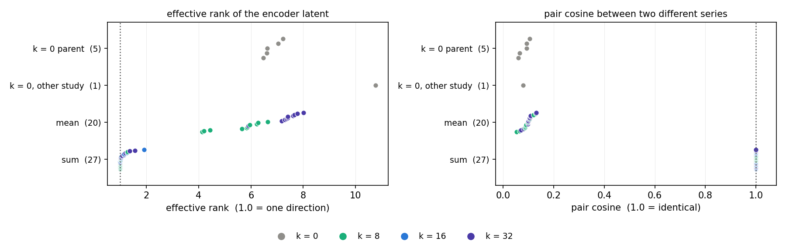
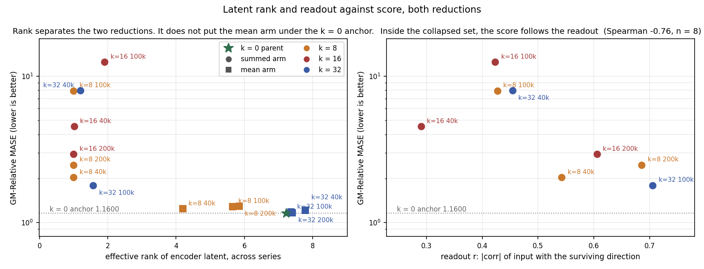
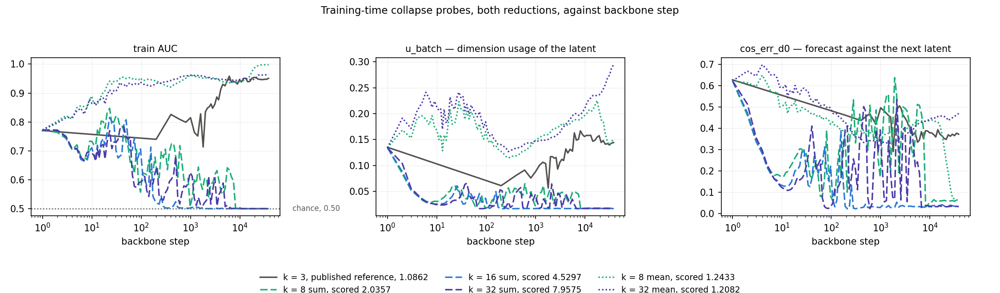
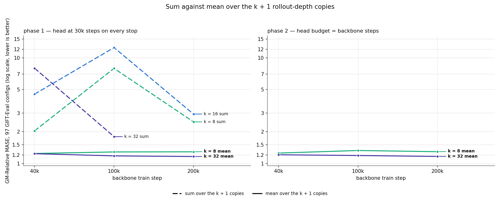
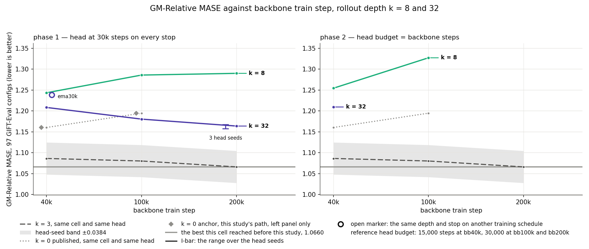
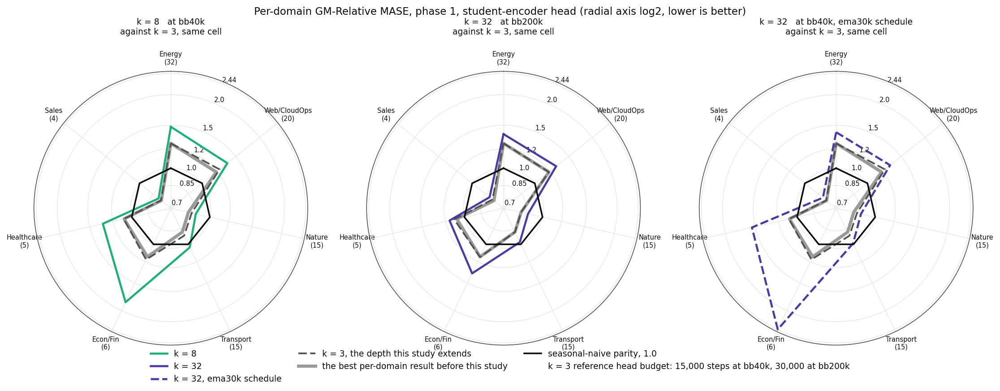
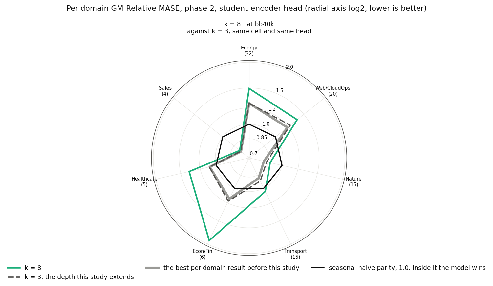

# The sum over the rollout-depth copies collapses the encoder, and rollout depth 8 and 32 do not improve GM-Relative MASE

Summing the k + 1 rollout-depth copies collapses the encoder to one latent
direction. Averaging the same copies does not, and the two sets of
checkpoints do not overlap.

*Effective rank and pair cosine of the encoder latent, 21 real GIFT-Eval
windows, through the loader the eval uses.*

## Terms

- **cell** — one (depth, backbone stop, head) entry.
- **`bbNk`** — the backbone stopped at N thousand steps.
- **phase 1** — a 30,000-step head on every backbone stop.
- **phase 2** — the head budget set equal to the backbone stop.
- **head** — the forecast head, trained on a frozen backbone. This study
  trains the student-encoder head.
- **leg** — one training run between two backbone stops. A cell's backbone is
  the last leg's checkpoint.
- **collapse** — the encoder maps two different series to almost the same
  latent. Pair cosine at or above 0.9999.
- **effective rank** — the exponential of the entropy of the latent
  covariance spectrum. 1.0 means one direction.
- **pair cosine** — the mean cosine between the latents of two different
  series. 1.0 means the encoder cannot tell them apart.
- **readout r** — the mean absolute correlation between the input series and
  the projection of the latent on its top direction.
- **train AUC** — the trainer's own separation of a positive from a negative.
  0.50 is chance.
- **`u_batch`** — the dimension usage of the latent, from the trainer's own
  column. It falls when the encoder puts its variance into fewer directions.
- **`cos_err_d0`** — 1 minus the cosine between the forecast and the next
  latent. 0 is an exact match.
- **EMA ramp** — the number of steps over which the EMA tau goes from its
  start value to its end value.
- **head-seed band** — ±0.0384, pooled over prior head-seed repeats. It
  bounds the head seed alone.
- **k = 0 parent** — the checkpoint set this study starts from. The name
  covers the checkpoints, never a score.
- **k = 0 anchor** — the k = 0 parent re-scored on this study's path and head
  budget. 1.1600 at bb40k, 1.1945 at bb100k.
- **k = 0 published** — the score the parent study published, 1.1603 at bb40k
  and 1.1945 at bb100k.

## The reduction

*Left: GM-Relative MASE against effective rank, both reductions. Right: the
same score against readout r, over the cells whose top direction carries at
least half of the latent variance.*

The reduction over the k + 1 depth copies sets the collapse. The depth does
not: no checkpoint sits between the summed set and the other two. Every
summed backbone is collapsed, and inside that set the score follows the
readout r (Spearman −0.76, n = 8).

*The trainer's own columns, per step, first 40,000 steps. Solid: published
k = 3. Long dash: sum. Dotted: mean.*

*The same cell and the same depths under both reductions.*

## The depth ladder

*GM-Relative MASE over the 97 GIFT-Eval configs, student head, mean
reduction. Left: 30,000-step head. Right: head budget = backbone steps.*

No scored mean cell comes within the head-seed band of the k = 3 reference.
The k = 0 anchor beats both depths at bb40k, and k = 8 and k = 32 sit inside
the band of each other there. This report reads every difference against the
head-seed band.

## Per-domain

*The config count of each domain is under its name.*

*Phase 2 at bb40k, both depths.*

## Limits

| limit | detail |
|---|---|
| backbone seed | one per cell, so backbone-seed variance is unmeasured |
| head seed | one per cell, except `k32 bb200k`, which has three draws |
| depths | two, k = 8 and k = 32. k = 16 was not run under the mean reduction |
| the shape in k | k = 1 to k = 7 is unmeasured. At bb40k, k = 8 and k = 32 sit inside the band of each other |
| the head budget | three pairs: two moves inside the band, and one at 1.1 times the band which is worse. Not resolved |
| phase-2 cells pending | `k32 bb100k`, `k32 bb200k`, `k8 bb200k` |
| the k = 0 anchor | measured at bb40k and bb100k, absent at bb200k. The k = 0 published covers bb40k and bb100k |
| the eval path | three controls ran it. The k = 0 parent returns its published score at both stops that have one: 1.1600 against 1.1603, and 1.1945 against 1.1945. The third control reads 1.2910 against the published 1.2748, a move of 0.0162 that sits inside the band. This study establishes no cause for it |

## Tables

### How to read a difference

| item | value | what it bounds |
|---|---|---|
| head-seed band | ±0.0384, pooled by `noise_band.py`, from [`ema_sched_ladder.md`](../2026-08-04_ema_sched_ladder/ema_sched_ladder.md) | the head seed alone |
| backbone-seed variance | unmeasured | one backbone seed per cell |
| in-study head-seed repeats | three draws on `k32 bb200k`: 1.1637, 1.1676, 1.1576. Range 0.0100. All three rows are in `results/mean/scores.csv` | the head seed on this study's own cell |
| the in-study range as the reading rule | not adopted. Three draws give a range, not a standard deviation, and a range over three points understates the spread. The pooled band is a maximum over many cells | — |

*Absolute differences. The ladder figure carries the direction.*

| comparison | difference | against the band |
|---|---:|---|
| k = 32 against k = 8, bb200k | 0.1261 | 3.3 × |
| k = 32 against k = 8, bb100k | 0.1054 | 2.7 × |
| best mean cell against k = 3, bb200k | 0.0977 | 2.5 × |
| k = 8 against the k = 0 anchor, bb100k | 0.0912 | 2.4 × |
| k = 8 against the k = 0 anchor, bb40k | 0.0833 | 2.2 × |
| k = 32 against the k = 0 anchor, bb40k | 0.0482 | 1.3 × |
| k = 32 against k = 8, bb40k | 0.0351 | inside |
| EMA ramp shortened to 30k, k = 32 bb40k | 0.0303 | inside |
| k = 32, bb100k to bb200k | 0.0166 | inside |
| k = 32 against the k = 0 anchor, bb100k | 0.0142 | inside |
| k = 32 bb200k against the k = 0 anchor at bb40k | 0.0037 | inside |

### The head budget

*A positive difference means the longer head scores worse.*

| cell | 30,000-step head | head = backbone steps | difference | against the band |
|---|---:|---:|---:|---|
| k = 8, bb40k | 1.2433 | 1.2543 (40k head) | +0.0110 | inside |
| k = 8, bb100k | 1.2857 | 1.3270 (100k head) | +0.0413 | 1.1 × |
| k = 32, bb40k | 1.2082 | 1.2093 (40k head) | +0.0011 | inside |
| k = 8, bb200k | 1.2898 | pending (200k head) | pending | pending |
| k = 32, bb100k | 1.1803 | pending (100k head) | pending | pending |
| k = 32, bb200k | 1.1637 | pending (200k head) | pending | pending |

### Phase 1, mean reduction, 30,000-step student head

*GM-Relative MASE over the 97 GIFT-Eval configs. Lower is better. The k = 3
column reads the score files of
[`rollout_depth.md`](../2026-08-08_rollout_depth/rollout_depth.md), same cell,
same head, same eval. The k = 0 published column reads
[`published.py`](../2026-08-08_rollout_depth/scripts/published.py). Both
columns carry that study's head budget: 15,000 steps at bb40k and 30,000 at
bb100k and bb200k.*

| backbone stop | k = 8 | k = 32 | k = 0 anchor | k = 0 published | k = 3, same cell |
|---|---:|---:|---:|---:|---:|
| bb40k | 1.2433 | 1.2082 | 1.1600 | 1.1603 | 1.0862 |
| bb100k | 1.2857 | 1.1803 | 1.1945 | 1.1945 | 1.0801 |
| bb200k | 1.2898 | 1.1637 | not run | none published | 1.0660 |
| bb40k, EMA ramp 30,000 | n/a | 1.2385 | n/a | n/a | n/a |

### Phase 2, head steps = backbone steps

| backbone stop | head steps | k = 8 | k = 32 |
|---|---:|---:|---:|
| bb40k | 40,000 | 1.2543 | 1.2093 |
| bb100k | 100,000 | 1.3270 | pending |
| bb200k | 200,000 | pending | pending |

### Control heads

*Every control ran this study's path at this study's 30,000 head steps. The
reference column carries the parent study's head budget, from
[`rollout_depth.md`](../2026-08-08_rollout_depth/rollout_depth.md) line 858.
Sources: `results/diag/score_c1_pathbound_b5pub_bb40k_h30k_student.txt`,
`results/diag/score_c2_k0anchor_a4parent_bb40k_h30k_student.txt`,
`results/mean/scores.csv`, and
[`published.py`](../2026-08-08_rollout_depth/scripts/published.py) for every
published value.*

| control | this study | reference | move | the reading |
|---|---:|---|---:|---|
| `k32 bb200k`, head seed 20260723 | 1.1676 | none | none | one draw of the in-study head-seed band |
| `k32 bb200k`, head seed 20260724 | 1.1576 | none | none | one draw of the in-study head-seed band |
| k = 0 parent, bb40k | 1.1600 | 1.1603 published, 15,000 head steps | 0.0003 | returns its reference |
| k = 0 parent, bb100k | 1.1945 | 1.1945 published, 30,000 head steps | 0.0000 | returns its reference |
| the parent study's own published cell, bb40k | 1.2910 | 1.2748 published, 15,000 head steps. 1.2751 is that study's own re-evaluation of the same checkpoint | 0.0162 against the published, 0.0159 against the re-evaluation | inside the band. This study establishes no cause |

### The two reductions, over every checkpoint on disk

*The probe reads the encoder latent of 21 real GIFT-Eval windows, through the
loader the eval uses. Source: `results/diag/collapse_all.csv`.*

| set | checkpoints | pair cosine | effective rank |
|---|---:|---|---|
| k = 0 parent | 5 | 0.0597 to 0.1057 | 6.46 to 7.22 |
| k = 0, other study | 1 | 0.0794 | 10.76 |
| mean, k = 8 and k = 32 | 20 | 0.0527 to 0.1305 | 4.13 to 8.01 |
| sum, k = 8, k = 16 and k = 32 | 27 | 0.99996 to 1.00000 | 1.000 to 1.905 |

*The trainer's own AUC, 500-step median, threshold 0.55, over every leg.
`AUC range` is the smallest and the largest AUC over that arm's checkpoint
rows. Sources: `results/diag/curve_state.csv` and
`results/diag/curve_state.out`.*

| arm | k | first AUC drop below 0.55 | last drop | AUC range |
|---|---:|---|---|---|
| n/a | 0 | never | none | 0.9426 to 0.9621 |
| mean | 8 | never | none | 0.9882 to 0.9982 |
| mean | 32 | never | none | 0.9478 to 0.9662 |
| sum | 8 | step 4,404 | step 7,845 | 0.4997 to 0.5003 |
| sum | 16 | step 347 | step 347 | 0.4999 to 0.5007 |
| sum | 32 | step 1,343 | step 4,968 | 0.4999 to 0.5003 |

### Phase 1, sum reduction, 30,000-step student head

*GM-Relative MASE over the same 97 configs. Source: `results/scores.csv`.*

| backbone stop | k = 8 | k = 16 | k = 32 |
|---|---:|---:|---:|
| bb40k | 2.0357 | 4.5297 | 7.9575 |
| bb100k | 7.9344 | 12.4827 | 1.7939 |
| bb200k | 2.4755 | 2.9331 | not run |

### Per-domain, best mean cell against k = 3

*`k = 32` at bb200k, 30,000-step student head, against k = 3 at bb200k on the
same cell and the same head. Sources: `results/mean/splits.csv` and
`../2026-08-08_rollout_depth/results/splits.csv`, rows
`A4_k3_bb200k_student,domain,*`.*

| domain | configs | k = 32 bb200k | k = 3 bb200k | difference |
|---|---:|---:|---:|---:|
| Econ/Fin | 6 | 1.3557 | 1.1432 | +0.2125 |
| Energy | 32 | 1.3791 | 1.2649 | +0.1142 |
| Web/CloudOps | 20 | 1.2940 | 1.1850 | +0.1090 |
| Transport | 15 | 0.9778 | 0.8797 | +0.0981 |
| Nature | 15 | 0.8691 | 0.8126 | +0.0565 |
| Healthcare | 5 | 1.1547 | 1.1036 | +0.0512 |
| Sales | 4 | 0.8105 | 0.7829 | +0.0275 |

### Term splits, mean reduction, 30,000-step student head

*The aggregate of each cell is in the phase tables above.*

| cell | short (55) | medium (21) | long (21) |
|---|---:|---:|---:|
| k = 32 bb200k | 1.0377 | 1.3632 | 1.3411 |
| k = 32 bb200k, head seed 20260723 | 1.0465 | 1.3576 | 1.3378 |
| k = 32 bb200k, head seed 20260724 | 1.0264 | 1.3608 | 1.3495 |
| k = 32 bb100k | 1.0515 | 1.3905 | 1.3560 |
| k = 32 bb40k | 1.0777 | 1.4320 | 1.3751 |
| k = 32 bb40k, 40k head | 1.0766 | 1.4368 | 1.3801 |
| k = 32 bb40k, EMA ramp 30k | 1.1436 | 1.3929 | 1.3572 |
| k = 8 bb40k | 1.1089 | 1.4650 | 1.4236 |
| k = 8 bb40k, 40k head | 1.1204 | 1.4763 | 1.4323 |
| k = 8 bb100k | 1.1798 | 1.4548 | 1.4233 |
| k = 8 bb200k | 1.1915 | 1.4672 | 1.3955 |
| k = 8 bb100k, 100k head | 1.2379 | 1.4726 | 1.4347 |

## Protocol

One cell, taken from
[`rollout_depth.md`](../2026-08-08_rollout_depth/rollout_depth.md), where it
set this project's best GM-Relative MASE at 1.0660.

| item | value |
|---|---|
| backbone | `d_model=64`, `n_heads=8`, `num_encoder_layers=3`, `num_layers=3`, `batch_size=64` |
| backbone seed | 20260520 |
| dataset | `gift-pretrain-full-4096 / small_v1` |
| loss shape | `--loss-shape cosine_similarity_batch_rep_only` |
| align | `--align-loss-weight 1.0 --moco-rep-keys --tau-rep 1.0 --align-target student` |
| InfoNCE | `--cpc-infonce-weight 0.0` |
| EMA | `--ema-embedding --ema-encoder --ema-tau 0.9 --ema-tau-end 1.0 --ema-tau-ramp-steps 100000` |
| SIGReg | `--sigreg-embedding --sigreg-encoding --sigreg-n-chunk 2048 --sigreg-embedding-weight 1.0 --sigreg-encoding-weight 1.0` |
| depth | `--train-rollout-depth K`, K in {8, 32} |
| reduction | `--train-rollout-reduce {sum, mean}`. `sum` is the trainer's default |
| backbone stops | 40,000, 100,000 and 200,000 steps |
| head | student encoder, 30,000 steps in phase 1, head steps = backbone steps in phase 2 |
| head seed | 20260722. `k32 bb200k` also ran 20260723 and 20260724 |
| eval | 97 GIFT-Eval configs, GM-Relative MASE, strategy B4, horizon 16 |

`--train-rollout-depth K` makes k + 1 depth copies of every loss term that
ties the forecaster output to the encoder latent. `--train-rollout-reduce`
says how the copies combine. `sum` gives the forecaster side k + 1 times its
k = 0 weight, and `mean` divides by k + 1.

## Annex

| file | what |
|---|---|
| `results/mean/scores.csv` | every scored cell of the mean reduction |
| `results/scores.csv` | every scored cell of the sum reduction |
| `results/mean/splits.csv` | the per-domain and per-term breakdown |
| `results/mean/arm_compare.csv`, `.md` | the two reductions, cell by cell |
| `results/diag/DIAGNOSIS.md` | the collapse probes, and what they rule out |
| `results/diag/collapse_all.csv` | 53 checkpoints, latent spread across series |
| `results/diag/time_rank.csv` | the same 53, latent spread along time |
| `results/diag/scalar_readout.csv` | the same 53, readout r and top-direction variance share |
| `results/diag/curve_state.csv` | the AUC crossings, per leg |
| `results/diag/collapse_vs_score.md` | the join: score beside every measurement |
| `results/diag/per_config_vs_373.csv` | 97 configs, this study against the k = 3 reference |
| `results/mean/RUN_STATE.md` | which cells have scored |
| `scripts/` | the launchers, the probes and the plot scripts |
