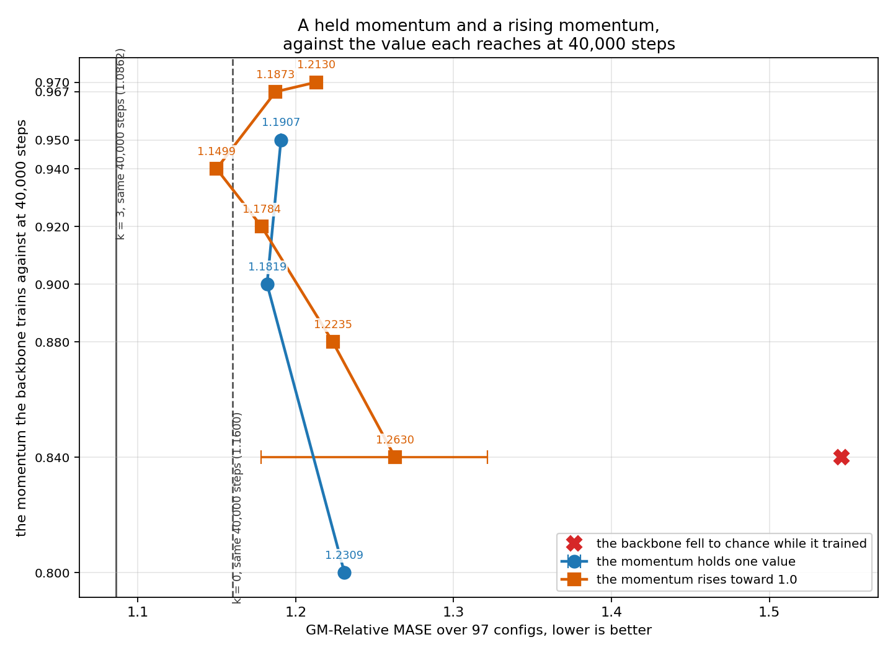
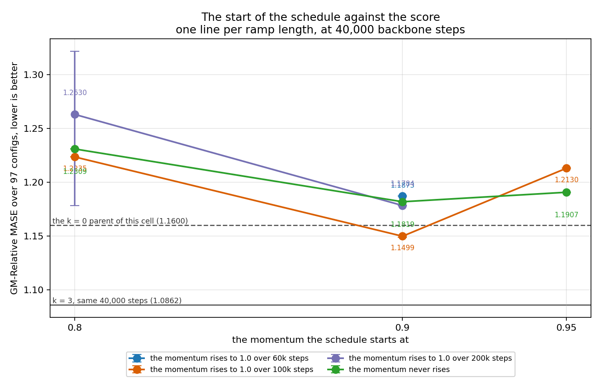
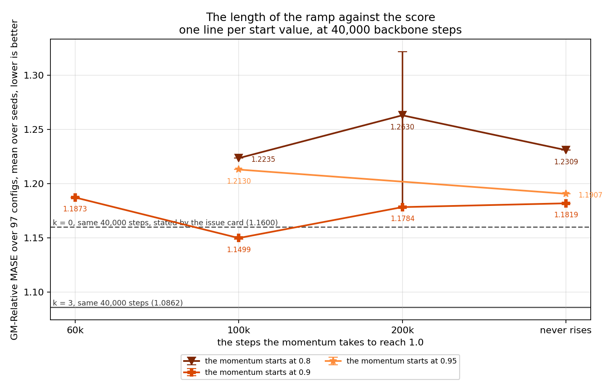
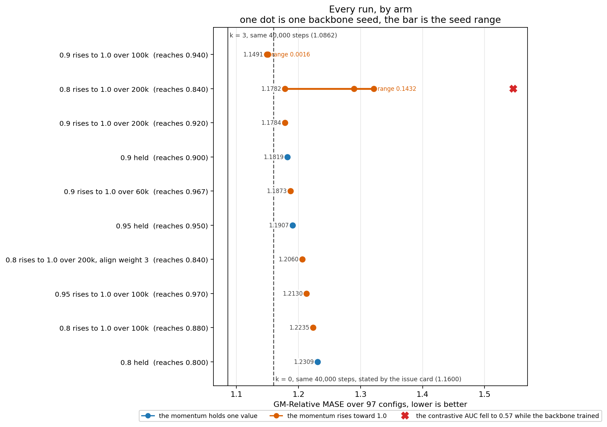
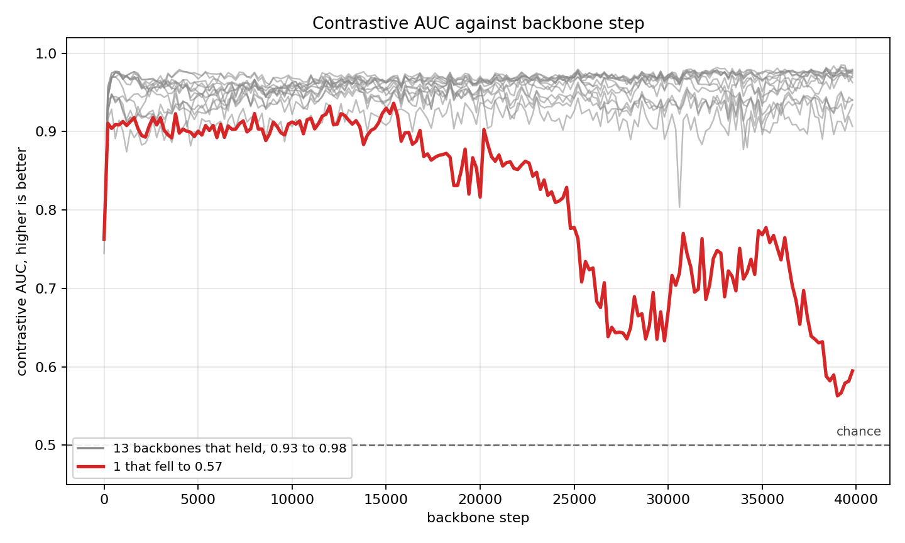
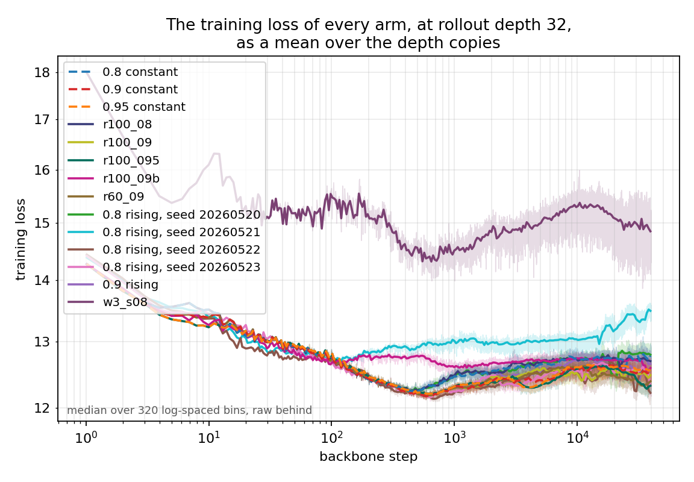
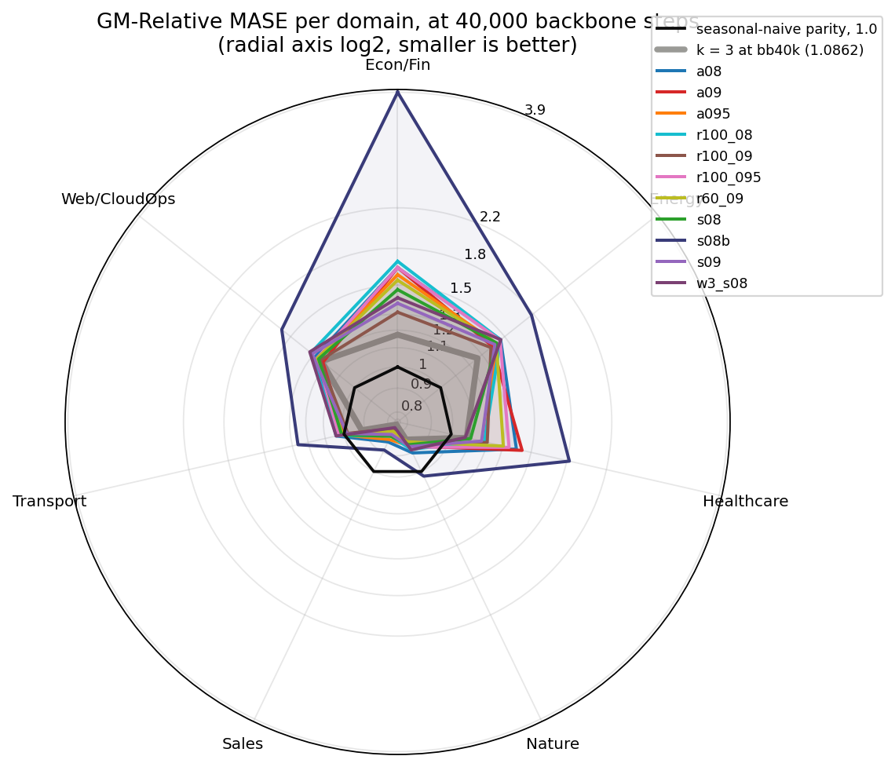

# A momentum that rises from 0.9 to 1.0 over 100,000 steps gives the best score at rollout depth 32

The best schedule holds 0.940 at the 40,000-step stop, and scores 1.1491 and 1.1507 at two backbone seeds. The card asked for a score below 1.0660, and no arm reached it: k = 3 scores 1.0862 at the same stop.

The arm with align weight 3.0 scores 1.2060 against 1.1782 for its twin at weight 1.0, at one seed each. That difference is inside the seed spread of that arm, so it settles nothing.

The arm of the collapsed backbone carries a red mark on every score figure.

## Protocol

- Rollout depth k = 32, mean reduction over the depth copies, align loss on the teacher.
- 40,000 backbone steps, then 30,000 head steps at head seed 20260722.
- The 97-config GIFT-Eval.
- Dataset `gift-pretrain-full-4096`, path `small_v1`.
- Backbone d_model 64, 8 heads, 3 encoder layers, 3 layers, batch size 64.

## The fourteen runs

| EMA momentum | holds at 40k | L_align weight | backbone seed | AUC at the stop | GM-Relative MASE | vs k = 3 at bb40k |
|---|---|---|---|---|---|---|
| 0.9, to 1.0 at 100k | 0.940 | 1 | 20260524 | 0.974 | 1.1491 | +0.0629 |
| 0.9, to 1.0 at 100k | 0.940 | 1 | 20260520 | 0.978 | 1.1507 | +0.0645 |
| 0.8, to 1.0 at 200k | 0.840 | 1 | 20260520 | 0.957 | 1.1782 | +0.0920 |
| 0.9, to 1.0 at 200k | 0.920 | 1 | 20260520 | 0.972 | 1.1784 | +0.0922 |
| 0.9, fixed | 0.900 | 1 | 20260520 | 0.979 | 1.1819 | +0.0957 |
| 0.9, to 1.0 at 60k | 0.967 | 1 | 20260520 | 0.976 | 1.1873 | +0.1011 |
| 0.95, fixed | 0.950 | 1 | 20260520 | 0.982 | 1.1907 | +0.1045 |
| 0.8, to 1.0 at 200k | 0.840 | 3 | 20260520 | 0.936 | 1.2060 | +0.1198 |
| 0.95, to 1.0 at 100k | 0.970 | 1 | 20260520 | 0.978 | 1.2130 | +0.1268 |
| 0.8, to 1.0 at 100k | 0.880 | 1 | 20260520 | 0.954 | 1.2235 | +0.1373 |
| 0.8, fixed | 0.800 | 1 | 20260520 | 0.927 | 1.2309 | +0.1447 |
| 0.8, to 1.0 at 200k | 0.840 | 1 | 20260523 | 0.975 | 1.2893 | +0.2031 |
| 0.8, to 1.0 at 200k | 0.840 | 1 | 20260522 | 0.978 | 1.3214 | +0.2352 |
| 0.8, to 1.0 at 200k | 0.840 | 1 | 20260521 | 0.575 (collapsed) | 1.5459 | +0.4597 |

| reference | GM-Relative MASE |
|---|---|
| k = 3, bb200k, the best score of the project | 1.0660 |
| k = 3, bb40k | 1.0862 |
| k = 32, mean, student, bb200k | 1.1637 |
| k = 32, mean, student, bb40k | 1.2082 |
| the k = 0 parent of this cell, bb40k | 1.1600 |
