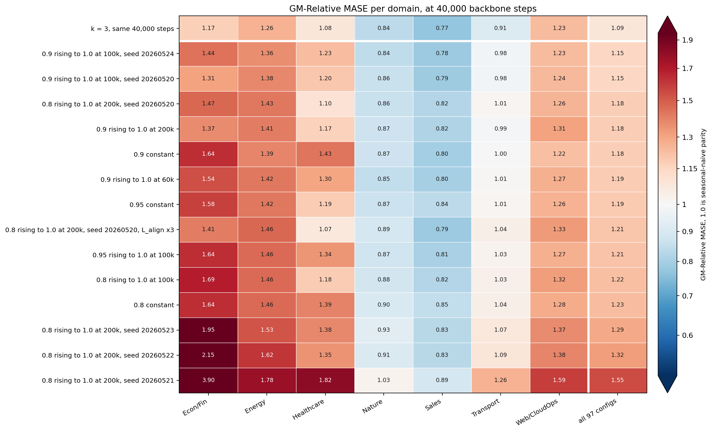

# A momentum that rises from 0.9 to 1.0 over 100,000 steps gives the best score at rollout depth 32

That schedule scores 1.1491 and 1.1507 at two backbone seeds. No arm goes below the k = 3 score of 1.0862 at the same stop.

The arms that carry one seed do not separate from each other.

Tripling the align-loss weight moves the score less than the seed spread.

## Protocol

- Rollout depth k = 32, mean reduction over the depth copies, align loss on the teacher.
- Student: the trained encoder. Teacher: its EMA copy, at the momentum this sweep moves.
- The stop: 40,000 backbone steps, then 30,000 head steps at head seed 20260722. Every arm is scored there.
- AUC: the area under the ROC curve of the contrastive task, on the training stream.
- The 97-config GIFT-Eval.
- Dataset `gift-pretrain-full-4096`, path `small_v1`.
- Backbone d_model 64, 8 heads, 3 encoder layers, 3 layers, batch size 64.

## The fourteen runs

| EMA momentum | holds at 40k | L_align weight | backbone seed | AUC at the stop | GM-Relative MASE | seed range | vs k = 3 at bb40k |
|---|---|---|---|---|---|---|---|
| 0.9, to 1.0 at 100k | 0.940 | 1 | 20260524 | 0.974 | 1.1491 | 0.0016 | +0.0629 |
| 0.9, to 1.0 at 100k | 0.940 | 1 | 20260520 | 0.978 | 1.1507 | 0.0016 | +0.0645 |
| 0.8, to 1.0 at 200k | 0.840 | 1 | 20260520 | 0.957 | 1.1782 | 0.1432 | +0.0920 |
| 0.9, to 1.0 at 200k | 0.920 | 1 | 20260520 | 0.972 | 1.1784 | one seed | +0.0922 |
| 0.9, fixed | 0.900 | 1 | 20260520 | 0.979 | 1.1819 | one seed | +0.0957 |
| 0.9, to 1.0 at 60k | 0.967 | 1 | 20260520 | 0.976 | 1.1873 | one seed | +0.1011 |
| 0.95, fixed | 0.950 | 1 | 20260520 | 0.982 | 1.1907 | one seed | +0.1045 |
| 0.8, to 1.0 at 200k | 0.840 | 3 | 20260520 | 0.936 | 1.2060 | one seed | +0.1198 |
| 0.95, to 1.0 at 100k | 0.970 | 1 | 20260520 | 0.978 | 1.2130 | one seed | +0.1268 |
| 0.8, to 1.0 at 100k | 0.880 | 1 | 20260520 | 0.954 | 1.2235 | one seed | +0.1373 |
| 0.8, fixed | 0.800 | 1 | 20260520 | 0.927 | 1.2309 | one seed | +0.1447 |
| 0.8, to 1.0 at 200k | 0.840 | 1 | 20260523 | 0.975 | 1.2893 | 0.1432 | +0.2031 |
| 0.8, to 1.0 at 200k | 0.840 | 1 | 20260522 | 0.978 | 1.3214 | 0.1432 | +0.2352 |
| 0.8, to 1.0 at 200k | 0.840 | 1 | 20260521 | 0.575 (collapsed) | 1.5459 | not counted | +0.4597 |

| reference | GM-Relative MASE |
|---|---|
| k = 3, bb200k, the best score of the project | 1.0660 |
| k = 3, bb40k | 1.0862 |
| k = 32, mean, student, bb200k | 1.1637 |
| k = 32, mean, student, bb40k | 1.2082 |
| the same backbone with no rollout (k = 0), at 40,000 steps | 1.1600 |
