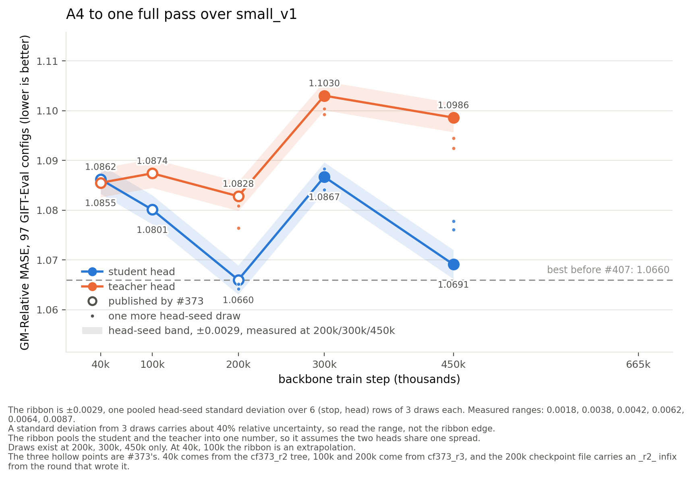

# One full pass over small_v1 scores 1.0783 and does not improve on 200,000 steps

The rollout-depth study stopped its best backbone, A4, at 200,000 steps, and this card gives the same run one full pass over `small_v1`. No stop after 200,000 steps beats 200,000 steps, on either head. The student mean rises from 1.0651 at 200,000 steps to 1.0783 at the full pass, and the teacher mean rises from 1.0800 to 1.1038 (GM-Relative MASE, lower is better).

*GM-Relative MASE against backbone train step, student and teacher heads, lower is better. Lines join the per-stop means. Small dots are single head-seed draws. Hollow marks are the published points from the rollout-depth study. The dashed line is the prior best, 1.0660.*

Every student draw after 200,000 steps scores above every student draw at 200,000 steps, with the closest pair at 1.0691 against 1.0660. The teacher draws show the same shape. The rise at 300,000 steps, +0.021 on both heads, is larger than the largest measured head-seed range, 0.0087.

## The teacher points are measurements, not repeats

The teacher encoder freezes at step 100,000. But the teacher head also loads 36 student-owned tensors, and 32 of them keep training. So each teacher point after 100,000 steps is a different model.

## Reproduction check

The head-seed 20260722 re-draw at 200,000 steps returns 1.0660 on the student head and 1.0828 on the teacher head, identical to the published values. Machine drift and code drift are zero.

## What one draw cannot order

The 665,000-step stop has one draw for each head. The 450k-to-665k gap, +0.0040 on the student mean, sits inside the measured head-seed ranges, so this report does not order 450,000 against 665,000 steps.

## Tables

Table 1: GM-Relative MASE for every (stop, head, seed) draw, with the per-stop mean and range.

| stop | head | s20260722 | s20260723 | s20260724 | mean | range |
|---:|:---|---:|---:|---:|---:|---:|
| 200k | student | 1.0660 | 1.0652 | 1.0642 | 1.0651 | 0.0018 |
| 200k | teacher | 1.0828 | 1.0809 | 1.0764 | 1.0800 | 0.0064 |
| 300k | student | 1.0867 | 1.0883 | 1.0841 | 1.0864 | 0.0042 |
| 300k | teacher | 1.1030 | 1.0992 | 1.1004 | 1.1009 | 0.0038 |
| 450k | student | 1.0691 | 1.0761 | 1.0778 | 1.0743 | 0.0087 |
| 450k | teacher | 1.0986 | 1.0924 | 1.0945 | 1.0952 | 0.0062 |
| 665k | student | 1.0783 | — | — | 1.0783 | — |
| 665k | teacher | 1.1038 | — | — | 1.1038 | — |

Table 2: checkpoint and head provenance.

| item | value |
|:---|:---|
| start checkpoint | `cf393_arm6_v2_combab_alignS_cf373k3_r2_200k.pth`, md5 `f477c03525bf5e169704715511f1c6d7` |
| its optimizer state | `cf393_arm6_v2_combab_alignS_cf373k3_r2_200k_optimizer.pth`, md5 `740891276637ff7bce744b1d9109d57a` |
| 300k checkpoint | md5 `618e433edea74ed2ca4ad9d10be37377` |
| 450k checkpoint | md5 `f505688b3168e32b72eb45dad0a897e0` |
| 665k checkpoint | md5 `ec1f64a5d4bc1e12d830a625b89cad84` |
| launcher | `scripts/run_pass.sh`, which calls the rollout-depth study's `run_leg_k.sh` and `stop_k.sh` |
| head recipe | arm6_v2, 30,000 head steps |
| head seeds | 20260722 to 20260724 at 200k, 300k, 450k. 20260722 at 665k |
| eval spec | 97 GIFT-Eval configs, B4 strategy, horizon 16 |

## Protocol

The run continues cell `arm6_v2_combab_alignS` (k = 3) from the 200,000-step checkpoint of the rollout-depth study, with its saved optimizer state, the same flags (constant lr 1e-3, no schedule) and the same data seed. 665,000 steps is 99.97% of one pass over `small_v1` (42,571,692 rows, 665,182 steps for one pass). Each stop trains a fresh head for 30,000 steps, with seeds 20260722 to 20260724 at 200k, 300k and 450k, and seed 20260722 at 665k. Each head scores on 97 GIFT-Eval configs with the B4 strategy at horizon 16. The arm6_v2 head recipe and the GM-Relative MASE metric are defined in [the rollout-depth study](../2026-08-08_rollout_depth/rollout_depth.md).
