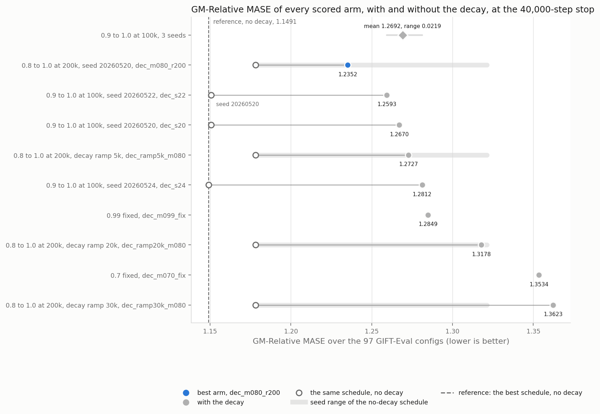
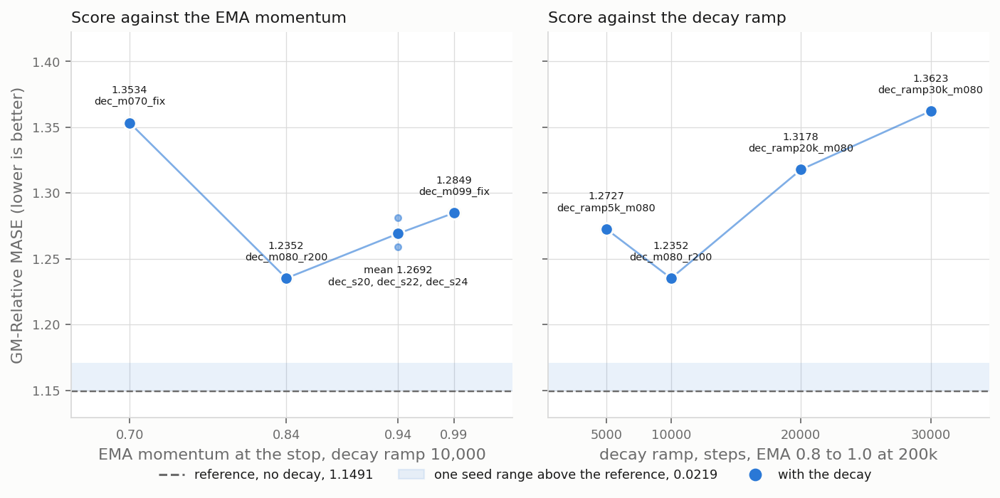
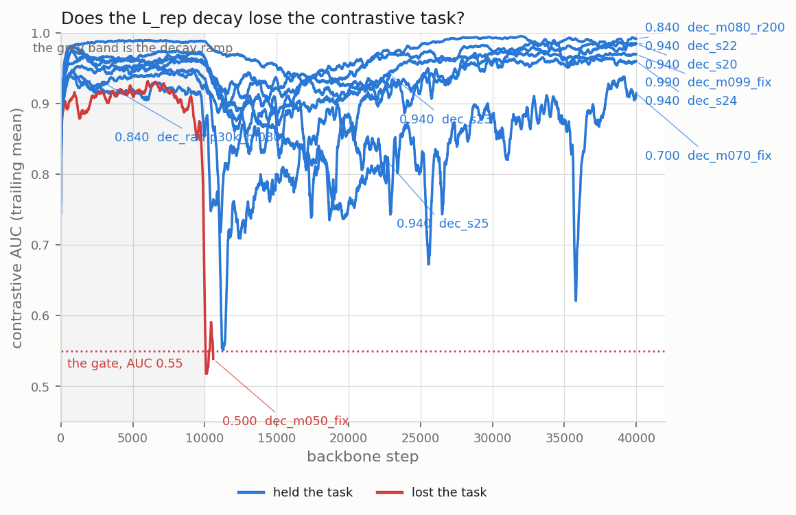
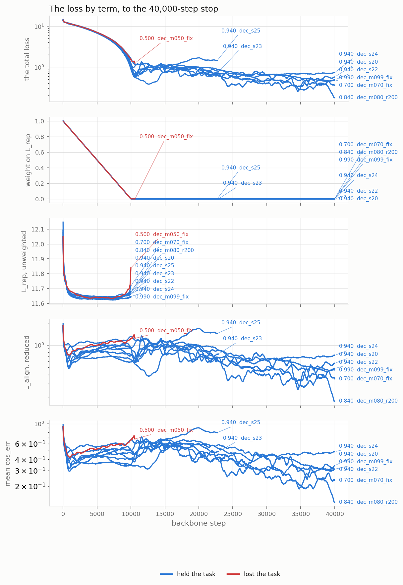

# A decay of the L_rep weight to zero never beats the no-decay reference at k = 32

A linear decay of the L_rep weight, the contrastive representation term of the training loss, does not improve the GM-Relative MASE of the k = 32 cell, one backbone configuration at rollout depth 32. Its best arm, one backbone run, loses to the no-decay reference by 3.9 times the seed range.

Both axes have their best value inside the tested range.

The contrastive AUC is the area under the ROC curve of the contrastive task on the training stream, 1.0 the ceiling and 0.5 chance. The run at momentum 0.500 lost the contrastive task.

Every scored arm still reduces its total loss over steps 20,000 to 40,000, and over the last 10,000 steps three arms have a positive slope and six a negative one (`results/loss_slope.csv`).

| term in the figure | definition |
|---|---|
| `L_align, reduced` | `L_align` is the alignment term of the loss, the student against the EMA teacher; the figure draws the residual `(loss - rep_w * l_rep - sigreg_e - sigreg_h) / align_w` |
| `sigreg_e`, `sigreg_h` | the two SIGReg regularisation terms of the loss, each at weight 1.0 (`notes/loss_decomposition.md`) |
| `align_w` | the weight of L_align, 1.0 (`scripts/plot_loss_terms.py`, `--align-weight`) |
| `cos_err` | the mean forecast cosine error over the 33 rollout depths d0 to d32 |
| `l_rep` | not computed past the ramp, so its lines end there |

## Tables

Score of each arm at the 40,000-step stop, by EMA schedule, decay ramp and seed (`scripts/arms.tsv`); last column: the same schedule with no decay, at the arm's seed where the reference study ran it, else at the seed named in the cell.

| arm | EMA schedule | momentum at the stop | decay ramp, steps | seed | score | same schedule, no decay |
|---|---|---|---|---|---|---|
| dec_m050_fix | 0.5 fixed | 0.500 | 10,000 | 20260520 | lost the task | not run |
| dec_m070_fix | 0.7 fixed | 0.700 | 10,000 | 20260520 | 1.3534 | not run |
| dec_ramp5k_m080 | 0.8 to 1.0 at 200k | 0.840 | 5,000 | 20260520 | 1.2727 | 1.1782 |
| dec_m080_r200 | 0.8 to 1.0 at 200k | 0.840 | 10,000 | 20260520 | **1.2352** | 1.1782 |
| dec_m080_r200_s24 | 0.8 to 1.0 at 200k | 0.840 | 10,000 | 20260524 | pending | 1.1782 |
| dec_ramp20k_m080 | 0.8 to 1.0 at 200k | 0.840 | 20,000 | 20260520 | 1.3178 | 1.1782 |
| dec_ramp30k_m080 | 0.8 to 1.0 at 200k | 0.840 | 30,000 | 20260520 | 1.3623 | 1.1782 |
| dec_s20 | 0.9 to 1.0 at 100k | 0.940 | 10,000 | 20260520 | 1.2670 | 1.1507 |
| dec_s22 | 0.9 to 1.0 at 100k | 0.940 | 10,000 | 20260522 | 1.2593 | 1.1507 (seed 20260520) |
| dec_s24 | 0.9 to 1.0 at 100k | 0.940 | 10,000 | 20260524 | 1.2812 | 1.1491 |
| dec_m099_fix | 0.99 fixed | 0.990 | 10,000 | 20260520 | 1.2849 | not run |
| reference | 0.9 to 1.0 at 100k | 0.940 | no decay | 20260524, 20260520 | | 1.1491, 1.1507 |

Gaps against the seed range of 0.0219, the range of `dec_s20`, `dec_s22`, `dec_s24` (`results/rank_gate.tsv`). Verdict rule: a gap under the seed range is noise, a gap under twice the seed range is a threshold, and a gap of twice the seed range or more is a rank. Column 4: the comparator's own seed range from `reports/2026-08-19_ema_momentum_k32/ema_momentum_k32.md`, 1.1782 to 1.3214 over three counted seeds of `0.8 to 1.0 at 200k`; a gap inside it is not a rank.

| comparison | gap | gap over seed range | seed range of the no-decay comparator | verdict |
|---|---|---|---|---|
| each scored arm against the reference 1.1491 | +0.0861 to +0.2132 | 3.9 to 9.7 | 0.0016 | rank |
| the three `0.9 to 1.0 at 100k` arms against that schedule with no decay, two of the three at the arm's own seed, `dec_s22` against the seed 20260520 run | +0.1086 to +0.1321 | 5.0 to 6.0 | 0.0016 | rank |
| the four `0.8 to 1.0 at 200k` arms against that schedule with no decay | +0.0570 to +0.1841 | 2.6 to 8.4 | 0.1432 | inside the comparator range, except `dec_ramp30k_m080` |
| best arm 1.2352 against the second 1.2593 | +0.0241 | 1.1 | | threshold |

Contrastive AUC per scored arm (`results/auc_verdicts.tsv`), with the floor the lowest trailing mean over every leg of the arm; the figure also draws the three unscored runs `dec_s23`, `dec_s25` and `dec_m080_r200_s24`.

| arm | momentum at the stop | AUC floor | floor step | last AUC | last step | verdict |
|---|---|---|---|---|---|---|
| dec_m050_fix | 0.500 | 0.5221 | 10,348 | 0.5233 | 10,600 | lost at 10,162 |
| dec_m070_fix | 0.700 | 0.5732 | 11,452 | 0.9166 | 40,000 | held |
| dec_ramp5k_m080 | 0.840 | 0.7157 | 6,630 | 0.9928 | 40,000 | held |
| dec_m080_r200 | 0.840 | 0.7685 | 11,213 | 0.9924 | 40,000 | held |
| dec_ramp20k_m080 | 0.840 | 0.8353 | 27,830 | 0.9659 | 40,000 | held |
| dec_ramp30k_m080 | 0.840 | 0.5428 | 34,826 | 0.9310 | 40,000 | held |
| dec_s20 | 0.940 | 0.8638 | 13,123 | 0.9842 | 40,000 | held |
| dec_s22 | 0.940 | 0.8944 | 11,688 | 0.9841 | 40,000 | held |
| dec_s24 | 0.940 | 0.8680 | 12,323 | 0.9587 | 40,000 | held |
| dec_m099_fix | 0.990 | 0.9049 | 19,755 | 0.9695 | 40,000 | held |

Total loss and its slope per 10,000 steps, fitted on 1,000-step blocks (`results/loss_slope.csv`, `results/loss_terms_at_stop.csv`).

| arm | total loss at 40,000 | slope, steps 20,000 to 40,000 | slope, steps 30,000 to 40,000 | mean cos_err at 40,000 |
|---|---|---|---|---|
| dec_m070_fix | 0.367 | -0.194 | -0.258 | 0.236 |
| dec_ramp5k_m080 | 0.318 | -0.113 | -0.201 | 0.210 |
| dec_m080_r200 | 0.208 | -0.179 | -0.088 | 0.151 |
| dec_ramp20k_m080 | 0.555 | -0.163 | -0.457 | 0.387 |
| dec_ramp30k_m080 | 0.486 | -2.261 | -0.389 | 0.307 |
| dec_s20 | 0.553 | -0.082 | +0.106 | 0.330 |
| dec_s22 | 0.471 | -0.118 | +0.009 | 0.301 |
| dec_s24 | 0.721 | -0.079 | +0.071 | 0.482 |
| dec_m099_fix | 0.460 | -0.235 | -0.256 | 0.310 |

## Protocol

- Cell: configuration `arm6_v2_combab_alignT`, reduction `mean`, align target the EMA teacher. `scripts/study.sh` holds every value.
- Decay: `--rep-loss-weight 1.0 --rep-loss-weight-end 0.0 --rep-loss-weight-ramp-steps <ramp>`, linear. The ramp of each arm is column 5 of `scripts/arms.tsv`.
- EMA: `--ema-tau <tau>`, with `--ema-tau-end 1.0 --ema-tau-ramp-steps <ramp>` on the ramped schedules. The momentum at the stop is the value the schedule holds at step 40,000.
- Backbone: 40,000 steps, seed 20260520 unless the arm name carries `s22`, `s24`. Checkpoints every 5,000 steps.
- AUC gate: `scripts/auc_guard.sh`, trailing window 500 steps, threshold 0.55, warm-up 1,000 steps. A run under the gate stops and gets no head.
- Head: 30,000 steps on the student encoder, head seed 20260722, runner `reports/2026-08-08_rollout_depth/scripts/head_eval_bb.sh`.
- Eval: GIFT-Eval, 97 configs, batch 4, forecast length 16. Score: GM-Relative MASE, lower is better.
- Reference: the EMA momentum study at `reports/2026-08-19_ema_momentum_k32/ema_momentum_k32.md`, the same cell with no decay. Its cell, stop, head, head seed, encoder and eval match this study on 11 of 11 items (`results/reference_match.tsv`). Its best score is 1.1491, and its own range is 0.0016 over two seeds.
- Seed range: the three seeds of `0.9 to 1.0 at 100k` under the decay, `results/rank_gate.tsv`.
- Pending: `dec_m080_r200_s24`, the repeat seed of the best arm, which gives its error bar.

## Annex

Runs without a score and why (`results/RUN_STATE.md`, `notes/execution_log.md`):

| arm | reached | why no score |
|---|---|---|
| dec_m050_fix | 10,600 | the AUC gate stopped it |
| dec_s23, dec_s25 | 22,900, 22,700 | the schedule already had three seeds |
| dec_m090_r60, dec_m095_fix | 100, 0 | no readable AUC row above step 1,000 (`results/auc_verdicts.tsv`) |
| dec_m090_fix, dec_m090_r200, dec_m095_r100 | never started | every scored momentum lost to the reference by 3.9 times the seed range or more, so no further momentum ran |
