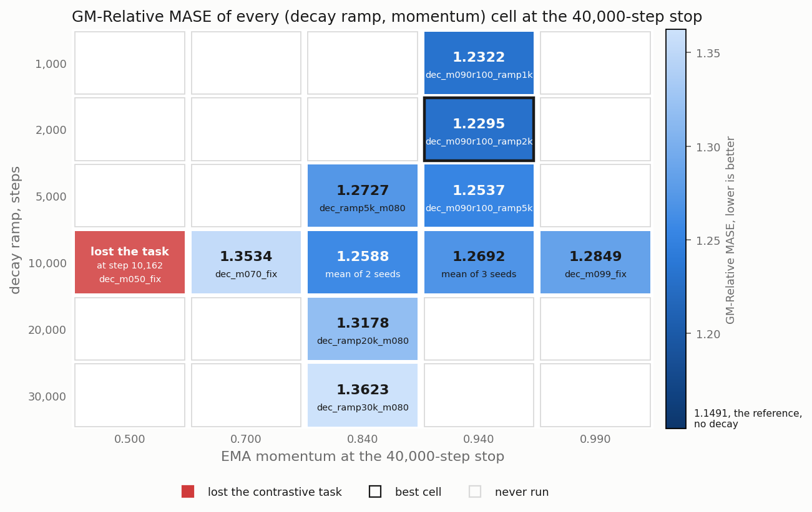
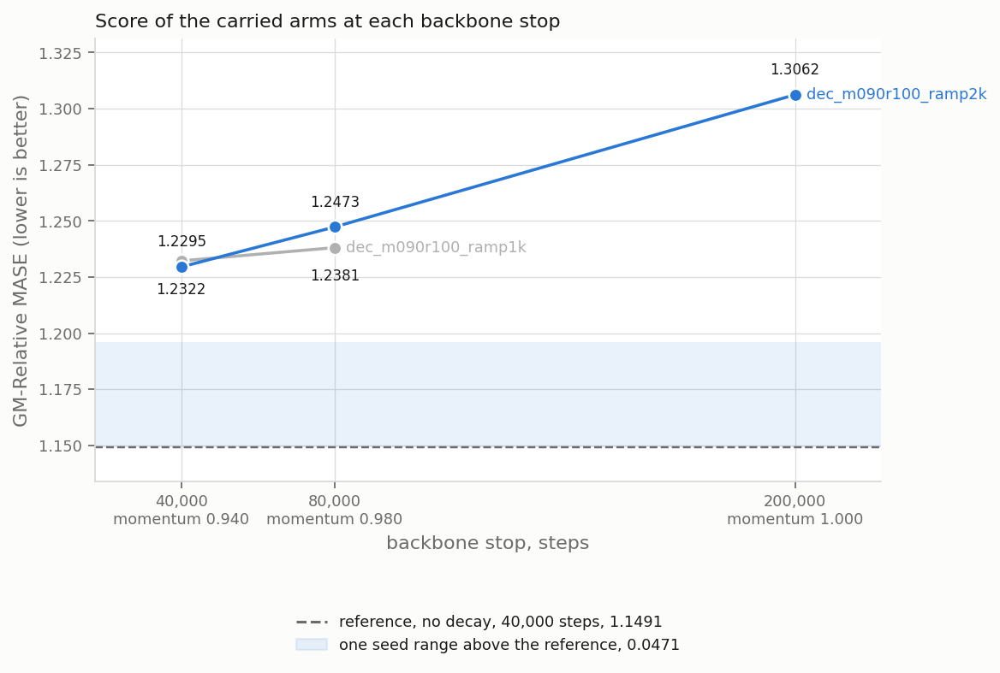
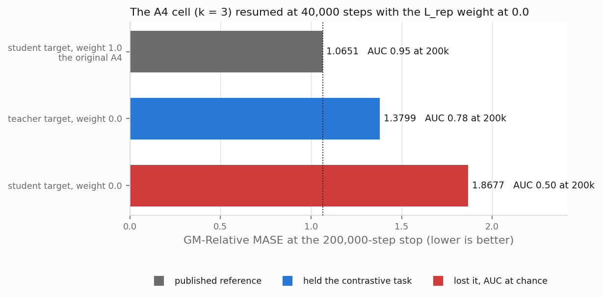

# A decay of the L_rep weight to zero never beats the no-decay reference, and the weight at 0.0 collapses the best cell on the student align target

A linear decay of the L_rep weight, the contrastive representation term of the training loss, does not improve the GM-Relative MASE of the k = 32 cell, over 21 scored runs. The best arm loses to the no-decay reference by 1.7 times the seed range at 40,000 steps, and its score rises at every later stop.

*Score of every scored arm at the 40,000-step stop, against the same EMA schedule with no decay.*

*The measured grid, decay ramp by EMA momentum at the stop, fixed and ramping schedules in separate columns, colour by score.*

No fixed momentum beats the ramping schedule at the same decay ramp of 2,000, and the two nearest gaps, +0.0357 and +0.0403, are inside the seed range of 0.0471.

*Score against each axis: the momentum at ramp 10,000, and the ramp on the two schedules the card varied it on.*

*Score of the two carried arms at each backbone stop, each leg resumed from the arm's prior checkpoint and optimizer state.*

The best arm held the contrastive task to 200,000 steps, AUC 0.98 falling to 0.95, while its score rose by +0.0767, 1.6 times the seed range.

*The A4 cell resumed from its 40,000-step checkpoint and optimizer state with the L_rep weight at 0.0, one run per align target, trained to 200,000 steps, against the original A4 ([`a4_full_pass`](../2026-08-20_a4_full_pass/a4_full_pass.md)).*

The two runs above use a DIFFERENT cell, `arm6_v2_combab_alignS` at k = 3 with the student align target: the project's best model, which this card asks how to beat. The student-target run collapsed: on this cell the EMA teacher enters the loss only through the MoCo keys inside L_rep, so at weight 0.0 the teacher leaves the objective. `L_align` then pulls the student's forecast toward the student's own detached latent (`src/loss.py:2915`), which a constant embedding satisfies: total loss 0.1595 at step 200,000, AUC at chance. The teacher-target run did not collapse and still lost 0.315 to the original A4, and the align target alone separates the two weight-0.0 runs by 0.488.

*Contrastive AUC per run to the 40,000-step stop, the area under the ROC curve of the contrastive task on the training stream, 1.0 the ceiling and 0.5 chance. The run at momentum 0.500 lost the task.*

*The training loss by term to the 40,000-step stop, one line per arm.*

| symbol | definition |
|---|---|
| `L_align, reduced` | `L_align` is the alignment term of the loss, the student against the EMA teacher. The figure draws the residual `(loss - rep_w * l_rep - sigreg_e - sigreg_h) / align_w` |
| `sigreg_e`, `sigreg_h` | the two SIGReg regularisation terms of the loss, each at weight 1.0 (`notes/loss_decomposition.md`) |
| `align_w` | the weight of L_align, 1.0 (`scripts/plot_loss_terms.py`, `--align-weight`) |
| `cos_err` | the mean forecast cosine error over the 33 rollout depths d0 to d32 |
| `l_rep` | not computed past the ramp, so its lines end there |

## Tables

Score of each arm at the 40,000-step stop, by EMA schedule, decay ramp and seed (`scripts/arms.tsv`, `results/scores.csv`). Last column: the same schedule with no decay, at the arm's seed where the reference study ran it, else at the seed named in the cell.

| arm | EMA schedule | momentum at the stop | decay ramp, steps | seed | score | same schedule, no decay |
|---|---|---|---|---|---|---|
| dec_m050_fix | 0.5 fixed | 0.500 | 10,000 | 20260520 | lost the task | not run |
| dec_m070_fix | 0.7 fixed | 0.700 | 10,000 | 20260520 | 1.3534 | not run |
| dec_ramp5k_m080 | 0.8 to 1.0 at 200k | 0.840 | 5,000 | 20260520 | 1.2727 | 1.1782 |
| dec_m080_r200 | 0.8 to 1.0 at 200k | 0.840 | 10,000 | 20260520 | 1.2352 | 1.1782 |
| dec_m080_r200_s24 | 0.8 to 1.0 at 200k | 0.840 | 10,000 | 20260524 | 1.2823 | 1.1782 (seed 20260520) |
| dec_ramp20k_m080 | 0.8 to 1.0 at 200k | 0.840 | 20,000 | 20260520 | 1.3178 | 1.1782 |
| dec_ramp30k_m080 | 0.8 to 1.0 at 200k | 0.840 | 30,000 | 20260520 | 1.3623 | 1.1782 |
| dec_f086_r2k | 0.86 fixed | 0.860 | 2,000 | 20260520 | 1.2698 | not run |
| dec_f090_r2k | 0.90 fixed | 0.900 | 2,000 | 20260520 | 1.2652 | not run |
| dec_m090r100_ramp1k | 0.9 to 1.0 at 100k | 0.940 | 1,000 | 20260520 | 1.2322 | 1.1507 |
| dec_m090r100_ramp2k | 0.9 to 1.0 at 100k | 0.940 | 2,000 | 20260520 | **1.2295** | 1.1507 |
| dec_m090r100_ramp5k | 0.9 to 1.0 at 100k | 0.940 | 5,000 | 20260520 | 1.2537 | 1.1507 |
| dec_s20 | 0.9 to 1.0 at 100k | 0.940 | 10,000 | 20260520 | 1.2670 | 1.1507 |
| dec_s22 | 0.9 to 1.0 at 100k | 0.940 | 10,000 | 20260522 | 1.2593 | 1.1507 (seed 20260520) |
| dec_s24 | 0.9 to 1.0 at 100k | 0.940 | 10,000 | 20260524 | 1.2812 | 1.1491 |
| dec_f094_r2k | 0.94 fixed | 0.940 | 2,000 | 20260520 | 1.3167 | not run |
| dec_m099_fix | 0.99 fixed | 0.990 | 10,000 | 20260520 | 1.2849 | not run |
| reference | 0.9 to 1.0 at 100k | 0.940 | no decay | 20260524, 20260520 | | 1.1491, 1.1507 |

Gaps against the seed range of 0.0471, the range of `dec_m080_r200` and `dec_m080_r200_s24`, the widest pair of repeat seeds in this study (`results/rank_gate.tsv`). Verdict rule: a gap at or under the seed range is noise, a gap under twice the seed range is a threshold, and a gap of twice the seed range or more is a rank. Column 4: the comparator's own seed range from `reports/2026-08-19_ema_momentum_k32/ema_momentum_k32.md`, 1.1782 to 1.3214 over three counted seeds of `0.8 to 1.0 at 200k`. A gap inside it is not a rank.

| comparison | gap | gap over seed range | seed range of the no-decay comparator | verdict |
|---|---|---|---|---|
| each scored arm against the reference 1.1491 | +0.0804 to +0.2132 | 1.7 to 4.5 | 0.0016 | threshold for `dec_m090r100_ramp2k`, `dec_m090r100_ramp1k` and `dec_m080_r200`, rank for the other 13 |
| the six `0.9 to 1.0 at 100k` arms against that schedule with no decay, five of the six at the arm's own seed, `dec_s22` against the seed 20260520 run | +0.0788 to +0.1321 | 1.7 to 2.8 | 0.0016 | threshold for `dec_m090r100_ramp2k` and `dec_m090r100_ramp1k`, rank for the other four |
| the five `0.8 to 1.0 at 200k` arms against that schedule with no decay | +0.0570 to +0.1841 | 1.2 to 3.9 | 0.1432 | inside the comparator range, except `dec_ramp30k_m080` |
| the three fixed-momentum arms against `dec_m090r100_ramp2k`, the ramping arm at the same decay ramp of 2,000 and the same seed | +0.0357 to +0.0872 | 0.8 to 1.9 | | inside the seed range for `dec_f090_r2k` and `dec_f086_r2k`, threshold for `dec_f094_r2k` |
| best arm 1.2295 against the second 1.2322 | +0.0027 | 0.1 | | noise |
| best arm 1.2295 against the best arm at ramp 10,000, 1.2352 | +0.0057 | 0.1 | | noise |

Gap of each axis point against the baseline of its axis. The momentum axis and the ramp axis at 0.840 use 1.2588, the mean of two seeds at momentum 0.840 and ramp 10,000. The ramp axis at 0.940 uses 1.2692, the mean of three seeds at momentum 0.940 and ramp 10,000. Verdict with the rule of the gate table above, against the seed range of 0.0471.

| axis | point | score | gap | gap over seed range | verdict |
|---|---|---|---|---|---|
| momentum, ramp 10,000 | 0.700 | 1.3534 | +0.0946 | 2.0 | rank |
| momentum, ramp 10,000 | 0.940 | 1.2692, mean of three seeds | +0.0104 | 0.2 | inside the seed range |
| momentum, ramp 10,000 | 0.990 | 1.2849 | +0.0261 | 0.6 | inside the seed range |
| ramp, momentum 0.840 | 5,000 | 1.2727 | +0.0139 | 0.3 | inside the seed range |
| ramp, momentum 0.840 | 20,000 | 1.3178 | +0.0591 | 1.3 | threshold |
| ramp, momentum 0.840 | 30,000 | 1.3623 | +0.1036 | 2.2 | rank |
| ramp, momentum 0.940 | 1,000 | 1.2322 | -0.0370 | 0.8 | inside the seed range |
| ramp, momentum 0.940 | 2,000 | 1.2295 | -0.0397 | 0.8 | inside the seed range |
| ramp, momentum 0.940 | 5,000 | 1.2537 | -0.0155 | 0.3 | inside the seed range |

Score of the two arms carried past 40,000 steps, each leg resumed from the arm's newest checkpoint and optimizer state (`results/scores.csv`, keyed by (arm, stop)). The EMA schedule ramps to 1.0 at 100,000 steps, so the momentum at the stop moves with the stop.

| arm | decay ramp, steps | stop | momentum at the stop | score | change against 40,000 | change over seed range |
|---|---|---|---|---|---|---|
| dec_m090r100_ramp2k | 2,000 | 40,000 | 0.940 | 1.2295 | | |
| dec_m090r100_ramp2k | 2,000 | 80,000 | 0.980 | 1.2473 | +0.0178 | 0.4 |
| dec_m090r100_ramp2k | 2,000 | 200,000 | 1.000 | 1.3062 | +0.0767 | 1.6 |
| dec_m090r100_ramp1k | 1,000 | 40,000 | 0.940 | 1.2322 | | |
| dec_m090r100_ramp1k | 1,000 | 80,000 | 0.980 | 1.2381 | +0.0059 | 0.1 |

The L_rep weight at 0.0 on the A4 cell, `arm6_v2_combab_alignS` at k = 3, both runs resumed from the same 40,000-step A4 checkpoint and optimizer state and trained to 200,000 steps. The AUC is the mean over steps 195,000 to 200,000 of the run's log, and of the A4 losses CSV (`reports/2026-08-08_rollout_depth/curves/r3/`) for the reference. Scores: `results/score_a4*_bb200k_h30k_student.txt`, each the `Aggregate GM-Relative MASE (97 configs)` line of its run's eval_local.log. The original A4 score is the mean of three head seeds ([`a4_full_pass`](../2026-08-20_a4_full_pass/a4_full_pass.md)).

| align target | L_rep weight | AUC at 200,000 | score | gap to the original A4 |
|---|---|---|---|---|
| student, the original A4 | 1.0 | 0.95 | 1.0651 | |
| teacher | 0.0 | 0.78 | 1.3799 | +0.3148 |
| student | 0.0 | 0.50 | 1.8677 | +0.8026 |

Contrastive AUC per run the study scored, plus the run the gate stopped and the three continuation legs (`results/auc_verdicts.tsv`), with the floor the lowest rolling median over every leg of the run. The figure also draws two runs this table leaves out: `dec_s23` and `dec_s25`.

| run | momentum at the stop | AUC floor | floor step | last AUC | last step | verdict |
|---|---|---|---|---|---|---|
| dec_m050_fix | 0.500 | 0.5221 | 10,348 | 0.5233 | 10,600 | lost at 10,162 |
| dec_m070_fix | 0.700 | 0.5732 | 11,452 | 0.9166 | 40,000 | held |
| dec_ramp5k_m080 | 0.840 | 0.7157 | 6,630 | 0.9928 | 40,000 | held |
| dec_m080_r200 | 0.840 | 0.7685 | 11,213 | 0.9924 | 40,000 | held |
| dec_m080_r200_s24 | 0.840 | 0.7780 | 11,270 | 0.8790 | 40,000 | held |
| dec_ramp20k_m080 | 0.840 | 0.8353 | 27,830 | 0.9659 | 40,000 | held |
| dec_ramp30k_m080 | 0.840 | 0.5428 | 34,826 | 0.9310 | 40,000 | held |
| dec_f086_r2k | 0.860 | 0.8450 | 6,293 | 0.9888 | 40,000 | held |
| dec_f090_r2k | 0.900 | 0.8650 | 3,354 | 0.9911 | 40,000 | held |
| dec_m090r100_ramp1k | 0.940 | 0.9075 | 2,062 | 0.9788 | 40,000 | held |
| dec_m090r100_ramp2k | 0.940 | 0.9092 | 3,209 | 0.9833 | 40,000 | held |
| dec_m090r100_ramp5k | 0.940 | 0.8688 | 7,851 | 0.9797 | 40,000 | held |
| dec_s20 | 0.940 | 0.8638 | 13,123 | 0.9842 | 40,000 | held |
| dec_s22 | 0.940 | 0.8944 | 11,688 | 0.9841 | 40,000 | held |
| dec_s24 | 0.940 | 0.8680 | 12,323 | 0.9587 | 40,000 | held |
| dec_f094_r2k | 0.940 | 0.9233 | 11,157 | 0.9884 | 40,000 | held |
| dec_m099_fix | 0.990 | 0.9049 | 19,755 | 0.9695 | 40,000 | held |
| dec_m090r100_ramp1k, continuation to 80,000 | 0.980 | 0.9543 | 68,542 | 0.9848 | 80,000 | held |
| dec_m090r100_ramp2k, continuation to 80,000 | 0.980 | 0.9536 | 44,762 | 0.9846 | 80,000 | held |
| dec_m090r100_ramp2k, continuation to 200,000 | 1.000 | 0.9475 | 181,140 | 0.9495 | 200,000 | held |

Total loss and its slope per 10,000 steps, fitted on 1,000-step blocks (`results/loss_slope.csv`, `results/loss_terms_at_stop.csv`). Over steps 20,000 to 40,000, 15 of the 16 scored arms reduce their total loss.

| arm | total loss at 40,000 | slope, steps 20,000 to 40,000 | slope, steps 30,000 to 40,000 | mean cos_err at 40,000 |
|---|---|---|---|---|
| dec_m070_fix | 0.367 | -0.194 | -0.258 | 0.236 |
| dec_ramp5k_m080 | 0.318 | -0.113 | -0.201 | 0.210 |
| dec_m080_r200 | 0.208 | -0.179 | -0.088 | 0.151 |
| dec_m080_r200_s24 | 0.748 | -0.374 | -0.186 | 0.521 |
| dec_ramp20k_m080 | 0.555 | -0.163 | -0.457 | 0.387 |
| dec_ramp30k_m080 | 0.486 | -2.261 | -0.389 | 0.307 |
| dec_f086_r2k | 0.276 | -0.086 | -0.011 | 0.184 |
| dec_f090_r2k | 0.445 | -0.073 | +0.107 | 0.241 |
| dec_m090r100_ramp1k | 0.587 | +0.110 | +0.131 | 0.354 |
| dec_m090r100_ramp2k | 0.397 | -0.088 | +0.171 | 0.267 |
| dec_m090r100_ramp5k | 0.536 | -0.090 | +0.009 | 0.351 |
| dec_s20 | 0.553 | -0.082 | +0.106 | 0.330 |
| dec_s22 | 0.471 | -0.118 | +0.009 | 0.301 |
| dec_s24 | 0.721 | -0.079 | +0.071 | 0.482 |
| dec_f094_r2k | 0.411 | -0.030 | -0.015 | 0.273 |
| dec_m099_fix | 0.460 | -0.235 | -0.256 | 0.310 |

## Protocol

- Cell: configuration `arm6_v2_combab_alignT`, k = 32, reduction `mean`, align target the EMA teacher. `scripts/study.sh` holds every value.
- Decay: `--rep-loss-weight 1.0 --rep-loss-weight-end 0.0 --rep-loss-weight-ramp-steps <ramp>`, linear. The ramp of each arm is column 5 of `scripts/arms.tsv`.
- EMA: `--ema-tau <tau>`, with `--ema-tau-end 1.0 --ema-tau-ramp-steps <ramp>` on the ramped schedules and no end flag on the fixed ones. The momentum at the stop is the value the schedule holds at that step.
- Backbone: 40,000 steps, seed 20260520 unless the arm name carries `s22`, `s23`, `s24`, `s25`. Checkpoints every 5,000 steps.
- Continuation: `CF409_STOPS=80000` or `200000` (`scripts/study.sh`) resumes the arm's newest step checkpoint with its optimizer state and trains on, same schedule, decay, head and eval. The score at each stop is one row of `results/scores.csv`, keyed by (arm, stop).
- AUC gate: `scripts/auc_guard.sh`, rolling median over 500 rows, threshold 0.55, warm-up 1,000 steps. A run whose rolling median ends under the threshold and does not come back stops and gets no head. A dip that recovers is not a loss.
- Head: 30,000 steps on the student encoder, head seed 20260722, runner `reports/2026-08-08_rollout_depth/scripts/head_eval_bb.sh`.
- Eval: GIFT-Eval, 97 configs, strategy B4, forecast length 16. Score: GM-Relative MASE, lower is better, line `Aggregate GM-Relative MASE (97 configs)` of each run's `eval_local.log`.
- Reference: the EMA momentum study at `reports/2026-08-19_ema_momentum_k32/ema_momentum_k32.md`, the same cell with no decay. Its cell, stop, head, head seed, encoder and eval match this study on 11 of 11 items (`results/reference_match.tsv`). Its best score is 1.1491, and its own range is 0.0016 over two seeds.
- Seed range: the two seeds of `0.8 to 1.0 at 200k` at ramp 10,000 under the decay, 0.0471, wider than the 0.0219 of the three seeds of `0.9 to 1.0 at 100k`, `results/rank_gate.tsv`. No new configuration carries a repeat seed, so configurations whose gap is inside that range cannot be ranked against each other.
- The A4 check: the first `Command line:` row of `results/run_cf393_arm6_v2_combab_alignS_cf373k3_cf409_a4{zero,teach}.log` holds the full flags. Cell `arm6_v2_combab_alignS`, k = 3, seed 20260520, `--rep-loss-weight 0.0`, `--align-target student` (a4zero) or `teacher` (a4teach), EMA 0.9 to 1.0 at 100,000, resumed at step 40,000, trained to 200,000, then the same 30,000-step head and eval as above. This item belongs to this card because the card asks how to beat that model (`notes/one_report.md`).

## Annex

Runs without a score and why (`results/RUN_STATE.md`, `notes/execution_log.md`):

| arm | reached | why no score |
|---|---|---|
| dec_m050_fix | 10,600 | the AUC gate stopped it |
| dec_s23, dec_s25 | 22,900, 22,700 | the schedule already had three seeds |
| dec_m090_r60, dec_m095_fix | 100, 0 | no readable AUC row above step 1,000 (`results/auc_verdicts.tsv`) |
| dec_m090_fix, dec_m090_r200, dec_m095_r100 | never started | every scored momentum at ramp 10,000 lost to the reference by 1.8 times the seed range or more, so no further momentum ran |

Next: #412
