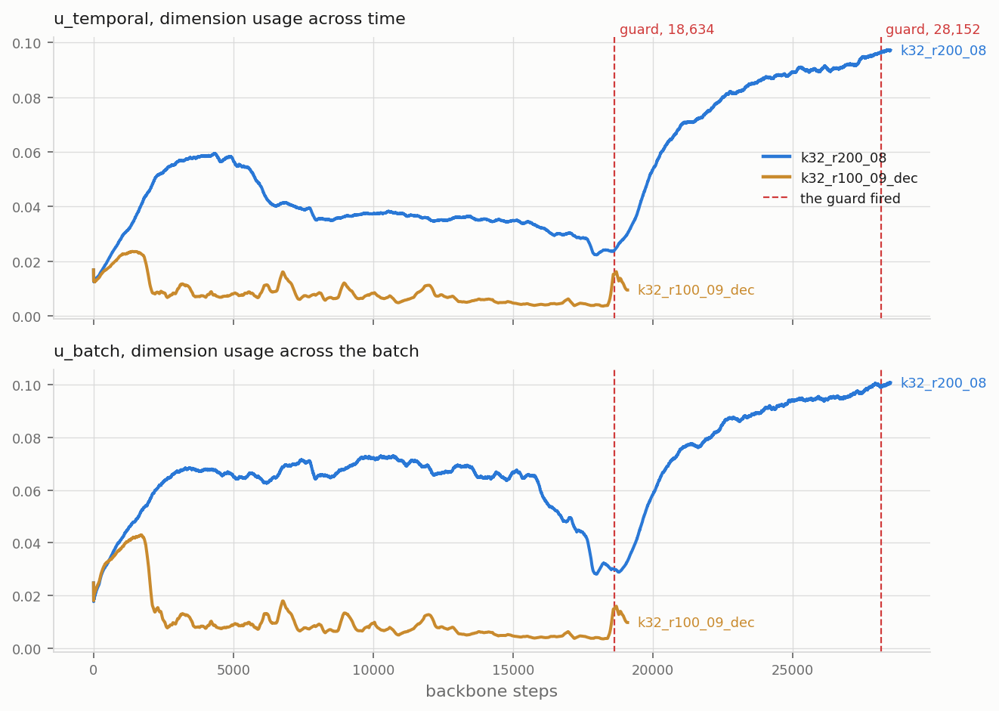
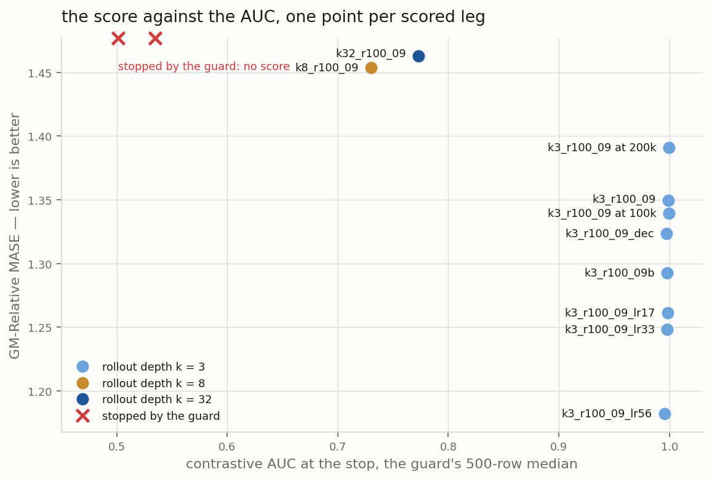

# At Moirai-2-Small size, the learning rate moves the score more than the capacity

At 11.4M parameters and 40,000 steps, a rate change from the published 1e-3
to 5.6e-4 gains 0.1107 GM-Relative MASE against the better 1e-3 seed, 1.9
seed bands. Next: #414.

## The rate has an interior minimum at 5.6e-4


GM-Relative MASE against the rate, k = 3, one seed per point. The metric is
the geometric mean, over the 97 GIFT-Eval configs, of MASE divided by
seasonal-naive MASE. Lower is better.

The band on every figure and table is **0.0568**, the spread of this card's
two seeds on one cell. A cell is one combination of depth, reduction, rate
and decay. Two numbers closer than the band are not ranked. A rule fixed before
the sweep scored set the bar at 1.2359, one band under the better 1e-3 seed.
1.1820 clears it, so every 1e-3 number of this card is void as a capacity
statement. The width-scaled rate 1.67e-4 (1e-3 times 64 over 384)
over-corrects by 1.4 bands against 5.6e-4. Two limits: only the k = 3 cell ran
this sweep, and 5.6e-4 is the best of four coarse points, one seed each. No
5.6e-4 arm has reached 200,000 steps, the stop of the 1.0651 project best. So
the size question stays open until pass 2 lands.

## The scores at 40,000 steps


Every pass-1 score against its 1.1M twin (a twin: the same configuration,
trained at 1.1M parameters by a parent study). Each label names the arm's
reduction, because the k = 3 arms inherit `sum` and the deeper arms inherit
`mean`.

## No stop improves the score at 1e-3


`k3_r100_09` at both sizes, three stops, all at 1e-3, the rate 5.6e-4
supersedes on this cell. A hollow marker is a stop that is not head-matched
(head-matched: both sizes score under a 30,000-step head).

The three 11.4M scores span 0.0515, inside the band, so no stop is ranked
above another. The pre-registered gate named `k3_r100_09b` for this climb.
The orchestrator overruled it before the seed scores existed, because the
1.0651 reference is a 200,000-step number on the `k3_r100_09` lineage
(`results/gate_40k.txt`). So the climb uses seed 20260520, the worse 1e-3
seed.

## The guard stopped two of the four mean arms and no sum arm


The AUC is a diagnostic probe, not a loss term (`src/metrics.py:361`). It
counts how often the forecast beats a lagged latent by cosine similarity,
and 0.5 is chance. Every AUC this report prints is the guard's statistic, a rolling
median over 500 training rows, except where a value says raw. **Held** means
the guard (median under 0.55 after a 1,000-step warm-up) never fired on the
arm. The guard stopped two of the ten pass-1 arms, both mean arms at 1e-3, and
all six sum arms ended above 0.99. The stop steps this report prints, 18,634
and 28,152, are the live guard's verdicts (`results/collapsed_*.txt`). The
offline recomputation in `results/lost_arm_terms.txt` crosses at 17,313 on the
decay arm.

A k = 3 against k = 32 comparison moves three settings together: the depth,
the reduction, and the weight of the rollout term. The sum reduction
multiplies that weight by k + 1, so 4 copies at k = 3 and 33 at k = 32.
This card cannot assign the split to the depth or the rate alone,
and the inheritance table below shows the confound. The one mean arm at
5.6e-4, `k32_r100_09_lr56`, still trains and prints no number here.

## One stopped arm falls to near-zero dimension usage, the other rises



`u_temporal` and `u_batch` of the two stopped arms, 200-row rolling mean, with
the guard step dashed. The two statistics measure dimension usage of the
latents across time and across the batch (`src/metrics.py:179`). A fall
toward zero is a collapse onto few dimensions.

`L_rep` carries the contrastive negatives, and `L_align` pulls the forecast
toward the EMA teacher's latent. `k32_r200_08` carries `L_rep` at weight 1.0
for all 28,500 logged steps, so the decay is not required to lose the task.
Dropping `L_rep` does not cause a loss either. `k3_r100_09_dec` runs 38,000
steps at weight 0.0 and holds a floor of 0.9797. It scores 1.3236, inside its
cell's seed range.

## The AUC does not rank the healthy arms



GM-Relative MASE against the AUC at the stop, one point per scored leg. A
leg is one continuous training segment of an arm toward one stop. The k = 3
points run `sum` and the k = 8 and k = 32 points run `mean`. The two stopped
arms sit on the top axis line, with no score.

`k32_r100_09` is 5.5 bands behind its 1.1M twin at 1.1507, a gap this card
cannot split between the width and the rate misfit.

## The loss by term


`L_rep`, `L_align` and the live `L_rep` weight, every run of the card.

## What this design can say

**One setting changes: the width.** Every arm trains the parent configuration
`arm6_v2_combab_alignT` at `d_model` 384 (11,431,548 parameters, against
Moirai-2-Small's 11.4M). Each pass-1 arm takes its depth, reduction, momentum,
seed, decay and rate from a published 1.1M parent (`scripts/arms.tsv`).

**This report applies the band outside the cell that measured it.** 0.0568 is
a two-seed spread at k = 3, sum, 1e-3, 40,000 steps. No replicate exists at
other stops or under the mean reduction, so those rankings assume the band
transfers. R4 below measures the band at 5.6e-4.

**The head budget comes from the 64-wide parents.** A 30,000-step head that
under-trains a 384-wide encoder biases every 11.4M score the same way.
Comparisons inside this card survive, and the size headline carries the
caveat.

**A decay verdict at 40,000 steps is a 40,000-step verdict.** The L_rep-decay
study carried its best decay arm to 200,000 steps and the gap moved. So this
card does not project its decay pair past the stop it measured.

## The tables

Every 1.1M reference number comes from `scripts/plot_style.py` and
`scripts/arms.tsv`. The k = 3 twin is cell A3 of the rollout-depth study, at
the same seed. Its head is 15,000 steps at the 40,000-step stop and 30,000
steps at the two later stops. The k = 32 twins come from the EMA-momentum
study (seeds 20260520 and 20260524) and the L_rep-decay study, under a
30,000-step head. The AUC anchors 0.978, 0.957 and 0.983 come from the same
two studies. The
project best, 1.0651, is the 1.1M align-student run at 200,000 steps (align
student: `L_align` targets the student latent, not the EMA teacher).

### The references

| number | GM-Relative MASE |
|---|---|
| the best arm of this card (k = 3, 5.6e-4, 40,000 steps) | 1.1820 |
| the project best (1.1M, align student, 200,000 steps) | 1.0651 |
| Moirai-2-Small, the same 97 GIFT-Eval configs | 0.728 |

### The scores

Ten scores over eight arms, because one arm scores three stops. Every 1e-3
row is superseded on the k = 3 cell by 1.1820 at 5.6e-4
(`results/scores.csv`). The two band columns read against the 1e-3 pair of the
same cell, in units of 0.0568, and positive is better.

| arm | k | reduce | seed | lr | decay | stop | 11.4M | bands vs 1.3495 | bands vs 1.2927 | 1.1M twin | gap | head-matched |
|---|---|---|---|---|---|---|---|---|---|---|---|---|
| k3_r100_09_lr56 | 3 | sum | 20260520 | 5.6e-4 | no | 40,000 | 1.1820 | 2.9 | 1.9 | never run | — | — |
| k3_r100_09_lr33 | 3 | sum | 20260520 | 3.3e-4 | no | 40,000 | 1.2483 | 1.8 | 0.8 | never run | — | — |
| k3_r100_09_lr17 | 3 | sum | 20260520 | 1.67e-4 | no | 40,000 | 1.2612 | 1.6 | 0.6 | never run | — | — |
| k3_r100_09b | 3 | sum | 20260525 | 1e-3 | no | 40,000 | 1.2927 | 1.0 | — | 1.3618 | -0.0691 | no, 15,000-step head |
| k3_r100_09_dec | 3 | sum | 20260520 | 1e-3 | yes | 40,000 | 1.3236 | — | — | never run | — | — |
| k3_r100_09 | 3 | sum | 20260520 | 1e-3 | no | 100,000 | 1.3395 | — | — | 1.3010 | +0.0385 | yes |
| k3_r100_09 | 3 | sum | 20260520 | 1e-3 | no | 40,000 | 1.3495 | — | — | 1.3618 | -0.0123 | no, 15,000-step head |
| k3_r100_09 | 3 | sum | 20260520 | 1e-3 | no | 200,000 | 1.3910 | — | — | 1.3998 | -0.0088 | yes |
| k8_r100_09 | 8 | mean | 20260520 | 1e-3 | no | 40,000 | 1.4537 | — | — | never run | — | — |
| k32_r100_09 | 32 | mean | 20260520 | 1e-3 | no | 40,000 | 1.4629 | — | — | 1.1507 (1.1491 to 1.1507) | +0.3122 | yes |

### The reduction and the depth are confounded

The confound comes by inheritance from the published parents.

| | sum | mean |
|---|---|---|
| k = 3 | 6 arms | none (a pass-2 arm runs it now) |
| k = 8, k = 32 | none | 4 arms |

### The k = 32 treatments

Compare this table by row and by column only, because the two stopped arms
differ in both the momentum and the decay. Neither schedule completes by
40,000 steps: the momentum reached 0.8285 (`k32_r200_08`) and 0.9400 (the
0.9-to-1.0 arms).

| EMA momentum | no decay | `L_rep` decay to 0.0 by 2,000 |
|---|---|---|
| 0.9 to 1.0 at 100k | held, ends 0.773 | guard fired at 18,634 |
| 0.8 to 1.0 at 200k | guard fired at 28,152 | not run |

### The contrastive AUC

| arm | verdict | AUC floor | at step | AUC last | at step |
|---|---|---|---|---|---|
| k32_r100_09 | held | 0.6827 | 20872 | 0.7732 | 40000 |
| k32_r100_09_dec | lost | 0.5014 | 19100 | 0.5014 | 19100 |
| k32_r200_08 | lost | 0.5347 | 28500 | 0.5347 | 28500 |
| k3_r100_09 | held | 0.9931 | 1942 | 0.9988 | 40000 |
| k3_r100_09 | held | 0.9974 | 40001 | 0.9994 | 100000 |
| k3_r100_09 | held | 0.9992 | 144399 | 0.9995 | 200000 |
| k3_r100_09_dec | held | 0.9797 | 9690 | 0.9974 | 40000 |
| k3_r100_09_lr17 | held | 0.9852 | 5991 | 0.9985 | 40000 |
| k3_r100_09_lr33 | held | 0.9913 | 3337 | 0.9980 | 40000 |
| k3_r100_09_lr56 | held | 0.9936 | 34553 | 0.9956 | 40000 |
| k3_r100_09b | held | 0.9922 | 1869 | 0.9982 | 40000 |
| k8_r100_09 | held | 0.6847 | 14106 | 0.7302 | 40000 |

### The contrastive AUC, step by step

Lower is worse, and a run at 0.5 has lost the task. The last two columns give
what the same cell, seed and stop reached at 1.1M parameters, and where.

| arm | k | EMA momentum | decay | 2,000 | 5,000 | 8,000 | 10,000 | 12,000 | 15,000 | 18,600 | 25,000 | 28,000 | 40,000 | verdict | 1.1M twin at 40,000 | parent study |
|---|---|---|---|---|---|---|---|---|---|---|---|---|---|---|---|---|
| k3_r100_09 | 3 | 0.9 to 1.0 at 100k | no | 0.993 | 0.998 | 0.998 | 0.998 | 0.998 | 0.998 | 0.998 | 0.999 | 0.999 | 0.999 | held | — | — |
| k3_r100_09b | 3 | 0.9 to 1.0 at 100k | no | 0.993 | 0.995 | 0.998 | 0.999 | 0.999 | 0.997 | 0.998 | 0.999 | 0.999 | 0.998 | held | — | — |
| k3_r100_09_lr33 | 3 | 0.9 to 1.0 at 100k | no | 0.997 | 0.992 | 0.997 | 0.998 | 0.998 | 0.998 | 0.997 | 0.998 | 0.998 | 0.998 | held | — | — |
| k3_r100_09_lr17 | 3 | 0.9 to 1.0 at 100k | no | 0.998 | 0.996 | 0.991 | 0.996 | 0.997 | 0.998 | 0.998 | 0.998 | 0.999 | 0.999 | held | — | — |
| k3_r100_09_lr56 | 3 | 0.9 to 1.0 at 100k | no | 0.996 | 0.998 | 0.998 | 0.998 | 0.997 | 0.998 | 0.998 | 0.997 | 0.998 | 0.996 | held | — | — |
| k3_r100_09_dec | 3 | 0.9 to 1.0 at 100k | yes | 0.996 | 0.992 | 0.986 | 0.980 | 0.984 | 0.992 | 0.992 | 0.997 | 0.997 | 0.997 | held | — | — |
| k8_r100_09 | 8 | 0.9 to 1.0 at 100k | no | 0.971 | 0.961 | 0.920 | 0.881 | 0.812 | 0.717 | 0.769 | 0.769 | 0.772 | 0.730 | held | — | — |
| k32_r100_09 | 32 | 0.9 to 1.0 at 100k | no | 0.968 | 0.937 | 0.889 | 0.892 | 0.840 | 0.793 | 0.763 | 0.843 | 0.789 | 0.773 | held | 0.978 | the EMA-momentum study |
| k32_r200_08 | 32 | 0.8 to 1.0 at 200k | no | 0.877 | 0.814 | 0.788 | 0.749 | 0.739 | 0.751 | 0.796 | 0.568 | 0.555 | — | lost at 28,152 | 0.957 | the EMA-momentum study |
| k32_r100_09_dec | 32 | 0.9 to 1.0 at 100k | yes | 0.978 | 0.746 | 0.758 | 0.742 | 0.642 | 0.747 | 0.718 | — | — | — | lost at 18,634 | 0.983 | the L_rep-decay study |

Compare two rows only when they differ in one column. These are the pairs,
and there are no others:

- `k32_r100_09` against `k32_r100_09_dec`, which moves the L_rep decay
- `k32_r100_09` against `k32_r200_08`, which moves the EMA momentum
- `k32_r100_09` against `k8_r100_09`, which moves the rollout depth
- `k3_r100_09_lr17` against `k3_r100_09_lr33`, which moves the learning rate
- `k3_r100_09_lr17` against `k3_r100_09_lr56`, which moves the learning rate
- `k3_r100_09_lr33` against `k3_r100_09_lr56`, which moves the learning rate
- `k3_r100_09` against `k3_r100_09_dec`, which moves the L_rep decay
- `k3_r100_09` against `k3_r100_09_lr17`, which moves the learning rate
- `k3_r100_09` against `k3_r100_09_lr33`, which moves the learning rate
- `k3_r100_09` against `k3_r100_09_lr56`, which moves the learning rate
- `k3_r100_09` against `k3_r100_09b`, which moves the seed

### The loss by term

Two pass-2 legs train now and print no row: `k3_r100_09_lr56` past 40,000
toward 200,000, and `k32_r100_09_lr56` toward 40,000.

| arm | stop | last step | total loss | L_rep | L_align | L_rep weight | EMA momentum | AUC |
|---|---|---|---|---|---|---|---|---|
| k32_r100_09 | 40,000 | 40,000 | 13.4947 | 11.6270 | 1.7583 | 1.00 | 0.9400 | 0.7629 |
| k32_r100_09_dec | 40,000 | 19,100 | 1.8013 | — | 1.8219 | 0.00 | 0.9191 | 0.5010 |
| k32_r200_08 | 40,000 | 28,500 | 13.6105 | 11.5968 | 2.0018 | 1.00 | 0.8285 | 0.5254 |
| k3_r100_09 | 100,000 | 100,000 | 12.3238 | 11.7174 | 0.1472 | 1.00 | 1.0000 | 0.9997 |
| k3_r100_09 | 200,000 | 200,000 | 12.2424 | 11.7181 | 0.1319 | 1.00 | 1.0000 | 0.9938 |
| k3_r100_09 | 40,000 | 40,000 | 12.5323 | 11.7822 | 0.1852 | 1.00 | 0.9400 | 0.9993 |
| k3_r100_09_dec | 40,000 | 40,000 | 1.0579 | — | 0.2487 | 0.00 | 0.9400 | 0.9980 |
| k3_r100_09_lr17 | 40,000 | 40,000 | 12.8115 | 11.7678 | 0.2532 | 1.00 | 0.9400 | 0.9992 |
| k3_r100_09_lr33 | 40,000 | 40,000 | 12.5972 | 11.7772 | 0.2020 | 1.00 | 0.9400 | 0.9983 |
| k3_r100_09_lr56 | 40,000 | 40,000 | 12.6520 | 11.6891 | 0.2118 | 1.00 | 0.9400 | 0.9973 |
| k3_r100_09b | 40,000 | 40,000 | 12.9777 | 11.7567 | 0.2832 | 1.00 | 0.9400 | 0.9984 |
| k8_r100_09 | 40,000 | 40,000 | 13.3835 | 11.6129 | 1.7117 | 1.00 | 0.9400 | 0.7563 |

### The arms

Thirteen arms over two passes. Each pass-1 row is a published 1.1M
configuration at the new width, and `scripts/arms.tsv` carries the reasoning
per row. The scores table above holds each arm's k, reduction, seed, decay
and rate.

| arm | pass | EMA start | EMA end | ramp |
|---|---|---|---|---|
| k3_r100_09 | 1 | 0.9 | 1.0 | 100000 |
| k32_r100_09 | 1 | 0.9 | 1.0 | 100000 |
| k32_r200_08 | 1 | 0.8 | 1.0 | 200000 |
| k3_r100_09_dec | 1 | 0.9 | 1.0 | 100000 |
| k32_r100_09_dec | 1 | 0.9 | 1.0 | 100000 |
| k8_r100_09 | 1 | 0.9 | 1.0 | 100000 |
| k3_r100_09b | 1 | 0.9 | 1.0 | 100000 |
| k3_r100_09_lr33 | 1 | 0.9 | 1.0 | 100000 |
| k3_r100_09_lr17 | 1 | 0.9 | 1.0 | 100000 |
| k3_r100_09_lr56 | 1 | 0.9 | 1.0 | 100000 |
| k32_r100_09_lr56 | 2 | 0.9 | 1.0 | 100000 |
| k3_r100_09_mean | 2 | 0.9 | 1.0 | 100000 |
| k3_r100_09b_lr56 | 2 | 0.9 | 1.0 | 100000 |

### The pass-2 arms

Their rows land in the tables above when they score (#414).

| run | arm | legs it holds | it settles |
|---|---|---|---|
| R1 | `k3_r100_09_lr56`, resumed from 40,000 | 100,000 then 200,000 | the size question at 200,000 steps |
| R2 | `k32_r100_09_lr56` | 40,000 | whether the mean cells erode at 5.6e-4 too |
| R3 | `k3_r100_09_mean` | 40,000 | the depth-against-reduction confound |
| R4 | `k3_r100_09b_lr56` | 40,000 | the seed band at 5.6e-4 |

### The cost

The totals sum the 28 logged pass-1 stage rows in `results/`.

| stage | logged runs | total hours |
|---|---|---|
| backbone | 8 legs | 51.2 |
| head, 30,000 steps each | 10 heads | 17.0 |
| GIFT-Eval, 97 configs each | 10 evals | 35.9 |

## How to repeat it

The evaluation protocol is the parents'. `scripts/head_eval.sh` calls the
rollout-depth study's `head_eval_bb.sh` unchanged, and adds only
`CF_BB_SHAPE`, which gives the head trainer and the evaluation the new width.
The head is a 2-layer transformer quantile head: forecast length 16, batch
256, rate 1e-3, seed 20260722. The score comes from the 97 GIFT-Eval configs
under strategy B4, GIFT-Eval's official evaluation strategy.

```bash
cd reports/2026-09-06_moirai_small_size
BB_GPU=0 bash run.sh size smoke trial     # the shape, the cost, one arm end to end

# The heads. One sweep per card, so start it before the backbones.
BB_GPU=1 bash scripts/head_sweep.sh &

# Pass 1: two backbones of one card at a time, largest memory need first.
BB_GPU=0 CF412_QUEUE="k32_r100_09 k32_r100_09_dec" bash scripts/queue_backbones.sh
BB_GPU=0 CF412_QUEUE="k32_r200_08 k8_r100_09"      bash scripts/queue_backbones.sh
BB_GPU=1 CF412_QUEUE="k3_r100_09 k3_r100_09b k3_r100_09_dec" \
  bash scripts/queue_backbones.sh
BB_GPU=1 CF412_QUEUE="k3_r100_09_lr56 k3_r100_09_lr33 k3_r100_09_lr17" \
  bash scripts/queue_backbones.sh

# The climb. `phase1.sh` resumes the furthest checkpoint, so the stops are one
# continuous run and a stop it never asks for costs nothing later.
BB_GPU=0 STOPS="100000 200000" ARMS="k3_r100_09" bash run.sh phase1

# Pass 2, one ordered lane per GPU, no head in the lane.
BB_GPU=0 CF412_LEGS="k3_r100_09_lr56:100000 k3_r100_09_lr56:200000" \
  bash scripts/pass2_lane.sh
BB_GPU=1 CF412_LEGS="k32_r100_09_lr56:40000 k3_r100_09b_lr56:40000 k3_r100_09_mean:40000" \
  bash scripts/pass2_lane.sh

bash run.sh collect && bash scripts/make_plots.sh && bash scripts/gate.sh
python3 scripts/lost_arm_terms.py   # the loss terms of the two stopped arms
```
