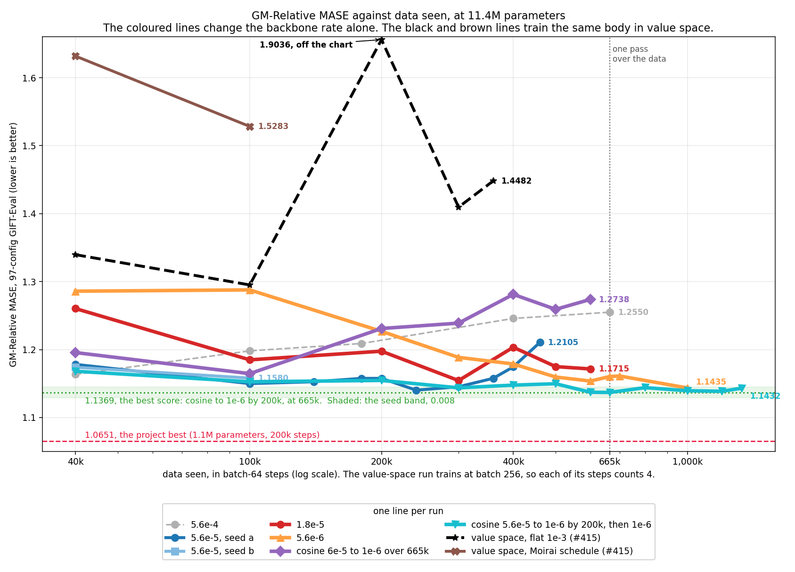
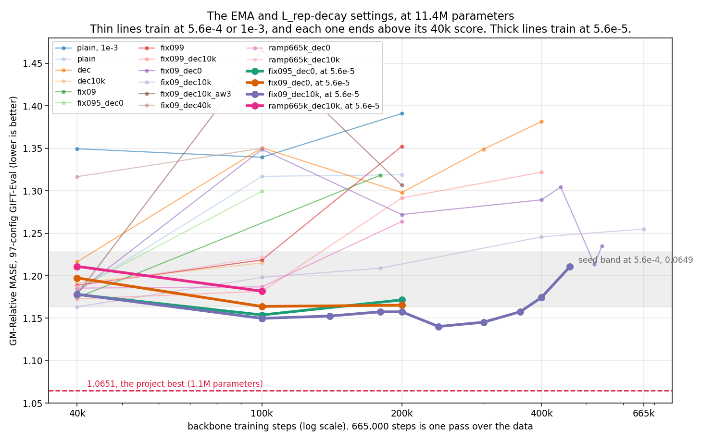
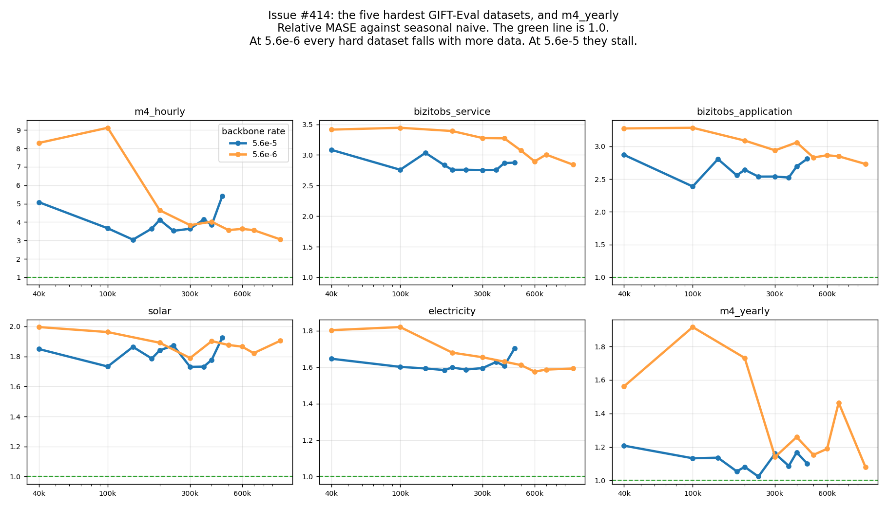
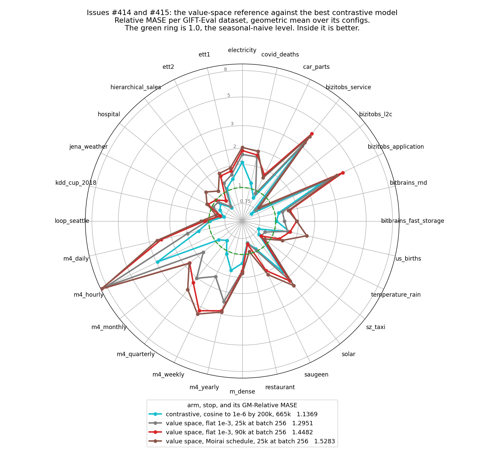

# At Moirai-2-Small size, the rate sets where the score turns, and no run reaches the 1.0651 project best

The card asks whether the contrastive backbone improves at Moirai-2-Small
size, 11.4M parameters (#412, #414). No run of the card beats the 1.0651
project best. The best 11.4M score is 1.1369 GM-Relative MASE, after one pass
over the data. Its rate starts at 5.6e-5 and falls by cosine to 1e-6 at step
200,000. Each constant rate gives a lowest score and then a climb, and the
rate sets where that turn falls. The same body, trained in value space with the
Moirai optimiser at a flat rate (#415), scores worse than the contrastive model
at equal data.

## Definitions

- **GM-Relative MASE**: the geometric mean, over the 97 GIFT-Eval configs, of
  MASE divided by seasonal-naive MASE. Lower is better, and 1.0 is the
  seasonal-naive level.
- **The cell**: #373's `arm6_v2_combab_alignT` at `d_model` 384, with
  11,431,548 parameters. k = 3, sum reduction, `L_align` to the EMA teacher, an
  EMA momentum fixed at 0.9, and an `L_rep` weight that falls from 1.0 to 0.0
  over the first 10,000 steps (`fix09_dec10k`). Only the rate changes between
  the coloured lines of the first figure.
- **One pass**: 665,000 steps at batch 64. That is the 42.6M windows of 4,096
  values in `gift-pretrain-full-4096/small_v1`.
- **The seed band**: 0.008, the largest gap between two seeds of the cell at
  5.6e-5 (0.0042 at 40,000 steps, 0.0081 at 100,000). Two numbers closer than
  the band are not ranked.
- **The turn**: the stop where the score of a run is lowest before it climbs.

## The rate sets where the score turns



Each constant rate falls to a lowest score and then climbs. The smaller the
rate, the later the turn: 40,000 steps at 5.6e-4, 240,000 at 5.6e-5 and
300,000 at 1.8e-5. At 5.6e-6 the score still falls at 1,000,000 steps.

The cosine anneal to 1e-6 by step 200,000 has no turn in one pass. Its lowest
score, 1.1369, is its 665,000-step score. A second pass at 1e-6 stays inside
the seed band: 1.1440 at 800,000, 1.1394 at 1,000,000, 1.1386 at 1,200,000
and 1.1432 at 1,330,000, the end of the second pass. The lowest scores of
the three best runs (1.1369, 1.1403 and 1.1435) also lie inside one band. So
the anneal removes the climb, and its floor is the floor of the constant rates.

A slower anneal, 6e-5 to 1e-6 over 665,000 steps, turns at 100,000 steps. The
best score of the card stays 0.0718 above the 1.0651 project best.

## At 5.6e-4, no EMA or decay setting stops the climb



Twelve arms at 5.6e-4 change the EMA momentum, the `L_rep` decay or the
`L_align` weight. Each one ends above its 40,000-step score. At 5.6e-5 the same
settings reach their lowest scores between 100,000 and 240,000 steps.

## At 5.6e-6, the hardest datasets improve with more data



These are the five datasets with the highest relative MASE under the best run,
and m4_yearly. At 5.6e-6 each one ends below its 40,000-step value. At 5.6e-5,
m4_hourly, solar and electricity climb after 400,000 steps. All six stay above
1.0.

## The value-space run at a flat 1e-3 scores worse than the contrastive model



The reference of #415 trains the same body on the quantiles of the actual
values, and rolls the forecast out in value space. It has no teacher, no EMA,
no `L_rep` and no `L_align`. This first run used the Moirai optimiser settings
at a flat rate: 1e-3, batch 256, weight decay 0.1, betas (0.9, 0.98), no
warmup and no gradient clip.

At 6.4M windows (25,000 steps at batch 256) the reference scores 1.2951, and
the contrastive run scores 1.1526 at the same data. Against the contrastive
run at 665,000 steps, the reference is worse on 27 of the 28 datasets at
25,000 steps, and on all 28 at 50,000, 75,000 and 90,000 steps. Its loss spiked
between 25,000 and 50,000 steps (1.9036 at 50,000), and again at 73,000,
77,000 and 79,000 to 84,000 steps (1.4096 at 75,000). Its last checkpoint,
90,000 steps, scores 1.4482. The owner stopped the run at 92,600 steps.

A second run with the Moirai schedule replaces it (#415): a 10,000-step
warmup, a cosine to 0 at 166,000 steps and a gradient clip of 1.0. It scores
1.6318 at 10,000 steps, the end of its warmup, and 1.5283 at 25,000 steps. The
flat run scored 1.2951 at 25,000 steps. Both stops of the second run are worse
than the contrastive run on all 28 datasets.

## The tables

### The references

| number | GM-Relative MASE |
|---|---|
| the best 11.4M score: cosine to 1e-6 by 200,000, at 665,000 steps | 1.1369 |
| the project best: 1.1M parameters, align student, 200,000 steps | 1.0651 |
| Moirai 1.0 Small trained on GIFT-Eval Pretrain alone ([Moirai 2.0](https://arxiv.org/abs/2511.11698), Table 2) | 0.946 |
| Moirai-2-Small | 0.728 |

### The turn of each run

One seed per run, except the second 5.6e-5 seed. The value-space reference
counts its steps at batch 256.

| run | lowest score | at step | last score | at step |
|---|---|---|---|---|
| 5.6e-4 | 1.1634 | 40,000 | 1.2550 | 665,000 |
| 5.6e-5, seed a | 1.1403 | 240,000 | 1.2105 | 460,000 |
| 5.6e-5, seed b | 1.1580 | 100,000 | 1.1580 | 100,000 |
| 1.8e-5 | 1.1544 | 300,000 | 1.1715 | 600,000 |
| 5.6e-6 | 1.1435 | 1,000,000 | 1.1435 | 1,000,000 |
| cosine 6e-5 to 1e-6 over 665,000 | 1.1646 | 100,000 | 1.2738 | 600,000 |
| cosine 5.6e-5 to 1e-6 by 200,000, then 1e-6 | 1.1369 | 665,000 | 1.1432 | 1,330,000 |
| value space, flat 1e-3 | 1.2951 | 25,000 | 1.4482 | 90,000 |
| value space, Moirai schedule | 1.5283 | 25,000 | 1.5283 | 25,000 |

`results/gm_trajectories.tsv` holds every scored stop of the card, one row per
stop. `scripts/gm_trajectories.py` builds it from the score files.

### The Moirai 2.0 ladder

Table 2 of the Moirai 2.0 paper changes one thing at a time, from Moirai 1.0
Small to Moirai 2.0 Small. MASE is GM-Relative MASE on GIFT-Eval.

| step | pretraining data | change | MASE |
|---|---|---|---|
| Moirai 1.0 Small | GIFT-Eval Pretrain | the start | 0.946 |
| v0 | GIFT-Eval Pretrain | decoder only | 0.929 |
| v1 | new corpus, 36M series | more data | 0.850 |
| v2 | new corpus | quantile loss | 0.744 |
| v3 | new corpus | autoregressive quantile decoding | 0.736 |
| v4 | new corpus | random masking | 0.772 |
| v5 | new corpus | multi-token prediction | 0.739 |
| Moirai 2.0 Small | new corpus | residual input projection | 0.728 |

### These runs against the Moirai 1.0 recipe

The Moirai 1.0 column gives the uni2ts pretraining defaults. The paper gives
no separate recipe for its 0.946 run.

| | Moirai 1.0 Small, GIFT-Eval Pretrain | value space, flat 1e-3 (#415) | contrastive, cosine by 200,000 |
|---|---|---|---|
| GM-Relative MASE | 0.946 | 1.2951, its best | 1.1369 |
| parameters | 14M | 11.4M | 11.4M |
| body | masked encoder, 6 layers | 3 encoder and 3 forecaster layers | the same |
| patch | 8 to 128, set by the frequency | 16 | 16 |
| objective | mixture negative log-likelihood | 9 quantiles of the values | contrastive, in latent space |
| forecast | the whole horizon at once | rollout, 1 patch per step | latent rollout, then a 30,000-step head |
| data | GIFT-Eval Pretrain, 230B points | `small_v1`, synthetic ARMA at 1/128, mixup | the same |
| steps and batch | 100,000 at 256 | 92,600 at 256, then stopped | 665,000 at 64 |
| rate | 1e-3, 10,000-step warmup, then cosine | 1e-3 flat | 5.6e-5, cosine to 1e-6 by 200,000 |
| gradient clip | 1.0 | none | none |
| weight decay | 0.1, linear weights only | 0.1, all weights | 0.1, all weights |
| scoring | its own forecast | a 30,000-step head, strategy B4 | the same |

Sources: the [Moirai 2.0 paper](https://arxiv.org/abs/2511.11698), the
[uni2ts pretraining config](https://github.com/SalesforceAIResearch/uni2ts/blob/main/cli/conf/pretrain/default.yaml)
and the
[uni2ts optimiser groups](https://github.com/SalesforceAIResearch/uni2ts/blob/main/src/uni2ts/model/moirai/pretrain.py).

## How to repeat it

The evaluation protocol is the parents'. `scripts/head_eval.sh` calls the
rollout-depth study's `head_eval_bb.sh`, which trains a 2-layer transformer
quantile head for 30,000 steps on the frozen backbone (forecast length 16,
batch 256, rate 1e-3, seed 20260722). The score comes from the 97 GIFT-Eval
configs under strategy B4.

```bash
cd reports/2026-09-06_moirai_small_size

# One arm of scripts/arms.tsv, one continuous run, a head and a score at each
# stop. A leg resumes the furthest checkpoint of the arm with its optimizer.
S="40000 100000 200000 300000 400000 500000 600000 665000"
BB_GPU=0 ARMS=k3_r100_09_lr56_fix09_dec10k_cos200k CF412_STOPS="$S" STOPS="$S" \
  CF412_SAVE_EVERY=20000 bash scripts/phase1.sh

# Score one stop again.
BB_GPU=0 bash scripts/head_eval.sh k3_r100_09_lr56_fix09_dec10k_cos200k 665000

# The flat-rate value-space run of #415 trained from PR #416 at c2f796d7.
# Its Moirai-schedule run trains from 9d0f3311, with the defaults of paths.sh.
git worktree add /tmp/cf-415 c2f796d7
(cd /tmp/cf-415/reports/2026-09-23_value_space_reference && \
  LR=1e-3 CF415_BATCH_SIZE=256 SAVE_EVERY=5000 \
  CF415_STOPS="10000 25000 50000 75000 100000 125000 150000 166000" bash run.sh)

# The table of scores and the four figures.
bash scripts/make_plots.sh
```
