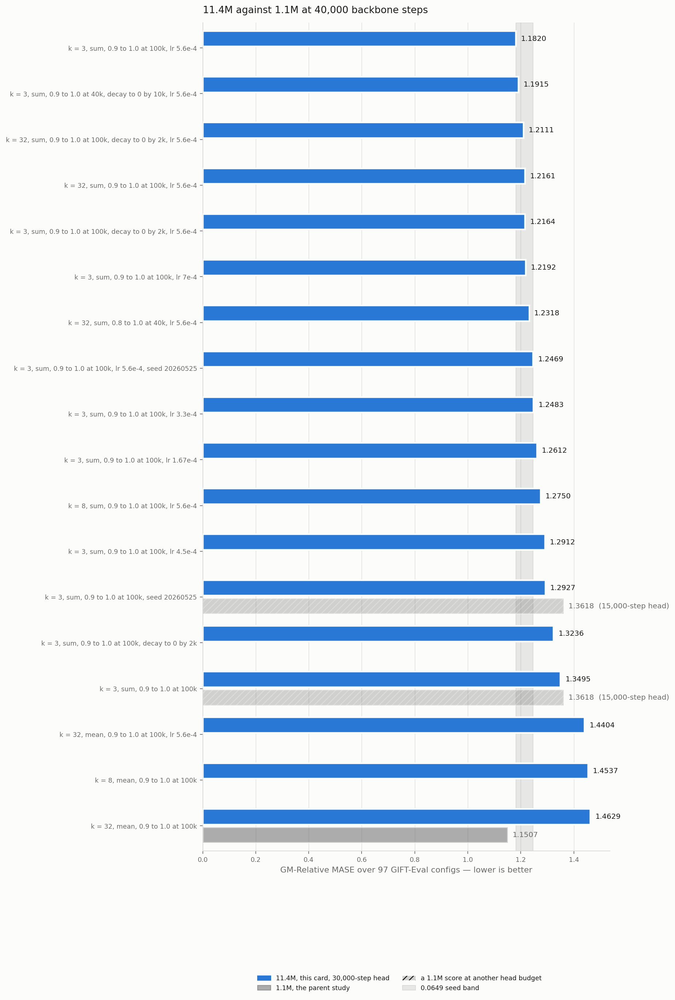
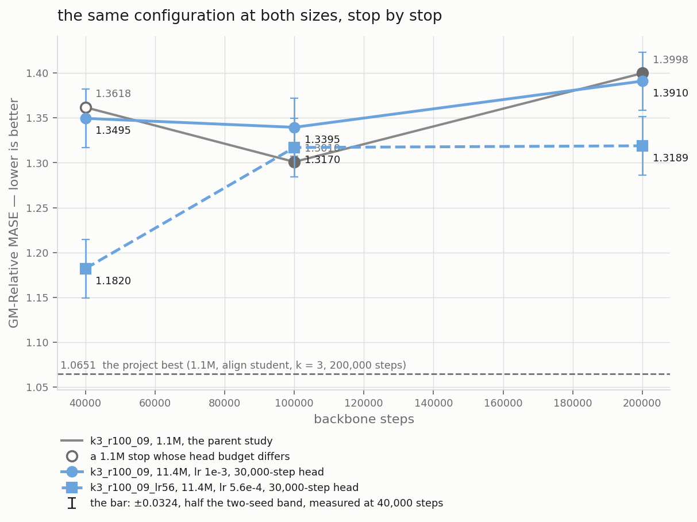
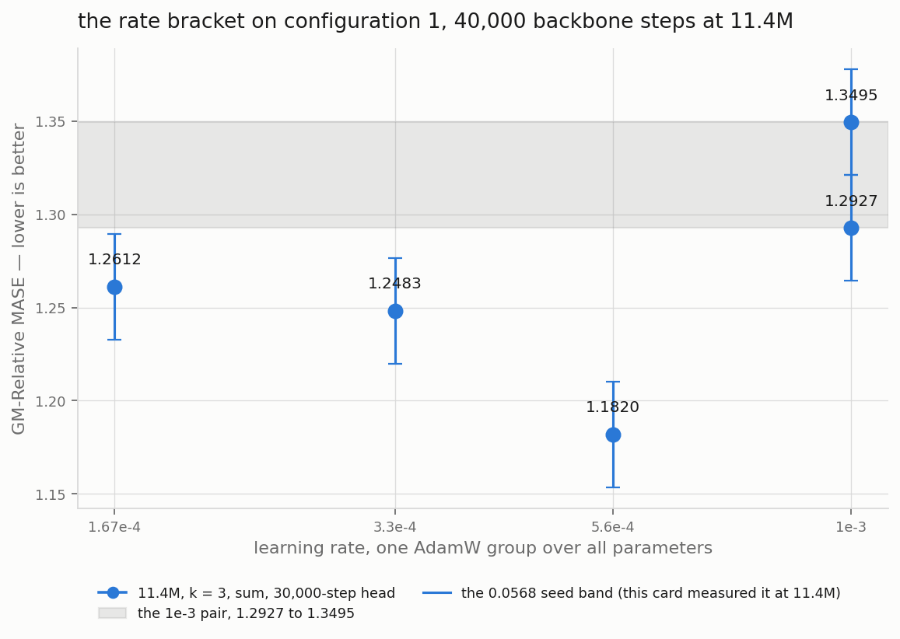
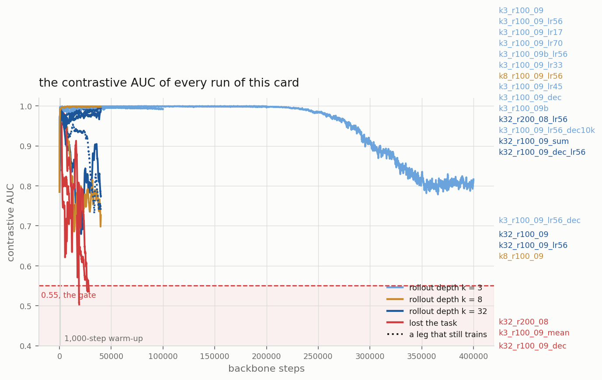
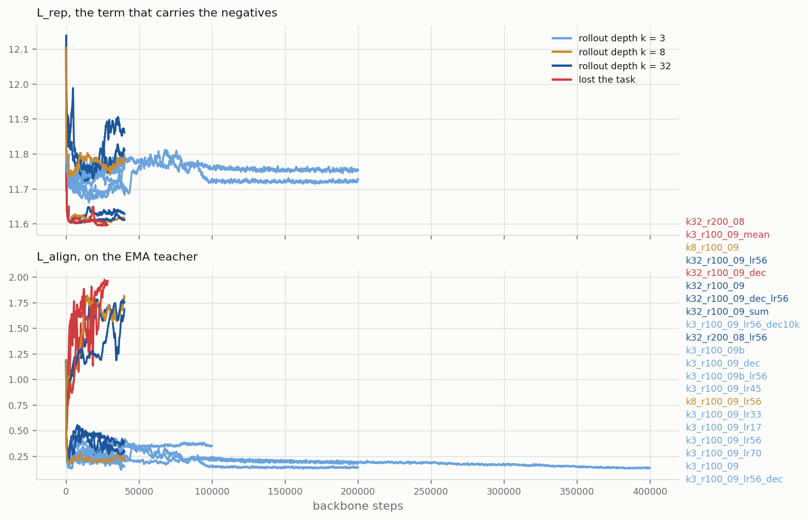

# The same objective at Moirai-2-Small size

**DRAFT — the card still runs. The verdict below covers the arms that landed.
`results/tables.md` and `plots/` refresh every 15 minutes.**

Every score of this project comes from a backbone of 1.1M parameters.
Moirai-2-Small holds 11.4M and scores 0.728 on the same 97 GIFT-Eval configs,
where our best is 1.0651. This card retrains the published teacher-align
configurations at 11.4M parameters, so we learn whether the objective is weak
or whether the model is small.

## The answer

At the parent's learning rate, ten times the capacity buys nothing. That rate
is the wrong one for this width, so this card does not answer the capacity
question it was built to answer.



Configuration 1 at both head-matched stops, against its own 1.1M twin, the same
cell and the same align target:

| stop | 11.4M | 1.1M twin | gap | bands |
|---|---|---|---|---|
| 100,000 | 1.3395 | 1.3010 | +0.0385 | 0.7 |
| 200,000 | 1.3910 | 1.3998 | -0.0088 | 0.2 |

Neither gap reaches the 0.0568 band, so at neither stop are the two sizes
ranked. The 200,000-step stop is the one the card was built for, and it is a
draw.

The number the project wants to beat is 1.0651, its own best at 1.1M and
200,000 steps on the student-align cell. The 11.4M model is 5.7 bands behind
it. Moirai-2-Small scores 0.728 on the same 97 configs.

On the deep mean cell at 40,000 steps the 11.4M model scores 1.4629 against
1.1507, worse by 5.5 bands.

EVERY ONE OF THOSE 11.4M NUMBERS IS AT 1e-3. On the same cell and the same
stop, this card then measured 1.1820 at 5.6e-4, which is 2.9 bands better than
the same seed at 1e-3. The 1.1M references are at 1e-3 as well, and no one has
shown a misfit at that width. So each comparison above carries the width AND a
rate misfit on one side of it, and this report does not claim the 11.4M model
is the worse one.

Against the 1.1M numbers at that stop, 1.1820 lands here:

| 1.1M reference at 40,000 steps | score | against 1.1820 |
|---|---|---|
| k = 3, student align, the best of the project | 1.0862 | 1.7 bands worse |
| k = 32, teacher align, the best of this card's targets | 1.1491 | 0.6 bands, a draw |
| k = 3, teacher align, this arm's own cell (#373 A3) | 1.3618 | better, but a 15,000-step head |

Read that table with its rows, not its best cell. Only the third row is this
arm's own cell, and its head budget differs, so it is not head-matched. The
second row is head-matched but a different cell. The first row is the number
the project actually wants to beat, and 1.1820 does not beat it.


## A longer stop does not change the size answer



`k3_r100_09` is the one arm this card carried to every stop. At each one it
ties its 1.1M twin.

| backbone steps | 11.4M | 1.1M twin | gap | head-matched |
|---|---|---|---|---|
| 40,000 | 1.3495 | 1.3618 | -0.22 bands | no, a 15,000-step 1.1M head |
| 100,000 | 1.3395 | 1.3010 | +0.68 bands | yes |
| 200,000 | 1.3910 | 1.3998 | -0.15 bands | yes |

Every gap is inside the 0.0568 band, so no stop ranks the two sizes. The
200,000-step row is the one the card asks for, because 1.0651 is a
200,000-step number, and it is head-matched: both sides train a 30,000-step
head on the same cell at the same backbone seed.

The 11.4M model does not improve with a longer stop either. It reads 1.3495 at
40,000, 1.3395 at 100,000 and 1.3910 at 200,000. Its best stop is the middle
one, and the whole climb spans 0.0515, which is inside one band.

TWO THINGS THIS DOES NOT SAY. It does not reach the project's best of 1.0651,
which sits 5.74 bands below the 200,000-step number and comes from the
align-student lineage. And every leg of it ran at 1e-3, which the next section
shows is the wrong rate at this width. So this climb answers "does the capacity
help at 1e-3", and the answer is no. The capacity question at a rate that fits
width 384 has no 200,000-step answer on this card.

## 1e-3 does not fit this width, and it voids every 1e-3 number here



`k3_r100_09_lr56` trains configuration 1 at 5.6e-4 and scores 1.1820. That is
the best 11.4M number of this card by a wide margin, and it clears the bar this
card fixed before the sweep ran.

| rate | score | D against 1.3495, same seed | D against 1.2927, other seed |
|---|---|---|---|
| 1e-3, seed 20260520 | 1.3495 | — | — |
| 1e-3, seed 20260525 | 1.2927 | +0.0568, 1.0 band | — |
| 3.3e-4 | 1.2483 | +0.1012, 1.8 bands | +0.0444, 0.8 bands |
| 5.6e-4 | 1.1820 | +0.1675, 2.9 bands | +0.1107, 1.9 bands |

EVERY READING AGREES, which is why this one is a verdict where `lr33` was not.
The bar was 1.2359, the better 1e-3 seed less one band, and 1.1820 clears it by
0.0539. Against its own seed the gap is 2.9 bands, which is a RANK under #409's
convention and not a threshold. Against the better seed it is 1.9 bands, so the
result does not turn on which 1e-3 run a reader subtracts.

SO EVERY 1e-3 NUMBER IN THIS REPORT IS TAKEN AT A RATE THAT DOES NOT FIT
`d_model` 384. That is the card's own rule, fixed in advance: D above the band
voids the 1e-3 numbers.

The rate also has an interior optimum on this bracket, not a monotone slope.
5.6e-4 beats 3.3e-4 by 0.0663, which is 1.2 bands, so lowering the rate further
made the model worse. `k3_r100_09_lr17` at 1.67e-4 is the third point and its
eval runs now.

## The width breaks the contrastive task on the deep mean cells



Every AUC in this report is a rolling median over 500 training rows, which is
the statistic the guard reads against its 0.55 threshold. A single row is
noisy, and one row under the threshold is not a lost run. An AUC goes to three
places here and a GM-Relative MASE to four, because the 0.0568 band turns on
the fourth place and no AUC reading does.

Three k = 32 arms of this card have an exact 1.1M twin, and every twin held the
task. #404's plain twin ended at AUC 0.978 at 40,000 steps. #409's decay twin,
`dec_m090r100_ramp2k`, ended at 0.983 and scored 1.2295. #404's `s08` twin, on
the other momentum schedule, ended at 0.957. Each twin matches its arm on the
cell, the momentum, the decay ramp and the seed 20260520.

At 11.4M all three fall, and TWO of them lose the task outright. `k32_r100_09`
goes from 0.968 at step 2,000 to 0.773 at 40,000 and holds. `k32_r100_09_dec`
reaches chance at step 18,634. `k32_r200_08` reaches it at step 28,152. The
guard stopped both, so neither has a head or a score.

The k = 3 arm is the POSITIVE CONTROL at the same width, and it does not merely
survive. Its AUC floor rises with every leg: 0.993 to 40,000 steps, 0.997 to
100,000 and 0.999 to 200,000. Same width, same cell, same align target, same
seed 20260520. The worst reading of its last leg beats the worst reading of its
first.

THE RATE REACHES THIS SECTION TOO, as a limit and not a measurement. Both arms
that lost the contrastive task ran at 1e-3, and no deep mean arm has run at a
lower rate at either size. A rate too high for the width is a plausible cause
of a collapse, so "the width breaks the task" may be "1e-3 breaks it at this
width". The k = 3 arms at 5.6e-4 and 3.3e-4 both held at 0.998, but that cell
holds at 1e-3 as well, so they do not separate it. One k = 32 arm at 5.6e-4
would.

So it takes BOTH the width and a depth above 3. At 1.1M all three k = 32 twins
held, at 0.978, 0.957 and 0.983. At 11.4M this cell at k = 3 improves for
200,000 steps. Neither the width nor the depth loses the task alone.

At k = 32 and 11.4M, two treatments each finish the job by themselves:

| EMA momentum | no decay | `L_rep` decay to 0.0 by 2,000 |
|---|---|---|
| 0.9 to 1.0 at 100k | held, ends 0.773 | LOST at step 18,634 |
| 0.8 to 1.0 at 200k | LOST at step 28,152 | not run |

THE DECAY IS NOT REQUIRED. `k32_r200_08` carries `L_rep` at weight 1.0 for
every one of its 28,152 steps and loses the task anyway. A ramp that starts at
0.8 does it with the full objective in place.

Read the table by column and by row, never on the diagonal. The decay column is
the pair at 0.9 to 1.0, where the no-decay arm HELD at 0.773 and its decay twin
lost at 18,634. The momentum column is the no-decay pair, where 0.9 held and
0.8 lost at 28,152. The two lost arms differ from each other in BOTH the
momentum and the decay, so the gap between 18,634 and 28,152 measures nothing.

NOT EVERY DEEP MEAN ARM LOSES THE TASK. Two of the four did. The other two ran
degraded and held: `k32_r100_09` ends at 0.773 and `k8_r100_09` at 0.730, with
floors of 0.683 and 0.685.

HELD AND LOST ARE CLOSER THAN A VERDICT COLUMN SUGGESTS. `k32_r100_09` fell to
0.683 at step 20,872, which is 0.133 above the gate, then climbed back to 0.904
by 35,877 and ended at 0.773. So the arm that held came within a seventh of the
threshold and recovered. That is why this report prints the whole trace and not
the verdict alone.

The worst AUC is also the worst score: 0.773 and 1.4629, against 0.999 and
1.2927 to 1.3495 on the k = 3 arms.

### The depth and the reduction are confounded, so neither is named

`k8_r100_09` puts a third configuration beside the two cells, and it erodes as
well. So losing the task is not a property of k = 32.

| step | k = 3 | k = 8 | k = 32, EMA 0.9 | k = 32, EMA 0.8 |
|---|---|---|---|---|
| 2,000 | 0.993 | 0.971 | 0.968 | 0.877 |
| 5,000 | 0.998 | 0.961 | 0.937 | 0.814 |
| 8,000 | 0.998 | 0.920 | 0.889 | 0.788 |
| 10,000 | 0.998 | 0.881 | 0.892 | 0.741 |
| 12,000 | 0.998 | 0.812 | 0.840 | 0.739 |
| 15,000 | 0.998 | 0.812 | 0.840 | 0.739 |
| 28,000 | 0.999 | 0.772 | 0.789 | 0.555 |
| 40,000 | 0.999 | 0.730 | 0.773 | lost at 28,152 |

The k = 3 column holds 0.998 and does not move. Every other column falls.

THE COLUMNS DO NOT ORDER BY DEPTH. To step 8,000 they fall from left to right.
After step 10,000 they cross: k = 8 goes under k = 32 at the same momentum,
0.812 against 0.840 at step 12,000, and it stays under to the stop, 0.730
against 0.773 at 40,000. So a deeper rollout does not erode faster, and an
earlier version of this report said it did. Both arms completed their legs, so
this is the finished reading and not a snapshot.

BUT THE DEPTH IS NOT THE ONLY THING THAT CHANGES ACROSS THOSE COLUMNS. Every
arm that erodes runs the `mean` reduction, and every arm that holds runs `sum`.
The two columns of `arms.tsv` are perfectly confounded over all ten arms:

| | `sum` | `mean` |
|---|---|---|
| k = 3 | 6 arms | none |
| k = 8, k = 32 | none | 4 arms |

That is inherited and not a defect. Each row of this card is a PUBLISHED
configuration at the new width, and the parents ran k = 3 under sum and the
deeper cells under mean. The card replicates configurations, it does not run a
factorial.

So "the depth erodes the task" and "the mean reduction erodes the task" fit
these rows equally well, and nothing on this card separates them. One k = 3 arm
under mean, or one k = 32 arm under sum, would settle it. Neither exists at
either size.

THE ONE CONTROLLED DEPTH PAIR RUNS THE WRONG WAY. `k8_r100_09` and
`k32_r100_09` share the reduction, the momentum, the seed and the rate, so the
depth is the one column between them. The k = 8 arm sits above to step 8,000,
crosses at 10,000, and falls further below after it: 0.812 against 0.840 at
12,000 and 0.717 against 0.793 at 15,000. So the SHALLOWER arm erodes faster
over that stretch.

The erosion therefore does not scale with k, and this report claims no ordering
in k at all. `k8_r100_09` has run 15,300 steps of its 40,000, so its column
ends there.

The EMA momentum moves the whole curve as well. `k32_r200_08` starts its ramp
at 0.8 and sits under `k32_r100_09` at every step, by 0.091 at step 2,000 and
by 0.101 at step 8,000. The two arms share the cell, the depth, the reduction
and the seed, so the momentum is the one thing between them.

The k = 3 arms have no 1.1M AUC anchor, because #373 published no AUC column
for cells A3 and A4. That limits a SIZE comparison at k = 3. It does not limit
the reading above, which compares four depths at one width inside this card.

The decay damages the two cells differently, and it shows early. At step 5,000
the k = 32 decay arm reads 0.746 against 0.937 for its no-decay twin, a gap of
0.191. The k = 3 decay arm reads 0.992 against 0.998, a gap of 0.006. Both
carry their `L_rep` weight at 0.0 from step 2,000.

`k3_r100_09_dec` then held the task to 40,000 steps. Its floor is 0.980 and it
ends at 0.997, against its twin's 0.999. That floor is higher than 0.904, which
is the BEST the k = 32 plain arm reaches after step 10,000. So the decay costs
nothing measurable at k = 3 over 38,000 steps at weight 0.0, and the same
treatment reaches chance at k = 32.

THE SCORE AGREES WITH THE AUC. `k3_r100_09_dec` scores 1.3236 against its
no-decay twin's 1.3495 at the same seed, a gap of 0.0259 in the decay arm's
favour and 0.5 of a band. The two arms differ in the `decay` column alone, so
that subtraction is controlled. The pair also sits inside the 1.2927 to 1.3495
range of the two 1e-3 seeds.

On the deep mean cell the same treatment has no score to compare, because that
arm lost the task at step 18,634 and never reached its stop. The cell
difference carries the reduction confound above, so it names two columns and
not the depth. That is the decay result of
this card: nothing measurable on the shallow sum cell, and a lost run on the
deep mean cell.

Two limits hold it. `k3_r100_09_dec` has no 1.1M twin, because every decay run
of #409 used k = 32. And it is a 40,000-step reading: #409 carried its best
decay arm to 200,000 steps and the gap moved, and this card carries neither
decay arm past 40,000.

## The loss by term



This cell has two loss terms. `L_rep` carries the contrastive negatives, and
`L_align` pulls the forecast toward the latent. The losses CSV also writes an
`l_pred` column and leaves every row of it empty. The loss shape is
`cosine_similarity_batch_rep_only`, which has no prediction term, so the empty
column is not a logging fault.

## What this design can say

**One thing changes: the width.** Every arm trains #373's cell
`arm6_v2_combab_alignT` at `d_model` 384, `n_heads` 8, 3 encoder layers and 3
decoder layers: 11,431,548 trainable parameters against Moirai-2-Small's
11.4M. The depth `k`, the reduction, the EMA momentum, the seed and the
`L_rep` decay of each arm are its parent's values.

**The protocol is the parents', by construction.** `scripts/head_eval.sh`
calls #373's `head_eval_bb.sh` unchanged: a quantile head, a 2-layer
transformer, forecast length 16, batch 256, learning rate 1e-3, head seed
20260722, then the 97 GIFT-Eval configs under strategy B4. The one thing this
card adds is `CF_BB_SHAPE`, which gives the head trainer and the evaluation
the new width.

**The head budget is not matched at every stop.** This card trains a
30,000-step head at every stop. #404 and #409 did the same at 40,000 steps, so
their numbers compare directly. #373 trained a 15,000-step head at 40,000
steps and 30,000 at 100,000 and 200,000, so its 40,000-step numbers do not.
The tables name the budget of every reference.

**The head was tuned on a 64-wide backbone.** A 30,000-step head that
under-trains a 384-wide encoder biases every 11.4M score in this report the
same way. Comparisons inside one size survive that bias. The size headline
does not, and it carries this caveat.

**The learning rate is not proven at this width.** Every arm above trains at
1e-3, which is the Moirai recipe. This project does not use muP, and the
trainer builds one AdamW group over all parameters. So a rate that fits
`d_model` 64 need not fit 384. Three arms sweep the rate on configuration 1,
at 5.6e-4, 3.3e-4 and 1.67e-4. Each one moves the rate column alone.

D is the best rate arm against BOTH seeds of configuration 1, 1.3495 and
1.2927, and not against 1.3495 alone. 1.3495 is the worse of the two, so an
arm that beats it by less than 0.0568 shows a seed draw and not a rate
effect. A D above 0.0568 on the better seed voids every 1e-3 number of this
card, and phase 1 repeats at the winning rate. Every arm inside the band, or
worse, ends the learning-rate explanation at width 384.

**The band is 0.0568, and this card measured it.** `k3_r100_09b` repeats
`k3_r100_09` at seed 20260525 alone, and it scores 1.2927 against 1.3495 at
the 40,000-step stop. That spread is this size's own seed band. It is wider
than the 0.0471 #409 measured at 1.1M, so this report ranks on 0.0568. Two
numbers closer than that are not ranked.

**A decay verdict at 40,000 steps is a 40,000-step verdict.** The two decay
arms pair with their plain twins at that stop alone. #409 carried its best
decay arm to 200,000 steps and the gap moved, so this card does not project
its pair past the stop it measured.

## The arms

_(from `scripts/arms.tsv`)_

## The tables

_(from `results/tables.md`)_

## How to repeat it

Backbones on one card, heads on the other. A backbone queue trains no head,
and one sweep starts every head that a checkpoint lacks.

```bash
cd reports/2026-09-06_moirai_small_size
BB_GPU=0 bash run.sh size smoke trial     # the shape, the cost, one arm end to end

# The heads. One per card, so start it before the backbones.
BB_GPU=1 bash scripts/head_sweep.sh &

# The backbones, two of one card at a time, largest memory need first.
# A small arm ahead of a large one takes the window the large one needs.
BB_GPU=0 CF412_QUEUE="k32_r100_09 k32_r100_09_dec" bash scripts/queue_backbones.sh
BB_GPU=0 CF412_QUEUE="k32_r200_08 k8_r100_09"      bash scripts/queue_backbones.sh
BB_GPU=1 CF412_QUEUE="k3_r100_09 k3_r100_09b k3_r100_09_dec" \
  bash scripts/queue_backbones.sh
BB_GPU=1 CF412_QUEUE="k3_r100_09_lr56 k3_r100_09_lr33 k3_r100_09_lr17" \
  bash scripts/queue_backbones.sh

# The climb. `phase1.sh` resumes the furthest checkpoint, so the stops are one
# continuous run and a stop it never asks for costs nothing later.
BB_GPU=0 STOPS="100000 200000" ARMS="k3_r100_09" bash run.sh phase1

bash run.sh collect && bash scripts/make_plots.sh && bash scripts/gate.sh
```

`scripts/arm_busy.sh <arm>` and `scripts/head_busy.sh <arm> <stop>` answer
whether an arm or a checkpoint is already running. Ask them before you start
anything by hand. Nothing under this card stops two trainers on one arm.
