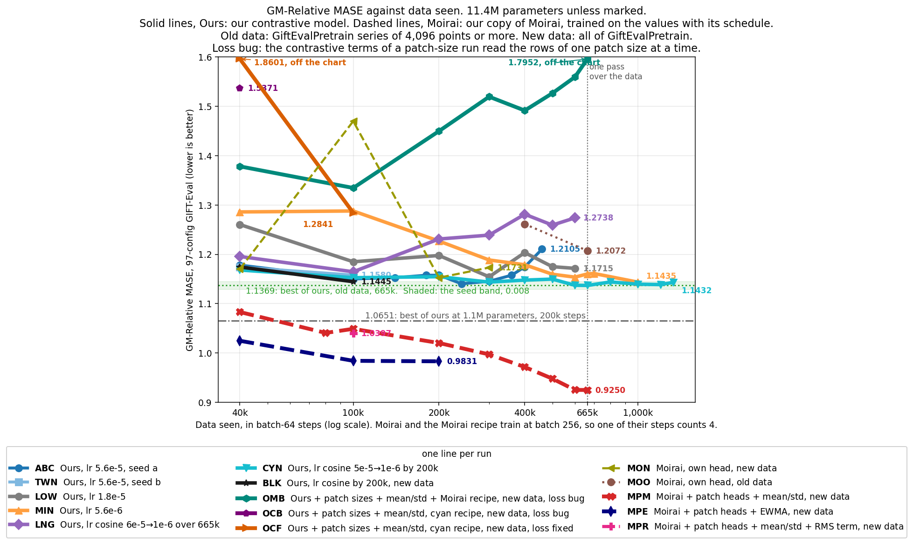
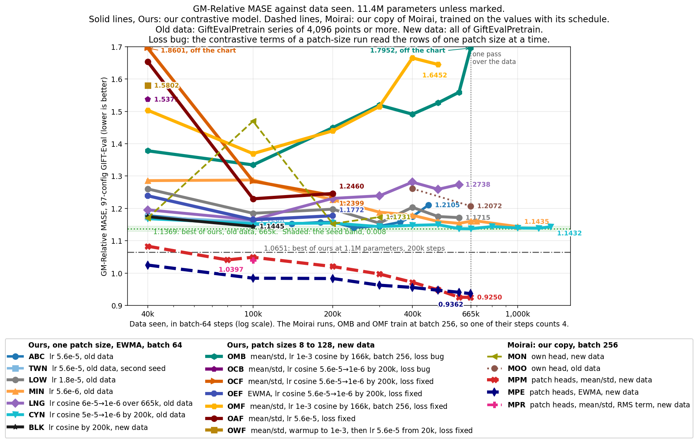
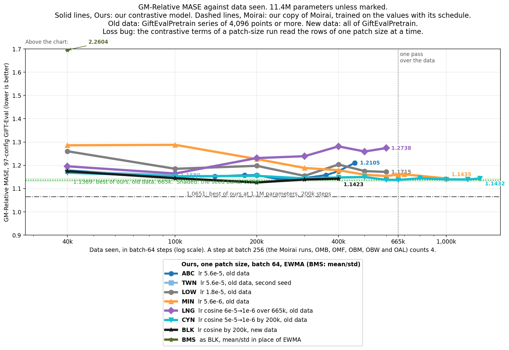
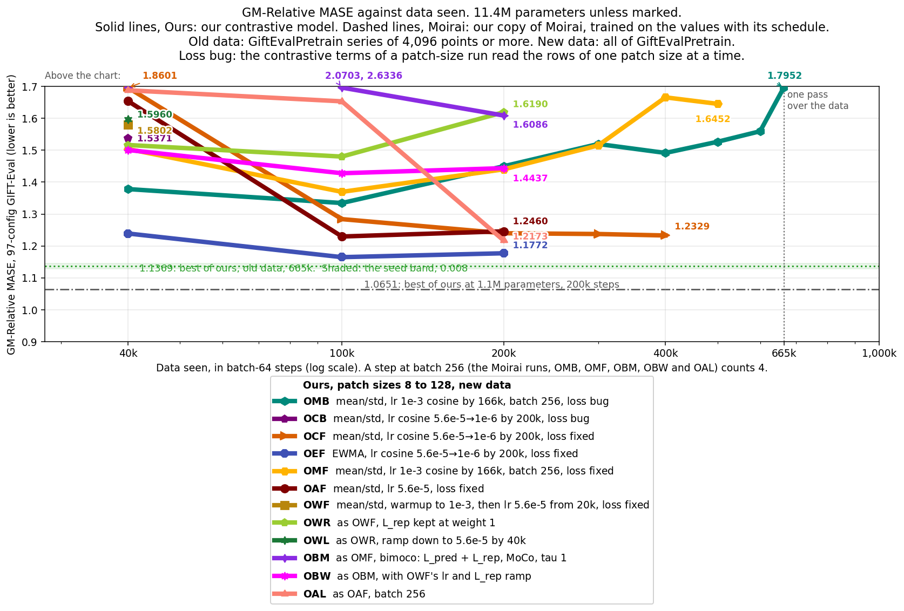
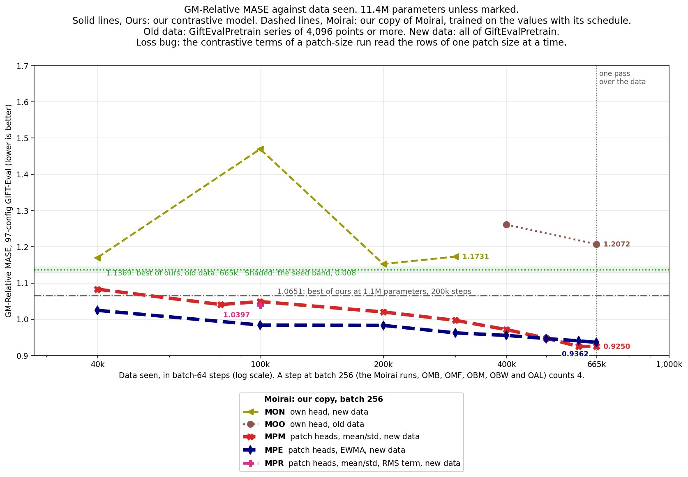
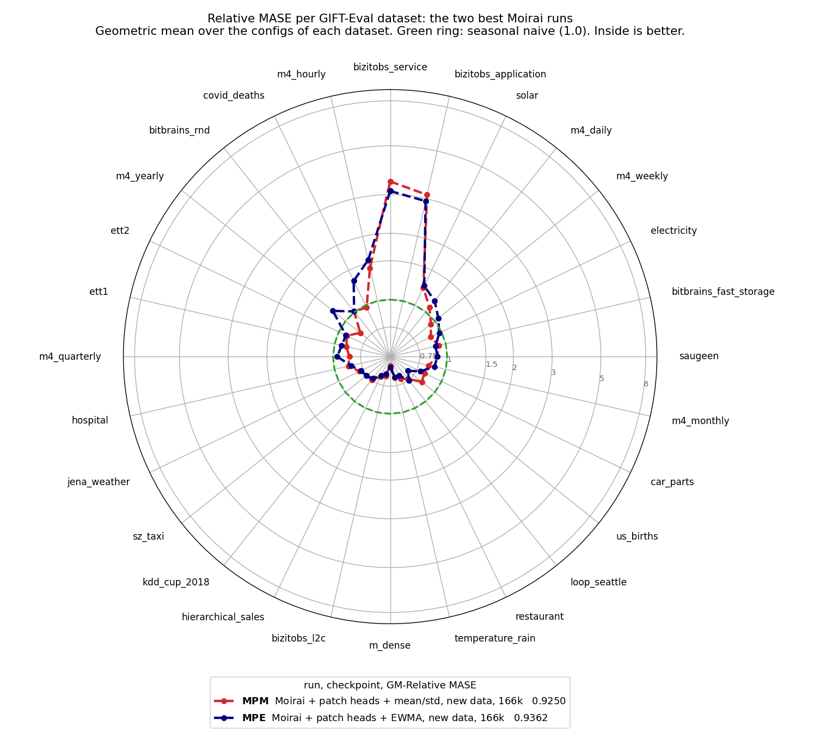
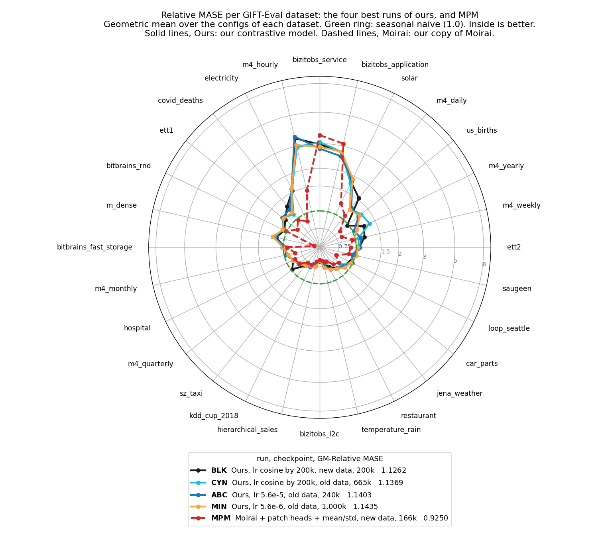
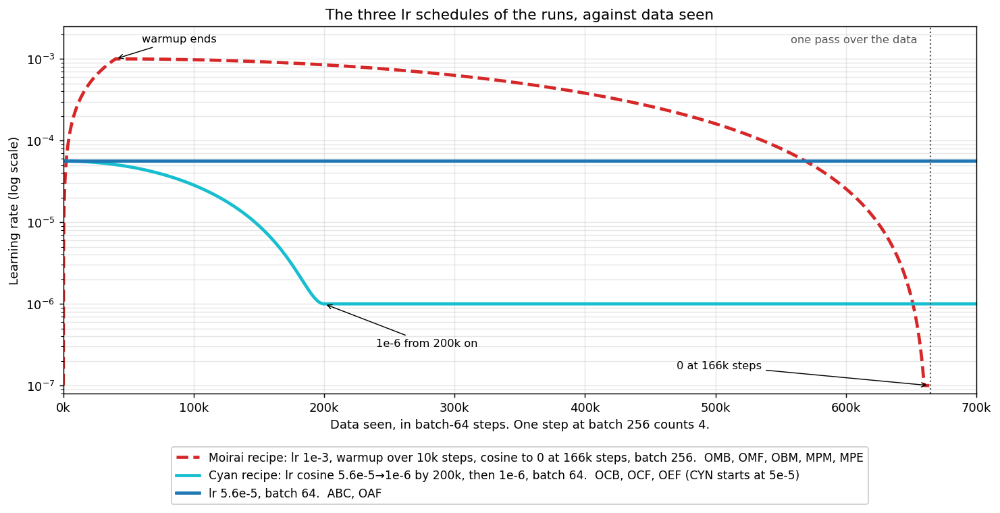
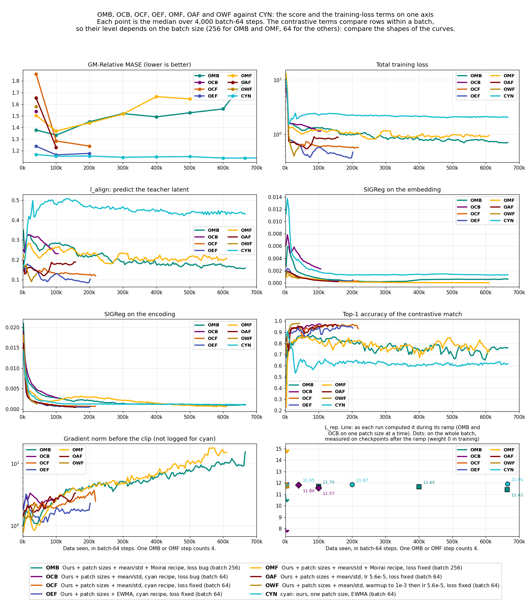

# Our contrastive model and our copy of Moirai on GIFT-Eval

| Code | Configuration | Batch | Training recipe | Best GM-Relative MASE | Step of the best |
|---|---|---|---|---|---|
| ABC | Ours, one patch size, EWMA, old data | 64 | lr 5.6e-5 | 1.1403 | 240k |
| TWN | As ABC, second seed | 64 | lr 5.6e-5 | 1.1580 | 100k |
| LOW | Ours, one patch size, EWMA, old data | 64 | lr 1.8e-5 | 1.1544 | 300k |
| MIN | Ours, one patch size, EWMA, old data | 64 | lr 5.6e-6 | 1.1435 | 1,000k |
| LNG | Ours, one patch size, EWMA, old data | 64 | lr cosine 6e-5 to 1e-6 over 665k | 1.1646 | 100k |
| CYN | Ours, one patch size, EWMA, old data | 64 | lr cosine 5e-5 to 1e-6 by 200k, then 1e-6 | 1.1369 | 665k |
| BLK | Ours, one patch size, EWMA, new data | 64 | lr cosine 5.6e-5 to 1e-6 by 200k, then 1e-6 | 1.1262 | 200k |
| BMS | As BLK, with mean/std in place of EWMA | 64 | lr cosine 5.6e-5 to 1e-6 by 200k, then 1e-6 | 2.2604 | 40k |
| OMB | Ours, patch sizes 8 to 128, mean/std, new data, loss bug | 256 | lr 1e-3, warmup over 10k, cosine to 0 at 166k | 1.3345 | 25k |
| OCB | Ours, patch sizes 8 to 128, mean/std, new data, loss bug | 64 | lr cosine 5.6e-5 to 1e-6 by 200k, then 1e-6 | 1.5371 | 40k |
| OCF | Ours, patch sizes 8 to 128, mean/std, new data | 64 | lr cosine 5.6e-5 to 1e-6 by 200k, then 1e-6 | 1.2329 | 400k |
| OEF | Ours, patch sizes 8 to 128, EWMA, new data | 64 | lr cosine 5.6e-5 to 1e-6 by 200k, then 1e-6 | 1.1650 | 100k |
| OMF | Ours, patch sizes 8 to 128, mean/std, new data | 256 | lr 1e-3, warmup over 10k, cosine to 0 at 166k | 1.3695 | 25k |
| OAF | Ours, patch sizes 8 to 128, mean/std, new data | 64 | lr 5.6e-5 | 1.2297 | 100k |
| OWF | Ours, patch sizes 8 to 128, mean/std, new data | 64 | lr 0 to 1e-3 over 10k, straight line to 5.6e-5 at 20k, then 5.6e-5 | 1.5802 | 40k |
| OWR | As OWF, with the L_rep weight at 1 for the whole run | 64 | lr 0 to 1e-3 over 10k, straight line to 5.6e-5 at 20k, then 5.6e-5 | 1.4800 | 100k |
| OWL | As OWR | 64 | As OWF, with the straight line to 5.6e-5 at 40k | 1.5960 | 40k |
| OBM | As OMF, with L_pred and L_rep (MoCo, tau 1, no L_align), the L_rep weight at 1 | 256 | lr 1e-3, warmup over 10k, cosine to 0 at 166k | 1.6086 | 50k |
| OBW | As OBM, with the L_rep weight from 1 to 0 by 10k | 256 | lr 0 to 1e-3 over 10k, straight line to 5.6e-5 at 20k, then 5.6e-5 | 1.4278 | 25k |
| OAL | As OAF | 256 | lr 5.6e-5 | 1.6530 | 25k |
| MON | Moirai, its own head, EWMA, new data | 256 | lr 1e-3, warmup over 10k, cosine to 0 at 166k | 1.1526 | 50k |
| MOO | Moirai, its own head, EWMA, old data | 256 | lr 1e-3, warmup over 10k, cosine to 0 at 166k | 1.2072 | 166k |
| MPM | Moirai, patch heads, mean/std, new data | 256 | lr 1e-3, warmup over 10k, cosine to 0 at 166k | 0.9250 | 166k |
| MPE | Moirai, patch heads, EWMA, new data | 256 | lr 1e-3, warmup over 10k, cosine to 0 at 166k | 0.9362 | 166k |
| MPR | As MPM, with a term on the RMS of each patch | 256 | lr 1e-3, warmup over 10k, cosine to 0 at 166k | 1.0397 | 25k |
